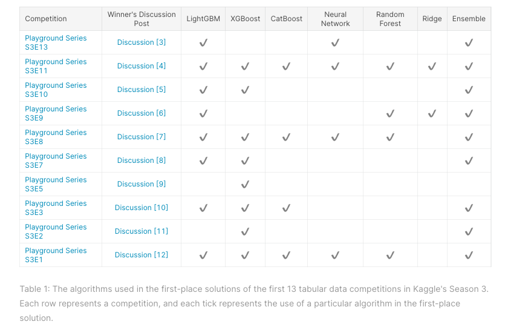
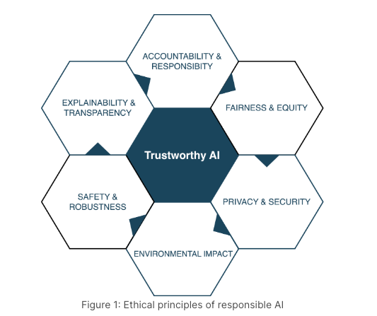

# 2023 Kaggle AI Report 轻量深读（Tier B）

> 赛事：Community（meta/征文评审）｜ 主题 other ｜ 220 队 ｜ 7 个主题类别 ｜ 截止 2023-07-16
> 材料基础：`digests/2023-kaggle-ai-report.md`（6 篇正文：获奖公布 429989 / 获奖作品索引 430092 / 积分奖牌争议 409784 / 冠军解决方案数据集 421036 / GenAI 类冠军 430488 / 继续发 notebook 是否影响评奖 420122；80 条主题索引）+ 2 张归档图
> 轻读时间：2026-10（Tier B B18）

## 1. 一句话重述与数字账

Kaggle 官方征文赛：写"过去两年 ML 社区学到了什么"的综述，按 **7 类**（Text / Image&Video / Tabular&TimeSeries / Kaggle Competitions / Generative AI / AI Ethics / Other）各评 1 名冠军，另有 15 个 Honorable Mention，并集结为 2023 Kaggle AI Report。本场的真实张力是**"排行榜平台引入主观同行评审"**：73 票的积分/奖牌争议帖、21 票的 AI 生成内容政策帖、156 评论的置顶 Q&A，都围绕评审公平与流程展开；而冠军作品里最可复用的是 tabular 冠军的"元分析"写法——把 S3 前 13 场冠军的算法选择做成对照表（图 1）。

| 关键数字 | 值 | 来源 |
| --- | --- | --- |
| 规模与类别 | **220 队**；**7 个类别各 1 名冠军** + 15 个 HM（Text/Image/Tabular/Competitions/GenAI/Ethics 各 2 个 HM，Other 3 个） | 429989 |
| 冠军名单 | Text：@abireltaief（LLM 总览）；Image/Video：@radbear（视觉模型进展）；Tabular：@rhysie（典型表格管线，含 S3 前 13 场冠军算法表）；Kaggle Competitions：@iamleonie（Towards Green AI）；GenAI：@trushk（生成式 AI 综述）；AI Ethics：Team TISL；Other：@pluvias（优化算法 MoMo/Sophia） | 429989 / 430092 |
| 评审机制 | 同行评审（peer feedback）+ **Grand Masters 专家组终审**；置顶 Q&A **156 评论**；"同行评审到底评什么" 12 票 / 15 评论；"论文评审结构"指南 6 票；"早点评审"倡议 12 票 | 400084 / 421717 / 421491 / 422312 |
| 争议 ①：积分奖牌 | 73 票 / 37 评论"该不该给这场发奖牌/积分"；官方更新帖 29 票 / 15 评论（确定计入）；"终于有 analytics 赛奖牌" 10 票 | 409784 / 410802 / 409708 |
| 争议 ②：AI 生成/抄袭 | 政策帖 21 票 / 24 评论；"用 ZeroGPT 查 essay" 7 票 / 21 评论；"像 Kaggler 而不是 bot" 6 票 / 9 评论 | 409388 / 419618 / 421046 |
| 结果透明度 | "Seeking Transparency on Results" 11 票 / 4 评论；"Scores over ranking?" 7 票；Other 类别排名顺序质疑 2 票 / 5 评论；最终报告 446174（22 票）公布 | 429994 / 430034 / 430133 / 446174 |
| 复用产物 | 冠军本人的 Kaggle Winning Solutions Dataset（结构化抽取方法）+ 抽取代码 + 说明文章 + 示例分析 | 421036 |

## 2. 逐方案对照矩阵

| 维度 | 冠军写法（7 类共性） | 评审期待 | 风险点 |
| --- | --- | --- | --- |
| 选题 | 一个类别的 2 年进展综述 | 分类内可比、覆盖近两年 | 跨类混淆（419771） |
| 证据 | 论文 + 图表（如 S3 冠军算法表、Trustworthy AI 图） | 引用可查、结构清晰 | 无引用/空泛 |
| 写作 | 结构化 essay/notebook | 同行可快速评审 | AI 痕迹/抄袭（409388） |
| 交付 | 挂到比赛数据集、公开 notebook | 可复现、可引用 | 提交规范细节多（421798） |

## 3. 共识、分歧与裁决

### 共识一：同行评审 + GM 终审是"知识型赛道"的可用机制，但需要流程护栏（400084 / 421491 / 421717 / 422312；置信度中高）

156 评论的 Q&A 与多篇流程帖说明评审细则本身是参赛门槛；官方用 GM 组做终审、用"评审结构"帖引导反馈质量。**裁决**：投此类赛道，按论文结构（问题—证据—结论—引用）写作，并主动为评审者降低阅读成本。置信度：中高。

### 分歧一：主观评审 vs 客观排行榜的积分价值（409784 vs 410802；置信度中高）

老玩家担忧"Kaggling 的客观性被破坏"，官方最终确认计入奖牌/积分并发布更新帖。**裁决**：平台已把 meta/知识型赛道纳入积分体系；参赛者应意识到这类比赛的"评审方差"大于指标赛，选题与写作的确定性投入更划算。置信度：中高。

### 共识二：AI 生成内容与抄袭是重点风控（409388 / 419618 / 421046；置信度中高）

官方出台 AI 内容政策，社区自发用 ZeroGPT 互查，并推动"像 Kaggler 一样评审"。**裁决**：保留写作过程证据（草稿、引用、代码），宁可写得朴素也不要冒险；被质疑的成本远高于收益。置信度：中高。

### 事件一：元分析式 essay 最受评审青睐（429989 + 421036；置信度中）

tabular 冠军把 S3 前 13 场冠军的模型选择编成表；另一位冠军把 Kaggle winning solutions 抽成结构化数据集。**裁决**：在"报告类"比赛里，**可复用的结构化产物**（表、数据集、清单）比长篇叙述更能体现贡献。置信度：中。

### 事件二：评审透明度仍不足（429994 / 430034 / 430133；置信度中）

有选手公开要求结果透明、质疑"分数 vs 名次"和 Other 类排名顺序。**裁决**：接受结果不可复算的现实，把重心放在"作品可被引用/复用"上。置信度：中。

## 4. 证据分级

| 断言 | 等级 | 说明 |
| --- | --- | --- |
| 7 类冠军与 HM 名单 | 官方帖（429989） | 高 |
| 奖项计入积分/奖牌 | 官方更新帖（410802） | 高 |
| 同行评审流程与争议 | 多帖 + 156 评论 Q&A | 中高 |
| AI 内容政策 | 官方帖（409388） | 高 |
| 冠军作品方法论（如 S3 表） | 作品截图（429989_img/01） | 中高 |
| 结果透明度质疑 | 讨论帖（429994 等） | 中 |

## 5. 悬案与缺口（登记）

- 评审 rubric、具体分数与评审人意见未公开；
- Other 类排名顺序与"分数 vs 名次"争议无官方结论；
- 归档的 6 篇正文不包含完整获奖作品正文（需跳转站外 notebook）；
- 报告 overview 里的 MAE 指标与评审制实际流程的关系未被归档材料解释；
- **图证缺口**：无（2 张图，本深读内嵌 2 张）。

## 6. 图表证据

**图 1**（topic 429989，tabular 冠军 @rhysie 的 essay）：Table 1 汇总 S3 前 13 场表格赛冠军所用的 LGBM/XGB/CatBoost/NN/RF/Ridge/Ensemble 组合——"元分析 + 结构化产物"拿冠军的直接样本。注意 S3E9 的冠军行是 Ridge/LGBM/RF/Ensemble（与 S3E9 深读一致）。

**图 2**（topic 429989，AI Ethics 冠军 Team TISL 的 essay）：Trustworthy AI 的六个维度（Accountability & Responsibility / Explainability & Transparency / Fairness & Equity / Privacy & Security / Environmental Impact / Safety & Robustness）——伦理类获奖 essay 的概念框架。

## 7. 出处

- 获奖公布（51 票 / 30 评论）：https://www.kaggle.com/competitions/2023-kaggle-ai-report/discussion/429989
- 获奖作品索引（2 票 / 2 评论）：https://www.kaggle.com/competitions/2023-kaggle-ai-report/discussion/430092
- 积分与奖牌争议（73 票 / 37 评论）：https://www.kaggle.com/competitions/2023-kaggle-ai-report/discussion/409784
- 官方积分更新（29 票 / 15 评论）：https://www.kaggle.com/competitions/2023-kaggle-ai-report/discussion/410802
- AI 生成内容政策（21 票 / 24 评论）：https://www.kaggle.com/competitions/2023-kaggle-ai-report/discussion/409388
- ZeroGPT 互查（7 票 / 21 评论）：https://www.kaggle.com/competitions/2023-kaggle-ai-report/discussion/419618
- 置顶 Q&A（13 票 / 156 评论）：https://www.kaggle.com/competitions/2023-kaggle-ai-report/discussion/400084
- 结果透明性质疑（11 票 / 4 评论）：https://www.kaggle.com/competitions/2023-kaggle-ai-report/discussion/429994
- 冠军解决方案数据集（5 票 / 2 评论）：https://www.kaggle.com/competitions/2023-kaggle-ai-report/discussion/421036
- 最终报告发布（22 票 / 2 评论）：https://www.kaggle.com/competitions/2023-kaggle-ai-report/discussion/446174
