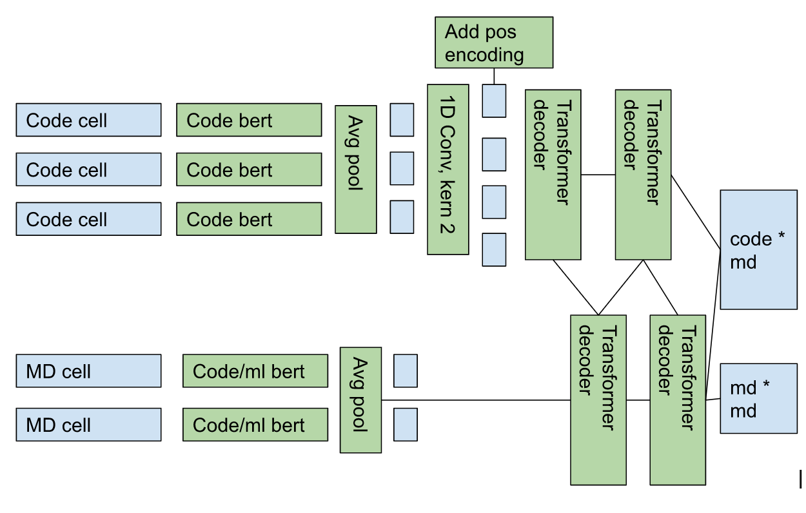
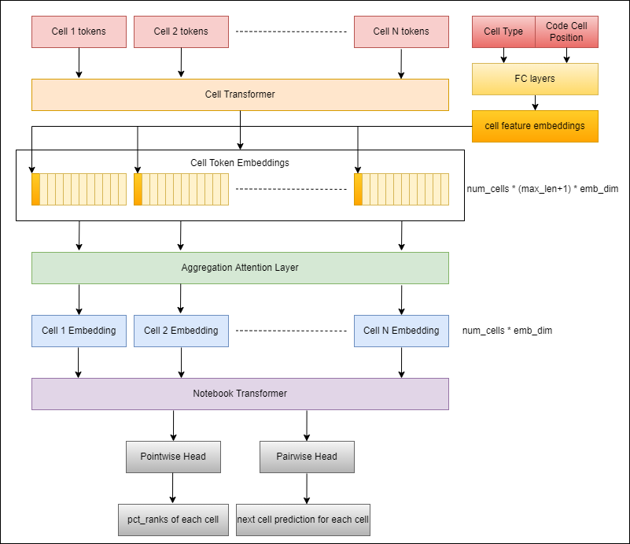

# Google AI4Code 轻量深读（Tier B）

> 赛事：Featured ｜ 主题 nlp（代码/文本排序）｜ 1135 队 ｜ 代码赛 ｜ 指标：AI4Code Kendall Tau
> 材料基础：`digests/AI4Code.md`（6 篇正文：领域理解 328905 / 2nd 343659 / 11th 343680 / 4th 343595 / 1st 360501 / 开源 326970；80 条主题索引）+ 6 张图
> 轻读时间：2026-10（Tier B B01）

## 1. 一句话重述与数字账

Jupyter notebook 中 **code 单元顺序已知**，要把 **markdown 单元排序并放进正确的 code 槽位**（Kendall tau 衡量）。真正的考点：**Learning-to-Rank（pointwise/pairwise/listwise）× 长文本上下文 × 排序后处理**；榜单由"长 notebook 的排序质量"主导。

| 关键数字 | 值 | 来源 |
| --- | --- | --- |
| 1st | 单模型 listwise deberta-v3-large；MLM 15 epochs/1024（3 天）→ 微调 10 epochs/2048（7 天）→ 推理 5120（6h）；MAE；LSTM head；同时预测 code/md，再把 code 按 GT 排；1×A100 80G+1×3090 | 1st |
| 2nd | bi/poly-encoder：CodeBERT 逐 cell + 双 TransformerDecoder 互注意；1D conv → N+1 槽位；3 输出（md→bin / md@bin / md→md）；BCE；后处理用"最小化错位概率和"（交换次数代理） | 2nd |
| 2nd 多语言 | 共享 CodeBERT：全 0.9113/英 0.9164/非英 0.8652；CodeBERT+mpnet：0.9088/0.9117/**0.8825** | 2nd |
| 4th | 三阶段：recall 模型（mpnet two-tower、9 负例、温度≈0.002、tau 897）→ pairwise rank（deberta-v3-small，仅重排 ~50% md，tau 905）→ context rank（3 md 一组、40 code、OOF recall 特征 +0.004）；集成 9162→**9170**；8×V100×30h/模型 | 4th |
| 11th | Nested Transformers：cell transformer + notebook transformer（cell×cell 注意）；cell 特征=类型+code 内百分位排名 | 11th |

## 2. 逐方案对照矩阵

| 维度 | 1st | 2nd | 11th | 4th |
| --- | --- | --- | --- | --- |
| 架构 | 单模型 listwise（cell 用 [SEP]/[CLS] 拼接） | 逐 cell 双塔 + 双 decoder 互注意 | 两级 Transformer | recall→rank→context 三阶段 |
| 序列长度 | 微调 2048/推理 **5120** | notebook=1 batch；变长 | 两级注意 | recall 全量 → rank 50% → context top-40 code |
| 损失 | MAE | BCE（3 输出） | — | CE + cosine/可学习温度 |
| 后处理 | code 按 GT 排，只排 md | 最小化错位概率和（近似期望交换数） | — | 重排+分组推理 |
| 多语言/外部 | 未用（xlm-r/mdeberta 差） | mpnet 缩小非英差距但总分略降；Zenodo 外部集小幅 | — | — |
| 算力 | A100 80G + 3090 | — | — | 8×V100×30h |

## 3. 共识、分歧与裁决

### 共识一：把任务重构为 LTR（Learning to Rank）是全场共识

领域帖系统给出 pointwise/pairwise/listwise 三种框架；1st 用 listwise；4th 的 recall→rank→context 是 pairwise+contextual 的级联。**裁决**：code 顺序已知 = 天然监督，markdown 排序可降解为"打分/配对/列表"问题。置信度：高。

### 共识二：指标偏爱长上下文 → 序列长度直接决定分数

1st 明确"metric 更在意长文本"，把 cell 数与 seq_len 拉大（2048 训练/5120 推理）；2nd 指出"大 notebook 的错误影响更大"，用更大采样权重。**裁决**：Kendall tau 下，长 notebook 的错位惩罚更重；训练/推理必须覆盖长序列，采样要向大 notebook 倾斜。置信度：高。

### 共识三：后处理（把 md 放进正确槽位）是独立增益

1st：同时预测 code 与 md，然后把 code 按 GT 排列、只对 md 排序；2nd：用"错位概率和最小化"取代 argmax（把期望交换数当损失代理）；4th：用 recall 分数重排。**裁决**：槽位分配需要专门算法，不是简单 argmax；期望错位数/最小化错位概率是正确目标。置信度：高。

### 共识四：DeBERTa/Sentence-Transformer 系 + CodeBERT 是主力骨干

1st：deberta-v3-large（xlm-r/mdeberta 明显更差）；2nd/4th：CodeBERT/mpnet；T5 系表现差（2nd/4th）。**裁决**：本任务不需要生成式骨干；编码器的长文本与跨模态能力更重要。置信度：中高。

### 分歧一：单 listwise 大模型 vs 逐 cell 双塔/多阶段级联

1st 单模型夺冠（代价：7 天训练+6h 推理）；2nd/11th/4th 用 cell 级/级联结构，实验与推理更省。**裁决**：两种路线都能到顶；cell 级结构便于快速迭代与多语言处理，listwise 大模型上限高但算力门槛高。置信度：中高。

### 分歧二：多语言与外部数据

2nd：mpnet 缩小非英差距（0.8652→0.8825）但总分略降；外部 Zenodo 数据小幅；1st：未用，认为英文占多数。**裁决**：非英处理是"方差 vs 均值"的权衡；外部数据收益小。置信度：中。

### 事实：算力门槛与"15–20% 数据仍可竞争"（领域帖）

4th 的单 recall 模型即需 8×V100×30h；领域帖认为用 15–20% 数据 + 技巧仍可做出有竞争力的尝试。**裁决**：本场头部方案算力密集；轻量参赛应走子集+级联+公共 OOF 路线。置信度：中。

## 4. 证据分级

| 断言 | 等级 | 说明 |
| --- | --- | --- |
| 1st 的流程/长度/失败清单 | 自述 + 公开代码 | 中高 |
| 2nd 的 tau 对照（0.9113/0.8652 等） | 自述（单折） | 中 |
| 4th 的三阶段 tau（897→905→9170） | 自述 + 代码 | 中高 |
| 后处理目标（错位概率和/期望交换） | 方法自洽 + 与他人对照 | 中高 |
| 多语言/外部数据结论 | 单队 A/B | 中 |

## 5. 悬案与缺口（登记）

- 3rd/5th–10th 方案未收录；"推理时只排 markdown 的 oracle 上界"未量化。
- Kendall tau 的具体计算口径（是否按 notebook 平均、长文本加权）未在材料中给全。
- 1st 的 listwise 输入构造（[SEP]/[CLS] 顺序）与 cell 数上限未公开细节。
- 4th 的 OOF recall 特征 +0.004/理论 +2k 的差异未复算。

## 6. 图表证据

**图 1**（topic 343659）：code cell → CodeBERT → 1D conv(k=2) → pos encoding → 双 TransformerDecoder（互注意 md/code memory）→ code×md、md×md 输出矩阵。

**图 2**（topic 343680）：cell transformer（编码单元）+ notebook transformer（cell×cell 自注意）两级结构。

## 7. 出处

- 领域理解（328905）：https://www.kaggle.com/competitions/AI4Code/discussion/328905
- 2nd（343659）：https://www.kaggle.com/competitions/AI4Code/discussion/343659
- 11th Nested Transformers（343680）：https://www.kaggle.com/competitions/AI4Code/discussion/343680
- 4th（343595）：https://www.kaggle.com/competitions/AI4Code/discussion/343595
- 1st（360501）：https://www.kaggle.com/competitions/AI4Code/discussion/360501
- 开源（326970）：https://www.kaggle.com/competitions/AI4Code/discussion/326970
- 缺口登记：3rd–10th 方案、325205（比赛意图讨论）
