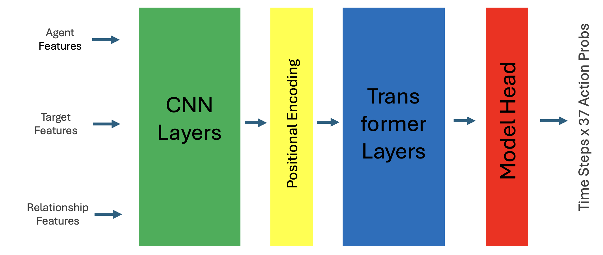
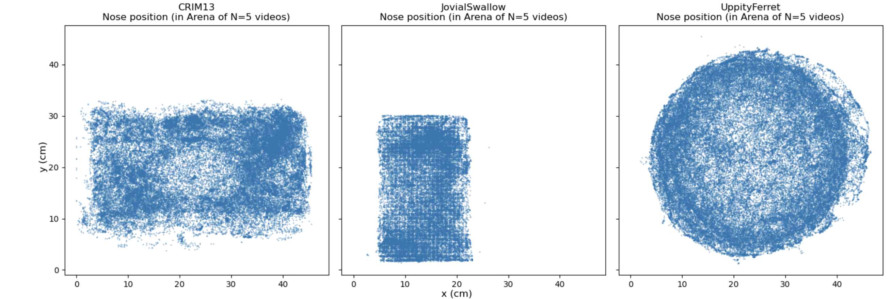

# MABe Mouse Behavior Detection 轻量深读（Tier B）

> 赛事：Research ｜ 主题 science（多实验室动物行为识别）｜ 1412 队 ｜ 代码赛 ｜ 指标：MABe F Beta
> 材料基础：`digests/MABe-mouse-behavior-detection.md`（6 篇正文：7th 663029 / 2nd 663083 / 10th 663063 / 3rd 663026 / 睡鼠笔记 608753 / 1D 检测占位 609063；80 条主题索引）+ 7 张图
> 轻读时间：2026-10（Tier B B02）

## 1. 一句话重述与数字账

从多实验室的小鼠追踪数据识别 37 种行为（F-beta）。真正的考点是**跨实验室的域不变表示（transfer learning）+ 逐 lab×action 阈值 + 多时间尺度网络**；阈值与后处理占分数的大头。

| 关键数字 | 值 | 来源 |
| --- | --- | --- |
| 7th（92 票） | 目标"用 NN 打败公开 XGB"；正确 CV 只用 15 个 lab（排除 MABe22/CalMS21/CRIM13，host 说不存在于测试）；**不变特征三选**（agent 中心坐标/分位缩放/距离）；body part 改名（hip/lateral→side，8 部件）；正/负/**mask** 三态标签；CNN+Transformer（cross/self mouse attention）；4 个时间窗（约 2/4/8/16 秒）；10 NN 集成 CV 0.546/私 0.518；**+XGB 堆叠** CV 0.559/私 **0.523（第 7）** | 7th |
| 2nd | 单鼠/配对动作分开建模；T=512；BCE；Lab ID 过 embedding；距离/速度/加速度特征；CNN+RNN/Transformer 与 SqueezeFormer 两族 5 变体；30fps 统一（标签最近邻插值、特征线性插值）；修 AdaptableSnail 的 25fps 与 ID 交换；lab×action 阈值 | 2nd |
| 3rd（52 票） | LSTM+全连接；lab embedding；~60 特征（距离/角度/速度）；NN+XGB blend；阈值按 lab×action 在 OOF 上网格搜索；多动作时按 **prob/threshold 比值**取最大；指出可疑"magic"数据性质（AdaptableSnail 误标、BoisterousParrot 动作长度多为 15 帧、CautiousGiraffe 9 帧交替攻击） | 3rd |
| 治理 | Ghost/Leech 队友 PSA（33 票/46 评论）、文件损坏（46 票）、私榜未更新（40 票） | 主题索引 |

## 2. 逐方案对照矩阵

| 维度 | 7th | 2nd | 3rd |
| --- | --- | --- | --- |
| 不变表示 | agent 中心/缩放/距离三方案家族 | 距离/速度/加速度 + lab embedding | 距离/角度/速度 + lab embedding |
| 标签处理 | 正/负/mask | 单/配对分开 + 30fps 标签对齐 | softmax 掩码不允许动作 |
| 网络 | CNN+Transformer（10 模型×4 时间窗） | CNN+RNN/Transformer、SqueezeFormer | LSTM |
| 阈值 | 逐 lab 阈值 + argmax | lab×action 阈值 | lab×action 网格搜索 + 比值 tie-break |
| 叠加 | NN 集成 + XGB（3 族 OOF+公开特征） | — | NN+XGB blend |
| 私榜 | 0.523（7th） | 2nd | 3rd |

## 3. 共识、分歧与裁决

### 共识一：跨 lab 不变表示是 NN 能赢的前提（3/3）

7th 列了三种坐标不变化方案并可视化三个 lab 的 arena 形状（矩形/窄矩形/圆）；2nd/3rd 都用"距离/速度/加速度"而非绝对坐标；7th 还把 hip/lateral 重命名为 side。**裁决**：多实验室数据必须先把"绝对位置/命名差异"消掉，否则 NN 无法迁移。置信度：高。

### 共识二：阈值是第二引擎（3/3）

2nd 的 lab×action 阈值、3rd 的 OOF 网格搜索 + prob/threshold 比值 tie-break、7th 的逐 lab 阈值。**裁决**：F-beta 下阈值与并列动作处理是独立的大增益模块；必须按 lab/action 分别校准。置信度：高。

### 共识三：多时间尺度 + NNs/XGB 叠加（7th 明证）

7th 用 2/4/8/16 秒窗口各训 CNN Transformer；NN 集成 0.518 → 加 XGB 堆叠 0.523（名次 8→7）。**裁决**：行为时长分布广，多窗口覆盖 + 树模型对 NN 概率做二阶融合稳定加分。置信度：高。

### 共识四：30fps 统一与插值（2nd/3rd）

2nd 把 25fps 的 AdaptableSnail 统一到 30fps（特征线性、标签最近邻），并修 ID 交换；7th 用"随机改 30→15/60fps"做时间增广。**裁决**：帧率/对齐是数据清洗第一项；时间抖动本身也是强增广。置信度：高。

### 分歧一：架构家族

CNN-Transformer（7th）vs CNN+RNN/SqueezeFormer（2nd）vs LSTM（3rd）都能进前 10。**裁决**：不变特征与阈值比骨干选择更决定名次；骨干只是多样性来源。置信度：高。

### 分歧二/风险：是否利用"magic"数据性质

3rd 明确列出可疑模式（误标/固定长度/交替模式）但未利用；治理帖（ghost 队友、损坏文件、LB 不更新）说明平台侧问题不少。**裁决**：数据性质利用需先判定合规；本场社区更倾向暴露问题而非套利。置信度：中。

## 4. 证据分级

| 断言 | 等级 | 说明 |
| --- | --- | --- |
| 7th 的不变特征/集成/XGB 叠加分数 | 自述 + 图 + 代码 | 中高 |
| 2nd 的 solo/pair 与帧率修复 | 自述 | 中高 |
| 3rd 的 magic 模式清单 | 自述（指向公开讨论） | 中（需复核数据） |
| 治理事件 | 主题索引 | 高（事件存在） |

## 5. 悬案与缺口（登记）

- 1st/4th–6th/8th–9th 方案未收录；"Are some files corrupt?"（46 票）与"Private LB 未更新"（40 票）未入库。
- 12 秒/16 秒窗口的算力与收益曲线未给；mask 标签的具体实现细节（7th 的 t=0/1/MASK 逻辑）只文字描述。
- 3rd 的 magic 模式是否被其他队利用未核实。

## 6. 图表证据

**图 1**（topic 663029）：Agent/Target/Relationship 三组特征 → CNN 层（时间卷积）→ 位置编码 → Transformer 层 → 头 → T×37 动作概率。

**图 2**（topic 663029）：CRIM13（矩形）、JovialSwallow（窄矩形）、UppityFerret（圆形）三实验室的鼻子位置散点——**绝对坐标不可跨 lab 使用**的直观证据。

## 7. 出处

- 7th（92 票）：https://www.kaggle.com/competitions/MABe-mouse-behavior-detection/discussion/663029
- 2nd（46 票）：https://www.kaggle.com/competitions/MABe-mouse-behavior-detection/discussion/663083
- 10th ST-GCN（663063）：https://www.kaggle.com/competitions/MABe-mouse-behavior-detection/discussion/663063
- 3rd（52 票）：https://www.kaggle.com/competitions/MABe-mouse-behavior-detection/discussion/663026
- 睡鼠笔记（53 票）：https://www.kaggle.com/competitions/MABe-mouse-behavior-detection/discussion/608753
- 1D 检测占位（42 票）：https://www.kaggle.com/competitions/MABe-mouse-behavior-detection/discussion/609063
