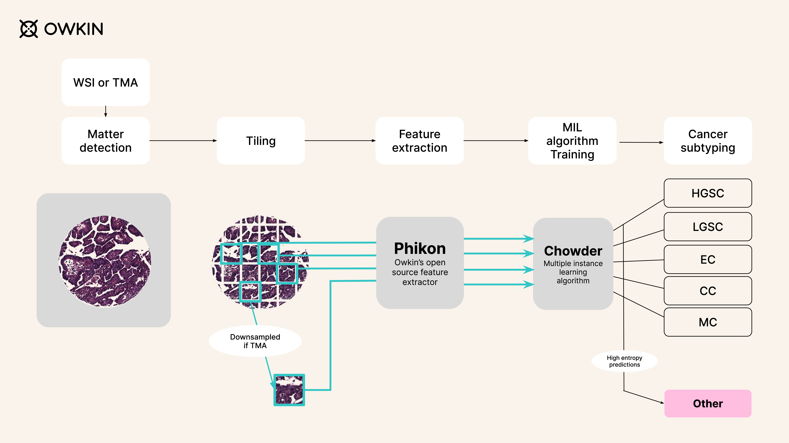

# UBC-OCEAN 轻量深读（Tier B）

> 赛事：Research ｜ 主题 cv（病理全切片分类）｜ 1326 队 ｜ 代码赛 ｜ 指标：Balanced Accuracy（5 亚型 + Other）
> 材料基础：`digests/UBC-OCEAN.md`（6 篇正文：1st Owkin 466455 / 13th 465358 / 8th 465382 / 基线 452165 / PNG 格式 452027 / 病理学家视角 445804；80 条主题索引）+ 7 张图
> 轻读时间：2026-10（Tier B B03）

## 1. 一句话重述与数字账

卵巢癌病理切片（WSI/TMA）五亚型 + Other 分类。真正的考点是**病理基础模型（Phikon/CTransPath/LUNIT）特征 + MIL 聚合 + 离群检测**；数据工程（PNG/分辨率/放大倍率）与 "Other 类" 是最大障碍。

| 关键数字 | 值 | 来源 |
| --- | --- | --- |
| 1st（Owkin，65 票） | 流程：matter detection（Otsu/HSV）→ 切片（WSI 224px；TMA 448→224 对齐 20×）→ **Phikon 768 维特征** → Chowder MIL（50 模型/折集成）→ 校准 + 模型筛选 → 65 模型均值；**高熵预测判 Other**（公榜 0.59→0.64，Other 值 16.6 分）；获胜提交公/私 0.64/0.66（最佳私 0.68）；**微调 Phikon**（6.5M patches + iBOT + register tokens，2.5 天/epoch/2×P100）作多样性；发现 **8% 切片分辨率错误（×12 而非 ×20），LGSC 中 20% 受影响**；CV 0.8–0.9 vs LB 0.64–0.68（跨中心泛化差距） | 1st |
| 8th（49 票） | "先理解数据再设计方法"：WSI/TMA 分开处理；TMA 降采样 2× 对齐 WSI 物理尺度；TMA 用官方 mask 切片 + ArcFace 检索（覆盖 ~60% TMA）+ 6 分类模型兜底；healthy/dead 当 Other | 8th |
| 13th（48 票） | WSI 模型：10× 降采样 + Otsu + CTransPath/LUNIT-DINO 特征 + MIL（CLAM/DSMIL/加权和）；TMA 模型：ArcFace + ArcMargin 子中心 + Faiss 检索；**双重离群检测**（嵌入距离 + 概率分布）；不做颜色归一化 | 13th |
| 数据问题 | PNG 非金字塔（内存/时间灾难）；mpp/ICC 元数据被剥离；数据质量投诉帖（57 票）；病理学家视角（112 票） | 主题索引 |

## 2. 逐方案对照矩阵

| 维度 | 1st | 8th | 13th |
| --- | --- | --- | --- |
| 特征 | Phikon（+微调版） | ArcFace 检索 + 多模型 | CTransPath + LUNIT-DINO |
| 聚合 | Chowder MIL（50/折） | 6 分类模型 + 检索 | CLAM/DSMIL/加权和 |
| WSI/TMA | 统一 20× 对齐 | 分开处理、2× 降采样对齐 | 分开处理、10× 降采样 |
| 离群 | 预测熵阈值 | ArcFace 距离 + healthy/dead | 嵌入距离 + 概率分布双阈值 |
| 颜色归一化 | 试过无效 | — | 不做（文献支持） |
| 私榜 | 0.66（最佳 0.68） | 8th | 13th |

## 3. 共识、分歧与裁决

### 共识一：病理领域基础模型 + MIL 是标准配方（3/3）

Phikon / CTransPath / LUNIT-DINO 特征 + Chowder/CLAM/DSMIL/MeanPool 聚合；1st 甚至只留 Phikon+Chowder 就夺冠（Occam's razor）。**裁决**：数字病理已进入"FM 特征 + MIL"范式；不需要大量自训骨干（除非做领域微调）。置信度：高。

### 共识二：离群/Other 类是最大单项（3/3）

Other 值 16.6 分；1st 的熵阈值 +0.05 公榜；8th 的 ArcFace 检索；13th 的双阈值。**裁决**：balanced accuracy 下"不预测 Other"直接封顶；离群检测必须是独立模块，且阈值要校准（1st 无真 Other 样本只能用公榜/内部测试校准——风险点）。置信度：高。

### 共识三：WSI 与 TMA 必须对齐物理尺度或分开建模（3/3）

WSI 20×/TMA 40×；1st 把 TMA 448→224 对齐 20×；8th 降采样 2×；13th 分开。**裁决**：跨放大倍率是首要预处理；用一个模型吃两种输入需要显式对齐。置信度：高。

### 共识四：颜色归一化收益否证（1st/13th）

Vahadane/Reinhard 无提升（与文献一致）。**裁决**：在强 FM 特征下，染色归一化不是优先项。置信度：中高。

### 分歧一：特征模型与 MIL 选择

1st：Phikon 单特征 + Chowder；13th：多特征 + CLAM/DSMIL；8th：检索 + 多模型。**裁决**：都能进前列；差异主要在离群检测与集成策略，而非单点模型。置信度：中高。

### 分歧二：超参调优 vs LB

1st 的 Ray Tune 调参"CV 升、公榜降"→ 弃用；并强调模型筛选比全量集成有效。**裁决**：该场 CV 与 LB 脱节（跨中心），调参容易拟合训练中心；以提交反馈做轻量筛选更稳。置信度：高（1st 明证）。

### 事件/数据质量

PNG 非金字塔 + 元数据缺失 + 8% 分辨率错误 + 数据质量投诉（57 票）——**主办方数据工程缺陷**是本场的一大主题。**裁决**：参赛者需自行做"元数据考古"（分辨率为一等特征）。置信度：高。

## 4. 证据分级

| 断言 | 等级 | 说明 |
| --- | --- | --- |
| 1st 的管线/分数/数据缺陷发现 | 自述 + 图 + 代码 + UMAP | 中高 |
| 8th/13th 的方法与分数 | 自述 + 图 | 中高 |
| Other 16.6 分与熵阈值 +0.05 | 自述（机制清晰） | 中高 |
| 颜色归一化无效 | 两队独立 + 文献 | 中 |
| 病理学家视角/数据质量 | 高票帖（未入库） | 中 |

## 5. 悬案与缺口（登记）

- 病理学家视角（112 票）、数据质量投诉（57 票）、PNG 格式帖（45 票）未细读——医学先验与官方回应缺失。
- 2nd–7th 方案未收录；"Other" 类的官方真值与评分细节不完整。
- 微调 Phikon 的收益未单独消融（1st 只给合并提交分数）。

## 6. 图表证据

**图 1**（topic 466455）：WSI/TMA → matter detection → tiling（TMA 降采样）→ Phikon 特征 → Chowder MIL → 五亚型 + 高熵预测判 Other。**"FM 特征 + MIL + 离群检测"的完整范式**。

## 7. 出处

- 1st Owkin（65 票）：https://www.kaggle.com/competitions/UBC-OCEAN/discussion/466455
- 13th（48 票）：https://www.kaggle.com/competitions/UBC-OCEAN/discussion/465358
- 8th（49 票）：https://www.kaggle.com/competitions/UBC-OCEAN/discussion/465382
- 基线（86 票）：https://www.kaggle.com/competitions/UBC-OCEAN/discussion/452165
- PNG 格式（45 票）：https://www.kaggle.com/competitions/UBC-OCEAN/discussion/452027
- 病理学家视角（112 票）：https://www.kaggle.com/competitions/UBC-OCEAN/discussion/445804
