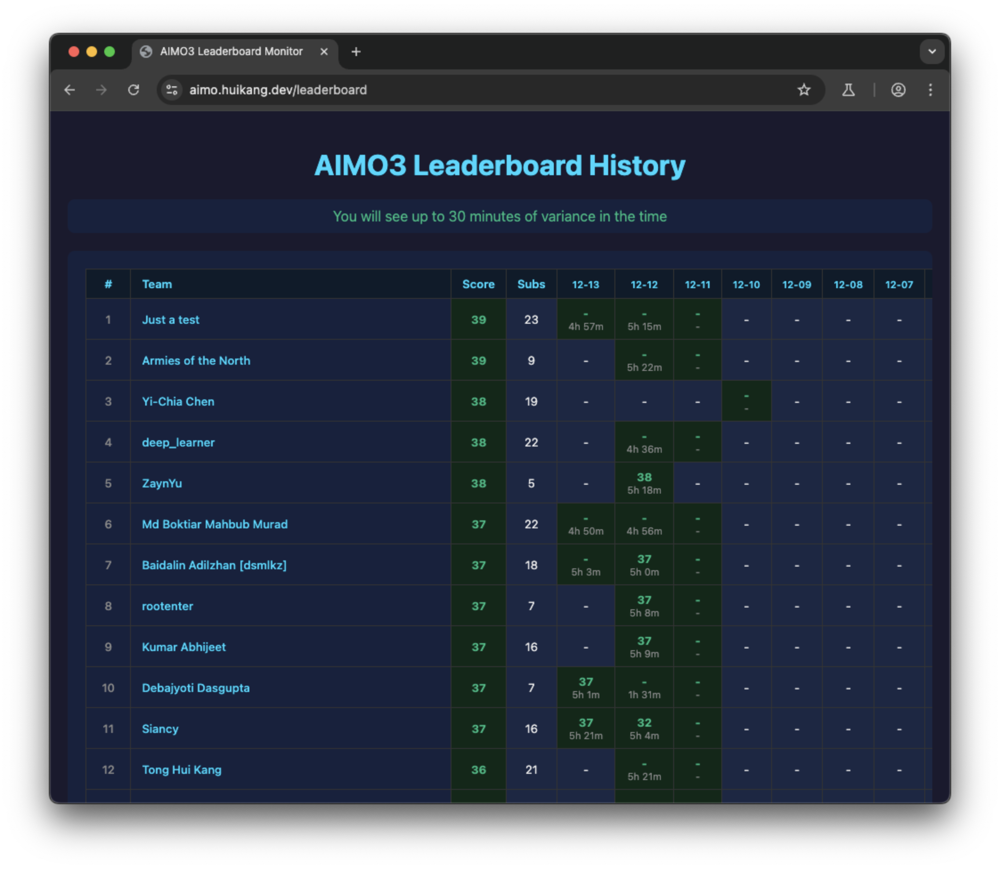
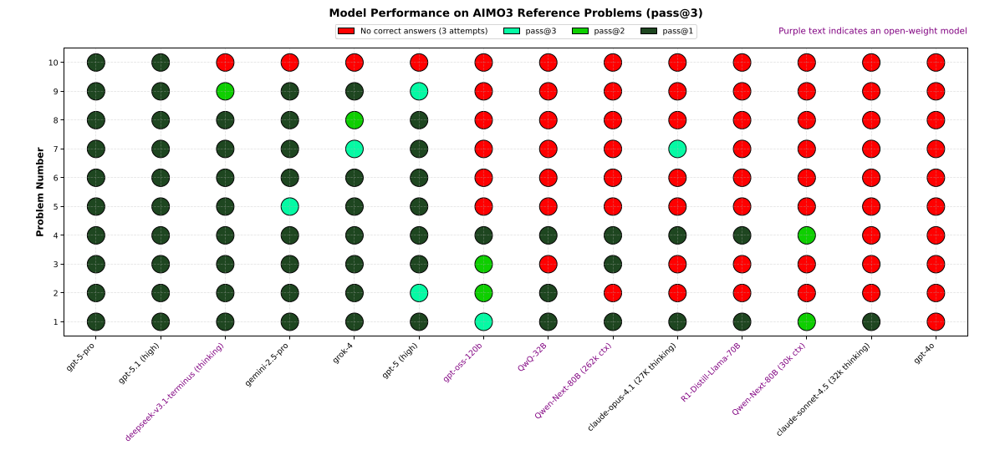
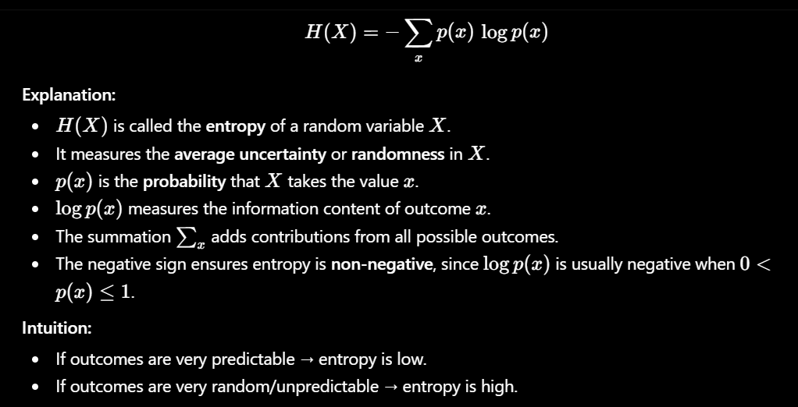

# AI Mathematical Olympiad Progress Prize 3 轻量深读（Tier B）

> 赛事：Featured ｜ 主题 nlp（IMO 级数学推理，代码赛）｜ 4138 队 ｜ 5 小时 / 1×H100 80GB / 50 题 ｜ 指标：AIMO3 Multirun-Accuracy（答案 ∈ [0, 99999]）
> 材料基础：`digests/ai-mathematical-olympiad-progress-prize-3.md`（10 篇正文：1st 703222 / 2nd 702423 / GPT-OSS-120B 技术总结 702057 / 37th 700274 / AIMO2 复盘 638787 / 语料奖 672528 / 附加奖公布 708484 / 写作奖规则 689703 等；120 条主题索引）+ 10 张归档图
> 轻读时间：2026-10（Tier B B12）

## 1. 一句话重述与数字账

给 50 道 IMO 级数学题在 5 小时内提交整数答案（[0, 99999]）。AIMO3 与 AIMO2 的最大区别是**"微调时代 → 推理工程时代"**：本届没有主流微调方案，榜单被一份 **GPT-OSS-120B + Python 工具 + 自洽投票**的公开 notebook 血洗（官方总结直言"main competition ended up being dominated by one notebook"），前排名次靠的是**提示词格式约束、熵/投票聚合设计、沙箱与显存工程**。AIMO2 的经验（DeepSeek-14B 微调 + 长度压缩）在本届退居次要。

| 关键数字 | 值 | 来源 |
| --- | --- | --- |
| 1st（703222） | GPT-OSS-120B（117B 参数 / 每 token 约 12B 激活的 MoE）单卡 H100：OS 级权重预加载进 page cache、prefix caching、8-bit KV cache 量化、熵加权自洽、持久 Jupyter 沙箱验证回路、自适应运行时调度；结论 = 推理工程 + 提示词工程的收益高于朴素扩规模（归档文本未给出最终分数） | 703222 |
| 2nd（702423） | 在 Parthenos 公开 notebook 上做 **7 处修改**：①系统提示强制答案范围与模约简提醒（最高杠杆）；②库使用提示压缩到一行（每 attempt 省 ~200 token）；③熵只统计**尾部 256 token**；④答案只认 `\boxed{}`（去掉 prose 回退、逗号/空格容错、最后一次匹配）；⑤投票分主导的聚合 `score = 2.0×vote_share + 0.3×confidence + 0.5×consensus`；⑥中位数熵；⑦"领先者不可被追上"提前停止；8 attempts/题、16 个持久 kernel、50 题约 4–5 小时 | 702423 |
| GPT-OSS-120B 技术总结（702057） | 私榜 **41.5**（546 名），公榜 41/50、公开版峰值 **42/50**；68 个 notebook 版本迭代；pass@8 + `ReasoningEffort.HIGH` + 持久 Python 工具；vLLM 0.11.2、65,536 ctx（81,920 可避免截断）、FP8 E4M3 KV cache、prefix caching、异步调度；发现：短提示 > 长篇解题框架；"IMO 金牌"人设更稳；sandbox 池 2×（16 workers/8 attempts）；pass@8+4 票早停优于 pass@12/16；不训练 | 702057 |
| 难度与基线 | 欢迎帖给出参考题 pass@3 对照：GPT-5-pro / Gemini 2.5-pro 近满分，gpt-oss-120b 明显落后（见图 2）；公榜/私榜难度对比帖 64 票 / 38 评论 | 635859 / 679559 |
| 最难题目 | ACUTES 被唯一一名选手在两次评测中都解出（总成绩 43.5，$30k 最难奖）；ROLLER 两次评测无人解出；官方称 pass@N 高至 N=4000 仍可能失败 | 708484 |
| AIMO2 遗产（638787） | 上届主流为 DeepSeek-R1-Distill-Qwen-14B：SFT/DPO/GRPO 压缩推理长度、W4KV8 量化、lmdeploy/TensorRT-LLM、ReDrafter 1.8×、动态时间缓冲；1st NemoSkills（2.2M CoT SFT + 15K TIR，CoT×0.3+TIR×0.7 权重合并，350s/题 + 210s 余量，4/5 一致早停，公 33/私 34） | 638787 |
| 语料奖 | CrystalMath（2,129 道高难验证题，CAV 过滤；官方抽检残余问题率 ~50%，同类难集约 80%）获 $30k；AstralMath 亚军（~431k 条工具使用轨迹、7 个模型、AstralBench 50 题）；特别提名 Pol yMath、JK-Piece（solution-hint TIR）、ICL 画像、Tong Hui Kang 标注（含 LoRA） | 708484 |
| 写作奖 | 冠军：Geremie Yeo & Chan Ka Vu（Nemotron Cascade 2 首个 FP8/NVFP4 量化 + 让 prefix caching 与投机解码在 hybrid-Mamba 上共存的 vLLM fork + EAGLE-3）与 natnitarach（20+ 受控实验证明"模型能力 > 提示词多样性"约 4 倍）；亚军 Hail Mary（199 题验证集上 16 项改动经 BH 多重检验后无一优于基线，附 pytest 失败模式检测器） | 708484 |
| 治理 | 私榜重跑（51 票 / 70 评论）、私榜多次更新（36 / 28 票）、H100 滥用治理（35 票）、Tinker 算力申请帖（34 票 / **344 评论**）、Longest Leader 奖（$20k，OSSMath 累计领跑，规则鼓励合并） | 索引 |

## 2. 逐方案对照矩阵

| 维度 | 1st（703222） | 2nd（702423） | GPT-OSS 技术总结（546th） | AIMO2 冠军（对照） |
| --- | --- | --- | --- | --- |
| 底座 | GPT-OSS-120B | GPT-OSS-120B | GPT-OSS-120B | Qwen2.5-14B 微调 |
| 训练 | 无 | 无 | 无 | SFT 2.2M CoT + 15K TIR + 合并 |
| 推理引擎 | vLLM（KV 8-bit、prefix cache） | vLLM + FP8 KV | vLLM 0.11.2 + FP8 KV | TensorRT-LLM + ReDrafter |
| 采样 | 并行多尝试 + 熵加权 | 8 attempts + 投票主导聚合 | pass@8 + 反熵权重 | pass@N + 动态批 |
| 工具 | 持久 Jupyter 沙箱验证回路 | 16 kernel 沙箱 | 持久 kernel，超时 6s | 沙箱 + 代码修复回环 |
| 时间调度 | 自适应（难度/稳定性分配） | 动态预算 + 不可追领先早停 | 时间缓冲（240s/840s 档） | 350s + 全局 210s 缓冲 |
| 结果 | 第 1 | 第 2 | 私 41.5（546） | AIMO2 第 1（33/34） |

## 3. 共识、分歧与裁决

### 共识一：AIMO3 进入"推理工程时代"，微调不再主导（1st、2nd、546th、官方总结；置信度高）

1st/2nd/546th 全部零训练，靠 prompt、采样聚合、沙箱与 vLLM 工程；官方总结也承认"主赛被一份 notebook 主导"，并用额外奖项（语料/写作/最难题/最长领跑）补偿深度。**裁决**：该类比赛当前的边际收益在推理系统而非权重；复现公开强 notebook 并按"格式约束 + 聚合器 + 可靠性"做增量是主路径。置信度：高。

### 共识二：答案格式/范围约束是最高杠杆的单点改动（2nd、37th；置信度高）

2nd 称在系统提示里加入 "[0, 99999] 且超界即模约简" 直接消除了一整类"做对但 box 了 20 位数"的零分；37th 也把"整数答案、避免浮点、何时用 Python、MOD 检查"写进提示。**裁决**：先修格式与验证协议，再谈题目求解能力。置信度：高。

### 分歧一：聚合器——纯熵加权 vs 投票主导（2nd vs 546th/Parthenos；置信度中高）

2nd 指出纯反熵加权会被"极低熵但错误"的单次尝试劫持，改为投票分主导（权重 2.0）+ 熵做 tie-breaker，并给出 500×500 矩形题的票数表；546th 的公开版则继续使用反熵加权（并拿到 41/42 分）。**裁决**：两种聚合都能工作，但需要配套早停与置信度口径（尾部 vs 全序列熵）；"投票为主 + 熵为辅"更抗离群。置信度：中高。

### 共识三：工程可靠性决定完赛与上限（1st、2nd、546th、治理帖；置信度中高）

1st 列 page cache 预加载、KV 量化、沙箱持久化、超时兜底；546th 强调 2× sandbox 池、81,920 ctx 防截断、Maron MoE 后端防 OOM；2nd 用 16 个持久 kernel；社区还有私榜重跑与队列问题。**裁决**：5 小时硬限制下，"不 OOM、不超时、可回退"比多一个技巧更重要。置信度：中高。

### 事件：赛制与算力治理（693267、696230、698987、668407、680552、708484；置信度中高）

私榜重跑与多次榜单更新引发大量讨论（51/70、36/79、28/79 评论）；H100 被挪作非 AIMO 用途被点名；Tinker 算力申请帖 344 评论；最难题/最长领跑奖的规则鼓励团队合并。**裁决**：AIMO 系列已从"单榜竞赛"演化为"多奖项 + 算力治理"的生态，参赛策略需同时考虑榜单与附加奖。置信度：中高。

## 4. 证据分级

| 断言 | 等级 | 说明 |
| --- | --- | --- |
| 2nd 的 7 项改动与聚合公式 | 自述 + 代码链接 | 高 |
| 546th 的工程发现清单与分数（41.5） | 自述（含版本迭代记录） | 中高 |
| 1st 的架构要点 | 自述 + 8 张图（多为公式/截图） | 中（未给分数） |
| AIMO2 各名次细节 | 二次汇总贴（引用官方 writeup 链接） | 中高 |
| 语料奖/写作奖/最难奖事实 | 官方公告 | 高 |
| 私榜重跑/滥用治理 | 多帖（高评论） | 中高 |

## 5. 悬案与缺口（登记）

- 1st 的最终得分与模型清单未在归档文本给出；3rd–5th 方案未收录；
- 私榜重跑的具体规则与多次榜单更新的差异未细读；
- Longest Leader 的逐日归属与合并细节未展开；
- 归档 10 图中 8 张来自 1st 的截图（公式/提示词），信息密度一般；
- **图证缺口**：无。

## 6. 图表证据

**图 1**（topic 662498，85 票）：社区自建 AIMO3 历史榜单监控——记录队伍在各日的分数与运行时长（"Just a test" 39 分、单次运行 4–5 小时），反映 5 小时预算与长跑特性。

**图 2**（topic 635859，官方欢迎帖）：参考题上各模型的 pass@3 表现——GPT-5-pro / Gemini 2.5-pro 接近全对，gpt-oss-120b 等开源模型明显落后。

**图 3**（topic 703222，1st）：熵的定义与直觉（低熵=高置信）——熵加权自洽聚合的数学基础。

## 7. 出处

- 1st（14 票）：https://www.kaggle.com/competitions/ai-mathematical-olympiad-progress-prize-3/discussion/703222
- 2nd（15 票）：https://www.kaggle.com/competitions/ai-mathematical-olympiad-progress-prize-3/discussion/702423
- GPT-OSS-120B 技术总结（28 票）：https://www.kaggle.com/competitions/ai-mathematical-olympiad-progress-prize-3/discussion/702057
- 37th 提示词压缩思路（13 票）：https://www.kaggle.com/competitions/ai-mathematical-olympiad-progress-prize-3/discussion/700274
- AIMO2 前排名方案汇总（24 票）：https://www.kaggle.com/competitions/ai-mathematical-olympiad-progress-prize-3/discussion/638787
- 附加奖公布（24 票）：https://www.kaggle.com/competitions/ai-mathematical-olympiad-progress-prize-3/discussion/708484
- 写作奖规则（19 票）：https://www.kaggle.com/competitions/ai-mathematical-olympiad-progress-prize-3/discussion/689703
- 历史榜单监控（85 票）：https://www.kaggle.com/competitions/ai-mathematical-olympiad-progress-prize-3/discussion/662498
- 官方欢迎帖与 pass@3 基线（65 票 / 82 评论）：https://www.kaggle.com/competitions/ai-mathematical-olympiad-progress-prize-3/discussion/635859
- 公私榜难度对比（64 票）：https://www.kaggle.com/competitions/ai-mathematical-olympiad-progress-prize-3/discussion/679559
- 私榜重跑（51 票 / 70 评论）：https://www.kaggle.com/competitions/ai-mathematical-olympiad-progress-prize-3/discussion/693267
- H100 滥用治理（35 票）：https://www.kaggle.com/competitions/ai-mathematical-olympiad-progress-prize-3/discussion/668407
