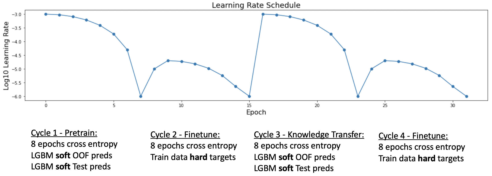
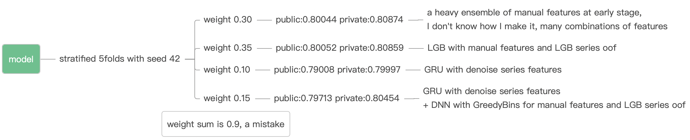

# 深读：Amex Default Prediction（用借来的数据、洗出的噪声、拼出的冠军）

> 素材：现有 8 篇正文 + 120 条主题索引（含 834 票"整数列"与 521 票"压缩数据"等公共资产）。
> 本篇亮点：量化"数据清洗"的每一笔收益；拆解短序列子群；裁决"堆叠行不行 / 权重听谁"两桩公案；冠军的 0.9 权重失误。

## 0. 一句话重述：这道题真正在考什么

预测客户未来违约（自定义 Gini + top-x% capture，本质是"头部排序质量"）。数据被**注入噪声**（含 (0,0.01] 区间的均匀噪声）、短序列客户行为迥异、测试期（未来）数据可用。

→ 任务降解为：**① 在公共清洗基线上再做噪声精修；② 对短序列子群单独建模；③ 用"排序融合 + 少量精选模型"锁住头部；④ 用工程（团队对齐、GPU、嵌套 CV）换取迭代速度。**

## 1. 材料与角色

| 帖子 | 角色 | 关键信息 |
| --- | --- | --- |
| 1st（jxzly，303 票） | 冠军 | LGB+NN 重集成 + GRU；**四个组件权重 0.30/0.35/0.10/0.15——总和 0.9（自述"a mistake"）**；发布 GitHub |
| 2nd（JuneHomes，180 票） | 亚军 | 团队工程学：7k 特征、统一折/holdout、≤2 月账单专用模型、Power(2) 秩融合；大量负结果 |
| 3rd（80 票） | 季军 | "feature engineering is all you need"；基于 raddar 去噪 + ragnar123 特征 |
| 5th（61 票） | 第 5 | GBDT+Transformer+2D-CNN+GRU；**"权重按公开榜定，按 CV 定会过拟合"**；meta feature 使 Transformer LB 0.790→0.793；横向 Pivot |
| 10th（93 票） | 第 10 | RAPIDS cuDF + XGB + 自回归 RNN 特征；**短序列是性能杀手**（量化）；利用未来测试数据 |
| 11th（347786） | 第 11 | LGBM + meta 特征；按 3/6 月窗口聚合；CV 0.79922 / priv 0.80852 |
| 13th（76 票） | 第 13 金 | **二次精修噪声**（(0,0.01] 均匀噪声，用他列过滤修复 29 个特征）；3 套集成（61/54/55 模型） |
| 14th（271 票） | 第 14 金 | NN Transformer **用 LGBM 知识蒸馏**（train+test 软标签，4 段循环）；nested 10×10 CV；RAPIDS FIL 做 10 万级置换重要性 |
| 指标四帖（254/144/111/94 票） | 学习资产 | 图形化解释、逐步理解、10× 加速实现、归一化 Gini——本场最热的公共资产 |

## 2. 逐方案对照矩阵

| 维度 | 1st | 2nd | 13th | 14th | 5th |
| --- | --- | --- | --- | --- | --- |
| 数据 | 公共特征 + 手工/序列特征 | raddar 预处理 + 7k 特征 + 自定义清洗 | raddar + **二次去噪** | raddar 系 + 蒸馏 | raddar + ragnar + meta |
| 验证 | 5 折（固定种子） | 统一折 + 20% 客户 holdout | 5k→15k 折对照 | **nested 10×10**（100 模型） | CV + 公开榜（选权重） |
| 主力模型 | LGB + GRU/DNN | DART LGB / GBDT LGB / CatBoost | LGBM stack/CMA/加权 | LGBM + Transformer（KD） | GBDT+Transformer+2D-CNN+GRU |
| 融合 | 手动权重（和=0.9） | Power(2) 秩融合 + 子群专用模型 | 3 套集成取平均 | 50% LGBM + 50% NN | 公开榜定权 |
| 私有分 | — | — | 0.80842 | 0.800（CV/LB 同） | — |

## 3. 共识与分歧（含裁决）

**共识**：raddar 去噪 + 公共特征是所有人的起点；短序列子群需要单独处理；头部排序（capture）比整体 AUC 更值得优化。

**分歧与裁决**：

| 争议 | 观点 A | 观点 B | 裁决（依据与置信度） |
| --- | --- | --- | --- |
| 堆叠（stacking）行不行？ | 13th：**LGBM stack（61 模型）进前列**，14th 用 nested CV 让堆叠可调 | 2nd："stacking by any mean"都不行，误差无模式；只保留 LR/Lasso 做融合 | **区分两类"堆叠"**：对**秩/概率做加权平均或线性融合**（有效，13th/14th/2nd 都用了）；对**复杂元模型**（2nd 的失败项）。2nd 的"无模式误差"是元模型失效的直接证据；置信度高 |
| 融合权重听谁？ | 5th：按公开榜定权，CV 定权会过拟合 | 2nd：加入 0.795 级弱模型会让公开分变差；1st：手动权重且**和=0.9 也是冠军** | **本场无定论**：private/public 大洗牌 + 头部指标噪声让"听谁"都带赌性；稳健做法=（14th）nested CV 出无泄漏分数 + 少量精选模型。置信度中 |
| 焦点损失（focal） | 指标是头部 capture，"理应"适合 focal | 2nd 多次实测：无效 | **接受负结果**：指标语义 ≠ 损失函数收益；置信度高（多次对照） |
| 短序列怎么办 | 2nd：≤2 月账单客户单独训 300 特征 DART 模型，按秩分组回填 | 10th：识别为"性能杀手"但不单独建模（时间不够） | **单独建模有效**（2nd 的实施）；置信度中（收益"很稳但很小"——该子群在公私榜占比小） |

## 4. 增量数字账

| 动作 | 数字 | 备注 |
| --- | --- | --- |
| 二次去噪收益（13th） | LGBM +0.0007 / XGB +0.0008 / CatBoost +0.0004 | 对照 raddar 基线 |
| 折数 5k→15k | +0.0013（LGBM） | 更细折改善头部指标 |
| CatBoost 延长早停 | +0.002 | 简单但有效 |
| 短序列违约率（10th） | seq=13 → **23.2%**；12 → 38.9%；11 → 44.7% | 序列越短违约越高（386k/10.6k/6.0k 客户） |
| 蒸馏 Transformer（14th） | CV 0.798 / LB 0.799；50/50 集成 0.800/0.801 | nested 10×10 无泄漏口径 |
| 冠军组件（1st） | 0.30/0.35/0.10/0.15（和 0.9） | 四个组件公/私榜 0.79–0.809 |

## 5. 机制推演

1. **噪声为何能被"用他列过滤"修复**：主办方在 (0,0.01] 区间注入了均匀白噪声（如 B_11 的直方图在 0 附近出现异常台阶）；13th 发现 **B_1 的小值区间标记了被加噪的行**，对这些行反号（invert）即可还原 B_11 的真实信号。本质是噪声注入的**行级相关结构**：抓到一个"受污染指示列"，就能批量修复其他列。
2. **短序列为何是杀手**：只有 11–12 个月历史的客户，违约率反而高（39–45% vs 23%），且特征聚合（均值/差分/滞后）在短窗口上方差极大；全量模型把他们的模式与长序列混在一起学，头部排序被稀释。2nd 的解法是"把 ≤2 月客户交给专用小模型"，再**只在原秩组内重排**——秩保持的合并避免了破坏全局排序。
3. **KD 为何要加入测试软标签**（14th）：测试集来自未来、分布有漂移；在蒸馏阶段用 LGBM 对 **train+test** 的软预测预训练 Transformer，让网络先吸收"未来分布"的形状，再用硬标签微调——4 段循环（软-硬-软-硬）兼顾分布适应与监督信号，且可训练更深（4 层、无跳连）的 Transformer。
4. **0.9 权重为何依然夺冠**（1st）：头部指标对小权重扰动不敏感（排序融合的鲁棒性）+ 最后阶段有运气成分（冠军自述"luck"）。**但这不构成照搬理由**——它是"稳健融合 + 榜单波动"的幸存者样本。
5. **工程即方法**（2nd/14th）：统一折与 holdout 让四人/多实验可比（2nd）；nested 10×10 + RAPIDS FIL 把"无泄漏验证 + 10 万级置换重要性"变成日常操作（14th）。本场前排的分差常在 1e-3 量级，**迭代速度本身就是分数**。

## 6. 证据分级

| 断言 | 等级 | 说明 |
| --- | --- | --- |
| 二次去噪收益 +0.0004~0.0008 | **可复算（对照表）** | 13th 给出三模型前后 |
| 短序列违约率台阶 | **可复算（代码输出）** | 10th 帖内表 |
| KD 循环与 nested CV | **可复算（图示+描述）** | 14th 图 2 + 10×10 描述 |
| 5th 的"权重按 LB"主张 | **自述（争议）** | 与 2nd 的"弱模型伤 LB"并存 |
| focal loss 无效 | **自述（多次）** | 2nd 明确"several times" |
| 1st 权重和 0.9 | **图证（自述"mistake"）** | 见内嵌图 2 |

## 7. 边界条件与反事实

- **头部指标场景**：本场结论都服务于"top-x% capture"；换成 AUC/LogLoss 为主的任务，短序列与噪声的权重要重估。
- **反事实 1**：不做二次去噪，13th 三模型各差 0.0004–0.0008——在 1e-3 竞争带里这正是金/银的差距。
- **反事实 2**：若把 ≤2 月客户直接丢弃（而非单独建模），会丢掉私榜中约 1–2% 的客户（2nd 提示"占比小"，收益稳但小）。
- **迁移前提**：任何"数据被注入噪声"的比赛，先找**行级污染指示特征**（某列的小值区间/异常台阶），再做跨列修复——比逐列平滑更有效。

## 8. 悬案与失败学

- 悬案 1：噪声注入的确切机制（为何是 (0,0.01]、为何部分列相关）未官方披露；
- 悬案 2：P_2（内部评分模型列）未被充分利用——2nd 想做"用 P_2 做元信息"但缺时间；
- 失败学：focal loss（指标暗示却无效）；复杂元模型 stacking（误差无模式）；盲目堆弱模型入 blend（2nd 实测伤分）；把"权重和=0.9"式的疏忽当作风格。

## 9. 图表证据

**图 1：知识蒸馏的 4 段余弦训练循环**（来源：14th topic 347641；本地 `intel/amex-default-prediction/bodies/347641_img/02.png`）

*读图结论*：每段 8 epochs——① 预训练（LGBM 软 OOF + 软测试预测）→ ② 硬标签微调 → ③ 再蒸馏 → ④ 再微调；学习率每段从 ~1e-3 重置并余弦降到 ~1e-6。**测试软标签参与预训练**是这张图里最不寻常也最关键的设计。

**图 2：冠军的融合结构与权重（和=0.9）**（来源：1st topic 348111；本地 `.../348111_img/02.jpg`）

*读图结论*：四个组件——手工特征重集成（0.30，公/私 0.80044/0.80874）、LGB（0.35，0.80052/0.80859）、GRU（0.10）、GRU+DNN（0.15）；**权重总和 0.9，作者自注"a mistake"**——却拿到冠军。是"稳健融合 + 榜单噪声 + 运气"的联合结果，不应被当作可复制的配方。

## 10. 对既有笔记/playbook 的修订点

1. 笔记升级：补二次去噪机制与收益、短序列数字台阶与专用模型、KD 循环、nested CV、0.9 权重轶事、堆叠两义裁决；内嵌两张图。
2. `playbook/tabular.md` 增补：**"行级污染指示特征"**修复法与**子群专用模型 + 秩保持合并**；验证一栏补 nested 10×10 作为无泄漏标准。
3. `playbook/00-通用方法论.md`：在"经典 vs ML"附近增补"指标语义不等于损失函数收益（focal 反例）"。

## 11. 出处

- 1st：https://www.kaggle.com/competitions/amex-default-prediction/discussion/348111
- 2nd：https://www.kaggle.com/competitions/amex-default-prediction/discussion/347637
- 3rd：https://www.kaggle.com/competitions/amex-default-prediction/discussion/349741
- 5th：https://www.kaggle.com/competitions/amex-default-prediction/discussion/348097
- 10th：https://www.kaggle.com/competitions/amex-default-prediction/discussion/347668
- 13th：https://www.kaggle.com/competitions/amex-default-prediction/discussion/348014
- 14th：https://www.kaggle.com/competitions/amex-default-prediction/discussion/347641
