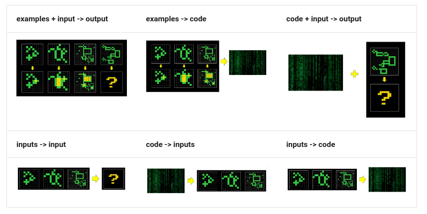

# ARC Prize 2024 轻量深读（Tier B）

> 赛事：Featured ｜ 主题 nlp/reasoning（抽象推理）｜ 1427 队 ｜ 代码赛 ｜ 指标：ARC 任务解出率（每任务 3 次提交内答对即算）
> 材料基础：`digests/arc-prize-2024.md`（4 篇正文：2nd Omni-ARC 545671 / 4th 550414 / 3rd 550328 / 21st 550209；80 条主题索引）+ 8 张图
> 轻读时间：2026-10（Tier B B09 收官）

## 1. 一句话重述与数字账

用少量"输入-输出网格"对学会一个抽象变换并应用到测试网格（每任务可提交 3 个候选）。本场的路线分野非常清晰：**"测试时训练（TTT）+ 语言模型"（2nd）对"经典 DSL 搜索 + 决策树 + CNN 集成"（3rd/4th）**——而 4th 的结语也承认"TTT 是当前最先进的方向"。

| 关键数字 | 值 | 来源 |
| --- | --- | --- |
| 2nd（Omni-ARC，545671） | 实现 MindsAI 的**测试时微调**思路并扩展成**多任务训练**：让同一个模型学 6 种 ARC 相关任务（图 1）——① examples+input→output（原任务）② inputs→input（学生成输入分布）③ examples→code ④ code+input→output ⑤ code→inputs ⑥ inputs→code；核心假设："**训练模型做需要好表示的任务，模型就会内化该表示**"；实现：**Qwen2.5-0.5B-Instruct + LoRA（rank 128、lr 5e-5、bs 16、2e5 步、max_len 8196、2×A6000）**；输入用**极简文本网格表示**（Markdown 代码块 + 首行形状 + 行号）；**测试时微调（TTT）**：对每个测试题用它 n−1 个训练样本微调（随机留 1 个当测试）、bs=1、约 300 步，**每题一个模型（每次提交 100 个微调模型）**——把某模型的解出数从 **11 提到 33**；微调已有 LoRA 比重建新 LoRA 更好；推理用数据增强 + 投票；最后与 **2020 年公开解法**集成 | 545671 |
| 4th（550414） | 经典路线：**DSL（领域特定语言）+ DAG 搜索 + 决策树 + CNN**（沿用 2020 冠军们的方案并现代化）；关键外部变量：Kaggle 内核 RAM 30GB、时限 12 小时（2020 为 9 小时）→ **搜索更深、训练更久、集成更多模型**；集成技巧：多数投票、自定义逻辑（如 icecuber 解优先、豁免多数投票）、**按"每个模型新解出的题数"成比例的概率抽样**；自评"TTT 是当前 SOTA" | 550414 |
| 3rd（550328） | 公开了得分 40 的 notebook（方案摘要写在 notebook 里）；强调"**能抵抗公榜=私榜过拟合、做通用解法**" | 550328 |
| 21st（550209） | 一个小而妙的技巧：**先做颜色重映射（按各 pair 的输入/输出颜色频率排序后映射）**再喂给 icecuber 求解器 → 在集成里比 26% 基线 **+2%**；作者自述"1% 的精力，其余都是失败" | 550209 |
| 社区侧 | "上手参考"（101 票）、"如何着手"（85 票）、"**用 LLM 得 33 分**"（50 票）、"400k 合成 ARC 题 + 代码 + 微调模型"（41 票）、"**一个 tiny 模型**"（44 票）、"我的失败尝试"（35 票）、"每日提交限制变更"（53 票） | 社区 |

## 2. 逐方案对照矩阵

| 维度 | 2nd（Omni-ARC） | 4th | 3rd |
| --- | --- | --- | --- |
| 路线 | **LLM + 多任务训练 + 测试时微调** | DSL/DAG 搜索 + 决策树 + CNN | notebook（得分 40） |
| 表示 | 文本化网格（Markdown + 形状 + 行号） | 网格 + 增强（对角翻转、颜色切换、对称） | — |
| 模型 | Qwen2.5-0.5B + LoRA(128) | 多算法集成 | — |
| TTT | **每题一个 300 步微调模型** | 无（靠搜索深度） | — |
| 集成 | 增强投票 + 与 2020 解法合并 | 多数投票 + 自定义优先 + 概率抽样 | — |

## 3. 共识、分歧与裁决

### 共识一：TTT（测试时训练）是本场的技术制高点（2nd + 4th 的评语）

2nd 的 TTT 把单模型解出数 11→33；4th 明确"读完顶级方案后，我相信 TTT 是当前 SOTA 且最有希望的方向"。**裁决**：当任务"每题都是新规则、样本极少"时，把算力花在"测试时适配"比预训练更多任务更有效。置信度：高。

### 共识二：表示（representation）决定可行性（2nd/21st）

2nd 的整个动机是"找对表示后 ARC 题很简单"，并用多任务训练逼出表示；21st 的颜色重映射（把颜色按频率排序后重编码）是同一思想的最小实现（+2%）。**裁决**：ARC 类任务的边际收益顺序 = 表示/规范化 > 搜索深度 > 模型规模。置信度：高。

### 共识三：集成策略必须"按能力加权、但不被单一强解主导"（4th）

4th 的集成三件套：多数投票 + 自定义逻辑（icecuber 解优先且豁免投票）+ 按"新解题数"概率抽样。**裁决**：当各子求解器能力差异大且题目独立时，"按历史贡献概率抽样 + 关键解豁免"比等权投票更稳。置信度：中高。

### 分歧一：小模型 TTT vs 大模型/经典搜索

2nd 用 **0.5B** 的小模型 + LoRA 就拿到第 2；4th 用经典 DSL/CNN 拿第 4；社区热议"tiny model"（44 票）与"用 LLM 得 33 分"（50 票）。**裁决**：TTT 让"模型规模"的重要性下降——每题 300 步的适配比参数量更值钱；但经典搜索在部分题型上仍不可替代（21st 的 +2% 就是给经典求解器加前置表示）。置信度：中高。

### 事件：公榜=私榜的诱惑（3rd 的提醒 + 53 票的提交限制帖）

3rd 特意强调"能抵抗公榜—私榜过拟合、做通用解法"；社区还讨论过每日提交限制变化。**裁决**：ARC 这类隐藏集与公开集同分布的赛制里，"过拟合公榜"是主要陷阱；通用性优先。置信度：中高。

## 4. 证据分级

| 断言 | 等级 | 说明 |
| --- | --- | --- |
| 2nd 的 Omni-ARC 六任务与 TTT 细节（11→33） | 自述 + 论文 + 多张图 + 公开代码 | 高 |
| 4th 的经典路线与集成技巧 | 自述 + 公开 notebook + 2020 来源 | 中高 |
| 21st 的颜色重映射 +2% | 自述 + 代码片段 | 中 |
| "TTT 是 SOTA" | 4th 的评语（非量化） | 中高 |
| 400k 合成题与小模型帖 | 社区资源 | 中 |

## 5. 悬案与缺口（登记）

- **1st place 的方案未入库**（MindsAI 团队的完整方案，2nd 是其实；官方 1st 与 2nd 分数是否接近未记录）；
- "Score 33 using LLM"（50 票）与"400k 合成 ARC"（41 票）未细读；
- 3rd 的方案细节在 notebook 内，未在 digest 展开；
- 归档 8 图：2nd 的六任务示意（图 1）与多任务模型图为关键图证。

## 6. 图表证据

**图 1**（topic 545671）：同一模型被训练的六种 ARC 相关任务——上排：examples+input→output（原任务）、examples→code、code+input→output；下排：inputs→input（生成输入分布）、code→inputs、inputs→code。作者假设"迫使模型同时做这些任务会内化更好的表示"，这也是 TTT 阶段能只用 n−1 个样本快速适配的基础。

## 7. 出处

- 2nd（Omni-ARC，173 行处）：https://www.kaggle.com/competitions/arc-prize-2024/discussion/545671
- 4th：https://www.kaggle.com/competitions/arc-prize-2024/discussion/550414
- 3rd：https://www.kaggle.com/competitions/arc-prize-2024/discussion/550328
- 21st：https://www.kaggle.com/competitions/arc-prize-2024/discussion/550209
- 用 LLM 得 33 分（50 票）：https://www.kaggle.com/competitions/arc-prize-2024/discussion/512910
- 400k 合成题（41 票）：https://www.kaggle.com/competitions/arc-prize-2024/discussion/543953
