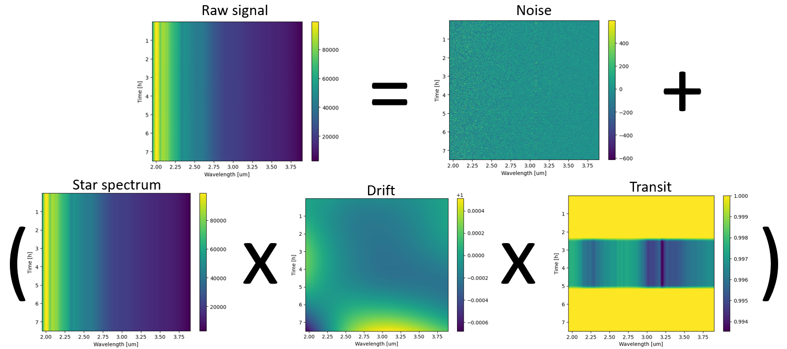

# Ariel Data Challenge 2025 轻量深读（Tier B）

> 赛事：Featured ｜ 主题 science（系外行星光谱反演）｜ 860 队 ｜ 代码赛 ｜ 指标：Ariel Gaussian Log Likelihood
> 材料基础：`digests/ariel-data-challenge-2025.md`（6 篇正文：1st 609888 / 6th 609276 / 7th 609210 / ArielML 591278 / 9th 609443 / 3rd 609252；80 条主题索引）+ 19 张图
> 轻读时间：2026-10（Tier B B04）

## 1. 一句话重述与数字账

从 Ariel 卫星模拟原始光谱（计数）反演行星凌星深度 D(λ) 及其不确定度 σ(λ)（高斯似然指标）。真正的考点是**预处理/校准的物理工程 + "均值+方差"双输出**；2025 数据更真实，1st 坚持了贝叶斯反演路线。

| 关键数字 | 值 | 来源 |
| --- | --- | --- |
| 1st（56 票，"Bayesian Inference, of course"） | 三步：预处理（5/50 帧合并、宇宙线去除、**PCA 看 jitter**、进阶波长合并 +0.01）→ **贝叶斯推断**（高斯先验分解为 Noise/Star spectrum/Drift 三阶多项式/Transit batman/深度均值+变化：FGS 高斯 + AIRS **GP（两个 SE 核）** + PCA 基；迭代线性化 + 超参梯度下降；网格搜索→BFGS 初始化；8 次迭代；200 样本近似协方差）→ **Fudging**（对 D/σ 做经验修正）；完整开发史开源 | 1st |
| 3rd（32 票） | 标准校准 + **8σ 时间维剔除（单项 +0.05 CV）**；梯度极值相位检测 + 分相特征（AIRS 按频率切 32 块 → +0.025）+ 8 次多项式拟合；CNN（92 时间块）；**Rational Quadratic NN 集成**；特征缩放 x/√(18+x²/9) | 3rd |
| 7th（609210） | Phase detector（梯度极值+阈值扫描+异常修复）→ 物理特征 → **NN 差分修正 + 基础 σ** → **GBM 调 σ 尺度** → 伪标；base wl_preds CV ~0.42 | 7th |
| 6th/9th/ArielML | Batman-Minuit（6th）；9th；教学库 ArielML | 材料 |

## 2. 逐方案对照矩阵

| 维度 | 1st（贝叶斯） | 3rd（ML） | 7th（ML+物理） |
| --- | --- | --- | --- |
| 预处理 | 进阶波长合并、jitter PCA | 8σ 剔除、梯度极值相位 | Phase detector+异常修复 |
| 核心 | 高斯先验 + batman + 迭代 BI | 特征 + CNN + RQ-NN 集成 | NN 差分修正 + GBM σ 尺度 |
| σ 处理 | 后验协方差 + fudging | RQ-NN 输出（隐含） | GBM 调尺度 |
| 训练技巧 | MLE 超参/网格+BFGS 初始化 | 特征缩放、8 次多项式 | 伪标 |
| 结果 | 1st | 3rd | 7th |

## 3. 共识、分歧与裁决

### 共识一：预处理/校准是最大的分数来源（3/3）

3rd：8σ 时间剔除单项 **+0.05**、AIRS 32 频块特征 **+0.025**；1st：进阶波长合并 +0.01（简单求和已经很强）；7th：phase detector 是流水线地基。**裁决**：原始计数→光度信号的每一步（非线性/坏像素/宇宙线/jitter/背景）都值 0.01–0.05 量级；模型复杂度是二阶问题。置信度：高。

### 共识二：双输出（D(λ) 均值 + σ(λ)）必须分别校准（3/3）

高斯对数似然对均值与方差同权：1st 用后验协方差 + fudging；7th 用 GBM 单独调 σ 尺度；3rd 用 NN 回归。**裁决**：σ 是第二引擎，需独立建模/校准；"好模型+错 σ"会被指标惩罚。置信度：高。

### 共识三：相位检测可用"信号梯度极值"（3rd/7th）

3rd/7th 都独立提出用梯度极值/阈值扫描定位 ingress/egress，再在相位内提特征。**裁决**：凌星边界在导数曲线上有特征形状，是比拟合更轻的相位检测法。置信度：中高。

### 分歧：贝叶斯反演 vs 物理特征+ML

1st："贝叶斯路线没有被足够使用"，用完整先验/后验；3rd/7th 用特征+NN/GBM 集成；1st 也承认"fudging"（经验修正）与部分预处理尚未理清（"my approach isn't actually working…"）。**裁决**：两条路线都能到前 3；贝叶斯的优势在不确定度与可解释性，ML 的优势在端到端拟合并吸收未建模效应。置信度：中高。

### 事件/资源

本届数据更真实（ExoSim2，36 票帖"我们知道如何造数据"）；有 ArielML 教学库与上届 NeurIPS 视频。**裁决**：物理仿真赛的"生成器知识"（ExoSim2）是可利用的领域先验。置信度：中。

## 4. 证据分级

| 断言 | 等级 | 说明 |
| --- | --- | --- |
| 1st 的贝叶斯先验/求解/图 | 自述 + 图 + 完整开源 | 高 |
| 3rd 的 8σ +0.05 / 32 块 +0.025 | 自述（单队消融） | 中高 |
| 7th 的三段流水线与 CV | 自述 + 图 | 中 |
| 数据更真实/ExoSim2 | 官方帖 + 社区 | 中高 |
| 6th/9th 细节 | 未细读 | — |

## 5. 悬案与缺口（登记）

- 6th/9th 方案未细读；ExoSim2 生成器细节与"训练/测试差异"未系统分析。
- 1st 的"为什么我的方法其实没完全 work"（fudging 本质）未读完；对 D/σ 的 fudge 公式未展开。
- 官方指标实现（log-likelihood 的容差/权重）未入库。

## 6. 图表证据

**图 1**（topic 609888）：Raw signal = (Star spectrum × Drift × Transit) + Noise 的时×波长热图分解。**贝叶斯反演把观测拆成物理组件的直观表达**。

## 7. 出处

- 1st（56 票）：https://www.kaggle.com/competitions/ariel-data-challenge-2025/discussion/609888
- 6th（609276）：https://www.kaggle.com/competitions/ariel-data-challenge-2025/discussion/609276
- 7th（609210）：https://www.kaggle.com/competitions/ariel-data-challenge-2025/discussion/609210
- ArielML（591278）：https://www.kaggle.com/competitions/ariel-data-challenge-2025/discussion/591278
- 9th（609443）：https://www.kaggle.com/competitions/ariel-data-challenge-2025/discussion/609443
- 3rd（32 票）：https://www.kaggle.com/competitions/ariel-data-challenge-2025/discussion/609252
