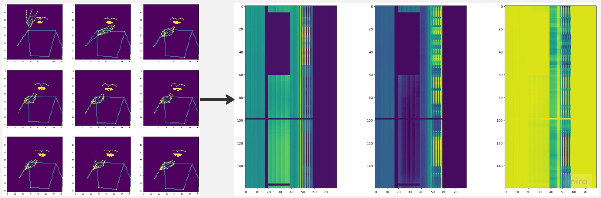

# Google Isolated Sign Language Recognition（ASL Signs）轻量深读（Tier B）

> 赛事：Research ｜ 主题（tabular→实为 cv/序列）｜ 1165 队 ｜ 代码赛 ｜ 指标：PostProcessorKernelDesc（250 类分类）
> 材料基础：`digests/asl-signs.md`（6 篇正文：1st 406684 / 2nd Google 406306 / 6th 406537 / 44th 406302 / pytorch 实验 391265 / 可复现 406978；80 条主题索引）+ 10 张图
> 轻读时间：2026-10（Tier B B04）

## 1. 一句话重述与数字账

从 MediaPipe 关键点识别 250 个孤立手语词。真正的考点是**输入表示（序列 vs 类频谱图像）+ 正则化 + 变长/掩码处理**；1st 的"1D CNN 为主、Transformer 为辅"与 2nd 的"EfficientNet 当音频谱分类"是两条代表路线。

| 关键数字 | 值 | 来源 |
| --- | --- | --- |
| 1st（191 票） | 1D CNN + Transformer 混合（192d，(3+1)×2 conv-transformer，causal depthwise conv）；**1.85M 参数**；nose 为参考点归一化 + lag1/lag2 运动特征；正则三件套：drop_path 0.2、dropout **0.8**、AWP λ0.2（缺一即掉分）；400 epochs、RAdam+Lookahead、cosine、CCE+LS0.1；4 seed 集成；CV 0.80/公 0.80/私 **0.88**；TPUv2-8 4 小时 | 1st |
| 2nd（Google，118 票） | **把 80 个关键点当"音频频谱"**：时间插值到 160、80 点×3（XYZ）→ EfficientNet-B0（160×80 输入）；辅助 BERT/DeBERTa（61 点：40 唇+21 手；20 手部距离特征+210 成对距离+15 角度）；finger-tree rotate、mixup、replace、时频掩码；单折 CV 0.898/LB ~0.8 | 2nd |
| 6th（406537） | MLP-encoder + frame-Transformer 双模型集成；**去掉无手指帧**、按 max_len 跨步；landmark id/type 嵌入；手部 max 聚合（单手）；首个 Transformer 缩小 + 输出层缩放（关键，便于两模型融合）；DeBERTa>BERT；预训练权重没帮助 | 6th |
| 44th/实验/可复现帖 | 公共 notebook 改进、PyTorch 实验、1st 代码复现 | 材料 |

## 2. 逐方案对照矩阵

| 维度 | 1st | 2nd | 6th |
| --- | --- | --- | --- |
| 输入表示 | 130/选定点序列 + 运动特征 | **160×80×3 图像**（类频谱） | 序列 + landmark-type 嵌入 |
| 主干 | 1D CNN + Transformer | EfficientNet-B0（2D CNN） | MLP + frame-Transformer |
| 变长处理 | max_len 384（训练 pad/推理截断）+ mask-aware BN/GAP | 插值到 160/96 | 去无手指帧 + 跨步 |
| 正则 | drop_path+dropout0.8+AWP | 多增广+mixup+时频掩码 | dropout 0.25 等 |
| 辅助模型 | 4 seed | BERT/DeBERTa helper | 第二 Transformer |
| 名次 | 1st | 2nd | 6th |

## 3. 共识、分歧与裁决

### 共识一：正则化是训练长周期模型的前提（1st 最强证据）

1st：drop_path 0.2 + dropout 0.8 + AWP 三者缺一即显著掉分（>300 epochs 训练）。2nd 用大量增广与掩码；6th 也以正则为主。**裁决**：关键点序列小数据（vs 250 类）下，过拟合是首要敌人；高 dropout/随机深度/对抗权重是标准件。置信度：高。

### 共识二：变长处理与掩码必须正确传导（1st/6th）

1st 用 causal padding 保持 mask 索引，并让 BN/GAP 感知 mask；推理只截断不 pad。6th 直接去掉无手指帧再跨步。**裁决**：关键点序列长度差异大，掩码错误会系统性伤害训练/推理一致性。置信度：高。

### 共识三：辅助特征（运动/距离/角度）对 Transformer 路有效（1st/2nd）

1st：lag1/lag2 运动；2nd：210 成对距离+15 角度+唇距离；6th：landmark 类型嵌入。**裁决**：原始坐标不足，显式几何关系能显著帮助注意力模型。置信度：高。

### 分歧一：1D CNN vs 2D CNN vs 纯 Transformer

1st 假设"帧间强相关 → 1D CNN 更高效"，纯 1D CNN 公榜 0.80；2nd 把关键点图像化后用 EfficientNet（CV 0.898）；6th 用 Transformer 但强调"tweaking madness"。**裁决**：三种表示都能到前 3；1D CNN 的归纳偏置更匹配短序列，图像化表示让 CNN 复用音频谱的成功先例。置信度：中高。

### 分歧二：预训练 Transformer 是否有用

6th 明确"预训练 DeBERTa 权重没帮上忙"；2nd 也未强调预训练。**裁决**：本任务的动作语义与文本预训练分布差异大，从零训练+强正则更可靠。置信度：中。

### 失败学（1st）

GCN、复杂几何增广、CutMix/MixUp（变长标签无法配对）、KD 均无效。**裁决**：增广与融合设计要服从"变长序列+单标签"的约束。置信度：中。

### 系列延续

同系列下一届（ASL Fingerspelling）转向连续拼写序列，1st 仍是同一位选手（Christof Henkel）——**从孤立分类到序列解码的迁移**（本仓库两篇可对照）。置信度：高。

## 4. 证据分级

| 断言 | 等级 | 说明 |
| --- | --- | --- |
| 1st 的架构/正则消融/分数 | 自述 + 图 + 公开代码 | 高 |
| 2nd 的图像化表示与 helper 模型 | 自述 + 图 | 中高 |
| 6th 的融合技巧与预训练结论 | 自述 + 代码 | 中高 |
| 44th/实验帖 | 未细读 | 中 |

## 5. 悬案与缺口（登记）

- 44th（406302）/PyTorch 实验（391265）未细读；"Lovely lips"（45 票）与 tf-lite 转换帖未入库。
- 公私榜 gap（CV 0.898 vs LB 0.8；1st 公 0.80/私 0.88）的成因未系统分析（可能参与者划分/泄漏）。
- 指标 PostProcessorKernelDesc 实现未入库。

## 6. 图表证据

**图 1**（topic 406306）：9 帧骨架图 → 160×80×3（XYZ 通道）的"类音频频谱"张量。**"关键点即频谱"表示法的直观展示**。

## 7. 出处

- 1st（191 票）：https://www.kaggle.com/competitions/asl-signs/discussion/406684
- 2nd Google（118 票）：https://www.kaggle.com/competitions/asl-signs/discussion/406306
- 6th（49 票）：https://www.kaggle.com/competitions/asl-signs/discussion/406537
- 44th silver（73 票）：https://www.kaggle.com/competitions/asl-signs/discussion/406302
- pytorch 实验（128 票）：https://www.kaggle.com/competitions/asl-signs/discussion/391265
- 可复现代码（72 票）：https://www.kaggle.com/competitions/asl-signs/discussion/406978
