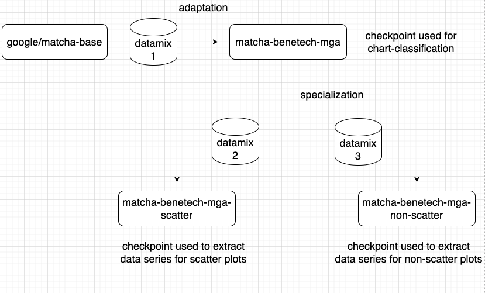

# Benetech - Making Graphs Accessible 轻量深读（Tier B）

> 赛事：Featured ｜ 主题 cv（图表→数据表，图表理解）｜ 608 队 ｜ 代码赛 ｜ 指标：Mixed Data Type Matching Score（表格匹配）
> 材料基础：`digests/benetech-making-graphs-accessible.md`（6 篇正文：1st 418786 / 2nd 418430 / 3rd 418420 / 7th 418510 / 6th 418466 / 13th 418321 等；80 条主题索引）+ 10 张图
> 轻读时间：2026-10（Tier B B10）

## 1. 一句话重述与数字账

从图表图片里抽出结构化的 (x, y) 数据序列。真正的考点是**"没有单一模型能覆盖所有图表类型"**：scatter/dot 用目标检测更稳、line/bar 用图表转文本模型（DePlot/Matcha）更强；顶配解法都是**"图表类型分类 + 按类型分支的混合管线"**，并把大量精力投在**合成数据与外部图表数据的清洗/重标注**上。

| 关键数字 | 值 | 来源 |
| --- | --- | --- |
| 1st（418786） | 两步：**图表类型分类 + 分类型的数据序列推断**；Bar/Line/Dot 用**按类型分别训练的 DePlot**（端到端），**Scatter 用目标检测**；分项（public/private）：Overall 0.86/0.72、Scatter 0.10/0.30、Dot 0.00/0.01、Line 0.32/0.13、VBar 0.39/0.26、HBar 0.05/0.01；数据三块：① 竞赛数据（extracted+generated，剔除约 100 张噪声标注）② **ICDAR**（1406 有标注 + 1903 无标注——有标注的逐张核对并按竞赛规则手工修正；无标注的先肉眼筛、再用 DePlot 打伪标签、再逐张复核修正）③ **自造约 6.5 万张合成图**（补 comp_generated 缺失的变化，如 histogram）；训练：**多阶段**——先在"全类型"数据（12 万图、8 epoch、bs 2、Adafactor lr 1e-5、warmup 4000、高斯模糊/噪声/颜色增强）上训，再用其结果做**类型专属二次训练**（vertical_bar 两次、line 一次；horizontal_bar 因数据少反而变差就用全类型模型；dot 只有生成数据、无法验证，不二次训练）；还处理了"竞赛标注与 DePlot 原始定义的 x/y 轴概念相反"——按 DePlot 原定义训练、推理时交换 | 418786 |
| 2nd（418430） | 全部基于 **google/matcha-base** 的图转文模型，**两阶段训练**（图 1）：① **adaptation**——用大量合成图把骨干适配到本任务（datamix1 → matcha-benetech-mga，兼作图类型分类）；② **specialization**——用**过采样的真实/抽取图**分成 **scatter 与非 scatter 两个专用模型**（datamix2/3），理由是 scatter 的散点预测难度显著更高；输出模板含 chart_type、点数（n_x|n_y）、x/y 序列（科学计数法 `"{:.2e}"`），并额外加 histogram 类在后处理里转成 vertical_bar；公开推理 notebook 与 GitHub | 418430 |
| 3rd（418420） | 团队内部两条路线（end-to-end vs 目标检测+OCR）互补：**分类 + 分类型**；scatter/dot 用检测、line/bar 用 **Matcha**；分项 public/private：Overall 0.87/0.71、Scatter 0.09/0.28、Line 0.33/0.13、VBar 0.39/…；自评"公榜 0.86+ 的队伍都有机会夺冠" | 418420 |
| 7th（418510，"no external data"） | 只用 Kaggle 数据，走**多模型流水线**而非端到端：图表分类 + 文本检测（找 x/y 标签）+ 文本识别（预训练不微调）+ 目标检测（刻度、散点、横/竖条）+ 目标分割（折线、以及判断竖条是否为 histogram）+ 兜底用预训练 DePlot（559 个 CV 文件里只触发 1 次）；CV/LB 0.871/0.86、私榜 0.67 | 418510 |
| 6th/13th | 6th 用 DePlot + UNet 后处理；13th 另一套方案（digest 有正文） | 418466/418321 |
| 社区 | "**为什么 Pix2Struct/MatCha/DePlot 训不起来**"（42 票 / 133 评论）——全场共同的技术坑；"规则更新"（30 票）；"DePlot 介绍"（28 票） | 社区 |

## 2. 逐方案对照矩阵

| 维度 | 1st | 2nd | 3rd | 7th |
| --- | --- | --- | --- | --- |
| 总体结构 | 分类 + 分类型（DePlot/检测） | 两阶段（适配+专精）Matcha | 分类 + 检测/Matcha | 全流水线（分类/检测/分割/OCR） |
| scatter | **目标检测** | scatter 专用 Matcha | 检测 | 目标检测 |
| line/bar | 分类型 DePlot | 非 scatter Matcha | Matcha | 分割/检测 |
| 外部数据 | ICDAR + 6.5 万合成 | 合成 + 过采样真实图 | — | **无（只用 Kaggle 数据）** |
| priv | 0.72 | — | 0.71 | 0.67 |

## 3. 共识、分歧与裁决

### 共识一：单一端到端模型不够，必须"分类 + 分类型分支"（1st/2nd/3rd/7th）

四队都先分类再分类型处理；2nd 进一步把分支定为 scatter vs 非 scatter（散点最难）；1st 更细（每类一个 DePlot + scatter 检测）。**裁决**：图表理解的类型异质性极强，"按图表类型路由"是标配；散点类必须用检测/分割（模型看不到隐含的 y 值坐标）。置信度：高。

### 共识二：训练数据的清洗/重标注与合成是主要工程量（1st/2nd + 42 票帖）

1st 为 ICDAR 做了"逐张肉眼核对 + 伪标签 + 再复核"；自造 6.5 万合成图补变化；2nd 用过采样真实图做专精；社区 133 条评论的帖子在讨论"为什么 Pix2Struct/MatCha/DePlot 训不起来"（标注规则/格式问题）。**裁决**：图表赛的瓶颈在数据管线（格式、坐标定义、噪声），模型选择是第二步。置信度：高。

### 共识三：公榜与私榜差距大，分项分数极不均衡（全员）

1st 的 public 0.86 → private 0.72，且 dot 两项仅 0.00/0.01；3rd 0.87→0.71；7th 0.86→0.67。**裁决**：本场是"高公榜、低私榜"的典型；选择提交要看分项（尤其 dot/scatter 这类几乎未解的类别）与验证稳定性，而非总体公榜。置信度：高。

### 分歧一：端到端 vs 图像处理流水线

2nd 完全端到端（Matcha）；7th 完全流水线（无外部数据）；1st/3rd 混合。**裁决**：端到端对 line/bar 强、流水线对 scatter/dot 强；顶配是"混合路由 + 各自最强工具"。置信度：高。

### 事件：x/y 轴概念反置的"坑"（1st）

竞赛标注规则与 DePlot 原始定义的 x/y 概念相反；1st 按 DePlot 原定义训练、推理时交换值。**裁决**：外部预训练模型与竞赛标注口径不一致时，优先"按预训练口径训练 + 推理端转换"，而不是强行改标注。置信度：中高。

## 4. 证据分级

| 断言 | 等级 | 说明 |
| --- | --- | --- |
| 1st 的两步管线、数据清洗与多阶段训练 | 自述 + 多张图 + 分项分数 | 高 |
| 2nd 的两阶段 Matcha（适配+专精） | 自述 + 管线图 + 公开代码 | 高 |
| 7th 的"无外部数据"流水线与 0.67 私榜 | 自述（细节完整） | 中高 |
| 3rd 的混合路线与分项分数 | 自述 + 图 | 中高 |
| "Pix2Struct 等训不起来" | 长讨论帖（133 评论） | 中 |

## 5. 悬案与缺口（登记）

- 4th/5th/8th–12th/14th 的方案未细读；"规则更新"（30 票）与"如何着手"（1046 行处）未细读；
- 1st 的目标检测（scatter）细节未展开；
- dot 类几乎无人解出（0.00–0.01），其失败原因未系统整理；
- 归档 10 图：2nd 的两阶段管线图（图 1）、3rd 的分类图为关键图证。

## 6. 图表证据

**图 1**（topic 418430）：从 `google/matcha-base` 出发 → **adaptation**（datamix1，大量合成图适配，输出兼作图表分类检查点）→ **specialization**（datamix2/3 分别训 scatter 与非 scatter 的数据序列抽取模型）。这张图把"先适配分布、再按难点专精"的两阶段策略表达得最清楚。

## 7. 出处

- 1st（60 票）：https://www.kaggle.com/competitions/benetech-making-graphs-accessible/discussion/418786
- 2nd（64 票）：https://www.kaggle.com/competitions/benetech-making-graphs-accessible/discussion/418430
- 3rd（54 票）：https://www.kaggle.com/competitions/benetech-making-graphs-accessible/discussion/418420
- 7th（51 票）：https://www.kaggle.com/competitions/benetech-making-graphs-accessible/discussion/418510
- 6th（40 票）：https://www.kaggle.com/competitions/benetech-making-graphs-accessible/discussion/418466
- Pix2Struct 训不起来（42 票 / 133 评论）：https://www.kaggle.com/competitions/benetech-making-graphs-accessible/discussion/406250
