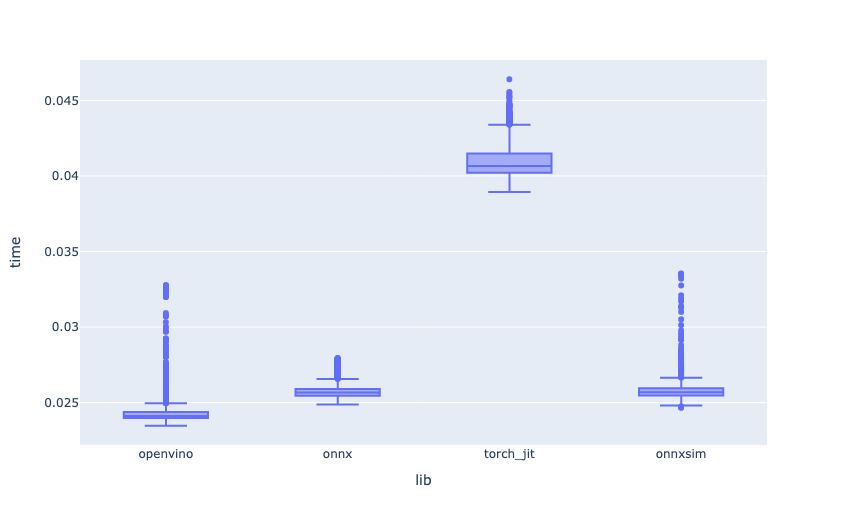

# BirdCLEF 2023 轻量深读（Tier B）

> 赛事：Research ｜ 主题 audio（鸟类声音识别）｜ 1189 队 ｜ 代码赛 ｜ 指标：buffered/padded cmAP
> 材料基础：`digests/birdclef-2023.md`（6 篇正文：1st 132 / Pretraining 0.80 88 / 2nd 67 / 4th 55 / 7th 38 / 10th；80 条主题索引）+ 2 张图
> 轻读时间：2026-10（Tier B B02）

## 1. 一句话重述与数字账

从声景录音识别鸟种（padded cmAP）。真正考的是**数据侧审计与整理（含 API bug 发现）+ 弱标签/无鸟段处理 + 知识蒸馏/预训练 + 推理加速**。

| 关键数字 | 值 | 来源 |
| --- | --- | --- |
| 1st（Correct Data is All You Need） | 294 次实验；发现 **Xeno-Canto API 每物种最多 500 文件**的元数据 bug（多 json 只取第一个）→ 修复后数据大幅扩充；5 折分层；**padded cmAP 要"跨折取均值、不要 OOF"**；CV 0.908/公 0.844/私 **0.764**；3 个 SED 模型（eca_nfnet_l0、convnext_small、convnextv2_tiny）+ ONNX；类采样权重 (count/sum)^0.5 | 1st |
| 1st 的预训练反复 | 只用 2023 数据时预训练增益大；加入额外数据后 LB 不再增益（CV 仍涨）→ 最后一周加严筛选（822 物种、>10 代表）后 **+1 公榜/+2 私榜** | 1st |
| 2nd | 7 模型集成（SED + 2021 2nd CNN）；openvino；伪标+**人工听标 ~1800 条 nocall 无提升**；ebird 数据非公开（问过 host） | 2nd |
| 4th（KD is all you need） | 4×eca_nfnet_l0（mel/PCEN 变体）；**Kaggle Models 预计算 bird-vocalization-classifier 做 KD**（其 cmAP5=0.9479）；公 0.831/私 0.744；额外 no-call/XC/Zenodo/esc50/aicrowd 噪声 | 4th |
| 7th（sumix） | 19 模型集成（effnet_b2+rexnet150）；`sumup/sumix` 双鸟叠加增广；KD（rkl 前缀）；openvino；私 0.7471 | 7th |

## 2. 逐方案对照矩阵

| 维度 | 1st | 2nd | 4th | 7th |
| --- | --- | --- | --- | --- |
| 骨干 | 3×SED（nfnet/convnext） | SED+CNN 7 模型 | 4×eca_nfnet_l0 变体 | effnet_b2+rexnet150×19 |
| 数据杠杆 | XC API 修复+严格预训练筛选 | XC 额外数据；伪标+手标 nocall | no-call/XC/Zenodo 噪声 | KD 全量重训 |
| 蒸馏/预训练 | 预训练（条件性有效） | — | **强 KD** | **KD** |
| 增广 | Mixup OR/背景/RandomFiltering/SpecAug | — | 激进 mixup + 多 epoch | **sumup/sumix** |
| 推理 | ONNX；温度均值+attention/max 加权 | openvino | — | openvino（图 1） |
| 私榜 | **0.764** | 2nd | 0.744 | 0.747 |

## 3. 共识、分歧与裁决

### 共识一：数据侧（额外录音+无鸟段+背景）是第一杠杆（4/4）

1st 的 API bug 修复与严格物种筛选、2nd 的 XC 额外数据、4th 的 no-call/Zenodo/esc50 噪声、7th 的全量 KD 重训。**裁决**：BirdCLEF 类弱标签声景赛，先把"训练数据分布"修对（含 no-call 负样本与背景噪声），再谈模型。置信度：高。

### 共识二：知识蒸馏/预训练是第二杠杆，但条件性强（1st/4th/7th）

4th：用 Kaggle Models 的强分类器 KD（其验证 cmAP5=0.9479）是核心；7th：19 模型 KD；1st：预训练只在"筛选后的 822 物种"下重新有效。**裁决**：蒸馏/预训练有效，但会被数据分布变化抵消；要把它当"最后一轮条件实验"而不是默认组件。置信度：高。

### 共识三：推理加速决定能否承载大集成（2nd/7th 图证）

openvino 最快（~0.024s）、onnx 次之（~0.026s）、torch_jit 最慢（~0.041s）；1st 用 ONNX。**裁决**：声景推理算力昂贵，加速=更大的可承受集成与 TTA。置信度：高（有测量图）。

### 分歧一：伪标/人工标注 nocall 是否有效

2nd 手标 ~1800 条 nocall **无提升**（怀疑伪标 FP 多）；4th/1st 用外部 no-call 数据有效。**裁决**：外部成规模 nocall 有效；在伪标质量不明时手标性价比低。置信度：中。

### 分歧二：验证与提交口径

1st：padded cmAP 要跨折均值（不是 OOF），CV 绝对值（0.908）与 LB（0.764）差很大但排序相关好；4th：只选"CV 和 LB 同涨"的方案。**裁决**：以排序/相关性为准则，不要跨口径比绝对值。置信度：高。

### 事实：失败的模型方向清单很有信息量（1st）

Transformer（ECAPA TDNN）、更大 chunk、CQT/LEAF、彩色噪声、2021 2nd 的噪声方案、整库 XC 预训练等均无效——**弱标签音频仍以 CNN/SED + 频谱增广为主**。置信度：中高。

## 4. 证据分级

| 断言 | 等级 | 说明 |
| --- | --- | --- |
| XC API 500 上限 bug | 自述（数据统计+机制解释） | 中高（可复核） |
| 1st 的 CV/LB 数字与实验量 | 自述 | 中高 |
| KD 的有效性（4th/7th） | 自述 + 公开模型 | 中高 |
| openvino/onnx 速度差 | 图证 | 高（测量层面） |
| 手标 nocall 无效 | 自述（单队） | 中 |

## 5. 悬案与缺口（登记）

- 3rd/5th/6th/8th/9th 等方案未收录；1st 承诺的 CV-LB 相关性论文"TBD"。
- XC API bug 的修复现状/官方回应未知（1st 用的是旧 commit）。
- 4th 的 KD 细节（如何用预计算 logits、温度/权重）未展开；2nd 的伪标 FP 假设未验证。

## 6. 图表证据

**图 1**（topic 412922）：openvino/onnx/torch_jit/onnxsim 的推理耗时箱线图——openvino 最快、torch_jit 最慢（约 1.7×）。**大集成可行性的工程前提**。

## 7. 出处

- 1st（132 票）：https://www.kaggle.com/competitions/birdclef-2023/discussion/412808
- Pretraining 0.80（88 票）：https://www.kaggle.com/competitions/birdclef-2023/discussion/395843
- 2nd（67 票）：https://www.kaggle.com/competitions/birdclef-2023/discussion/412707
- 4th（55 票）：https://www.kaggle.com/competitions/birdclef-2023/discussion/412753
- 7th（38 票）：https://www.kaggle.com/competitions/birdclef-2023/discussion/412922
- 10th：https://www.kaggle.com/competitions/birdclef-2023/discussion/412713
