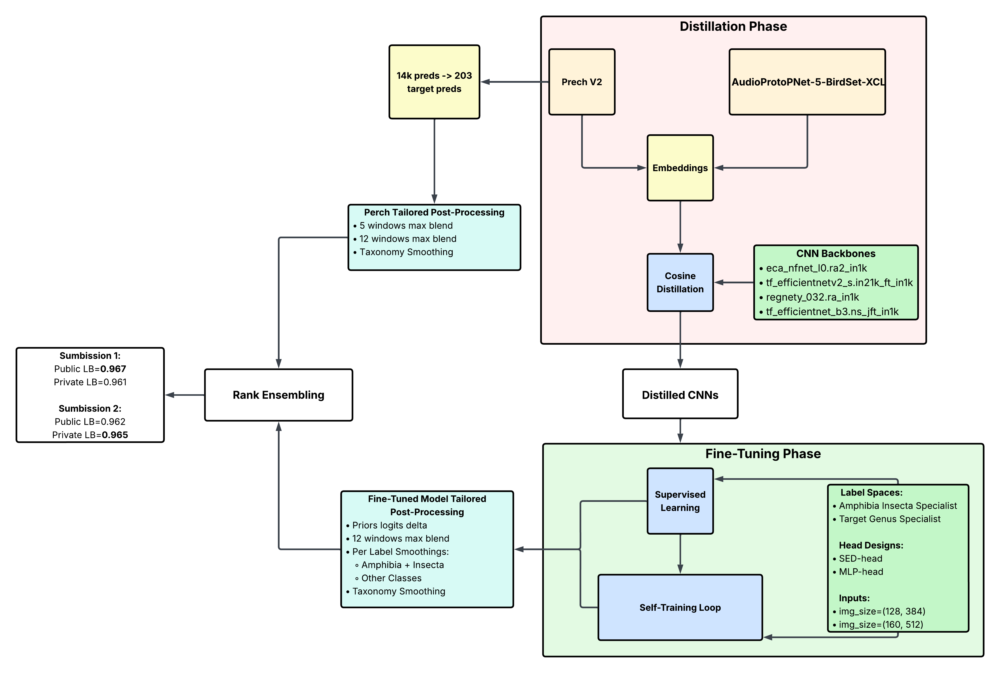

# BirdCLEF 2026 轻量深读（Tier B）

> 赛事：Research ｜ 主题 audio（鸟类/两栖/昆虫声音识别）｜ 4094 队 ｜ 代码赛 ｜ 指标：Birdclef ROC AUC
> 材料基础：`digests/birdclef-2026.md`（6 篇正文：Claude-Code 被移除 704391 / 1st 704752 / 2nd 704399 / 10th 704271 / 11th 704264 / Claude 占位 681146；80 条主题索引）+ 7 张图
> 轻读时间：2026-10（Tier B B03）

## 1. 一句话重述与数字账

鸟/两栖/昆虫声景识别（ROC AUC）。2026 的两大主题：**"Perch 蒸馏 → 微调 → 多轮 Noisy Student 自训练"成为标准配方**，以及 **AI 编码代理（Claude Code）引发的参赛方式与合规争议**。

| 关键数字 | 值 | 来源 |
| --- | --- | --- |
| 1st（169 票） | 5 秒输入多样化集成（SED/MLP 头、两栖/昆虫专家、属级专家、Perch v2 线性头）；两阶段训练：**cosine embedding 蒸馏**（Perch v2 / AudioProtoPNet）→ 微调 + **多轮 Noisy Student**；自训练：1 轮公 0.946、2 轮 **0.950**、3 轮 0.949；LSS 注入标签和归一化 0.5 解决过拟合；PL 与 LSS 注入器分离（不同样本）；PL 标签和上限 0.75；Site-22 非 LSS 物种 mask +0.002；属级专家 +0.001~0.002；**两个域定制验证集**（Site-22 未见站点 / 贪心覆盖）；rank blending；最终公 0.967/私 0.961 | 1st |
| 2nd（53 票） | Perch+蒸馏 SED+自研 CNN+昆虫专家；**LB 主要信号**（LSS AUC 与 LB 相关仅 ~0.2）；4 轮伪标；5s 窗口；EffNetV2s/B0/NFNet；**soft AUC + 0.25 BCE**；Perch 蒸馏 +0.02 但增加相关性 → 为保集成多样性**弃用**；XC 预训练骨干把分数推过 0.930 | 2nd |
| 10th / 11th | "simple model as always"；11th "without Perch"（另有一个"差点的第 3 名"） | 10th/11th |
| AI 代理事件 | 101 名"纯 Claude-Code 方案"被取消资格（全自动 autoresearch 循环 + 邮件授权提交）；"Claude-Code 结果"占位帖 142 票；"Is everyone using LLM tools?" 60 票/116 评论 | 704391+主题索引 |

## 2. 逐方案对照矩阵

| 维度 | 1st | 2nd |
| --- | --- | --- |
| 教师/蒸馏 | Perch v2 + AudioProtoPNet（cosine embedding 蒸馏，每模型重蒸） | Perch 蒸馏 +0.02 但**为多样性弃用** |
| 自训练 | Noisy Student（LSS/PL 注入器分离、标签和上限） | 4 轮伪标（先混 LSS，后改为替换 50–60%） |
| 专家 | 两栖/昆虫、属级 | 昆虫专家（nikitababich XC 数据） |
| 输入 | 5s（128×384/160×512） | 5s；XC 骨干用原 mel 规格 |
| 验证 | 两个 LSS 域拆分 + 调 PP | 验证不可靠 → LB 主信号 |
| 损失 | CE + 蒸馏 cosine | soft AUC + 0.25 BCE |
| 关键判断 | 额外 XC/iNat 多数变差，仅专家用 | 相关性控制优先于单模分数 |

## 3. 共识、分歧与裁决

### 共识一：Perch（外部强模型）是 2026 的入场券，蒸馏是把它的能力搬进小模型的标准桥（1st/2nd）

1st 两阶段蒸馏 + 自训练达 0.935+（无自训练）；2nd 蒸馏 +0.02；11th 标题即为"Without Perch"（暗示不用 Perch 要吃亏）。**裁决**：有强外部音频模型时，embedding 蒸馏（cosine）比直接用其输出更可塑；但蒸馏会增加模型相关性，要配合架构/头/标签空间多样性。置信度：高。

### 共识二：Noisy Student 自训练仍有效，但必须"防注入信号反噬"（1st 的核心技术贡献）

1st 发现"蒸馏+LSS 已经很强，加噪声 PL 会拖垮模型"，解法：LSS 标签和归一化 0.5、PL 标签和上限 0.75、两个注入器分样本、power transform、按标签和采样。收益：1→2 轮公 0.946→0.950，3 轮回落。**裁决**：自训练的关键是**控制注入强度与来源隔离**，不是轮数越多越好。置信度：高（有消融数字）。

### 共识三：5 秒窗口（配合精确裁剪）优于更长的 20 秒（1st/2nd）

1st 明说 >5s 不行（域适应+标签模式）；2nd 的 20s 框架"持续低估"。**裁决**：本赛制/标注下 5s 是甜点；跨年可变，需要按域做时长搜索。置信度：高。

### 共识四：验证极难，两队的应对相反（1st 造域拆分；2nd 用 LB）

1st：Site-22 未见站点 + 贪心覆盖两个 LSS 拆分，调参比 LB 更可信；2nd：自建验证全不可靠（LSS AUC 与 LB 相关 0.2），回到 LB。**裁决**：**比赛新引入的 LSS/验证数据**应优先用于"域泛化/覆盖"两类拆分；LB 仍可作相对信号但有过拟合风险。置信度：中高。

### 分歧：多样性的来源（蒸馏 vs 架构/头/标签空间）

1st 每模型重新蒸馏（不同 seed/教师）以制造细微分集；2nd 为保多样性完全弃用蒸馏。**裁决**：两条路都能到前 2；核心是"让模型间不相关"，蒸馏可以是多样性工具，也可以成为相关性来源——取决于如何使用。置信度：中高。

### 事件：AI 编码代理与合规

101 名全自动 Claude-Code 方案被取消资格（系统有验证门 + 邮件人工授权提交）；社区同时在争论"是不是所有人都在用 LLM 工具"。**裁决**：2026 起，agent 辅助开发成为默认生产力，但**全自动参赛**触碰规则边界；"人做 Idea、agent 做工程"的混合模式（1st 明述）是安全区。置信度：高（事件存在）。

## 4. 证据分级

| 断言 | 等级 | 说明 |
| --- | --- | --- |
| 1st 的自训练/注入参数与消融 | 自述 + 图 + 代码 | 中高 |
| 2nd 的 4 轮伪标与蒸馏弃用 | 自述 + 公开 notebook | 中高 |
| LSS AUC-LB 相关 ~0.2 | 2nd 自述 | 中 |
| Claude-Code 被移除 | 帖标题 + 当事人叙述 | 高（事件）；移除原因未明 |
| 10th/11th 分数 | 未细读 | 中 |

## 5. 悬案与缺口（登记）

- 101 名被移除的**具体原因**（全自动提交？规则条款？）未在收录正文中说明；official recap 未入库。
- "Is everyone using LLM tools?"（60 票/116 评论）与 Claude 占位帖（142 票）未细读——AI 工具在竞赛中的边界没有定论。
- 1st 的完整消融（各注入器单独贡献）与 3rd 名方案未收录。

## 6. 图表证据

**图 1**（topic 704752）：蒸馏阶段（Perch v2/AudioProtoPNet → embeddings → cosine 蒸馏到 nfnet/effnetv2/regnety 等）→ 微调阶段（监督 + 自训练循环；专家标签空间；SED/MLP 头）→ 两套定制后处理 → rank ensembling → 两次提交（公 0.967/私 0.961、0.962/0.965）。**2026 年 BirdCLEF 的完整技术栈**。

## 7. 出处

- Claude-Code 被移除（704391）：https://www.kaggle.com/competitions/birdclef-2026/discussion/704391
- 1st（704752）：https://www.kaggle.com/competitions/birdclef-2026/discussion/704752
- 2nd（704399）：https://www.kaggle.com/competitions/birdclef-2026/discussion/704399
- 10th（704271）：https://www.kaggle.com/competitions/birdclef-2026/discussion/704271
- 11th（704264）：https://www.kaggle.com/competitions/birdclef-2026/discussion/704264
- Claude 占位（681146）：https://www.kaggle.com/competitions/birdclef-2026/discussion/681146
