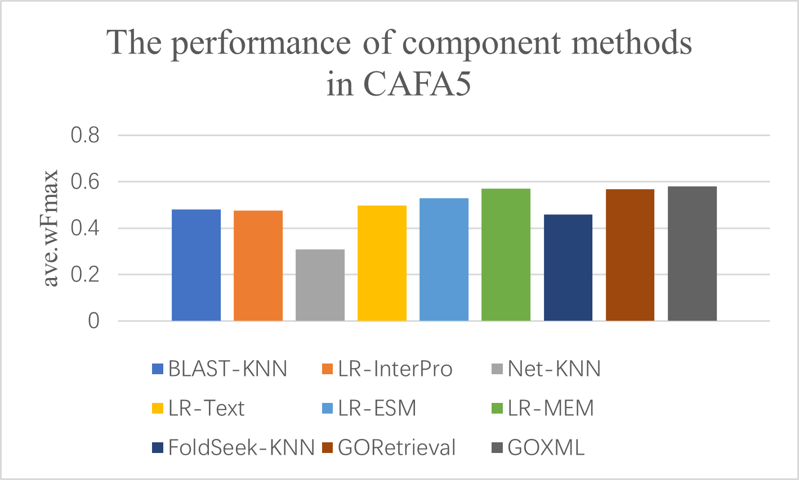

# CAFA 5 Protein Function Prediction 轻量深读（Tier B）

> 赛事：Research ｜ 主题 science（蛋白功能预测，极端多标签）｜ 1625 队 ｜ 代码赛 ｜ 指标：IA 加权的 Fmax（`PostProcessorKernelDesc`）
> 材料基础：`digests/cafa-5-protein-function-prediction.md`（6 篇正文：1st 466917 / 2nd 434064 / 3rd 464437 / 13th 425 行处 / Information Accretion 405237 / ESM2 帖 406168；80 条主题索引）+ 5 张图
> 轻读时间：2026-10（Tier B B09）

## 1. 一句话重述与数字账

给蛋白序列预测其 GO 功能标签（13k+ 标签的极端多标签，且需满足本体层级传播）。真正的考点是**"多源信息的组件化 + 学习排序集成"**：1st 的 GOCurator 把序列/结构/文本/文献/网络各做一个组件方法，再用 **learning-to-rank** 融合；文本与结构组件的单点强度甚至超过经典 BLAST/InterPro 基线（图 1），而"是否把网络 KNN 纳入融合"要**按物种过滤**。

| 关键数字 | 值 | 来源 |
| --- | --- | --- |
| 1st（GOCurator，复旦 ZhuLab，私榜 0.61623） | 在 **NetGO 3.0** 基础上加了四个新组件：**LR-MEM**（蛋白描述 + 文献 + 序列的表征拼接 + 逻辑回归）、**FoldSeek-KNN**（3D 结构相似度加权投票）、**GOXML**（基于文献的 AttentionXML 极端多标签分类）、**GORetrieval**（两阶段：先用相似描述的蛋白检索候选 GO 词，再用 GO 描述与目标文献做语义重排；该重排器还能给其他方法加分）；原有组件：BLAST-KNN、LR-InterPro、LR-ESM（ESM-1b 嵌入）、LR-Text（D2V/TF-IDF）、Net-KNN（PPI 网络）；**集成 = learning to rank**，输入含各方法分数 + **20 维物种 one-hot**；验证集不是时间切分，而是**按 CAFA5 测试集的物种分布采样 1000 个蛋白**；重要发现：**Net-KNN 在标注稀少的物种上表现差，把它从融合中剔除反而更好** → 最终只保留 Net-KNN 对"top-15 有足够标注蛋白的物种"的预测；作者称"文本/结构组件 + NetGO 3.0 即可拿到约 90% 的最终性能"；耗时：InterProScan+ESM-1b 1–2 天、各组件训练 10–15h、排序集成 <50min、推理 ~3.5h | 466917 |
| 2nd 私榜/公榜 5th（434064） | 嵌入：T5 / esm2-large / ankh-large（多数用 T5，部分用 T5+ESM 拼接）+ **物种 one-hot（只留约 30 个在训练/测试都充分的 taxa，其余合并）**；基模型：自研 **py-boost**（极端多输出 GBDT，仅 GPU，单 V100 上 4.5k 输出/1.5h 每折）、13k 输出的逻辑回归（在稀有词上更好）、改自公开 notebook 的 NN；**简单 5 折 CV 反而最优**；**条件概率重构**（本场最独特）：目标矩阵允许 NaN（父词全为 0 时该词记 NaN 并在训练中掩码），模型预测 `P(词 | 至少一个父词存在)`，推理时按本体图顺序还原为原始概率 `p_raw = p_cond × (1 − ∏(1 − p_parent_raw))`（假设父节点独立），**因此可对训练中没出现过的词也用先验均值给出预测**；该方案本身分数提升不大，但**模型与常规多标签差异大 → 集成增益显著** | 434064 |
| 3rd（464437） | NN 路线：T5/ESM2-t36/ESM2-t48 嵌入 + 物种 one-hot（只用测试集出现的 90 个 taxonomy id）；**把 UniProt GOA 的 11 类"非实验证据码"标注当作额外特征**（one-hot 后经 kernel=1 的 1D-CNN 处理）——即"先用弱标注，再用实验标注作 GT" | 464437 |
| 解释帖（405237，68 票） | **Information Accretion 讲解**：`ia(v) = log2(Pr(Pa(v))/Pr(v))`，用训练集经验计数估计并**加 1 平滑**避免除零；这是本场指标的权重来源（越具体的词权重越大） | 405237 |
| 社区侧 | "ESM2 末层嵌入"（47 票）、"ProteinBERT / 蛋白语言模型"（45/41 票）、"一个月剩余：发生了什么"（49 票）、"CAFA5 生物信息学入门材料"（46 票） | 社区 |

## 2. 逐方案对照矩阵

| 维度 | 1st | 2nd | 3rd |
| --- | --- | --- | --- |
| 序列表示 | ESM-1b + InterPro 域/家族 + 文本/文献 | T5/esm2-large/ankh-large + taxa one-hot | T5 + ESM2-t36/t48 + 90 个 taxa |
| 结构 | **FoldSeek-KNN** | — | — |
| 文本/文献 | **GOXML（AttentionXML）+ GORetrieval（两阶段重排）+ LR-MEM** | — | 非实验证据码作特征 |
| 网络 | Net-KNN（**按物种过滤，仅 top-15 物种**） | — | — |
| 集成 | **Learning to Rank**（含物种 one-hot） | 2 GBDT + 2 LogReg + NN 混合 | NN 集成 |
| 目标处理 | 标准多标签 + 本体传播 | **条件概率重构（0/1/NaN + 图顺序还原）** | 标准多标签 |

## 3. 共识、分歧与裁决

### 共识一：多源组件 + 学习排序/混合是顶配（1st/2nd/3rd）

1st 的 9 个组件 + LTR；2nd 的 py-boost/LogReg/NN 混合；3rd 的多嵌入 NN 集成。**裁决**：极端多标签任务里，标签空间难被单一模型覆盖——"多个互补组件（序列/结构/文本/网络）"是结构性的，而不是可选的。置信度：高。

### 共识二：文本与结构信息被低估（1st 图 1 + 3rd）

1st 的组件对比（图 1）：GOXML 0.577、GORetrieval 0.557、LR-MEM 0.556 均高于 BLAST-KNN 0.475、LR-InterPro 0.467；3rd 也专门挖非实验标注文本。**裁决**：蛋白功能预测中，文献/描述文本与 3D 结构的边际高于再调序列相似度工具。置信度：高。

### 共识三：本体结构必须显式建模（解释帖 + 2nd）

IA 解释帖说明层级与权重；2nd 直接把本体图搬进推理（按图序还原条件概率，并能预测训练未见词）。**裁决**：GO 预测的两个"隐藏作业"是层级一致性（子词出现→父词出现）与 IA 加权——两者都应在训练/后处理里显式处理。置信度：高。

### 分歧一：网络（PPI）信息用不用

1st 发现"不做物种过滤时 Net-KNN 拖累融合"，最终只保留 top-15 物种的 Net-KNN；2nd/3rd 干脆不强调网络。**裁决**：跨物种泛化时，网络信息容易带来物种偏置——使用前必须做"按物种的收益审计"。置信度：中高（1st 有实验与图）。

### 分歧二：验证集怎么切

1st 按测试集物种分布采样 1000 蛋白（非时间切分）；2nd 试了多种 CV 后回到简单 5 折；3rd 未强调。**裁决**：验证集设计应匹配"测试集的物种/标签分布"，否则模型选择会被物种构成带偏。置信度：中高。

### 事件：极端多标签的工程效率（2nd）

2nd 自研 py-boost（GPU、极多输出、比通用实现快数百倍）才能在时限内训练 4.5k–13k 输出。**裁决**：标签空间上万时，"训练吞吐"本身就是一等约束，值得投工程。置信度：中高。

## 4. 证据分级

| 断言 | 等级 | 说明 |
| --- | --- | --- |
| 1st 的九组件 + LTR 与私榜 0.61623 | 自述 + 组件分数图 + 团队背景（CAFA3/4 前列） | 高 |
| 2nd 的条件概率重构与 py-boost | 自述 + 公式 + 开源实现 | 中高 |
| 3rd 的非实验证据码特征 | 自述 + 图 | 中 |
| IA 公式与加 1 平滑 | 官方指标解释帖 | 高 |
| ESM2 与蛋白语言模型的社区对照 | 多条高票帖 | 中高 |

## 5. 悬案与缺口（登记）

- 4th–12th 与 13th 的方案未细读；"一个月总结"（49 票）与"ESM2 末层嵌入"（47 票）未细读；
- 1st 的 LTR 特征细节（除 20 维物种 one-hot 外）未展开；
- 2nd 的条件概率方案的独立贡献未量化（自述"不大，但集成增益大"）；
- 归档 5 图：1st 的组件分数图（图 1）与 Net-KNN 物种过滤图为关键图证。

## 6. 图表证据

**图 1**（topic 466917）：九个组件方法在 CAFA5 的 ave.wFmax——GOXML 0.577、GORetrieval 0.557、LR-MEM 0.556 领先；LR-ESM 0.518、LR-Text 0.484；经典基线 BLAST-KNN 0.475、LR-InterPro 0.467、FoldSeek-KNN 0.445；**Net-KNN 仅 0.304**（解释了"网络信息需按物种过滤"）。

## 7. 出处

- 1st（34 票）：https://www.kaggle.com/competitions/cafa-5-protein-function-prediction/discussion/466917
- 2nd 私榜/公榜 5th（59 票）：https://www.kaggle.com/competitions/cafa-5-protein-function-prediction/discussion/434064
- 3rd（31 票）：https://www.kaggle.com/competitions/cafa-5-protein-function-prediction/discussion/464437
- Information Accretion 解释（68 票）：https://www.kaggle.com/competitions/cafa-5-protein-function-prediction/discussion/405237
- ESM2 末层嵌入（47 票）：https://www.kaggle.com/competitions/cafa-5-protein-function-prediction/discussion/406168
- 蛋白语言模型（41 票）：https://www.kaggle.com/competitions/cafa-5-protein-function-prediction/discussion/402565
