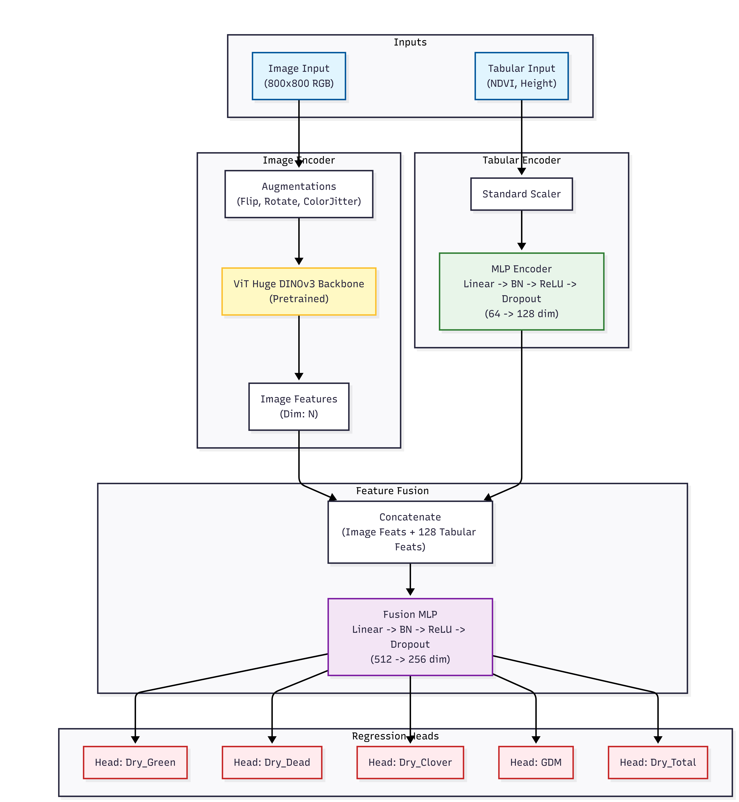

# CSIRO Biomass Prediction 轻量深读（Tier B）

> 赛事：Research ｜ 主题 science（农业 CV 回归）｜ 3805 队 ｜ 代码赛 ｜ 指标：加权 R²（五个生物量目标的加权平均）
> 材料基础：`digests/csiro-biomass.md`（6 篇正文：1st 670735 / 4th 670677 / 5th 670668 / 7th 670654 / 37th 670672 / 按采样日期分组 615401；80 条主题索引）+ 10 张图
> 轻读时间：2026-10（Tier B B06）

## 1. 一句话重述与数字账

从牧场照片回归五个生物量分量（Green/Dead/Clover/GDM/Total）。真正的考点是**"小样本 + 显著分布漂移"下的验证设计与先验利用**：按 `Sampling_Date` 分组 CV 才能让 CV 逼近 LB；DINOv3 特征 + 左右视角 + 区间分类辅助头 + 物理一致性后处理是主要增益。

| 关键数字 | 值 | 来源 |
| --- | --- | --- |
| 验证方法（132 票） | ConvNext-Tiny 三组对照：按 State 分层（不分组）CV 0.7189 / LB 0.60（**CV-LB 差 0.1189**）；**按 Sampling_Date 分组**后 CV 0.5837 / LB 0.55（差 0.0337）→ 再调 → 0.5968/0.57（差 0.0268）。**结论：日期必须分组**（host 明确 train/test 的采样日期不完全相同） | 615401 |
| 1st（670735） | 3 折按 **state + 采样日期**划分；图像切左右两视角过同一 backbone，1 层多头自注意力融合 + MLP；DINOv3 编码器；**5 个回归头 + 5 个区间分类头（每物种 7 个区间，借鉴 UEPNet）→ +0.03 LB/PB**；SmoothL1 + 加权 CE（0.3）；随机缩放+黑边填充模拟相机焦距差异；两阶段训练（冻结 DINO → 全量微调）；**1024 分辨率 + Large 优于更大模型**；消融链：baseline 0.70/0.60 → +cls 0.73/0.63 → +cls@1024 0.74/0.64 → +aug_scale 0.74/0.65；**在线训练（两轮伪标 + SWA，Large:Base 权 0.4:0.6）再 +0.02 以上**；后处理（clover×0.8、dead 分段缩放、GDM/Total 用物理关系回填）→ 最佳 PB 0.68 | 1st |
| 4th（670677） | **手工裁掉图像里的"纸板"背景 → +0.01（pub 0.74→0.75，priv 0.64→0.65）**；ViT-Huge DINOv3（冻前半层）+ 表格模态融合（NDVI/Height 经 2 层 MLP）+ 5 回归头；WeightedSmoothL1 [0.1,0.1,0.1,0.2,0.5]（偏重 Total/GDM）；**辅助任务：让 backbone 从图像预测 NDVI/Height → 再 +0.01（最终 0.76 pub / 0.66 priv）** | 670677 |
| 5th（670668） | 100+ 次实验；**HSV 橙色检测 + inpaint 去除图像日期戳**；把物理关系（Dead=Total−GDM、Clover=GDM−Green）当先验；总结数据特性：~800 张训练图、原图 2000×1000、跨州分布漂移 | 670668 |
| 7th（670654） | 单/双流 DINOv3-Large（前 80% 参数冻结）+ Softplus 回归头；**StratifiedGroupKFold（group=采样日期，label=state）**，因原始只有 3 个日期而把 WA 数据细分为 7 个虚拟日期，**用 1000 万随机种子暴力搜最均衡切分**；每折保留 top-3 loss + top-3 score 共 6 个检查点做 SWA；单模 5 折 0.76 pub / 0.65 priv；双流版推理只用三个测量分量，GDM/Total 用物理关系推导 | 670654 |
| 其他 | 37th 用 "Self Prompt Tuning with DINOv3"（提示微调）；"Height_Ave_cm 与 Dead 预测"帖（86 票）检验 host 假设；DINOv3 是本届主流底座 | 社区 |

## 2. 逐方案对照矩阵

| 维度 | 1st | 4th | 7th | 5th |
| --- | --- | --- | --- | --- |
| 底座 | DINOv3（1024, Large） | ViT-Huge DINOv3 | DINOv3-Large（冻 80%） | 未细述（100+ 实验） |
| 视角/模态 | 左右双视角 + 注意力融合 | 图像 + NDVI/Height 表格融合 | 单/双流 | 图像 |
| 输出头 | **回归 + 7 区间分类（+0.03）** | 5 回归头（加权损失） | 5 回归头（Softplus），双流物理推导 | — |
| 数据清洗 | 缩放+黑边增强 | **手裁纸板（+0.01）** | — | **去日期戳（HSV+inpaint）** |
| 验证 | 3 折（state+日期） | — | 日期分组 + 1000 万种子搜切分 | — |
| 在线学习 | **两轮伪标 + SWA（+0.02）** | — | TTT/SWA | — |
| priv | 0.68（PB 最佳） | 0.66 | 0.65（单模） | 0.76（5th，私榜口径不同） |

## 3. 共识、分歧与裁决

### 共识一：必须按采样日期分组验证（社区 + 1st/7th）

132 票帖给出量化对照：不分组时 CV 高 0.12、完全误导；1st 用 state+日期做 3 折；7th 甚至把 WA 细分虚拟日期并暴力搜切分。**裁决**：分布漂移的 CV 设计要复刻"测试集在时间上的新样本"结构；训练图之间的日期重叠是最容易泄漏的维度。置信度：高（有对照数字）。

### 共识二：DINOv3 是本届的公共底座（1st/4th/7th/37th）

四队都用 DINOv3 系列（Large/Huge/Base）；7th 冻 80% 参数即可 0.76 pub；1st 认为 Large 与 Huge 差别不大、**加大分辨率比加大模型更划算**。**裁决**：小样本 CV 赛用自监督大底座 + 冻结/低学习率微调是稳妥起点；算力优先给分辨率。置信度：高。

### 共识三：数据清洗比模型结构更"便宜"（4th/5th）

4th 手裁纸板 +0.01；5th 去日期戳；两者都不改结构却涨分。**裁决**：农业/田野图像的"采集伪影"（背景板、时间戳、边框）会直接进特征；先做数据审计再堆模型。置信度：高。

### 分歧一：物理约束用不用

1st 明确"不在训练中加物理约束，以减少对训练集依赖"，但**后处理**用 GDM/Total 关系回填；7th 的双流版直接推导 GDM/Total；5th 把物理关系当先验；4th 的辅助任务也是间接注入先验。**裁决**：约束放在"后处理/推理端推导"比放在损失里更稳（避免训练不稳定与真值违反约束时的冲突）。置信度：中高。

### 分歧二：区间分类辅助头值不值

1st 的 5 个 7 区间分类头 +0.03（LB/PB 同涨），是他们与多数队的最大差异；其他队未采用。**裁决**：把回归目标离散化成"粗定位+细回归"在多物种混合分布下有效（类似 crowd counting 的做法），值得作为回归赛的备选结构。置信度：中高（单队，但消融链完整）。

### 事件：在线学习/伪标签是最后的大杠杆

1st 两轮伪标（先 Large/Base 互训 + SWA + 回炉训练）>+0.02；7th 的 Stage2 也是在线伪标 + TTT。**裁决**：小样本 CV 赛里，测试期自适应（伪标回炉/SWA/TTT）的收益大于再换一个 backbone。置信度：中高。

## 4. 证据分级

| 断言 | 等级 | 说明 |
| --- | --- | --- |
| 日期分组对 CV-LB 差距的影响（0.1189→0.0268） | 自述 + 对照表 | 高 |
| 1st 的区间分类 +0.03、在线训练 +0.02 | 自述 + 消融表 | 高 |
| 4th 的纸板裁剪 +0.01、辅助任务 +0.01 | 自述 + 架构图 | 中高 |
| 7th 的 1000 万种子搜切分 | 自述（细节可复现） | 中 |
| 5th 的去日期戳与物理关系 | 自述 + 代码片段 + 图 | 中高 |

## 5. 悬案与缺口（登记）

- 2nd（670895，弱监督分割+合成数据）、3rd、6th 与 37th 的完整方案未细读/未入库；
- "Height_Ave_cm 与 Dead Biomass 预测"（86 票）对 host 假设的检验结论未细读；
- 5th 声称私榜 0.76 与其他队的私榜分数（0.66–0.68）口径不一致，材料未澄清；
- 归档 10 图：4th 的融合架构图 2 张为关键证据，其余为 5th 的实验记录/指标图。

## 6. 图表证据

**图 1**（topic 670677）：4th 的主模型——RGB（800×800）过 ViT-Huge DINOv3，NDVI/Height 过 MLP 编码（64→128 维），拼接后经融合 MLP（512→256）分五个回归头；配合"从图像预测 NDVI/Height"的辅助任务（+0.01）。

## 7. 出处

- 1st（670735）：https://www.kaggle.com/competitions/csiro-biomass/discussion/670735
- 4th（46 票）：https://www.kaggle.com/competitions/csiro-biomass/discussion/670677
- 5th（81 票）：https://www.kaggle.com/competitions/csiro-biomass/discussion/670668
- 7th（41 票）：https://www.kaggle.com/competitions/csiro-biomass/discussion/670654
- 按采样日期分组（132 票）：https://www.kaggle.com/competitions/csiro-biomass/discussion/615401
- Height/Dead 假设检验（86 票）：https://www.kaggle.com/competitions/csiro-biomass/discussion/650736
