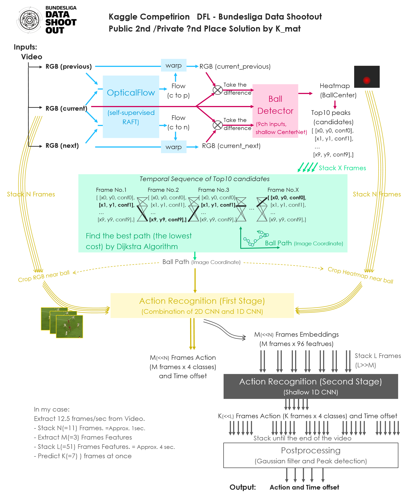

# DFL Bundesliga Data Shootout 轻量深读（Tier B）

> 赛事：Featured ｜ 主题 cv/tabular（足球转播视频的事件检测）｜ 530 队 ｜ 代码赛（两阶段：私榜用未见过的比赛）｜ 指标：DFLEventDetectionAP
> 材料基础：`digests/dfl-bundesliga-data-shootout.md`（6 篇正文：1st 359932 / 2nd 360097 / 3rd 360236 / 4th 472 行处 / 5th 360331 / 6th 570 行处；80 条主题索引）+ 21 张图
> 轻读时间：2026-10（Tier B B11）

## 1. 一句话重述与数字账

从德甲转播视频里检测事件（含时间偏移）——视频被切得很短、标注稀疏、且私榜是完全未见的比赛。真正的考点是**"单阶段弱监督 vs 多阶段球追踪"两条路线的取舍**，以及**在 5–6 小时的推理预算内把分辨率、帧率与模型数配平**。

| 关键数字 | 值 | 来源 |
| --- | --- | --- |
| 1st（Team Hydrogen，359932，139 票） | **单阶段 2.5D+3D 混合模型**：输入 1024×1024 **灰度图**（比彩色泛化更好且更快），通道堆叠 3 个相邻帧；对当前帧 t=15，分别喂 5 个时间步（每步 3 帧：{8,9,10}…{20,21,22}），共 **15 帧**；主干 effnetv2_b0/b1（更大的主干在小数据上快速过拟合）；**3D 卷积只用在最后一个 block 与池化前的卷积**（其余保持 2.5D，便于缓存与提速）；Mixup；**BCE + 3 个目标列**，标签用"事件附近小窗口的硬标签"；**SoccerNet 标签预训练 +0.02**（未标注区域的伪标签预训练失败）；推理分辨率 +128 略涨；**只预测每隔一帧**，最终用两个模型交替逐帧补齐；后处理降假阳；单模型内核运行 2.5 小时（单视频 25 分钟），双模型约 5 小时；验证用固定 4 场（4ffd5986_0 等），本地最好 0.857 与公榜强相关，最终在全量数据上重训 | 359932 |
| 2nd（K_mat，360097） | 多阶段管线（图 1）：① **自监督 RAFT 光流**求全局（相机）运动，用"warp 后与原始的差异"定位运动中的球（解决遮挡/看台背景/场边死球）；② **球检测器**（9 通道输入：当前帧 + 与前一帧/后一帧的 warp 差异，浅层 CenterNet）输出热图 → 取 **top-10 峰值**作为候选；③ 把候选沿时间堆叠，用 **Dijkstra 求全局最低成本路径**得到球轨迹；④ **两阶段动作识别**：先按轨迹裁剪球附近区域（RGB + 热图）+ 2D CNN + 1D CNN 得帧级特征（M=3 帧特征），再用浅层 1D CNN 在 L=51 帧（约 4 秒）上做时序分类，一次预测 K=7 帧；⑤ 后处理（高斯滤波 + 峰值检测）输出"动作类别 + 时间偏移"。工程参数：视频抽帧 **12.5 fps**、N=11 帧（约 1 秒）用于检测 | 360097 |
| 3rd/4th/5th/6th | 3rd 有公开方案（360236，85 票）；4th（472 行处）与 5th（360331）各有 write-up；6th 基于 baseline notebook 的"简单方法" | 360236/360331 |
| 社区侧 | "视频分类入门"（75 票）、"YOLOv5 球检测"（49 票）、"我们（沮丧的）方法"（42 票）、"关于外部数据"（40 票）、"正确的帧定位与视频切分时间"（38 票） | 社区 |

## 2. 逐方案对照矩阵

| 维度 | 1st | 2nd |
| --- | --- | --- |
| 路线 | **单阶段弱监督分类（3 目标列）** | **多阶段：光流→球检测→轨迹优化→两阶段动作识别** |
| 输入 | 1024² 灰度 × 15 帧（2.5D 堆叠 + 末段 3D） | 12.5fps；检测用 9 通道（RGB + 前后 warp 差异） |
| 关键结构 | effnetv2_b0/b1 + 末尾 3D 卷积 | 浅层 CenterNet + Dijkstra 轨迹 + 2D/1D CNN |
| 预算 | 单模型 2.5h / 双模型 ~5h（间隔预测） | 12.5fps 全流程 |
| 数据 | 竞赛标注 + SoccerNet 预训练（+0.02） | 竞赛视频（光流自监督） |

## 3. 共识、分歧与裁决

### 共识一：球的位置信息是动作分类的关键（1st/2nd + 49 票 YOLOv5 帖）

2nd 明确"注意力/裁剪到球附近能显著提升分类器"，并为此专门做光流+检测+轨迹；社区有 YOLOv5 球检测帖（49 票）。**裁决**：转播视频里的目标（球）很小且常被遮挡，显式的球定位（检测或热图 + 轨迹平滑）是分类的前置条件。置信度：高。

### 共识二：小数据 + 标签稀疏 → 单阶段弱监督也能赢（1st）

1st 完全依赖单阶段模型与硬标签窗口（且只用有标注区域训练），靠 2.5D/3D 混合与推理端工程拿到双榜第一。**裁决**：当"事件时间容忍度"给了弱监督空间时，端到端分类 + 后处理可以胜过复杂的多阶段管线（多阶段更可解释、但对每个子模块的误差都敏感）。置信度：中高。

### 共识三：推理预算（5–6 小时内核）是一等约束（1st/2nd）

1st 用灰度、2.5D 主干、只预测隔帧、双模型交错；2nd 用 12.5fps + 轻量检测 + Dijkstra。**裁决**：视频赛的方案必须在设计阶段就配平"分辨率×帧率×模型数"，否则跑不完。置信度：高。

### 分歧一：3D 卷积 vs 光流/轨迹

1st 只在最后一块用 3D 卷积；2nd 完全不用 3D，靠光流与轨迹。**裁决**：时序建模可放在网络里（3D）或在外部显式化（光流/轨迹）；后者可解释、可分段调试，前者更省管线。置信度：中高。

### 事件：外部数据（SoccerNet）与两阶段赛制（1st + 40 票帖）

1st 的 SoccerNet 预训练 +0.02（伪标签预训练失败）；社区有"关于外部数据"的长讨论（40 票）。**裁决**：外部同域数据有稳定小增益；未标注区域的伪标签在弱监督时序任务里风险高。置信度：中。

## 4. 证据分级

| 断言 | 等级 | 说明 |
| --- | --- | --- |
| 1st 的单阶段架构、15 帧设置与推理预算 | 自述 + 团队说明 | 高 |
| 2nd 的五段管线与工程参数（12.5fps/N11/M3/L51/K7） | 自述 + 总览图 | 高 |
| SoccerNet 预训练 +0.02 | 自述（单点对照） | 中 |
| 球附近裁剪提升分类 | 2nd 自述 + 社区 YOLO 帖 | 中高 |
| 两阶段赛制与私榜未见比赛 | 赛事说明 + 1st 自述 | 高 |

## 5. 悬案与缺口（登记）

- 3rd/4th/5th/6th 的方案未细读；"视频分类入门"（75 票）与"沮丧的方法"（42 票）未细读；
- 1st 的 3 个目标列定义与后处理细节未展开；
- 2nd 的检测器/分类器训练细节（自监督 RAFT 的规模）未给全；
- 归档 21 图：2nd 的管线总览（图 1）为核心图证。

## 6. 图表证据

**图 1**（topic 360097）：RGB 前/当前/后三帧 → **自监督 RAFT 光流**（求全局相机运动）→ warp 差异作为额外通道 → 浅层 CenterNet **球检测热图** → top-10 峰值候选 → 沿时间堆叠后用 **Dijkstra 求最低成本球轨迹** → 按轨迹裁剪球附近 RGB/热图 → **两阶段动作识别**（2D CNN + 1D CNN 抽帧特征，再用浅层 1D CNN 在约 4 秒窗口上分类，一次预测 7 帧）→ **高斯滤波 + 峰值检测**输出"动作 + 时间偏移"。左下角给出具体参数：12.5 fps、N=11 帧（≈1s）、M=3 帧特征、L=51 帧（≈4s）、K=7。

## 7. 出处

- 1st（139 票）：https://www.kaggle.com/competitions/dfl-bundesliga-data-shootout/discussion/359932
- 2nd（360097）：https://www.kaggle.com/competitions/dfl-bundesliga-data-shootout/discussion/360097
- 3rd（85 票）：https://www.kaggle.com/competitions/dfl-bundesliga-data-shootout/discussion/360236
- 5th（41 票）：https://www.kaggle.com/competitions/dfl-bundesliga-data-shootout/discussion/360331
- 视频分类入门（75 票）：https://www.kaggle.com/competitions/dfl-bundesliga-data-shootout/discussion/347266
- 外部数据（40 票）：https://www.kaggle.com/competitions/dfl-bundesliga-data-shootout/discussion/340836
