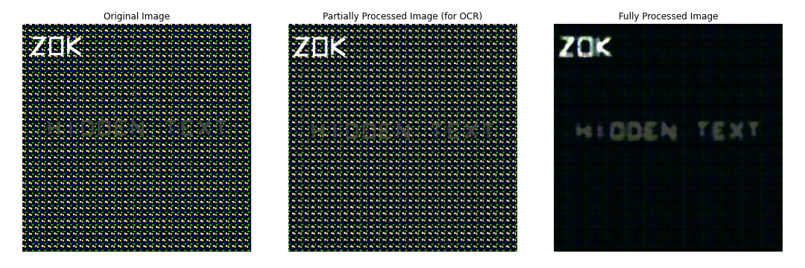

# Drawing with LLMs 轻量深读（Tier B）

> 赛事：Featured ｜ 主题 nlp（文本→SVG 图像生成）｜ 1309 队 ｜ 代码赛 ｜ 指标：SVG Image Fidelity（VQA + 美学分的加权组合，含 OCR 惩罚）
> 材料基础：`digests/drawing-with-llms.md`（6 篇正文：1st 581027 / 2nd 581023 / 3rd 581024 / 4th 581108 / 13th 581032 / OCR-Exploit 565396；80 条主题索引）+ 27 张图
> 轻读时间：2026-10（Tier B B08）

## 1. 一句话重述与数字账

按文本描述生成 ≤6000 字节的 SVG，评分 = VQA（问答式保真）+ 美学分的组合，并对图中可被 OCR 读出的多余文字罚分。真正的考点是**"指标管线本身"**：1st/2nd 都在利用"OCR 只跑部分处理流程、VQA/美学跑全流程"的缝隙，把文本对 OCR 隐藏、对评分可见；而 3rd/4th 走的是"真·生成式"路线（Flux/SD3.5M + 矢量化 + 可微渲染优化）。

| 关键数字 | 值 | 来源 |
| --- | --- | --- |
| 1st（581027，76 票） | **64 张 SSD-1B 基线图 → 矢量化 → 每个 SVG 加 OCR 诱饵/提示文本/美学伪影 → 用自实现图像处理管线打分 → 选美学分最高者**；防 OCR 幻觉：左上角嵌 3 个可见字符，穷举后发现 "ZOK" 最佳；**隐藏文本模式**（`<pattern>` 噪声纹理 + `<rect>` 填充）：原始图与"部分处理图（供 OCR）"里不可见，但**全处理图（供 VQA/AES）里显形**（图 1）；矢量化：6 色量化 → OpenCV 轮廓 → 多边形简化 → 压缩 SVG path，按面积/中心度/简单度排序填到 6000 字节；美学伪影（彩色方块 5×4、绿字 KUZ/3Q3、灰字 SSQ、"FRANCE XK ARTS"）由**遗传算法/爬山**搜索得到；最终选定 SVGAES≈0.563、VQA≈0.88；未奏效：把 CLIP/VQA 分纳入选择、>64 张图、均值化处理管线、方块位置变体 | 581027 |
| 2nd（581023，39 票） | 独立发现同一条缝隙："OCR 罚分在增强前统计、VQA 分在增强后计算 → 让文字增强前不可见、增强后可见"；用**虚线遮罩模板**覆盖文字（未被覆盖的部分才被 OCR 读到）；自研字母/模板/排布（4000 个字母承载巨量文本、尽量不跨列）；**用 A100 穷举字母组合（15 个 prompt 上的平均美学分）找到 "Zoe"**；再加心形符号、位置微调、短 prompt 复制、随机插词搜最优 | 581023 |
| 3rd（581024） | **不利用文本注入**的"正统"路线：Flux.1-schnell 生成位图（多种 prompt 模板）→ vtracer 矢量化 → **可微 SVG 优化**迭代提升 VQA/AES（VQA 0.81 / AES 0.64） | 581024 |
| 4th（581108，40 票） | SD3.5-Medium（不含 T5 编码器）+ **DRaFT-LV 微调 LoRA**：用人类偏好奖励（HPSv2、PickScore）+ 竞赛美学分 + VQA 代理（"图像是否展示该 prompt"）直接反传到扩散模型；再用 diffvg 可微光栅化精修 SVG；承认用了 richolson 的 OCR 诱饵与转 SVG 代码 | 581108 |
| 13th（581032） | 初学者路线（对比赛全貌的记录） | 581032 |
| OCR-Exploit 帖（565396，79 票） | 公开"文本渲染 vs OCR"的攻防基线（LB 0.305），推动了整个赛场转向文本注入路线 | 565396 |
| 事件 | **多次指标更新**（"Metric Update Soon" 33 票、"（又一次）Metric Update" 54 票）；"反演攻击：从评测模型反推源图"（39 票）；"主流 LLM 的 SVG 能力对比：Claude-3.7-Sonnet 最强"（54 票） | 社区 |

## 2. 逐方案对照矩阵

| 维度 | 1st | 2nd | 3rd | 4th |
| --- | --- | --- | --- | --- |
| 核心策略 | 指标缝隙（隐藏文本 + 诱饵 + 美学伪影） | 指标缝隙（虚线遮罩隐藏文本） | 正统生成 + 可微优化 | 生成模型微调 + 可微精修 |
| 生成 | SSD-1B（64 张，Tiny VAE/DPM-Solver/DeepCache） | SD + 自研文本排布 | **Flux.1-schnell** | **SD3.5M + DRaFT-LoRA** |
| 矢量化 | 6 色量化 + 轮廓简化 | 自研字母编码 | vtracer | 启发式 + diffvg |
| 选择 | 自实现管线打分选优 | A100 穷举组合 | 可微优化 | 奖励反传 |

## 3. 共识、分歧与裁决

### 共识一：本场的"元问题"是 OCR 与 VQA 的处理顺序（1st/2nd）

两队在独立发现同一缝隙后都放弃了纯生成路线：OCR 罚分在增强前、VQA/美学分在增强后 → 文本可以"对它隐身、对它现形"。**裁决**：当评测由多模型/多阶段管线组成时，**阶段间的信息差**是与建模并列的攻击面；发现后应立即重排策略（与 USPTO 的 "Magic" 同类）。置信度：高。

### 共识二：美学分可以靠"伪影搜索"提升（1st/2nd）

1st 的彩色方块/特定字串来自 GA/爬山；2nd 用 A100 穷举出 "Zoe"；两者都发现"特定字母组合显著影响美学分"。**裁决**：当评分含"美学"这类学出来的代理模型时，针对它的离散搜索（字串/图案/布局）是有效手段——但这类收益随指标更新而失效。置信度：中高。

### 分歧一：走指标缝隙还是走真生成

1st/2nd 走缝隙（第 1/2），3rd/4th 走正统生成（第 3/4），13th 亦为生成向。**裁决**：缝隙路线收益大但脆弱（评测一改即失效，本场确实多次更新指标）；正统路线的经验（DRaFT 微调、可微 SVG 优化）更可迁移。两条线都该记录。置信度：高。

### 共识三：生成→矢量化→（可微）优化是 SVG 任务的通用骨架（3rd/4th/13th）

3rd 用 vtracer + 可微优化；4th 用启发式矢量化 + diffvg；1st 也用 6 色量化 + 轮廓简化。**裁决**：位图生成 ≠ SVG；矢量化质量与路径压缩是独立的一等模块（6000 字节约束下尤其如此）。置信度：高。

### 事件：指标多次更新与反演攻击（社区）

("Metric Update"×2：33/54 票)；"Inversion Attack"（39 票）展示从评测模型反推源图。**裁决**：生成类赛事的评测器本身就是攻击面；主办方需要"评测器不可反演 + 阶段一致性"的设计。置信度：中高。

## 4. 证据分级

| 断言 | 等级 | 说明 |
| --- | --- | --- |
| 1st 的隐藏文本机制与选择流程 | 自述 + 图 + 公开 notebook | 高 |
| 2nd 的虚线遮罩与 "Zoe" 穷举 | 自述 + 图 | 中高 |
| 3rd 的 Flux+vtracer+可微优化 | 自述 + 步骤图 | 中高 |
| 4th 的 DRaFT-LoRA 与奖励设计 | 自述 + 训练代码 + 图 | 中高 |
| 指标更新与反演攻击 | 官方公告 + 论坛帖 | 中高 |

## 5. 悬案与缺口（登记）

- 5th–12th 的方案未入库；"References and starter materials"（62 票）与"LLM 的 SVG 生成能力对比"（54 票）未细读；
- 多次指标更新的具体变更内容未整理（只说"又在更新"）；
- 1st 的彩色方块等伪影具体图案未给全；
- 归档 27 图：1st 的隐藏文本前后对比（图 1）、3rd 的四步管线、4th 的 DRaFT 图为关键图证。

## 6. 图表证据

**图 1**（topic 581027）：左=原始 SVG 渲染（"ZOK" 诱饵可见、目标文本被噪声纹理掩盖）；中=供 OCR 的部分处理图（目标文本仍不可见）；右=供 VQA/美学评分的全处理图（"HIDDEN TEXT" 现形）。这就是"对 OCR 隐身、对评分现形"的直接证据。

## 7. 出处

- 1st（76 票）：https://www.kaggle.com/competitions/drawing-with-llms/discussion/581027
- 2nd（39 票）：https://www.kaggle.com/competitions/drawing-with-llms/discussion/581023
- 3rd：https://www.kaggle.com/competitions/drawing-with-llms/discussion/581024
- 4th（40 票）：https://www.kaggle.com/competitions/drawing-with-llms/discussion/581108
- 13th（38 票）：https://www.kaggle.com/competitions/drawing-with-llms/discussion/581032
- OCR-Exploit（79 票）：https://www.kaggle.com/competitions/drawing-with-llms/discussion/565396
- 指标更新（54 票）：https://www.kaggle.com/competitions/drawing-with-llms/discussion/567872
