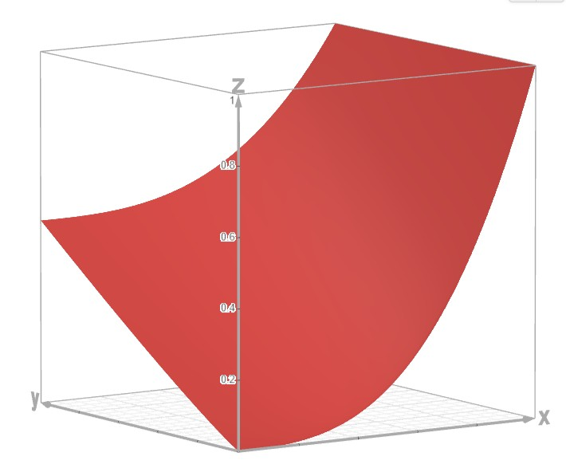

# Equity in Post-HCT Survival Predictions 轻量深读（Tier B）

> 赛事：Research ｜ 主题 science（生存分析 + 公平性）｜ 3325 队 ｜ 代码赛 ｜ 指标：Stratified Concordance Index（按种族分层的 C-index）
> 材料基础：`digests/equity-post-HCT-survival-predictions.md`（6 篇正文：1st 566550 / 指标入门 550003 / 5th 566541 / 3rd 566574 / 4th 566528 / 2nd 566522；80 条主题索引）+ 9 张图
> 轻读时间：2026-10（Tier B B03）

## 1. 一句话重述与数字账

异体造血干细胞移植后的无事件生存排序（按种族分层的 C-index）。真正的考点是**把"生存排序"分解为两件事并合并**：P(事件=0) 分类 + 事件样本的条件时间/排名回归；同时处理删失与公平性分组。

| 关键数字 | 值 | 来源 |
| --- | --- | --- |
| 1st（186 票） | 两目标：分类 P(efs=0)（XGB/LGBM/CatBoost/NN/TabM/GNN+rank-loss，AUC ≈0.759–0.762）+ 回归 efs_time 归一化排名（仅 efs==1 排序，0.6:0.4 样本权）；**magic merge 函数**（x=P(efs=0),y=归一化时间，(a,b,c) 搜索，图 1）；27 组合 + Optuna 权重（限 0.1–1 做正则）→ CV 0.6965；发现 **LGB/XGB 最佳深度=2**（特征交互极少）；给种族组加噪声提 CV 不提 LB | 1st |
| 2nd（115 票） | 基于 SurvivalGAN 论文把问题拆成 efs 分类 + efs_time 回归（efs 当额外特征、推理设 efs=1）；风险 R=p(efs=1)×sigmoid(−reg)；再训一个 NN 用 pairwise tanh 损失**直接逼近竞赛指标**；**AutoGluon Medium 拆解后也能拿金**（OOF 0.6884/私 0.697） | 2nd |
| 4th（566528） | 因子化公式：risk = P(事件=0)·s0 + P(事件=1)·(s0+(1−s0)·E[rank%|event=1])；删失样本用 **Kaplan-Meier 累积密度**加权；单模私 0.696–0.698、全套 0.69936、总运行 4h | 4th |
| 3rd/5th/指标帖 | 3rd/5th 方案；指标入门帖（301 票）详解 C-index 的 efs=1/0 配对与两种建模路线（合并目标 vs Cox/AFT 生存损失） | 材料 |

## 2. 逐方案对照矩阵

| 维度 | 1st | 2nd | 4th |
| --- | --- | --- | --- |
| 分解 | 分类 P(efs=0) + 条件排名回归 | 分类 + 时间回归 | 分类 + 条件排名 + KM 权重 |
| 合并 | 参数化 magic 函数 + rank | R=p(efs=1)×sigmoid(−reg) | 期望排名闭式公式 |
| 删失处理 | 样本权重 | efs 当特征、推理设 1 | Kaplan-Meier 权重 |
| 模型族 | GBDT/NN/TabM/GNN | XGB/HistGBM/RealMLP/CatBoost + NN 指标逼近 | CatBoost/XGB/TabM/LGBM |
| 关键发现 | 深度 2；race 噪声 CV≠LB | AutoML 也能金 | 4h 全流程 |

## 3. 共识、分歧与裁决

### 共识一：生存排序必须分解为"事件分类 + 条件时间/排名"（3/3，且 2nd 有论文依据）

1st/2nd/4th 都独立采用分解；2nd 指出 SurvivalGAN 的 TimeRegressor 同时吃特征与类别信息，因此拆开重建是自然选择。**裁决**：在合成生存数据（SurvivalGAN）上，"分类×条件回归"的因子化重建优于端到端生存损失；两种路线（分解 vs Cox/AFT）都被指标帖列为正解。置信度：高。

### 共识二：删失处理是必要的（4th 的 KM 权重；2nd 的 efs 特征）

efs=0 是"至少存活到 efs_time"的删失观测；4th 用 Kaplan-Meier 累积密度加权；2nd 把 efs 当特征并在推理设 1。**裁决**：不能把 efs_time 当普通回归目标；删失要用权重/特征/生存损失显式表达。置信度：高。

### 共识三：合并函数是一等公民（三队公式各异）

1st 的参数化曲面 + 排名变换；2nd 的乘积风险；4th 的期望排名公式——都在"如何把两个输出折成单一风险分"上做了设计。**裁决**：合并规则与两个子模型同等重要；1st 用 27 组合选最优。置信度：高。

### 共识四：公平性指标下"加噪声"是伪增益（1st）

1st 明说"给部分种族组加噪声显著提升 CV，但公/私榜都无效"。**裁决**：分层指标里按组做的手工调整会过拟合局部，不能替代真实建模。置信度：中高（单队，但机制清晰）。

### 分歧：模型族与端到端

1st 用 GNN（KNN-25 图 + GraphSAGE）与 rank-loss 变体；2nd 用 AutoGluon/RealMLP + NN 指标逼近；4th 纯 GBDT 因子化。**裁决**：分解框架下 GBDT 已足够强（4th 4h 达 0.6994）；NN 主要作为多样性/指标逼近。置信度：中高。

### 有趣的细节

1st：LGB/XGB 最优深度=2（CatBoost=6），说明特征交互价值低、任务易拟合；2nd：efs=0 样本的预测与真值有相关性（合成过程造成），加入 efs=0 反而提升 efs=1 的回归——**合成数据的人工结构会以反直觉方式帮助建模**。置信度：中。

## 4. 证据分级

| 断言 | 等级 | 说明 |
| --- | --- | --- |
| 1st 的分解/合并/组合表 | 自述 + 图 + 代码 | 中高 |
| 2nd 的 SurvivalGAN 依据与 AutoML 结果 | 自述 + 论文引用 + 表格 | 中高 |
| 4th 的 KM 权重公式与分数 | 自述 + 公开代码 | 中高 |
| C-index 指标解释 | 高票教学帖（301 票） | 高 |
| race 噪声 CV≠LB | 自述 | 中 |

## 5. 悬案与缺口（登记）

- 3rd/5th 方案未细读；"An interesting finding: GM 协作"（81 票）与"年龄分布怪象"（74 票）未入库。
- 公平性（race 分层）的官方评估细节与任何处置未收录。
- 1st 的 GNN/rank-loss 细节（shift 修复）只简述。

## 6. 图表证据

**图 1**（topic 566550）：合并函数曲面 z=f(x=P(efs=0), y=归一化 efs_time)。**"两个子模型如何折成单一风险分"的核心设计**。

## 7. 出处

- 1st（186 票）：https://www.kaggle.com/competitions/equity-post-HCT-survival-predictions/discussion/566550
- 指标入门（301 票）：https://www.kaggle.com/competitions/equity-post-HCT-survival-predictions/discussion/550003
- 5th（566541）：https://www.kaggle.com/competitions/equity-post-HCT-survival-predictions/discussion/566541
- 3rd（566574）：https://www.kaggle.com/competitions/equity-post-HCT-survival-predictions/discussion/566574
- 4th（566528）：https://www.kaggle.com/competitions/equity-post-HCT-survival-predictions/discussion/566528
- 2nd（115 票）：https://www.kaggle.com/competitions/equity-post-HCT-survival-predictions/discussion/566522
