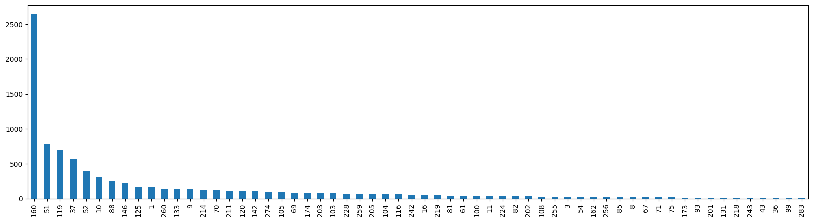
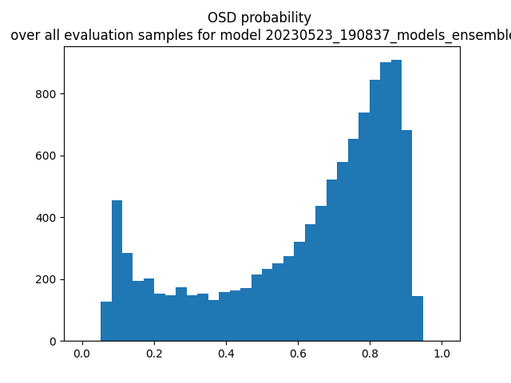

# FathomNet 2023（Out-of-Sample Detection）轻量深读（Tier B）

> 赛事：Research（标准赛）｜ 主题 cv（海洋生物分类 + 未知类别检测）｜ 69 队 ｜ 指标 FathomNet 2023（分类 + OSD/AUC 组合）｜ 截止 2023-05-23
> 材料基础：`digests/fathomnet-out-of-sample-detection.md`（6 篇正文：4th 413092 / 新手入门 397069 / 标签错误 407400 / 往届相似赛 397024 / metric 修复 404769 / 组队 397070；29 条主题索引）+ 2 张归档图
> 轻读时间：2026-10（Tier B B20 收官）

## 1. 一句话重述与数字账

海洋生物图像任务：既要把样本分到已知类别，又要判断它是否**超出已知类别（Out-of-Sample Detection）**。数据极端长尾且标签噪声大（290 个类别中 **157 个没有对应图像**，同族/属/目名称混乱）；4th 的方案非常"轻"：把少于 10 张图的类别并入 zero class，用 EfficientNetV2B0 + label smoothing 0.1 训练 6 模型集成，**OSD 分数 = 1 − max(类概率)，再叠加 5× 各类预测标准差**。赛程中还出现过 metric 的 AUC 部分计算 bug，官方修复并重新计分——提醒大家**必须自己核对评测实现**。

| 关键数字 | 值 | 来源 |
| --- | --- | --- |
| 规模与任务 | **69 队**；290 个类别（其中 **157 个无语料图像**）；分类 + OSD；FGVC10/CVPR 相关 | 398752 / 索引 |
| 4th 预处理 | 把**少于 10 张图**的类别并入 zero class（unknown），只留数据充足的类别训练/验证 | 413092 |
| 4th 训练 | EfficientNetV2B0（ImageNet 预训练）+ 128 维 Dense + 输出层；输出层按正负样本不均衡初始化；两阶段微调（先冻结 base，再解冻 2 个顶层）；**label smoothing 0.1** 在噪声标签下最好；6 模型集成 | 413092 |
| 4th 推理 | 类别：6 模型概率平均后取 **>0.4**；OSD：每模型 `1 − max(prob)`，最终 = **平均 OSD + 5×平均标准差** | 413092 |
| 数据/标签问题 | 类别名称层级错误（如 Acanthascinae/Rossellidae、Careproctus 属下三种、Lyssacinosida 目）；团队用 FathomNet API + marinespecies.org 交叉核验并回馈重标注 | 407400 |
| 评测问题 | metric 的 **AUC 部分有 bug**，官方修复后重新计分；另有 MAP@20 与评测代码不一致、评测报错、null 提交等帖 | 404769 / 410140 / 401858 |
| 上手门槛 | 图片需从源站下载且慢；官方 `download_images.py` 参数报错；submit 格式/规则（额外数据集）问题多 | 397071 / 410908 / 410430 / 407096 |

## 2. 逐方案对照矩阵

| 维度 | 4th（分类 + 不确定度） | 社区数据线 |
| --- | --- | --- |
| 类别 | 长尾并入 unknown | 用 API/外部站补稀有类 |
| 模型 | EfficientNetV2B0 ×6 + 标签平滑 | — |
| OSD | 1−max(prob) + 5×std | — |
| 风险 | 阈值/权重经验化 | 标签错误与规则限制 |

## 3. 共识、分歧与裁决

### 共识一：OSD 可以用"置信度补集 + 集成不确定度"做基线（413092；置信度中高）

`1 − max(prob)` 给出 OOD 直觉分数；叠加集成预测标准差把"模型间分歧"变成 OSD 信号。**裁决**：先做该基线，再考虑专门 OOD 方法（energy/Mahalanobis/生成式）；所有阈值在 OOF 上定。置信度：中高。

### 共识二：极端长尾 + 噪声标签要"归并 + 平滑"（413092 / 407400 / 398487；置信度中高）

<10 图类别归 unknown、label smoothing 0.1 是 4th 的显式选择；社区另帖讨论标签噪声处理。**裁决**：先统计每类样本数与层级一致性，把不可学类别并入 unknown；标签平滑/噪声鲁棒损失作为默认项。置信度：中高。

### 事件一：评测实现必须自行核对（404769 / 410140 / 401858；置信度中高）

官方修过 AUC 部分的 bug；选手也发现 MAP@20 与评分代码不一致。**裁决**：下载官方 metric 实现，用构造样本做单元校验；分数突变先怀疑评测而非模型。置信度：中高。

### 事件二：数据获取与规则是结构性门槛（397071 / 410908 / 407096；置信度中）

图片来源分散、下载慢、脚本参数报错、外部数据集边界模糊。**裁决**：先用官方下载脚本/公开打包数据建最小集，再按规则补充；外部数据先发帖确认。置信度：中。

### 事件三：竞赛文化（最后一周不公开高分 notebook）（397069；置信度中）

官方说明最后一周禁用公开 notebook 发布，鼓励此前分享。**裁决**：把关键 notebook 在截止前保留；学习阶段多读已公开的 EDA/入门帖。置信度：中。

## 4. 证据分级

| 断言 | 等级 | 说明 |
| --- | --- | --- |
| 4th 的完整配方 | 自述 + 2 张图（413092） | 中高 |
| 290 类 / 157 类无图 | 社区统计帖（398752） | 中高 |
| 标签层级错误 | 社区帖（407400） | 中 |
| metric bug 与重算 | 官方帖（404769） | 高 |
| 下载/规则问题 | 多帖（397071 等） | 中高（现象） |

## 5. 悬案与缺口（登记）

- 1st–3rd 方案未归档，4th 是唯一可读方案；
- OSD 的官方定义与最优阈值策略无归档说明（411135 在问）；
- 类别重标注是否被官方采纳未归档；
- 外部数据集/规则澄清答复未归档；
- **图证缺口**：无（2 张图，本深读内嵌 2 张）。

## 6. 图表证据

**图 1**（topic 413092，4th）：合并 <10 图类别后的类别分布——仍极端长尾（最高类约 2600 张，长尾类别接近个位数），直观解释了"归并 unknown + 标签平滑"的选择。

**图 2**（topic 413092，4th）：集成模型在评测样本上的 OSD 概率直方图——多数样本 OSD 概率在 0.8–0.95，另有一小簇接近 0.1 的"已知类"样本；用于校准 OSD 阈值。

## 7. 出处

- 4th 方案（5 票 / 0 评论）：https://www.kaggle.com/competitions/fathomnet-out-of-sample-detection/discussion/413092
- 标签错误讨论（6 票 / 2 评论）：https://www.kaggle.com/competitions/fathomnet-out-of-sample-detection/discussion/407400
- metric 修复与重算（3 票 / 0 评论）：https://www.kaggle.com/competitions/fathomnet-out-of-sample-detection/discussion/404769
- 157/290 类无图（2 票 / 1 评论）：https://www.kaggle.com/competitions/fathomnet-out-of-sample-detection/discussion/398752
- 往届相似赛（19 票 / 2 评论）：https://www.kaggle.com/competitions/fathomnet-out-of-sample-detection/discussion/397024
- 新手入门（9 票 / 3 评论）：https://www.kaggle.com/competitions/fathomnet-out-of-sample-detection/discussion/397069
- MAP@20 不一致（2 票 / 2 评论）：https://www.kaggle.com/competitions/fathomnet-out-of-sample-detection/discussion/410140
- 下载脚本参数报错（2 票 / 10 评论）：https://www.kaggle.com/competitions/fathomnet-out-of-sample-detection/discussion/397071
