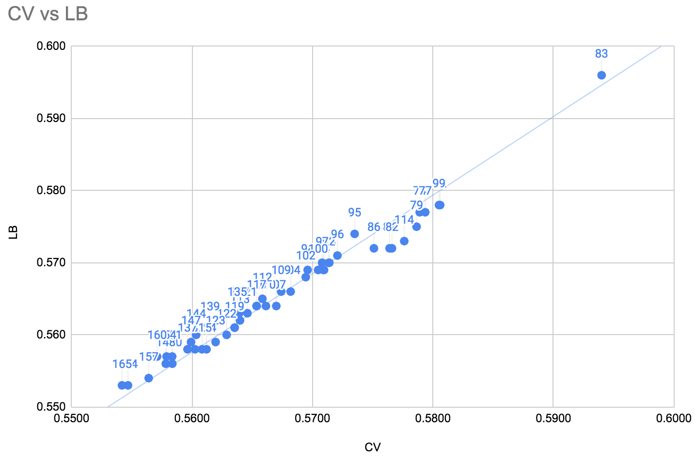
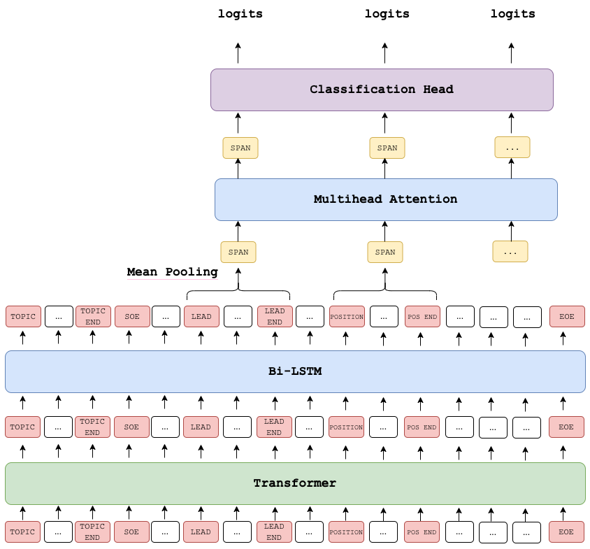
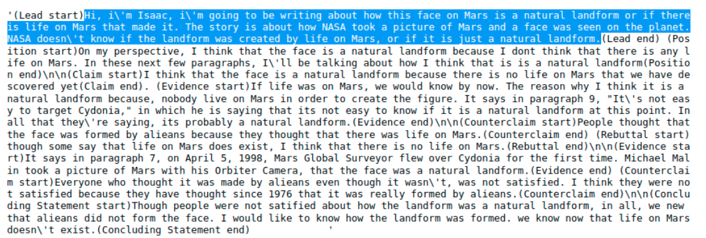

# Feedback Prize - Effectiveness 轻量深读（Tier B）

> 赛事：Featured ｜ 主题 nlp（论述要素效果分类，log loss）｜ 1557 队 ｜ 代码赛 + Efficiency Track ｜ 指标：Multiclass Log Loss
> 材料基础：`digests/feedback-prize-effectiveness.md`（6 篇正文：1st 141 / 更多教训 107 / 2nd 94 / 3rd 77 / Efficiency 1st 75 / 3rd 短版 62；80 条主题索引）+ 3 张图
> 轻读时间：2026-10（Tier B B01）

## 1. 一句话重述与数字账

预测学生论述中每个 discourse 要素（Lead/Position/Claim/Evidence/…）的"有效程度"（三分类 log loss）。真正考的是：**整篇输入 + 逐 span 池化**的表示方式、**前届比赛数据的无泄漏伪标**、以及**两级集成 + 均值校准**；另有独立 Efficiency Track 考"单模蒸馏 + 推理优化"。

| 关键数字 | 值 | 来源 |
| --- | --- | --- |
| CV-LB 关系 | 近乎完美线性（1st 的 CV-LB 图，图 1）；"CV 动了 LB 就同向动" | 1st |
| Span MLM（3rd） | 改动：mask 率 15%→**40–50%**、连续 span 3–15、chunk 720 → **+0.02~0.03** | 3rd |
| 其他增益（3rd） | AWP +0.005~0.01；prompts +0.002~0.005；mask aug+MSD +0.002~0.005；LSTM+LGB 元模型 +0.002~0.004 | 3rd |
| 伪标（前届 2021 数据） | 1st：3 轮（核心组件）；2nd：某人有效到 **5 轮**、另一人 1 轮；3rd 尝试无效（争议） | 1st/2nd/3rd |
| 二级模型 | 1st 的 LGBM/NN 二级模型稳定 **+0.003~0.005**；2nd 的 stacking **+0.004** | 1st/2nd |
| 单模/成绩 | 3rd 单模 10 折 deberta-large 公 0.563/私 0.566；2nd 三人单模私 0.558–0.571 | 3rd/2nd |
| Efficiency | 1st：单 deberta-v3-large（第 4 轮 PL + OOF PL，无原始标签蒸馏）私 **0.557 / 5 分 40 秒**（可进前三）；预分词+按长度排序再省 40 秒 | 1st |

## 2. 逐方案对照矩阵

| 维度 | 1st（Team Hydrogen） | 2nd（Team SKT） | 3rd（Darjeeling Tea） |
| --- | --- | --- | --- |
| 表示 | Essay group model（整篇 + 逐 discourse 池化 + 类型辅助损失）；token classification 变体 | 整篇 + 池化或首 token；特殊标记/prompt 定位 span；pooled 后加 GRU/LSTM | 整篇 + 新特殊 token；Bi-LSTM + Multihead Attention over span |
| 预训练 | — | 前届权重/tascj0 权重；部分 MLM | **Span MLM**（40–50% mask、span 3–15、chunk 720）+ T5 合成数据 MLM |
| 增强 | mask augmentation | AWP（+0.003） | T5 标签保持增强（0–50% 混入）+ AWP + MSD + prompts |
| 伪标 | 3 轮（前届数据，折内无泄漏 + 全量 6 版本） | 跨届数据；软概率；3 轮 PL + 3 轮 GT 交替；最多 5 轮 | 尝试后放弃（与 1st/2nd 分歧） |
| 集成 | 多模型加权（含**负权重**）+ 2 级 LGBM/NN（+0.003~0.005） | stacking（+0.004；prob_sequences 特征；6×6=36 预测平均） | LSTM/LGB meta（+0.002~0.004） |
| 校准 | log loss 列均值调整 | — | — |
| 验证 | 效率分层切分 + 3 seed 混合 | StratifiedGroupKFold（>GroupKFold） | 10 折 |

## 3. 共识、分歧与裁决

### 共识一：整篇输入 + 逐 span 池化是正确表示（3/3）

1st：essay group model（batch=1 篇 → 展开为 discourse 数）；2nd："直接输入整篇会导致模型不确定在哪预测"，用特殊标记/prompt 指位；3rd：span 特殊 token + 池化。**裁决**：先让模型看到完整语境，再用标记/池化指定预测目标；不要拆成孤立 discourse。置信度：高（"更多教训"作者也承认花了整场才意识到）。

### 共识二：DeBERTa-large/v3-large 是唯一可靠骨干（3/3）

2nd 全员 deberta 变体；1st"只有 deberta-(v3)-large 有效"；3rd 的 Longformer/LUKE 只贡献多样性。**裁决**：长文本 + 相对位置/解耦注意力适配本任务；其他骨干是多样性选项。置信度：高。

### 共识三：前届比赛数据是本场最大外部杠杆（无泄漏伪标）

2nd 的 11000 篇 2021 essays、5 轮 PL；1st 的 3 轮 PL + 蒸馏；"更多教训"作者后悔"信了别人说没用、没亲自充分测试"。**裁决**：跨届同题数据 + 折内无泄漏软伪标（PL 与 GT 交替训练）是主杠杆；但轮数与收益因流水线而异（1–5 轮）。置信度：高。

### 共识四：两级集成 + 简单元模型稳定加分

1st 的二级 LGBM/NN +0.003~0.005（含负权重有效）；2nd 的 stacking +0.004（prob_sequences/邻居/essay 聚合特征）；3rd 的 LSTM/LGB meta +0.002~0.004。**裁决**：一级模型概率 + span 序列特征喂二级模型是标准配方。置信度：高。

### 共识五：CV-LB 高度一致 → 信任 CV

1st 的 CV-LB 图近线性；1st "3 seed 混合后才评估"；2nd 换 StratifiedGroupKFold 后相关性更好。**裁决**：小数据 DL 赛要先做多 seed 评估与折设计（效率分层/分组），CV 一致时按 CV 选模。置信度：高。

### 分歧一：伪标是否有效

1st/2nd 成功且是核心；3rd 的"Things that didn't work"列了 pseudo labeling，而"更多教训"作者又后悔没测。**裁决**：分歧源于实现（teacher 质量/轮数/是否折内无泄漏），不是方法本身；采用"折内无泄漏 + 教师集成 + 轮数早停"的稳健版本。置信度：中高。

### 分歧二：T5 增强的价值

3rd 的 T5 增强用于 MLM 与直接混训（-0.002~+0.005，不稳定）；1st/2nd 未强调合成文本。**裁决**：合成文本的主要作用是 MLM 域适应与表示多样性，直接当训练样本需谨慎。置信度：中。

### 事实：Efficiency Track 把"集成"蒸馏成单模

1st 用第 4 轮 PL + OOF PL（无原始标签）训练单 deberta-v3-large，私 0.557/5m40s（前三水平）；并给出预分词+长度排序省 40s、base 版 <2min 的路径。**裁决**：效率赛道的最优策略 = 大集成产伪标 → 单模蒸馏 + 推理工程。置信度：高。

## 4. 证据分级

| 断言 | 等级 | 说明 |
| --- | --- | --- |
| 1st 的 CV-LB 关系 | 图证（图 1） | 高（展示层面） |
| Span MLM +0.02~0.03、AWP 等增益 | 自述（分项区间） | 中高 |
| 伪标 3 轮/5 轮有效 | 自述（两队独立） | 中高 |
| Efficiency 0.557/5m40s | 自述 + 公开 notebook | 高（可复现） |
| stacking +0.004 | 自述 + 公开代码 | 中高 |
| 3rd 的架构图 | 图证 | 高（结构层面） |

## 5. 悬案与缺口（登记）

- 4th–10th 方案未收录；`338271` Token Classification Approach（88 票）、`333277` 单模实验日志 0.624（90 票）、`332438` DeBERTa 综述（91 票）未收录。
- 3rd 的"伪标无效"具体实现（教师/轮数/数据范围）未知，无法定位与 1st/2nd 的差异。
- T5 合成数据的质量审计/去重细节缺失；prompt 泄漏风险（本文测试集 prompt 与训练同分布？）未讨论。

## 6. 图表证据

**图 1**（topic 347536）：CV vs LB 散点近乎严格线性（点标注名次）——"CV 可信"的直接证据。

**图 2**（topic 347433）：特殊 token（TOPIC/SOE/LEAD/POSITION/EOE）→ Transformer → Bi-LSTM → 逐 span Mean Pooling → Multihead Attention → 分类头。

**图 3**（topic 347359）：正文中用 `(Lead start)…(Lead end)` 等标记包住每个 discourse 的示例——"整篇输入 + 指位"的具体形态。

## 7. 出处

- 1st（141 票）：https://www.kaggle.com/competitions/feedback-prize-effectiveness/discussion/347536
- 更多教训（107 票）：https://www.kaggle.com/competitions/feedback-prize-effectiveness/discussion/347425
- 2nd（94 票）：https://www.kaggle.com/competitions/feedback-prize-effectiveness/discussion/347359
- 3rd（77 票）：https://www.kaggle.com/competitions/feedback-prize-effectiveness/discussion/347433
- Efficiency 1st（75 票）：https://www.kaggle.com/competitions/feedback-prize-effectiveness/discussion/347537
- 3rd 短版（62 票）：https://www.kaggle.com/competitions/feedback-prize-effectiveness/discussion/347371
- 缺口登记：338271、333277、332438、347713、327251
