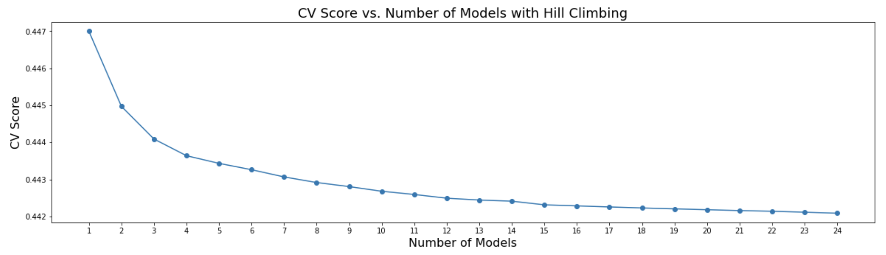
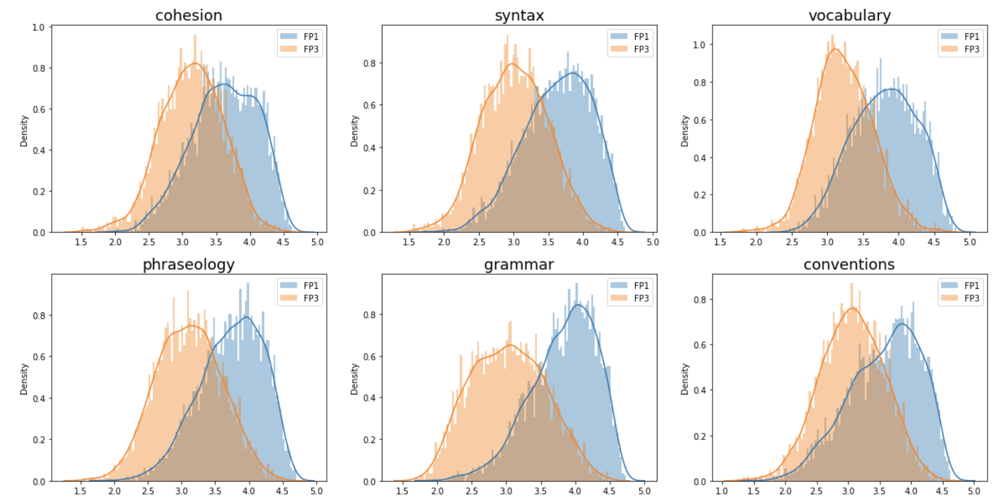

# Feedback Prize ELL 深读：小样本多目标回归的融合工程

> 赛事：Featured ｜ 主题 nlp（教育）｜ 2654 队 ｜ 代码赛 ｜ 指标 6 列 RMSE 均值（2022-11-29 截止）
> 材料基础：`digests/feedback-prize-english-language-learning.md`（8 节正文：1st/2nd/3rd/5th + SVR starter + 往届方案汇总 + 访谈索引 + 新奖试点）+ 6 张图
> 深读时间：2026-10（Tier A #13）

## 0. 一句话重述：这道题真正在考什么

题面是"给 ESL 作文的 6 个维度打分"，实际被考的是**在 ~3,900 篇的小数据上，把"模型多样性 × 元优化器 × 伪标签转移"三件事做对**。降解为 6 步：

1. **实验统计纪律**：数据小、RMSE 抖动大 → 5th 的"每次实验跑 3 个种子、只比较均值"是全场最有价值的方法论；CV 与 LB 近乎完美相关（1st/2nd/5th 独立确认）；
2. **多样性来源**：池化（Mean/Concat/WeightedLayer/GeM/LSTM/两级）、max_len（512/768/1024/1462/2048）、backbone 家族、冻结/重初始化层、差分学习率、AWP——每项贡献一点点，堆出可选池；
3. **融合的元优化器**：Optuna（1st，目标级权重）、爬山法（3rd，支持负权重 +0.006 私榜）、Nelder-Mead（5th，权重带 [1,3] 约束）——三种都在"OOF 上搜权重"，纪律差异决定是否过拟合；
4. **多目标结构**：6 个维度不独立——按目标设损失权重（3rd 的 0.21/0.16/0.10/0.16/0.21/0.16）、按目标加 rank/Pearson 损失（2nd）、按目标调集成权重（全员）；
5. **伪标签转移**：FB1 伪标签让 CV 从 0.4470→0.4370 但 LB 不涨（3rd 怀疑泄漏/分布漂移，直方图证据 FP1>FP3）；正确姿势是"预训练吸收、微调重校准"（5th）；
6. **外部信息源**：冻结嵌入 + RAPIDS SVR（无训练 CV 0.450）作为廉价的异质集成成员（SVR starter/1st/3rd 都用）。

一句话：**这是"融合工程学"比赛**——单模天花板（~0.447）与冠军（0.441）的差距，全部来自多样性采集与权重搜索的正确性。

## 1. 材料与角色

| 帖子 | 作者 | 票数 | 角色与独有信息 |
| --- | --- | --- | --- |
| [351577](https://www.kaggle.com/competitions/feedback-prize-english-language-learning/discussion/351577)（SVR starter，197 票） | Chris Deotte | 197 | **零训练基线**：5 个冻结模型的嵌入 → RAPIDS cuML SVR，CV 0.4505 / LB 0.44x；把 PetFinder 经验跨场迁移 |
| [369609](https://www.kaggle.com/competitions/feedback-prize-english-language-learning/discussion/369609)（3rd） | Chris Deotte + Amed + CroDoc | 141 | **爬山的完整记录**：24 模型从 50 候选选出、含负权重；伪标签失败 + FP1/FP3 分布漂移直方图 |
| [369457](https://www.kaggle.com/competitions/feedback-prize-english-language-learning/discussion/369457)（1st） | Dracarys 队（Rohit/Evgenii/Poteman） | 129 | 多池化×多长度×多 backbone 的模型工厂 + 3 个嵌入模型 SVR；OPTUNA 目标级权重；"Train PL/Actual 均值"技巧 |
| [369369](https://www.kaggle.com/competitions/feedback-prize-english-language-learning/discussion/369369)（2nd） | gezi | 112 | **单模提升路径最细**：回译预训练（14 语言）→ vocabulary 大改善；rank loss 恒有用；自曝 Optuna 用同一份 OOF 的过拟合风险 |
| [348967](https://www.kaggle.com/competitions/feedback-prize-english-language-learning/discussion/348967)（往届汇总） | CroDoc | 83 | Feedback 1/2（含效率赛道）全部名次帖的链接索引——跨届复用入口 |
| [369578](https://www.kaggle.com/competitions/feedback-prize-english-language-learning/discussion/369578)（5th） | Psi | 74 | **种子平均纪律 + 预训练式伪标签**：3 种子均值筛选实验；Nelder-Mead 权重约束 [1,3]；未提交的无约束版本可达私榜 #2 |
| [348957](https://www.kaggle.com/competitions/feedback-prize-english-language-learning/discussion/348957)（访谈索引） | Sanyam Bhutani | 55 | 往届冠军直播/访谈入口 |
| [369307](https://www.kaggle.com/competitions/feedback-prize-english-language-learning/discussion/369307)（新奖试点） | Mark McDonald | 53 | 本场首次"写作奖"试点（top10 队伍 $1,000+周边）——**深读材料本身是赛事激励的产物** |

**材料缺口（未扩采，登记备查）**：索引里另有 32 条 write-up 未收录，含 [4th（369621，50 票）](https://www.kaggle.com/competitions/feedback-prize-english-language-learning/discussion/369621)、[6th（369567）](https://www.kaggle.com/competitions/feedback-prize-english-language-learning/discussion/369567)、[效率赛道 1st Team Turing（369646）](https://www.kaggle.com/competitions/feedback-prize-english-language-learning/discussion/369646)、[13th（369440）](https://www.kaggle.com/competitions/feedback-prize-english-language-learning/discussion/369440)、[单模双种子金方案（369368）](https://www.kaggle.com/competitions/feedback-prize-english-language-learning/discussion/369368) 等。

## 2. 逐方案对照矩阵

| 维度 | 1st Dracarys | 2nd gezi | 3rd Chris/Amed | 5th Psi |
| --- | --- | --- | --- | --- |
| 模型池 | 5 backbone × 5 池化 × 3 max_len（768/1462/512）× 冻结/重初始化；+3 嵌入模型 SVR | 仅 deberta-v3-large/base 可用；单模 0.4456–0.4514 | 24 模型（主要为 deberta-v3-large 变体；含 xlm-roberta、TF-deberta、RAPIDS-SVR） | 6 backbone（v3 base/large、v2 XL/XXL、Longformer large、roberta large）× 长度 512/1024/2048 × CLS/GeM |
| 损失 | — | Pearson 损失 + **rank loss（率 0.1）**；经验：rank 恒有用、Pearson 帮硬目标伤软目标 | 目标级损失权重（0.21/0.16/0.10/0.16/0.21/0.16，和=1.00） | cosine 3 epoch 取末轮；差分学习率（backbone/head） |
| 预训练/伪标签 | FB1 伪标签 + **Train PL/Actual 均值**；软 PL 直接训练→严重过拟合（CV 0.437） | 回译预训练（14 语言，2 阶段）；FB2 列表模型预训练；FB1 伪标签 | **不用伪标签**（FP1 PL 让 CV 0.4470→0.4370 而 LB 不涨） | **两轮"预训练式"伪标签**：老数据出软标 → 预训练 → 只用本赛数据微调（无需分布校准） |
| 权重搜索 | Optuna（目标级），仅当同时改善 CV 与 LB 才纳入 | 逐模型逐目标手调（自曝不稳定性） | **爬山法 + 负权重**（CV +0.0010、私榜 +0.0060） | Nelder-Mead（目标级，权重限 [1,3]；无约束版=私榜 #2） |
| 成绩 | CV 0.44096 / 公开 0.433821 / 私榜 0.433356（另有 CV 0.44073 未选、私榜更好） | 最佳 PB 0.433541（干净路线）；伪标签+Optuna 0.43363（自评过优化） | 单模 0.4470 → 集成 **0.4420**（私榜约 0.434） | 保守版即最佳已选私榜；无约束版可达 #2 |
| 独门技巧 | 嵌入模型 SVR 入集 | 回译帮 vocabulary、伤 conventions | 训练 2048/推理 640；batch=1；dropout=0；clip 10；`\n\n`→`|` | 3 种子实验纪律 |

## 3. 共识、分歧与裁决

### 共识一：小数据下的"实验统计纪律"是第一方法论（5th 定义，全员适用）

5th：每个实验跑 **3 个唯一种子**，只比较种子均值；只有均值改善才上 5 折；再比较"3 种子混合"确认。2nd 的教训从反面印证：用**同一份 OOF** 做 Optuna 调参再选权重 = 二次过拟合（其 CV 0.44494 被自评为"不准确"）。1st 的对策则是"只有当模型同时改善 CV 与 LB 才纳入集成"。

**裁决**：小样本 RMSE 的改进必须先把噪声带宽压到增益之下；种子平均（实验端）+ 独立数据/双层协议（权重搜索端）是两条互补防线。置信度高。

### 共识二：多样性优先于单模强度（3rd 的爬山记录是最直接证据）

3rd 的记录：爬山选出的**第 2、3 名成员 CV（0.4524/0.4498）并不优于第 1 名（0.4470）**，但组合增益最大；且负权重成员（如第 7 个 CV 0.4570 权重 −0.160）也被选中——"最佳 CV 模型不是最先被选的"。
1st/2nd/5th 的池化/max_len/backbone 变体清单是同一原则的不同采集方式。

**裁决**：在小数据回归里，采集"错法不同"的模型（池化/长度/家族/损失）比把单模再调 0.001 更值钱。置信度高（与 THEORY L7/L13 一致）。

### 共识三：CV≈LB 的强相关是本场可用 CV 迭代的前提（但也埋了陷阱）

1st"近乎完美相关"、5th"很好相关"、2nd"信任 LB 但伤了 PB"——3rd 更直接：伪标签让 CV 暴涨 0.010 而 LB 不动，说明 **CV 只有在无泄漏/无分布漂移时才是尺子**；2nd 的 Optuna 与 3rd 的伪标签都是"CV 被污染"的案例。

**裁决**：先审计 CV 的污染源（同 OOF 二次使用、跨届伪标签、分布漂移），再决定信 CV。置信度高。

### 分歧一：伪标签到底用不用？

- 不用：3rd（FP1 伪标签 CV 虚涨、LB 不涨；直方图显示 FP1 目标分布整体高于 FP3）；
- 用：2nd（伪标签单模 PB 最好 0.434726）、1st（FB1 PL + Train PL/Actual 均值）、5th（两轮预训练式 PL）；
- 关键差异在**使用方式**：直接把伪标签混入训练（3rd/2nd 早期）→ 分布错配/泄漏；把伪标签当**预训练**、再在本赛数据上微调（5th/1st 的均值技巧）→ 分布被重校准，增益稳定。

**裁决**：跨届/跨分布的伪标签必须走"预训练→本域微调"路线；直接混训会在分布错配时虚涨 CV。置信度高（3rd 的直方图 + 5th 的方法论互证）。

### 分歧二：权重搜索用负权重吗？

3rd：允许负权重，CV +0.0010、私榜 +0.0060（效果好）；
5th：有未提交的无约束（含负）版本可达私榜 #2，但"感觉太冒险"选择保守约束 [1,3]；
2nd：手调权重被自评为"也不稳定"。

**裁决**：负权重在 24+ 个高度相关模型上确实能再压 CV，但它是**对 OOF 噪声的拟合**；收益（0.001 CV / 0.006 私榜）与风险并存。若提交次数有限，约束权重更稳；若能大量提交，可赌博。置信度中（缺少 3rd/5th 的对照实验）。

## 4. 增量数字账

**3rd 的爬山账（本场最完整）**

| 阶段 | CV | 说明 |
| --- | --- | --- |
| 最佳单模 | 0.4470 | deberta-v3-large 家族 |
| 爬山 2 模型 | 0.44493 | 第 2 名 CV 仅 0.4524（多样性胜出） |
| 爬山 3 模型 | 0.44405 | — |
| 爬山 ~10 模型 | 0.44262 | 前 10 个占大部分增益 |
| 爬山 24 模型 | **0.4420** | 后 14 个合计 ~0.0006（长尾） |
| 负权重消融 | CV −0.0010 / 私榜 −0.0060 | 相对仅正权重 |

**其余关键数字**

| 动作 | 数字 | 来源 |
| --- | --- | --- |
| 回译预训练（14 语言）| 单模 CV 0.4505→0.4498；vocabulary 显著改善 | 2nd |
| rank loss（率 0.1） | 单模 CV 0.4514→0.4505；硬目标（score/max）改善最明显 | 2nd |
| FB2 预训练 | 单模 CV 0.4505→0.4488（LB/PB 同向） | 2nd |
| 伪标签（FB1） | 单模 CV 0.4468–0.4469，最佳 PB 0.434726 | 2nd |
| 伪标签（FB1→FP3，直接混训） | CV 0.4470→0.4370，LB 不变（怀疑泄漏/漂移） | 3rd |
| 集成（1st 最终） | CV 0.44096 / 公开 0.433821 / 私榜 0.433356 | 1st |
| 冻结嵌入 + SVR（零训练） | CV 0.4505 / LB 0.44x | SVR starter |
| 种子平均收益 | 3 种子混合相对单种子显著降噪（5th 全流程采用） | 5th |
| 提交成本 | 23 模型 × 2（全量+5 折）T4×2 推理 2h20m | 2nd |

**可复算校验（2 处算术吻合）**

1. 3rd 的目标损失权重之和：0.21+0.16+0.10+0.16+0.21+0.16 = **1.00** ✓（设计为加权平均）；
2. 3rd 的爬山总增益：0.4470−0.4420 = **0.0050**；前三模型贡献 0.4470−0.44405 ≈ **0.0030（60%）**——曲线前陡后平的量化 ✓（图 1 逐点可读）。

## 5. 机制推演

**M1｜为什么小数据必须"种子平均 + 多样池"**：~3,900 样本、6 目标 RMSE 的噪声带宽与模型差异同量级；单种子比较等于在噪声里选模型。种子平均把方差压到 √3 之一；多样池让权重搜索在相关矩阵上做组合优化——两者的共同目标都是"把真实增益从噪声里抬出来"。

**M2｜爬山为什么能超过 Optuna 式全局搜索（本场两种都出现）**：爬山从最优单模出发、每步只加"带来最大边际改善"的模型（含负权重），天然带正则（贪心、早停），且可解释；Optuna 在全空间搜索在 24–50 维、高相关输入下更容易过拟合 OOF。但 1st 用 Optuna 成功、3rd 用爬山成功、5th 用 Nelder-Mead 成功——**元优化器不是胜负手，权重搜索与验证的隔离才是**。

**M3｜rank/Pearson 损失的"目标特异性"**：6 目标难度不均（hard target 的样本序关系比绝对值更可学）。rank loss 把"相对次序"从标签噪声里提出来，帮硬目标；但也可能把容易目标的校准破坏掉——2nd 因此用 0.1 的低比率 + 集成（含 0 比率模型）覆盖两种风格。**多任务里，"损失风格"本身是多样性维度。**

**M4｜回译为什么专帮 vocabulary**：回译造出的平行文本迫使模型关注"词在跨语言下不变的语义角色"，对词汇维度（词汇丰富度/选择）信号增强；对 conventions（拼写规范类，跨语言不稳定信号）反而有害——2nd 的逐目标曲线证实。**增强方法的作用是目标选择性的，不是全局的。**

**M5｜伪标签的两种命运**：直接混训时，FB1 标签分布与 FP3 不同（FP1 整体更高，图 2），模型学到系统性偏移 + 潜在的"历史重叠样本记忆"→ CV 虚涨；预训练+微调路线让本赛数据完成最终校准，伪标签只贡献特征/初始化，不贡献标签尺度。**伪标签可以转移"表示"，不可转移"分布"。**

**M6｜为什么训练 2048、推理 640 反而更好**（3rd）：训练期长上下文让模型见到完整文章结构（正则/信息），推理期短窗口减少噪声与过拟合风险——**训练/推理长度解耦**；配合 batch=1 + dropout=0 + clip 10，"小数据下的大正则"组合。可迁移到一切小数据长文本任务。

## 6. 证据分级

| 断言 | 等级 | 说明 |
| --- | --- | --- |
| 3rd 爬山曲线与 24 模型权重表 | **可读取（图+表）** | 逐模型 CV/权重完整；CV 增益经 OOF 计算 |
| FP1/FP3 分布漂移直方图 | **可读取（图）** | 6 目标全部可见 FP1 右移；伪标签失败的解释证据强 |
| 1st 的模型表与最终集成分 | **可读取（表）** | 18 行单模 CV/LB/PB + 集成三列 |
| 2nd 单模提升表（回译/rank/伪标签） | **可读取（表）** | 每行一个改动；但为顺序累加，非独立消融 |
| "回译帮 vocabulary、伤 conventions" | **可读取（曲线图）** | 逐目标 epoch 曲线支撑 |
| 种子平均的收益量级 | **自述（5th）** | "一般 0.2–0.6 ft"？本场未给数值（该数字来自 26th 帖，非本场）——**本场未量化，登记弱证据** |
| 负权重 +0.006 私榜 | **自述（3rd）** | 无重复实验 |
| 无约束版可达私榜 #2（5th） | **自述** | 未提交版本，无法核验 |

## 7. 边界条件与反事实

- **小样本 + 强区间相关性**是本场一切方法的土壤：3,900 篇、6 个高度相关目标、RMSE 均值 → 集成增益大、单模改进小、CV 噪声大。换到大样本任务，"爬山/种子平均"的边际收益会下降。
- **反事实（3rd）**：若不设负权重，私榜 −0.006（但从第 1 掉到第 3？不能归因于单一因素）；若用了 FP1 伪标签并信 CV，私榜大概率塌方——**CV 虚涨 0.010 是危险信号而非进步**。
- **反事实（5th）**：若提交无约束权重版本，私榜可达 #2；保守约束的代价 ~2 个名次——**在提交预算允许时，"信任本地搜索"的期望收益可能被低估**。
- **反事实（2nd）**：回译预训练是一条低成本单模提升路径（0.0007–0.0017 CV）；若早期投入，可能改变集成成员构成。
- **任务边界**：本场的"embedding+SVR"零训练基线（0.4505）接近单模上限（0.4470），说明**小数据下线性头 + 冻结强特征被严重低估**——与 PetFinder 的结论同构（THEORY L10）。

## 8. 悬案与失败学

**悬案**

1. **FP1 伪标签的"泄漏"到底是什么**：3rd 明确说"一定有泄漏但没找到"；分布漂移（图 2）是解释之一，但是否还有历史样本重叠未证实；
2. **种子平均的量化收益**：本场未给出"单种子 vs 3 种子"的对照数字（5th 只说流程）；
3. **负权重 vs 约束权重的期望值**：3rd 与 5th 的相反选择缺少同场对照。

**失败学**

| 失败 | 来源 | 教训 |
| --- | --- | --- |
| 同一份 OOF 调参 + 选权重 | 2nd（自曝） | 二次过拟合；CV 0.44494 不可信 |
| FB1 伪标签直接混训 | 3rd | CV 虚涨 0.010、LB 不动；跨届标签分布漂移 |
| 软伪标签直接训练本赛数据 | 1st | CV 过拟合到 0.437，不可用 |
| 手调逐目标权重 | 2nd | 自评"不稳定、有过拟合空间" |
| 增强/后处理 | 1st | 明确无效（回归任务增强难） |
| 不同损失、TFIDF、T5/GPT、二阶堆叠 | 5th | 全部无效；DeBERTa 家族压倒性 |
| 只比较单种子结果 | 5th 反例 | 小数据下会在噪声里选模型 |

## 9. 图表证据

> 路径相对本文件（`analysis/deep/`）：`../../intel/feedback-prize-english-language-learning/bodies/<topic>_img/NN.ext`

**图 1：爬山曲线——前 3 个模型吃掉 60% 增益**（3rd，topic 369609）——`../../intel/feedback-prize-english-language-learning/bodies/369609_img/01.png`

*读图结论*：CV 0.4470（1 模）→ 0.44493（2）→ 0.44405（3）→ 0.44262（10）→ ~0.4421（24，帖文记 0.4420）；曲线前陡后平，**长尾 14 个模型合计约 0.0006**。配合权重表看：第 2、3 名成员的单模 CV（0.4524/0.4498）都不是最优，却按"边际增益"被选中——爬山在联合优化"多样性 + 边际增益"，而不是按单模强弱排序。

**图 2：FP1 vs FP3 的目标分布漂移（伪标签失败的物证）**（3rd）——`../../intel/feedback-prize-english-language-learning/bodies/369609_img/02.png`

*读图结论*：6 个目标全部呈现 FP1（蓝）分布整体高于 FP3（橙）——FP1 伪标签学到的是"更高的评分尺度"。这直接解释了"CV 0.4470→0.4370 而 LB 不涨"：CV 被尺度偏移的伪标签"喂"得太好，跨域不转移。

**图 3：rank 损失的逐目标效果（score/max 与 score/min）**（2nd，topic 369369）——`../../intel/feedback-prize-english-language-learning/bodies/369369_img/03.png`

*读图结论*：`score/max`（最难维度）上 crank 变体（0.5652–0.5704）优于基线（0.5817）；`score/min` 上差距小/互有胜负——**rank loss 的收益集中在硬目标**，与 2nd 的文字结论一致。

**图 4：逐目标学习曲线（回译/rank/预训练的作用差异）**（2nd）——`../../intel/feedback-prize-english-language-learning/bodies/369369_img/02.jpg`

*读图结论*：6 面板显示不同变体在 epoch 4 的终值分化（如 coherence 0.4741–0.4744 聚集、vocabulary 0.4099–0.4164 分化）；回译模型在 vocabulary 面板最好、在 conventions 面板未必——**增强/损失的作用是目标特异性的**。

**图 5：零训练 SVR 的完整管线**（Chris Deotte，topic 351577）——`../../intel/feedback-prize-english-language-learning/bodies/351577_img/01.png`

*读图结论*：5 个模型（Deberta Base/Large/Large-MNLI/v3 Large/XLarge）各自对 Test Data 抽嵌入 → 拼接 → RAPIDS cuML SVR；无任何微调即 CV 0.450 / LB 0.44x。**它是"冻结特征 + 线性头"在小数据上的又一次验证**（与 PetFinder 的 SVR 头部同构）。

## 10. 对既有笔记/playbook 的修订点

1. `notes/nlp/feedback-prize-english-language-learning.md` 升级：补齐 8 节作者/票数；方案谱系扩为 4 方案对照矩阵；新增爬山账、伪标签分布漂移、种子纪律、SVR 基线、图证与失败学。
2. `playbook/nlp.md` 增补：
   - **小数据回归的融合配方**：多种子实验纪律 → 多样性池（池化/长度/家族/损失风格）→ 元优化器（爬山/Nelder-Mead/Optuna，权重约束与负权重的取舍）；
   - **跨届伪标签规则**：只作预训练、不作直接标签；先画分布对比图；
   - **目标特异性**：逐目标损失权重/损失风格/集成权重；
   - **训练/推理长度解耦**（2048 训练 / 640 推理）。
3. `playbook/00-通用方法论.md` 增补：
   - "**CV 污染源清单**"（同 OOF 二次使用、跨届分布漂移、泄漏子集）先审计再信任；
   - "**伪标签转移表示、不转移分布**"原则；
   - "**小数据的验证噪声管理**"：种子平均 + 权重约束 + 提交预算下的风险取舍。

## 11. 出处

- SVR starter（Chris Deotte，197 票）：https://www.kaggle.com/competitions/feedback-prize-english-language-learning/discussion/351577
- 3rd（Chris Deotte/Amed/CroDoc，141 票）：https://www.kaggle.com/competitions/feedback-prize-english-language-learning/discussion/369609
- 1st（Dracarys 队，129 票）：https://www.kaggle.com/competitions/feedback-prize-english-language-learning/discussion/369457
- 2nd（gezi，112 票）：https://www.kaggle.com/competitions/feedback-prize-english-language-learning/discussion/369369
- 往届方案汇总（CroDoc，83 票）：https://www.kaggle.com/competitions/feedback-prize-english-language-learning/discussion/348967
- 5th（Psi，74 票）：https://www.kaggle.com/competitions/feedback-prize-english-language-learning/discussion/369578
- 访谈索引（Sanyam Bhutani，55 票）：https://www.kaggle.com/competitions/feedback-prize-english-language-learning/discussion/348957
- 新奖试点（Mark McDonald，53 票）：https://www.kaggle.com/competitions/feedback-prize-english-language-learning/discussion/369307
- 未收录缺口（登记备查）：369621（4th）｜369567（6th）｜369646（效率 1st）｜369440（13th）｜369368（单模双种子）等
