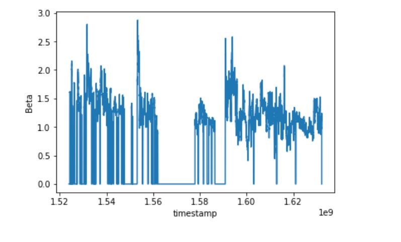

# G-Research Crypto Forecasting 轻量深读（Tier B）

> 赛事：Featured ｜ 主题 tabular（tabular-ts，金融）｜ 1946 队 ｜ 标准赛 ｜ 指标：Weighted Correlation Coefficient（残差收益）
> 材料基础：`digests/g-research-crypto-forecasting.md`（8 篇正文：13th/前 6 周第 1 313386 / 2nd 323098 / 3rd 323703 / 7th 323250 / 初始思路 284903 / 额外数据 285726 / 指标帖 286778 / Jane Street 迁移 286676；120 条主题索引）+ 3 张图
> 轻读时间：2026-10（Tier B B04）

## 1. 一句话重述与数字账

预测 14 种加密货币 15 分钟残差收益（加权相关，按时间滚动更新 6 次）。真正的考点是**滚动评测下的稳健 CV 与不泄漏 + 目标工程（残差/beta 分解）+ 概率性名次管理**。

| 关键数字 | 值 | 来源 |
| --- | --- | --- |
| 2nd（87 票） | 极简：LightGBM 平方损失、无集成/无正则/无增广；**6 折 walk-forward 分组 CV（group=timestamp；折长 40 周、步进 20 周、train/test 间留 1 周 gap）**；用 Numba 加速特征；只改 n_estimators/leaves/lr；**只提交 2 次**；用"低分大师/宗师分数平台（≈0.08）"解读被 probing/过拟合抬高的公榜；16GB/9h 内核限制下修内存拷贝（df.update 陷阱）；25 分钟训练+10 分钟推断 | 2nd |
| 13th（最终，前 6 周第 1，91 票） | 17 特征（8 滞后 EMA/收益/波动 + 时间戳均值 + asset_id）；LGBM+Keras NN 集成；**目标分解**：TargetZero=15 分钟前向收益、TargetBeta=Zero+beta 分量；观测缺失时 beta 自动为 0（图 1）→ 用"是否缺失"在 3750 个时间戳窗口内切换两套模型预测；该工程 **+0.01**（原测试期）；外部交易所数据（XRP/ZEC）小幅增益 | 13th |
| 3rd/7th/Jane Street 迁移帖 | 323703 / 323250 / 286676 | 材料 |
| 事件 | 公榜 probing/过拟合严重；社区要求赛后公开测试数据以验证分数；6 次滚动更新导致排名大洗牌 | 2nd/13th |

## 2. 逐方案对照矩阵

| 维度 | 2nd | 13th |
| --- | --- | --- |
| 模型 | 单 LGBM（无集成） | LGBM+NN 集成 |
| 特征 | 重要性驱动的自定义特征（不公开） | 17 特征 |
| 目标 | 原始 target | 目标拆分为 Zero/Beta 双模型 + 切换 |
| CV | 6 折重叠 walk-forward + 1 周 gap | 多时段测试 |
| 公榜态度 | 只提交 2 次、用低分大师平台校准 | 关注 beta=0 与缺失模式 |
| 特征工程速度 | Numba | binning（500–1000 值） |
| 结果 | 2nd | 13th（前 6 周 1st） |

## 3. 共识、分歧与裁决

### 共识一：滚动评测的 CV 必须 walk-forward + 分组 + 留 gap（2nd 明说）

2nd 的 6 折重叠设计（40 周折长/20 周步进/1 周 gap）同时兼顾"多折低方差"与"长折接近全量"；无 gap 会让模型在测试期开头"作弊"。**裁决**：时序金融赛的 CV 设计是决策基础；重叠长折是方差/数据量的帕累托解。置信度：高。

### 共识二：公榜被 probing/过拟合污染，需要"外部锚"（2nd）

2nd 不看公榜做优化，只用"低分大师/宗师的分数平台 ≈0.08"来定位真实水平；13th 也呼吁赛后公开测试数据核验。**裁决**：滚动金融榜=高噪声；用"可信选手的保守分数"或自建 CV 作锚，不追公榜。置信度：高。

### 共识三：目标工程（残差/beta 分解）是核心增益（13th +0.01）

官方的 target 在"资产缺失"时会从"15 分钟前向收益"切换到"相对全市场（beta）"，二者语义不同；13th 用双目标/双模型+按缺失窗口切换。**裁决**：先彻底理解目标的计算口径（尤其缺失/停牌等分支），再建模。置信度：高。

### 分歧一：集成与正则

2nd：无集成/无正则也能第 2（靠特征与 CV）；13th：LGBM+NN 集成。**裁决**：特征与目标工程到位后，简单单模已足够；集成是边际优化。置信度：中高。

### 分歧二：外部数据

2nd 未提；13th 用交易所额外货币（非竞赛资产）小幅增益；社区有自动更新市场数据帖（117 票）。**裁决**：额外市场数据可用，但增益有限且需对齐时间戳/防泄漏。置信度：中。

### 事件：名次过山车

13th 前 6 周第 1 最终 13th（"rollercoaster"）；2nd 估计自己在第 7 次更新有 75% 概率让出第 1。**裁决**：该赛制的最终名次含有巨大抽样噪声；以"长期在多时段稳健"而非"单次榜首"为目标。置信度：高（当事人自述）。

## 4. 证据分级

| 断言 | 等级 | 说明 |
| --- | --- | --- |
| 2nd 的 CV 设计/公榜解读/资源约束 | 自述（细节具体） | 中高 |
| 13th 的目标分解 +0.01 | 自述 + 图 + notebook | 中高 |
| 公榜 probing 现象 | 多队/社区讨论 | 高（现象） |
| 外部数据小幅增益 | 单队 | 中 |
| Jane Street 迁移 | 单独帖 | 中 |

## 5. 悬案与缺口（登记）

- 3rd/7th 未细读；"Initial thoughts"（294 票）与"Eval Metric/Target/Weights"（286778，111 票）未入库；"Elon Musk tweets"外数据争议（85 票）未细读。
- 官方是否公开测试数据/如何处理 LB 有效性质疑无记录。
- 2nd 拒绝公开特征（担心被 host 用于实盘获利），因此其"特征重要性驱动"细节不可复核。

## 6. 图表证据

**图 1**（topic 313386）：Beta 分量随时间序列大幅波动并在资产缺失时归零——**"官方 target 会在两种语义间切换"的直接证据**（双模型切换的依据）。

## 7. 出处

- 13th/前 6 周第 1（91 票）：https://www.kaggle.com/competitions/g-research-crypto-forecasting/discussion/313386
- 2nd（87 票）：https://www.kaggle.com/competitions/g-research-crypto-forecasting/discussion/323098
- 3rd（323703）：https://www.kaggle.com/competitions/g-research-crypto-forecasting/discussion/323703
- 7th（323250）：https://www.kaggle.com/competitions/g-research-crypto-forecasting/discussion/323250
- 初始思路（294 票）：https://www.kaggle.com/competitions/g-research-crypto-forecasting/discussion/284903
- 额外数据（117 票）：https://www.kaggle.com/competitions/g-research-crypto-forecasting/discussion/285726
- Jane Street 迁移（286676）：https://www.kaggle.com/competitions/g-research-crypto-forecasting/discussion/286676
