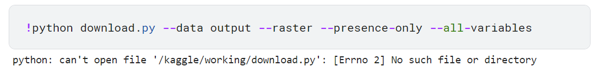

# GeoLifeCLEF 2024 轻量深读（Tier B）

> 赛事：Research（标准赛）｜ 主题 cv（遥感 + 环境栅格 → 物种分布）｜ 51 队 ｜ 指标 F-Score Beta (Micro) ｜ 截止 2024-05-24
> 材料基础：`digests/geolifeclef-2024.md`（6 篇正文：working note 邀请 506431 / 新手门槛吐槽 481283 / Discord 规则 480782 / 论文推荐 480732 / ClimateClef 数据 481485 / FGVC11 其他赛 486162；21 条主题索引）+ 1 张归档图
> 轻读时间：2026-10（Tier B B21）

## 1. 一句话重述与数字账

GeoLifeCLEF 2024：用**卫星时序 + 气候/环境栅格 + 图像**预测物种分布（F-Score Beta Micro），属于 FGVC11 + LifeCLEF（CVPR/CLEF）研究赛。材料的两条主线非常清晰：① **研究赛的第二交付物是 working note**——6/7 截稿、6/21 通知、7/8 camera-ready，收入 CEUR-WS，优秀者进 LNCS 并获会议注册费；② **数据获取是最大门槛**——原始栅格在 Seafile，官方 `download.py` 让新手卡住，`GLC.plotting` 在 Kaggle 环境不可用，社区因此自行打包上传 **ClimateClef** 气候栅格数据。

| 关键数字 | 值 | 来源 |
| --- | --- | --- |
| 规模与定位 | **51 队**；F-Score Beta (Micro)；官方称 LB **>0.4** 已是显著成绩；FGVC11（CVPR）+ LifeCLEF（CLEF）联合研究赛 | 506431 |
| working note 时间线 | 竞赛 5/24 截止 → **6/7 论文截稿** → 6/21 录取通知 → 7/8 camera-ready；CEUR-WS 出版，择优进 Springer LNCS，最佳论文获 CLEF 注册费 | 506431 |
| 数据访问 | PA 数据在 Kaggle；**原始栅格在 Seafile**，需分组下载 zip；官方建议 `python download.py --data output --raster --presence-only --all-variables` | 481283 |
| 社区补丁 | 选手自行上传 **ClimateClef**（气候环境栅格 zip）到 Kaggle 并给 Seafile 链接（20 票）；另有"图表/数据关系"等多帖答疑 | 481485 |
| 新手门槛（20 票） | `download.py` 语法错误/文件不存在；`GLC.plotting` 模块在 Kaggle 无法安装；首次加载数据 10 分钟；最后只画出 2 张欧洲植物分布图——作者呼吁研究赛更友好 | 481283 |
| 方法线索 | 推荐卫星图像分类综述与湿地物种多样性遥感论文；社区讨论"用 Transformer 融合多模态信息"；Landsat 时序、卫星 patch、PA/PO 关系、cube 维度等问题 | 480732 / 500432 / 497807 / 482176 |
| 周边 | FGVC11 其他 Kaggle 赛（数据格式相近，可多赛复用）；官方 Discord；CLEF 2025 是否会继续（9 评论） | 486162 / 480782 / 561689 |

## 2. 逐方案对照矩阵

| 维度 | 官方路线 | 社区补丁路线 | 新手实际体验 |
| --- | --- | --- | --- |
| 数据 | Kaggle PA + Seafile 栅格 | ClimateClef 打包上传 | 下载/模块报错 |
| 方法 | 多模态（图像 + 遥感 + 气候） | 论文与 Transformer 融合探索 | 先能画图 |
| 交付 | 预测 + working note | notebook 分享 | 卡在环境 |

## 3. 共识、分歧与裁决

### 共识一：研究赛的完成标准包含"可复现论文"（506431；置信度高）

官方明确要求 working note 提供足够复现最终 run 的信息，并有严格时间线（6/7 → 7/8）。**裁决**：从第一天就维护实验日志与数据版本；把论文写作排进赛程而不是赛后补。置信度：高。

### 事件一：数据获取/工具链是本届最大门槛（481283 / 481485；置信度中高）

Seafile 下载脚本对新手不友好、GLC 模块不可用、加载耗时；社区用 ClimateClef 直接绕开。**裁决**：优先用社区打包数据；下载流程写成脚本 + 校验和；提前在 Kaggle 环境验证依赖。置信度：中高。

### 共识二：多模态融合（图像 + 遥感时序 + 环境栅格）是主线（480732 / 500432 / 497807 / 499314；置信度中）

官方与社区都在讨论 satellite/Landsat/Transformer 融合。**裁决**：先复现单模态基线（图像分类 / 遥感特征），再用 Transformer 或双塔融合作增量；注意时间对齐（Landsat 时序）。置信度：中。

### 事件二：低参赛量 + 数据复杂度 = 环境与文献成本高于建模（481283 / 506431；置信度中）

51 队、研究赛属性；官方感谢"超过 0.4"的少数队伍。**裁决**：评估投入产出：如果目标是论文与会议，值得；如果只冲榜，先看数据获取成本。置信度：中。

### 事件三：排名/作者归属等研究赛规则要提前问（507399 / 486171；置信度中）

最终报告与排名、credit 归属被专帖询问。**裁决**：赛前确认作者顺序、团队注册与报告要求，避免赛后争议。置信度：中。

## 4. 证据分级

| 断言 | 等级 | 说明 |
| --- | --- | --- |
| working note 时间线与出版路径 | 官方帖（506431） | 高 |
| 数据访问方式与下载脚本 | 官方数据页引用（481283） | 高（存在问题） |
| ClimateClef 社区数据 | 资源帖 + 链接（481485） | 中高 |
| 新手门槛 | 高票吐槽帖（481283） | 中高（个人经历） |
| 方法文献线索 | 社区推荐（480732 / 500432） | 中 |
| FGVC11 赛群 | 官方帖（486162） | 高 |

## 5. 悬案与缺口（登记）

- 本赛 1st–10th 方案未归档（官方邀请所有参赛者写 working note，但 Kaggle 侧只有邀请帖）；
- 最终排名与获奖名单未归档；
- 数据下载脚本问题是否有官方修复未归档；
- CLEF 2025 是否续办未定（561689）；
- **图证缺口**：无（1 张图，已内嵌；仅为报错截图）。

## 6. 图表证据

**图**（topic 481283）：新手按官方命令运行 `!python download.py --data output --raster --presence-only --all-variables`，得到 `python: can't open file '/kaggle/working/download.py': [Errno 2] No such file or directory`——数据下载脚本是本届最典型的卡点，也是社区打包 ClimateClef 的直接原因。

## 7. 出处

- working note 邀请（8 票 / 4 评论）：https://www.kaggle.com/competitions/geolifeclef-2024/discussion/506431
- 新手门槛吐槽（20 票 / 3 评论）：https://www.kaggle.com/competitions/geolifeclef-2024/discussion/481283
- ClimateClef 数据集（20 票 / 4 评论）：https://www.kaggle.com/competitions/geolifeclef-2024/discussion/481485
- Discord 规则（7 票 / 0 评论）：https://www.kaggle.com/competitions/geolifeclef-2024/discussion/480782
- 论文推荐（4 票 / 3 评论）：https://www.kaggle.com/competitions/geolifeclef-2024/discussion/480732
- FGVC11 赛群（5 票 / 0 评论）：https://www.kaggle.com/competitions/geolifeclef-2024/discussion/486162
- 报告与排名问题（2 票 / 5 评论）：https://www.kaggle.com/competitions/geolifeclef-2024/discussion/507399
