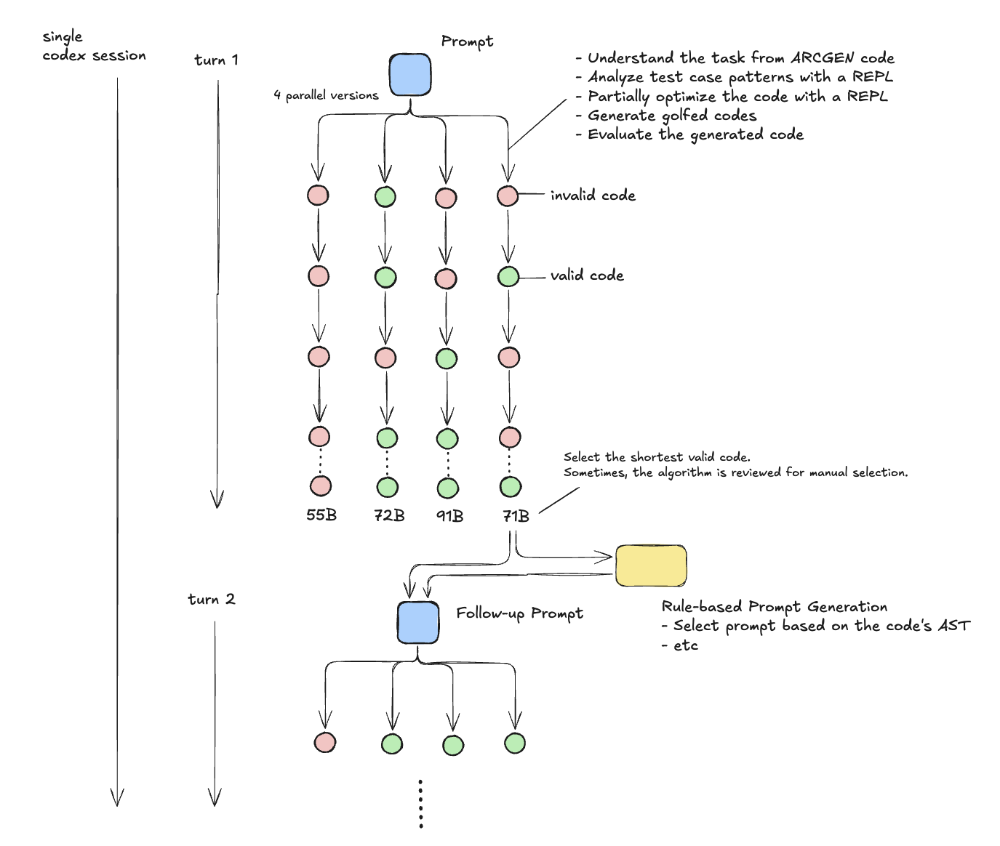

# Google Code Golf Championship 2025 轻量深读（Tier B）

> 赛事：Research ｜ 主题 sim-agent（LLM agent + 代码高尔夫）｜ 1142 队 ｜ 标准赛 ｜ 指标：Code Golf Metric（400 道 ARC 题的字节数得分）
> 材料基础：`digests/google-code-golf-2025.md`（6 篇正文：4th 614124 / 5th 614225 / 8th 615039 / 解决方案链接 613968 / 单题分数共享 596679 / 最后三天 613583；80 条主题索引）+ 21 张图
> 轻读时间：2026-10（Tier B B07）

## 1. 一句话重述与数字账

用**最短的 Python 源码**解 400 道 ARC-AGI 任务（按字节数计分）。真正的考点是**"agent 流水线 + 压缩/语言特性套利"**：有人把 98% 的产出交给 LLM（并行采样 + AST 规则提示），有人手写高尔夫并自研比 Zopfli 更强的压缩器，还有人两者混用。

| 关键数字 | 值 | 来源 |
| --- | --- | --- |
| 4th（614124） | **98% 由 LLM 生成**（作者自述"看不懂最终代码"）；流程：gpt5-codex 单会话 10–30 轮、每轮 **N=4 并行生成 → 评估 → 取最短有效**；**基于 AST 的规则化跟进提示**（没用 regex 就提示用 `re`；有循环就提示改递归；`def` 改 `lambda`）；无改进 s 轮即停、t 轮无改进则提示"更探索"；主要用 **Codex Cloud**（约 15 个会话并行，ChatGPT Pro 限额内）；**codex exec CLI + Docker 沙箱 + SQLite 日志**；为逃离局部最优**每次开全新空沙箱**；最后两周让 LLM 优化"**压缩友好代码**"（按 zip/zopfli 后体积评分）→ Task 324 的钻石级解法；提示语 "Shorter code is known to exist" | 614124 |
| 5th（614225） | 90% 硬磨 + 9% 工具 + 1% 奇技；**自研压缩器强于 Zopfli（相对原生 zlib +700 分）**；用 `#coding:L1`（latin-1）承载任意字节 + `zlib.decompress(code,-15)` 原始 deflate；深入 deflate 内部（Huffman 树 RLE）→ 代码级优化：**重复片段、避免大写字母、tab 缩进、单引号、循环展开**；自建 deflate 可视化工具；代表解：task111 62 字节（`iter(l.pop, n)`）、task270 115 字节（regex 条件组 `(?(id)yes|no)`）；还做了 seed cracking | 614225 |
| 8th（615039） | 纯手工作业："没有秘密技巧，只有许多小洞察的累加"；代表性技巧：**递归模板** `p=lambda g,i=67:-i*g or p(...,i-1)`、细胞自动机式 flood fill、`pysearch`（lynn 的工具）、循环替代递归的短模板、**边遍历边 `pop()` 变异**（配合 `g*1` 浅拷贝）、`a*0==0` 判断"数字 vs 行"、**把 4 层循环压成 1 层 + 位运算**（8=2³，用 `t&7`/`t>>3` 代替 `%`//`//`）；公开 GitHub 全套 | 615039 |
| 社区侧 | "Getting to Rank 25 by Teaching LLMs to Golf"（34 票）；"Solutions By Hand vs By LLM"（24 票）——两派路线之争；"ARC Starter Solutions - All 400 Tasks"（20 票）；漏洞报告帖（"发现 960K+ 的方法"，18 票）；"400 题本地全过、提交时 1 题失败"（19 票）；"最后 3 天能否暂停公布解法"（31 票，社区协作伦理讨论） | 社区 |
| 交叉引用 | NeuroGolf 2026 的 9th 明确说其"系统优先"的调度器**灵感来自本场第 4 名的 Parallel Sampling + Rule-based Prompt Generation**（见 `analysis/deep/neurogolf-2026.md`） | 726653 |

## 2. 逐方案对照矩阵

| 维度 | 4th（agent 派） | 5th（压缩派） | 8th（手工派） |
| --- | --- | --- | --- |
| 生成方式 | LLM 并行采样 + AST 规则提示 | 手工 + 压缩工具链 | 全手工 |
| 核心杠杆 | 吞吐（15 会话 × 4 并行）+ 提示策略 | **压缩器**（>Zopfli，+700 分） | 语言特性/模板洞察 |
| 探索机制 | 空沙箱重启、探索提示 | seed cracking | pysearch + 人脑 |
| 代表成果 | Task 324 压缩友好解 | task111/270 极小解 | 递归/位运算模板库 |

## 3. 共识、分歧与裁决

### 共识一：LLM 能覆盖大部分工作量，但"最后一公里"仍需人（4th/8th + 社区）

4th 98% 由 LLM 生成，但 2% 的人类洞察（压缩友好、正则转向）贡献关键突破；8th 明确"LLM 不足以进入顶区"；社区有 "By Hand vs By LLM" 之争。**裁决**：agent 负责吞吐与搜索，人类负责"改变搜索空间"的元策略（如换压缩目标）。置信度：高。

### 共识二：并行采样 + 机械验证 + 最短选择是标准骨架（4th，并被 NeuroGolf 9th 复用）

每轮 N 份候选 → 本地验证 → 只保留最短有效 → 反馈下一轮。**裁决**：这是"独立小任务 × 机械化验证"赛制的通用范式，可直接迁移到模型/代码优化赛。置信度：高（跨赛复用已验证）。

### 共识三：压缩/编码层面的套利收益巨大（5th）

自研压缩器 +700 分；`#coding:L1` + raw deflate 省字节；Huffman RLE 认知直接影响源码写法（少大写、tab 缩进、单引号）。**裁决**：计分若含"代码体积"，压缩器与编码细节是独立的一等赛道，值得单独立项。置信度：高。

### 分歧一：手写 vs LLM

8th 全手工获第 8；4th 近乎全 LLM 获第 4；5th 人机混合获第 5。**裁决**：两种路线都能进前列，但都需要一个"可验证的快速迭代环"；纯手写依赖个人技巧沉淀，纯 LLM 依赖流水线与提示策略。置信度：中高。

### 事件：漏洞与社区伦理（18 票漏洞帖 + 31 票暂停公布帖）

有人发现可刷到 960K+ 的漏洞并上报；社区讨论"最后三天暂停公开解法"以维护竞争公平。**裁决**：这类赛制要提前定义漏洞披露与解法共享规则；agent 时代的比赛治理与建模同等重要。置信度：中（现象）。

## 4. 证据分级

| 断言 | 等级 | 说明 |
| --- | --- | --- |
| 4th 的流水线、提示规则与压缩友好策略 | 自述 + 流程图 + 公开代码 | 高 |
| 5th 的压缩器 +700 分与 deflate 细节 | 自述 + 工具/代码 | 中高 |
| 8th 的模板技巧与公开仓库 | 自述 + 代码 | 高 |
| NeuroGolf 9th 对本场的引用 | 跨帖引用 | 高 |
| 社区伦理/漏洞 | 论坛帖 | 中 |

## 5. 悬案与缺口（登记）

- **1st（"Code Golf International"，614092）与 2nd（618673）的方案未入库**——本场最高名次的方法细节缺失；
- 3rd/6th/7th 未细读；"Getting to Rank 25 by Teaching LLMs to Golf"（34 票）未细读；
- 5th 的 seed cracking 具体机制未在材料中展开；
- 归档 21 图：4th 的并行采样流程图（图 1）、5th 的 deflate 可视化、8th 的任务动画为核心图证（GIF 建议跳转查看）。

## 6. 图表证据

**图 1**（topic 614124）：单会话多轮循环——每轮 Prompt → **4 份并行生成**（红=无效、绿=有效）→ 取最短有效码（55B/72B/91B/71B 中选 71B）→ **基于 AST 的规则化跟进提示** → 下一轮；展示了"并行采样 + 机械验证 + 最短选择"的完整闭环。

## 7. 出处

- 4th（Parallel Sampling + Rule-based Prompt Generation）：https://www.kaggle.com/competitions/google-code-golf-2025/discussion/614124
- 5th（Better Compression Algorithm and Seed Cracking，27 票）：https://www.kaggle.com/competitions/google-code-golf-2025/discussion/614225
- 8th（import itertools，36 票）：https://www.kaggle.com/competitions/google-code-golf-2025/discussion/615039
- 解决方案链接（41 票）：https://www.kaggle.com/competitions/google-code-golf-2025/discussion/613968
- 单题分数共享（44 票）：https://www.kaggle.com/competitions/google-code-golf-2025/discussion/596679
- 最后三天（31 票）：https://www.kaggle.com/competitions/google-code-golf-2025/discussion/613583
- 1st（未入库，待补）：https://www.kaggle.com/competitions/google-code-golf-2025/discussion/614092
