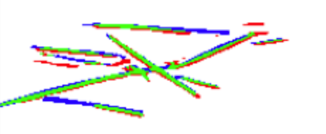
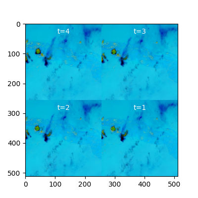
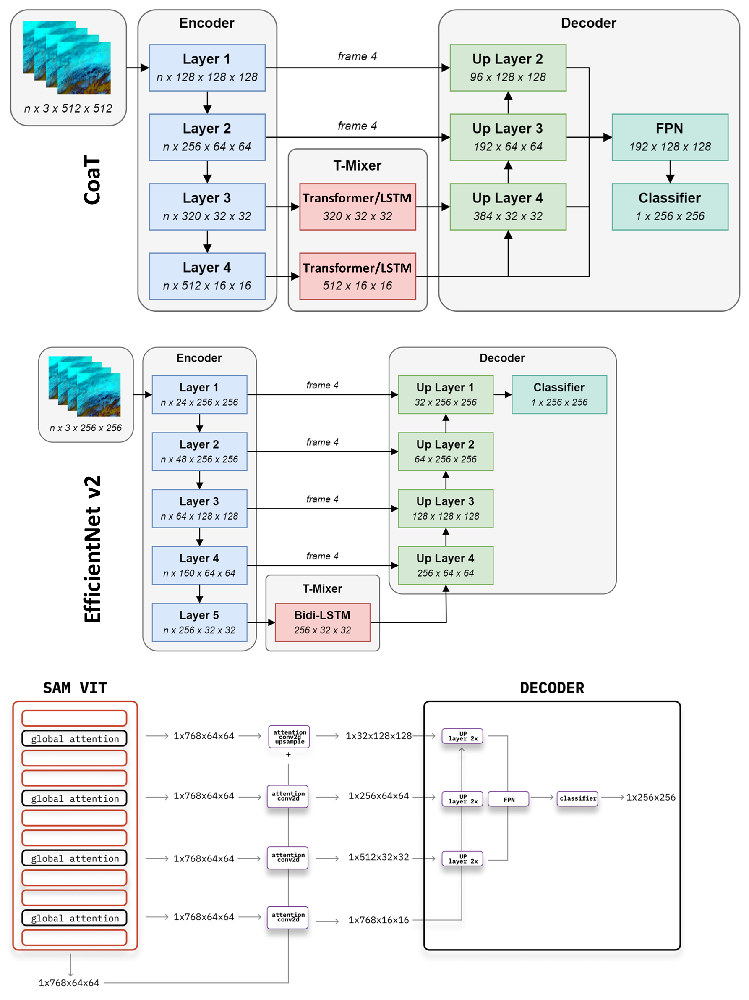

# Google Research - Identify Contrails 轻量深读（Tier B）

> 赛事：Research ｜ 主题 cv（遥感分割）｜ 954 队 ｜ 代码赛 ｜ 指标：contrails_global_dice
> 材料基础：`digests/google-research-identify-contrails-reduce-global-warming.md`（6 篇正文：1st 430618 / 2nd 430491 / 3rd 430685 / 5th 430549 / 9th 430479 / 失败实验帖 414344；80 条主题索引）+ 7 张图
> 轻读时间：2026-10（Tier B B05）

## 1. 一句话重述与数字账

在卫星红外假彩图上分割凝结尾迹（contrails），类像素占比 ~0.18%，细线状（数像素宽）→ **像素级精度 + 噪声标注 + 硬标签评测**三重叠加。真正的考点是**标签错位（0.5 像素平移）这个数据缺陷**：识别它的队伍解锁了 flip/rot90 增强与 TTA（+0.005~0.01），没识别的队伍被它锁死。

| 关键数字 | 值 | 来源 |
| --- | --- | --- |
| 1st（430618） | U-Net + MaxViT-Tiny 编码器；**发现标签相对影像向右下偏移 0.5 像素**（用"旋转 180° 后预测出现蓝-绿-红条纹"诊断）；解法：训练**对称化标签 y_sym**（512² 双线性重采样）+ 5×5 stride-2 小卷积学 y_sym→y，推理端 8 模式 TTA（+0.006）；有增强可训 40–50 epoch（无增强仅 10–20）；两模型加权（阈值 ~0.45）：单时刻 t=4（1024²）与四时刻拼图（t=1–4 拼成 1024²，只把 H/2 四分之一喂解码器）。分数：单时 512 0.712 / 单时 1024 0.716 / 4 拼 0.722 / **集成 0.724 priv**（CV 0.706, pub 0.725） | 1st |
| 2nd（430491，111 票） | 软标签（标注者平均）+ **输入上采样 ×2/×4 与像素重排（pixel shuffle）解码**（细线任务的关键）；底座 CoaT（最佳单模 **0.7039 CV / 0.71790 priv**）/ NeXtViT / SAM-B / EffNetV2-s；**时序混合放在低分辨率特征图（res/32、res/16）**（云位移 10–30px，3D 卷积/VideoSwin 不可用），LSTM 最佳、多帧 +0.01；损失 BCE+dice-Lovasz（**放宽阈值最优区间**→减少私榜抖动）；PL（外采 GOES16）提升单模但降低集成多样性；**标准 K 折因瓦片空间重叠会高估 CV**，改用整训练集多 seed + 官方验证。8 模型集成 0.72574 pub / 0.72304 priv | 2nd |
| 3rd（430685） | 2.5D U-Net：把多帧塞进 batch 维跑 2D 底座，**3D 卷积插在 skip connection 各层级**（+0.02，优于只在 U-Net 末端加 3D）；小比例 flip/rot90 仍有小增益；伪标签按 0.25 离散化后预训练+原数据微调；**百分位阈值**（最优≈正像素比 0.16%）；dice 的启发式平滑（分子 +700000/分母 +1000000）；18 模型集成 priv 0.72233；最佳单模 maxvit_large 0.71629 pub——**因最后一天加入全量 flip/TTA 版本，与第 2 名只差 0.00001** | 3rd |
| 5th（430549） | EffNetV2L + 自研 3D U-Net（每帧同编码器、各层级 Conv3D 融合、UNet 解码）；双目标（1 通道 sigmoid 75% + 5 通道 softmax 按标注者比例 25%）；Lion 优化器；**自己标定出 x=0.408, y=0.453 的错位量**后 TTA8 可用（+0.005~0.01）；最佳单模 priv 0.71443 | 5th |
| 9th（430479，76 票） | 独立推断出错位来源：**多边形转掩码时最左点未计入、最右点计入**；给出两种修法：①训练用"一致翻转"的掩码 ②**影像整体平移 0.5 像素**（warpAffine 矩阵含 1.5 偏移，需标定）；选方案② | 9th |
| 失败实验帖（414344，112 票） | 早期"所有增强都掉分"、2.5D 掉分、MiT/SegFormer/DeepLab 更差、BCE+dice 组合无增益、辅助分类头失败；但"更大底座 + 更大分辨率 + 伪标签 + 阈值"把 0.61 → 0.67+；CV/LB 在后期失联 | 414344 |

## 2. 逐方案对照矩阵

| 维度 | 1st | 2nd | 3rd | 5th | 9th |
| --- | --- | --- | --- | --- | --- |
| 错位处理 | y_sym + 小卷积映射 | 不用 flip/rot90（赛后才发现） | 小比例使用 | **自标定偏移量** | 图像平移 0.5px |
| 主干 | MaxViT-Tiny + U-Net | CoaT/NeXtViT/SAM/EffNetV2 | 多种（maxvit_large 最佳单模） | EffNetV2L + 3D U-Net | U-Net（强底座） |
| 时序 | 4 帧拼图（空间拼接） | **低分辨率特征 LSTM/Transformer 混合** | 3D 卷积进 skip | Conv3D per level（可换 ConvLSTM2D） | 不做 |
| 标签 | soft + y_sym | soft（标注者平均） | 平均掩码 + 离散伪标签 | 双目标（软 + 标注者分布） | 个体标注全用 |
| 阈值 | ~0.45（验证调） | 0.46–0.50（lovasz 让阈值更宽） | **百分位（≈正像素比）** | 后处理阈值 | — |
| priv | **0.724** | 0.72304 | 0.72305（差 0.00001 屈居第 3） | 0.71443（最佳单模） | — |

## 3. 共识、分歧与裁决

### 共识一：0.5 像素错位是本场的"元问题"（1st/5th/9th 独立发现）

早期所有人都观察到"flip/rot90 一用就掉分"（414344 甚至说"所有增强都无效"）；1st 用旋转后的条纹诊断出标签右下偏移；5th 标定到 x=0.408/y=0.453；9th 从多边形转掩码的边界规则解释成因。**裁决**：数据缺陷无法从统计直觉推得，必须做"单点失效实验 + 可视化诊断"；发现后增强/TTA 变成免费增益（+0.005~0.01，3rd 靠它多活了 18 模型集成）。置信度：高（三方独立 + 图证）。

### 共识二：细线分割必须提升"有效像素分辨率"（1st/2nd/3rd/5th）

1st 直接把输入升到 1024²（0.712→0.716）；2nd 用输入上采样 ×2/×4 + pixel shuffle 解码（"substantial boost"）；5th 用大分辨率 + 大底座；3rd 加大解码器通道。**裁决**：对细结构，分辨率与解码器上采样方式比换更深的网络更有效。置信度：高。

### 共识三：阈值选择影响不亚于模型（全队）

1st 阈值 0.45 用验证调；2nd 的 dice-Lovasz 让阈值最优区间变宽（抗震）；3rd 用**百分位阈值**（≈0.16% 正像素比）；5th 后处理阈值重要。**裁决**：F1/Dice 型指标下阈值是把概率图变集合的关键参数，选择方法要抗分布漂移（百分位/宽最优区间）。置信度：高。

### 共识四：时序信息只在低分辨率/浅层有效（1st/2nd/3rd/5th）

2nd 明确 3D 卷积与 VideoSwin 无效（云位移 10–30px），只有 res/32、res/16 的特征混合有效（LSTM 最佳，多帧 +0.01）；3rd 的 3D 卷积插在 skip 各层（+0.02）；1st 的 3D/ConvLSTM 完全训不起来、改用 2×2 拼图；5th 用 Conv3D 逐层融合。**裁决**：帧间配准不可行时，把时序融合"降分辨率/后置"是对齐误差与信息量之间的折中。置信度：中高。

### 分歧：伪标签（PL）

3rd 用 PL 预训练 + 原数据微调，是 18 模型集成的组成部分；2nd 发现 PL 提升单模但**降低集成多样性**，平均后收益消失；1st 早停 PL（5 折平均后收益不显著）；5th/9th 未大规模使用。**裁决**：PL 在单模上"看起来很强"，但在集成层面常被同质化抵消；要不要用取决于最终提交形态。置信度：中高。

### 事件：验证设计（2nd 的警告）

2nd 指出标准 K 折因训练瓦片空间重叠而**高估 CV**，改为"整训练集多 seed + 官方验证集评估"；3rd 在后期也只信全量训练的验证分；414344 观察到 CV/LB 后期失联。**裁决**：瓦片/空间重叠的数据必须按空间分组验证，否则选择会被系统性误导。置信度：高。

## 4. 证据分级

| 断言 | 等级 | 说明 |
| --- | --- | --- |
| 0.5 像素错位（诊断过程 + 修法） | 自述 + 图 + 三方独立复现 + 公开代码 | 高 |
| 1st 的各模型分数表与 TTA +0.006 | 自述 + 表 + notebook | 高 |
| 2nd 的时序融合位置结论（LSTM 最佳等） | 自述 + 架构图 + 分数表 | 高 |
| 3rd 的 3D 卷积插 skip +0.02 | 自述 + 伪代码 | 中高 |
| 5th 的偏移量 x=0.408/y=0.453 | 自述（与 1st/9th 互证） | 高（现象）/中（具体数值） |
| PL 的集成层面无效 | 2nd/1st 独立自述 | 中高 |

## 5. 悬案与缺口（登记）

- 4th/6th–8th 方案未入库；
- "Single Model CV-LB Thread"（413153，47 票）、"One month to go 总结"（420629，110 票）两条高票线未细读；
- 3rd 提到的"最后一天全量 flip+TTA 版本导致私榜掉分"只有一句解释（像素错位或波动），无法进一步验证；
- 归档图 7 张中 4 张为方法图（1st 的错位诊断/拼图、2nd 的架构、5th 的 3D U-Net）。

## 6. 图表证据

**图 1**（topic 430618）：把无增强模型对 180° 旋转输入的预测与原标签对比——沿凝结尾迹出现"蓝（FN）-绿（TP）-红（FP）"三色条纹，证明**标签相对影像向下偏移**；左右方向同理。这是"增强为什么失效"的关键诊断图。

**图 2**（topic 430618）：1st 的 4-panel 输入——把 t=1…4 的 512² 帧拼成一张 1024² 图（自注意力跨面板）；只有 t=4 的 H/2 特征进解码器。用于在"3D 卷积/ConvLSTM 训不起来"时仍然利用时序。

**图 3**（topic 430491）：2nd 的三种架构——CoaT（T-Mixer 插在 res/32、res/16）、EffNetV2 + Bidi-LSTM、SAM ViT；标注 "frame 4" 的跳连显示解码器只吃被预测帧，时序只在低分辨率混合。

## 7. 出处

- 1st（430618）：https://www.kaggle.com/competitions/google-research-identify-contrails-reduce-global-warming/discussion/430618
- 2nd（111 票）：https://www.kaggle.com/competitions/google-research-identify-contrails-reduce-global-warming/discussion/430491
- 3rd（48 票）：https://www.kaggle.com/competitions/google-research-identify-contrails-reduce-global-warming/discussion/430685
- 5th（41 票）：https://www.kaggle.com/competitions/google-research-identify-contrails-reduce-global-warming/discussion/430549
- 9th（76 票）：https://www.kaggle.com/competitions/google-research-identify-contrails-reduce-global-warming/discussion/430479
- 失败实验帖（112 票）：https://www.kaggle.com/competitions/google-research-identify-contrails-reduce-global-warming/discussion/414344
- 单模 CV-LB 线程（47 票）：https://www.kaggle.com/competitions/google-research-identify-contrails-reduce-global-warming/discussion/413153
