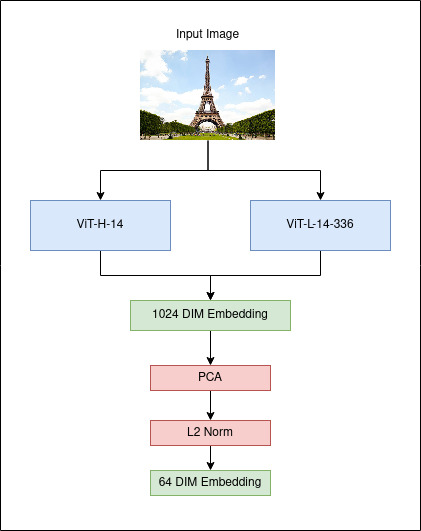

# Google Universal Image Embedding 轻量深读（Tier B）

> 赛事：Research ｜ 主题 cv（通用图像嵌入，检索）｜ 1022 队 ｜ 代码赛 ｜ 指标：检索型度量（PostProcessorKernelDesc）｜ **不提供训练数据**
> 材料基础：`digests/google-universal-image-embedding.md`（6 篇正文：1st 359316 / 2nd 359525 / 4th 359487 / 5th 359161 / 10th 635 行处 / 数据集帖 715 行处；80 条主题索引）+ 6 张图
> 轻读时间：2026-10（Tier B B09）

## 1. 一句话重述与数字账

训练一个**通用 64 维图像嵌入**并在隐藏检索基准上评测，**主办方不提供任何训练数据**——所有队伍必须自己找数据（且受商用许可约束，后来放宽为"论坛提到的公开数据集即可"）。真正的考点是"**预训练权重选择 + 数据组合 + 头部/骨干的训练顺序 + 嵌入空间对齐式集成**"。

| 关键数字 | 值 | 来源 |
| --- | --- | --- |
| 1st（359316） | 完整时间线：① **预训练权重**——ImageNet-22K 权重 0.405；CLIP ViT-L 在 **LAION-400M 31ep 上 0.499**（试遍可用权重）；发现"只取嵌入向量的一部分算均值"可 **+0.010**（"平均太多值会让真实特征被稀释"），随机投影对弱权重有用、对强权重有害；② **训练**：GLDv2-clean + 线性头 + **ArcFace（m=0.5, s=30）**仅 6 epoch → 0.560；③ **迭代加数据**（Products-10k、Shopee、MET、Alibaba goods、H&M、GPR1200、GLDv2-Full、DeepFashion）→ 0.610（再加 epoch 无益）；④ **解冻骨干但用 10× 低学习率、只训 3 epoch，并冻结最后一层 FC**——作者从"线性投影权重 F(C, X) 的剧烈抖动反映类中心几何被破坏"推断这是过拟合根源；FC 加 dropout → **0.650–0.660**；⑤ 单独在 Products-10k 上精调 → **0.671**；⑥ **集成**：朴素集成无效（不同模型的类中心几何 F(C,X) 不同），两条解法：(a) model-soup 式（同 F(C,X)、不同超参/分辨率）224+280 → **0.680**；(b) **用一个线性变换对齐不同模型的 F(C,X) 空间**，从而集成差异更大的模型（更优） | 359316 |
| 2nd（359525） | 数据派：用了 **14 个数据集**（Aliproducts、Art_MET、DeepFashion、DeepFashion2(hard-triplets)、Fashion200K、LargeFineFoodAI、Food Recognition 2022、JD_Products_10K、Landmark2021、Grocery Store、rp2k、Shopee、Stanford_Cars、Stanford_Products），"量大但没做多少筛选"；骨干 **ViT-H/14-224**（open_clip），neck = fc + dropout 0.2 | 359525 |
| 4th（359487） | **两个 CLIP 模型的集成 + model soup**：共训 9 个模型（4×ViT-L-14-336 + 5×ViT-H-14），权重平均成 2 个"汤"；各出 512 维描述子 → **拼接成 1024 维 → PCA 降到 64 维**（图 1）；训练用 **sub-center ArcFace + 自适应 margin**；数据只用 **GLD2020 + Products-10k**（"商品与地标已覆盖本赛约 50% 的分布"），并明确**更多数据对精调无益** | 359487 |
| 5th（359161，"NS embedding"） | CLIP 视觉编码器（LAION-2B 预训练）；**只训头 + ArcFace**；强正则（weight_decay=0.1）；额外特征：**归一化的原始高/宽/长宽比**；TTA；`resize(antialias=True)`；数据：GLR2021（随机删掉 2000 类）、products10k、GPR1200（删 200 个 iNaturalist 类）、food101；公开代码与论文 | 359161 |
| 社区侧 | "自定义起步训练数据集"（110 票）、"**外部数据帖**"（108 票 / 102 评论）、"13 万张图（128/512）"（76 票）、"**预训练模型汇总**"（65 票）、"图像嵌入论文 I"（63 票）、"**数据集许可澄清**"（47 票）、"承认失败并公开 notebook"（38 票） | 社区 |

## 2. 逐方案对照矩阵

| 维度 | 1st | 2nd | 4th | 5th |
| --- | --- | --- | --- | --- |
| 骨干 | CLIP ViT-L（LAION-400M） | ViT-H/14 | ViT-L-14-336 + ViT-H-14 | CLIP（LAION-2B） |
| 训练序 | 线性头 → 解冻骨干（10× 低 LR，3 epoch，**冻结最后一层 FC**） | 头部 + dropout | sub-center ArcFace + 自适应 margin | 只训头 + ArcFace |
| 数据 | GLDv2+Products-10k+…（迭代加） | 14 个数据集 | **只用 GLD2020+Products-10k** | GLR2021+products10k+GPR1200+food101 |
| 集成 | **同 F(C,X) 汤 + 跨空间线性对齐** | — | **2 汤拼接 → PCA 到 64** | TTA |
| 关键洞见 | 类中心几何 F(C,X) 决定集成可行性 | 数据量为王 | 少量高相关数据足够 | 强正则 + 原始尺寸特征 |

## 3. 共识、分歧与裁决

### 共识一：预训练权重（CLIP 系）是起点，且"选权重"比"改结构"重要（1st/4th/5th）

1st 花大量精力试遍 CLIP/ImageNet 权重（0.405→0.499）；4th/5th 直接用 open_clip 的 LAION 权重。**裁决**：无数据赛先做"权重普查"（含各训练集/epoch 版本），结构改动风险高（"预训练权重对新增结构很脆弱"）。置信度：高。

### 共识二：检索式指标下，集成必须在"嵌入空间"层面做（1st/4th）

1st 明确指出朴素集成不行的原因是"各模型类中心几何 F(C,X) 不同"，给出两条路（同空间的 model soup；跨空间的线性对齐）；4th 用"两个模型拼接 → PCA"实现集成。**裁决**：度量学习模型的集成等价于"对齐/拼接嵌入空间"，不能直接平均预测。置信度：高。

### 共识三：数据选择是核心竞争点（全员 + 108 票外部数据帖）

1st 迭代加数据集（+0.05）；2nd 用 14 个数据集；4th 只用 GLD2020+Products-10k 也能第 4（并称"更多数据无益"）；社区外部数据帖 102 条评论、110 票的起步数据集帖。**裁决**：无数据赛的胜负主要在"数据组合与许可合规"，而不在模型；但"数据越多越好"不成立（4th 的反例）。置信度：高。

### 分歧一：训练多少（头-only vs 解冻骨干）

5th 只训头；1st 发现只训头很快到瓶颈（0.610），解冻骨干必须以 10× 低 LR、短训并冻结最后一层 FC 才有效；2nd/4th 也训骨干/多模型。**裁决**：强预训练权重 + 小数据时"只训头"最稳；要再提升必须用极保守的骨干微调（低 LR、短程、冻结投影层）。置信度：中高。

### 分歧二：数据规模

2nd 用 14 个数据集（量大不筛选）；4th 只用 2 个（覆盖约 50% 分布）且称更多无益；1st 迭代加入后收敛。**裁决**：数据要"匹配目标分布"（商品+地标占本赛一半），不是越多越好。置信度：中高。

### 事件：许可与规则（47 票澄清帖）

比赛禁止无商用许可的数据集，一度导致几乎所有队伍可能违规；1st 发帖询问后 host 放宽为"论坛提到的公开数据集可用"。**裁决**：无数据赛的规则边界要先问清（合规风险会直接影响方案）；登记本场治理演进。置信度：中高。

## 4. 证据分级

| 断言 | 等级 | 说明 |
| --- | --- | --- |
| 1st 的分数链（0.499→0.671→0.680）与 F(C,X) 论证 | 自述 + 公开代码 | 高 |
| 4th 的 2 汤 + PCA 与"更多数据无益" | 自述 + 管线图 + 开源仓库 | 中高 |
| 5th 的强正则与尺寸特征 | 自述 + 论文/代码 | 中高 |
| 2nd 的 14 数据集与 ViT-H14 | 自述 | 中 |
| 许可澄清 | 官方回复帖 | 高 |

## 5. 悬案与缺口（登记）

- 3rd/6th–9th 与 10th 的方案未细读；"预训练模型汇总"（65 票）与"承认失败并公开 notebook"（38 票）未细读；
- 1st 的"跨空间线性对齐"具体实现（求解方式与代价）未展开；
- 各队的 64 维降维方法（PCA/随机投影/线性层）比较分散；
- 归档 6 图：4th 的管线图（图 1）、5th 与另一队的 2 张图为图证。

## 6. 图表证据

**图 1**（topic 359487）：输入图 → 两个 CLIP 骨干（ViT-H-14 与 ViT-L-336）各出 512 维 → **拼接成 1024 维 → PCA → L2 归一化 → 64 维嵌入**。这是"集成在嵌入空间层面完成"的具体实现（与 1st 的 F(C,X) 对齐思路同构）。

## 7. 出处

- 1st（359316）：https://www.kaggle.com/competitions/google-universal-image-embedding/discussion/359316
- 2nd（555 行处）：https://www.kaggle.com/competitions/google-universal-image-embedding/discussion/359525
- 4th：https://www.kaggle.com/competitions/google-universal-image-embedding/discussion/359487
- 5th（65 票）：https://www.kaggle.com/competitions/google-universal-image-embedding/discussion/359161
- 外部数据帖（108 票）：https://www.kaggle.com/competitions/google-universal-image-embedding/discussion/337384
- 自定义训练集（110 票）：https://www.kaggle.com/competitions/google-universal-image-embedding/discussion/336574
