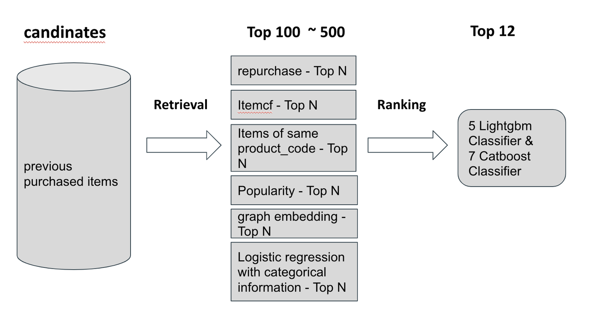
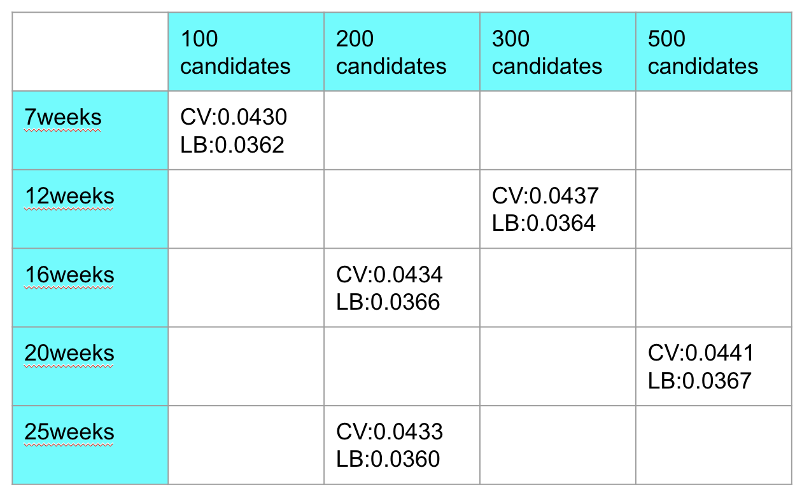
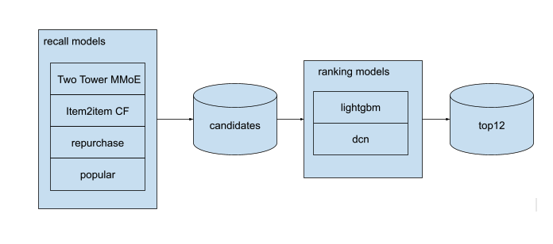

# H&M 时尚推荐深读：召回策略是上限，排序只吃残差

> 赛事：Featured ｜ 主题 tabular（recsys）｜ 2952 队 ｜ 标准赛 ｜ 指标 MAP@12（2022-05-09 截止）
> 材料基础：`digests/h-and-m-personalized-fashion-recommendations.md`（8 节正文：1st/2nd/3rd/4th/6th/52nd + 赛事本质 Q&A + 图像数据集）+ 6 张图（全场图片资产已全读）
> 深读时间：2026-10（Tier A #15）

## 0. 一句话重述：这道题真正在考什么

题面是"给每位顾客推荐 12 件商品"，实际被考的是**"下一篮预测（next basket）"的候选构造学**。降解为 5 步：

1. **自己造训练/测试集**（1st 明言）：数据在时间上滚动，"正确答案"由你按周切分定义——候选表（顾客×商品×周）就是数据集本身；
2. **召回 = 上限**：时尚季节性强 + 历史稀疏（~50% 用户在近 3 个月无交易）→ **近期热门 + 复购** 是最强起点；itemCF 甚至打不过"直接取热门"（2nd）；召回策略的多样性决定命中率；
3. **召回特征进排序**（3rd 的最大单笔）："该商品由哪条策略召回、在策略内的排名"——只加候选数量而不加这两个特征，CV 会非常差；策略数×排名的元信息把召回质量显式喂给 ranker；
4. **排序吃残差**：GBDT（binary 或 ranker 目标）在 100–500 候选上重排；LGBM/CatBoost 互有胜负；负采样是必须的（pos:neg≈1:300 → 降到 30×pos 或每周 100–200 万条）；
5. **冷启动非对称**：冷用户可用人口学特征兜底（4th 双塔 MMoE）；**冷商品永远排不进 top12**（缺交互信息，1st 直接放弃；文本/图像特征对暖用户无增益）。

一句话：**这是一场"候选生成策略的军备竞赛"**——1st 的召回菜单（复购/itemCF/同款/热门/图嵌入/逻辑回归）与 3rd 的"策略×排名"特征，比任何排序模型调参都值钱。

## 1. 材料与角色

| 帖子 | 作者 | 票数 | 角色与独有信息 |
| --- | --- | --- | --- |
| [307288](https://www.kaggle.com/competitions/h-and-m-personalized-fashion-recommendations/discussion/307288)（Q&A，431 票） | Paweł Jankiewicz | 431 | **方法论总纲**："预测下一篮"；候选=你自己造的负样本；策略最重要；LGBMRanker 把 customer 当 query；小样本快速验证 |
| [324070](https://www.kaggle.com/competitions/h-and-m-personalized-fashion-recommendations/discussion/324070)（1st，430 票） | senkin13 & h4211819 | 430 | 召回菜单 + 100–500 候选 + 5 LGBM/7 CatBoost；**CV-LB 网格（周数×候选数）**；工程（TreeLite/28 分片/300G 内存） |
| [306152](https://www.kaggle.com/competitions/h-and-m-personalized-fashion-recommendations/discussion/306152)（图像数据集，100 票） | Sanskar Hasija | 100 | 5 档降分辨率图像数据集（128–1024）——冷启动/多模态路线的公共弹药 |
| [324129](https://www.kaggle.com/competitions/h-and-m-personalized-fashion-recommendations/discussion/324129)（3rd，96 票） | sirius | 96 | **召回策略特征（是否被某策略召回＋策略内排名）**：0.02855→0.03262；**BPR user2item 相似度**：0.03363→0.03510 |
| [324197](https://www.kaggle.com/competitions/h-and-m-personalized-fashion-recommendations/discussion/324197)（2nd，80 票） | wht1996 & Paweł | 80 | 600 热门/用户 + 两段 LGBM；Paweł 的 Rust 并行特征框架；"**itemCF 不如热门**"；可用性/邮编写得像推荐赛 |
| [324076](https://www.kaggle.com/competitions/h-and-m-personalized-fashion-recommendations/discussion/324076)（52nd，75 票） | Clear n' Simple | 75 | **20 分钟 notebook（FIL 后 12 分钟）**：33M 候选（~25/人）+ 时间感知手工 CF；极简却进前 2% |
| [324075](https://www.kaggle.com/competitions/h-and-m-personalized-fashion-recommendations/discussion/324075)（6th，71 票） | Ethan 队（Giba/qysx/hyd） | 71 | 候选数×模型×目标函数对照表；`categorical_features` +0.0005~0.0008；Giba 的 10k 大候选 + cudf 方案 |
| [324094](https://www.kaggle.com/competitions/h-and-m-personalized-fashion-recommendations/discussion/324094)（4th，65 票） | Hongwei Zhang | 65 | 双塔 MMoE（活跃/非活跃门控）+ 文本/图像聚类做冷启动商品；LGBM lambdarank vs DCN |

**材料缺口（未扩采，登记备查）**：索引里另有 20 条 write-up 未收录，含 [5th（324098，64 票）](https://www.kaggle.com/competitions/h-and-m-personalized-fashion-recommendations/discussion/324098)、[9th（324127）](https://www.kaggle.com/competitions/h-and-m-personalized-fashion-recommendations/discussion/324127)、[11th（324084）](https://www.kaggle.com/competitions/h-and-m-personalized-fashion-recommendations/discussion/324084)、[Giba 部分（324278）](https://www.kaggle.com/competitions/h-and-m-personalized-fashion-recommendations/discussion/324278)、[22nd 单 LGBM（324152）](https://www.kaggle.com/competitions/h-and-m-personalized-fashion-recommendations/discussion/324152)、[top-10 汇总（324486）](https://www.kaggle.com/competitions/h-and-m-personalized-fashion-recommendations/discussion/324486) 等。

## 2. 逐方案对照矩阵

| 维度 | 1st senkin13 | 2nd wht1996+Paweł | 3rd sirius | 4th Hongwei | 6th Ethan 队 | 52nd Clear n' Simple |
| --- | --- | --- | --- | --- | --- | --- |
| 召回 | 复购/itemCF/同 product_code/热门/**图嵌入**/逻辑回归（6 路） | wht：600 热门 + 历史策略；Paweł：属性计数器×时段/图相似/共现/随机游走（多样性优先） | 热门/近期购买/相关品/属性热门/同名品 + **策略×排名特征** | item2item CF / 复购 20 / 上周热门 / **双塔 MMoE** | u2i / i2i / u2tag2i / 年龄分桶热门 | 时间感知 pair-CF（上周售出、5 pairs/件、≥2 人买过）+ 复购 + 年龄热门 |
| 候选数 | 100–500（网格选 500） | 600→130→+历史全量 | 几十→几百（关键扩容） | 未明（fold 设定 5 折用 3） | 120 / 220 / 1000 对照 | **~25/人（33M 总）** |
| 排序模型 | 5 LGBM + 7 CatBoost（classifier） | 两段 LGBM（第二段特征复杂） | 16 模型平均（LGBM/CatBoost/XGB） | LGBM lambdarank（DCN 未调好用） | CatBoost/LGBM × binary/lambdarank 对照 | LGBMRanker |
| 关键特征 | count/time/agg/diff/similarity（itemCF、word2vec、ProNE） | 属性×历史、streaks、可用性（postal_code） | **召回策略×排名**；**BPR 用户-商品相似度（AUC 0.72）** | 双塔嵌入作特征；文本/图像簇 | count/gap/discount/tfidf+svd/item_sim | 配对强度与来源特征 |
| 负采样 | 每周 100–200 万 | — | 30× 正样本 | Giba：200–500/顾客 | — | — |
| CV/LB | 0.0441 / 0.0367（单模）；集成 0.0371 | 0.0355→0.0362（加候选）→0.0368（集成） | 0.03510（加 BPR 后） | CV 0.039 / LB 0.0349 | 单模 0.0403/0.0341；集成 0.0348 | 20 分钟；私榜与前排同量级 |

## 3. 共识、分歧与裁决

### 共识一：召回（候选生成）决定上限；排序只在残差上加分（全员）

- 1st："候选生成策略是突破精度上限的关键，好的特征工程/建模只能逼近这个上限"；
- 3rd：仅"候选兜底不排雷"——只扩容不加召回特征时 CV 极差；
- 2nd：wht 单模 0.0355 → 换 Paweł 的候选 0.0362（+0.0007）→ 集成 0.0368；
- Q&A（RecSys 2019 冠军）直接把"策略"列为比赛最重要部分。

**裁决**：先最大化候选命中率，再谈排序。置信度最高。

### 共识二：热门 + 复购是文本/图像之前的绝对主线

2nd 明确"itemCF 召回效果不如直接取热门"；1st"主要用近期热门（时尚季节性强）"；6th 的 hot-by-age-bin；52nd 也保留"12 件年龄热门"。图像/文本只有 6th（tfidf/discount）、4th（图像簇）用在**冷启动商品**上，1st 明说图像/文本特征对其无帮助。

**裁决**：在"多数用户历史稀疏 + 时尚强季节"的分布下，时间加权的热门与个人复购是性价比最高的信号；itemCF/深度召回是补充而非替代。置信度高。

### 共识三：负采样与候选数是耦合旋钮

pos:neg≈1:300（3rd）→ 保留 30× 正样本；1st：每周 100–200 万负样本；Giba：每顾客随机 200–500 负样本；6th 的实验显示 120↔220 候选几乎无差、lambdarank 在 1000 候选时掉分（0.0400→0.0381）。

**裁决**：候选数存在甜区（~100–500/人）后收益饱和，负采样负责把训练分布压回可算/可学区间；盲目扩容是负收益（3rd/6th 两处证据）。置信度高。

### 分歧一：binary 分类 vs ranker 目标 vs 模型家族

- 1st：LGBM 分类器为主，CatBoost LB 明显更差（集成仍 5+7 混）；
- 6th：同候选数下 CatBoost binary（0.0403）> LGBM binary（0.0395）；lambdarank（0.0400）≈ binary 且 1000 候选时更差；
- 4th：LGBM lambdarank 远好于 DCN；
- 各家用分类器也能夺冠——MAP@12 只需前 12 排序质量，binary + GBDT 排序能力足够。

**裁决**：模型/目标的选择对总分影响 ≤0.001 级，候选质量与召回特征才是主项；没有普适最优组合（与 OTTO 的 GBDT 统治但目标函数百家争鸣同构）。置信度中高。

### 分歧二：复杂召回（图嵌入/双塔/深度）值不值？

- 反方：2nd 试过多个 RecBole 深度模型"不够好"；Paweł 的图游走/图像相似只是候选多样性的一部分；1st 的图嵌入召回存在但非核心；
- 正方：4th 把主要精力押在 Two Tower MMoE（任意长度候选 + 嵌入作排序特征 + 冷启动用户），是其第 4 的关键。

**裁决**：深度召回的价值取决于能否同时产出"可复用嵌入特征"与"冷启动兜底"（4th 的两用）；纯为召回率堆模型不划算。置信度中。

## 4. 增量数字账

| 动作 | 数字 | 来源 |
| --- | --- | --- |
| 3rd：加入召回策略特征＋候选扩容 | LB 0.02855 → 0.03262（银→近金） | 3rd |
| 3rd：BPR user2item 相似度 | LB 0.03363 → 0.03510（进奖金区）；BPR AUC 0.720 vs 全模型 0.806 vs 最佳其他单特征 0.680 | 3rd |
| 1st：窗口×候选网格 | 7w/100：0.0430/0.0362；12w/300：0.0437/0.0364；16w/200：0.0434/0.0366；**20w/500：0.0441/0.0367**；25w/200：0.0433/0.0360 | 1st 图 |
| 1st：单模→集成 | LB 0.0367 → 0.0371（5 LGBM + 7 CatBoost） | 1st |
| 2nd：候选升级与集成 | 0.0355 → 0.0362（+Paweł 候选）→ 0.0368（集成） | 2nd |
| 6th：模型/目标/候选对照 | CatBoost-120：CV 0.0403/LB 0.0341（最佳单模）；集成 CV 0.0412/LB 0.0348；lambdarank-1000：CV 0.0381 | 6th 表 |
| 6th：类别特征声明 | CV +0.0005~0.0008 | 6th |
| 4th | CV 0.039 / LB 0.0349；双塔嵌入兼作排序特征 | 4th |
| 52nd | 33M 候选（~25/人）；20 分钟（FIL 后 12 分钟）进前 2% | 52nd |

**可复算校验（3 处吻合）**

1. 52nd：33M 候选 ÷ ~25/人 ≈ **1.3M 顾客** ✓（与 H&M 顾客规模一致）；
2. 1st：5 LGBM + 7 CatBoost = **12 模型集成** ✓（正文与图一致）；
3. 1st 网格的 CV-LB 总体同向但不严格：CV 排序 0.0441（20w）>0.0437（12w）>0.0434（16w）>0.0433（25w）>0.0430（7w）；LB 排序 0.0367（20w）>0.0366（16w）>0.0364（12w）>0.0362（7w）>**0.0360（25w）**。两处反转：12w↔16w（CV 偏好 12w、LB 偏好 16w）与 **25w（CV 排第 4、LB 垫底）**——过长的历史窗口在 CV 上不显著、在 LB 上掉分，窗口选择须以 LB/多窗口验证为准。

## 5. 机制推演

**M1｜为什么热门是时尚推荐的最强先验**：商品生命周期以周计（季节/上新），用户复购周期短；在 50% 用户近 3 个月无交易的情况下，"全站近期热"覆盖了多数正确答案；itemCF 在稀疏共现上估计噪声大，反而不如聚合的热度。**推论：任何推荐比赛的第一张基线应当是"时间加权热门"**（与 OTTO 的召回优先一脉相承）。

**M2｜"策略×排名"特征为什么是 3rd 的最大杠杆**：候选表本身携带元信息——某候选是被"复购"召回（强信号）还是被"图嵌入"召回（弱信号），以及它在各策略内的序。这些特征让 ranker 学到"策略可靠性"的先验，把召回器的判断二次定价；缺了它们，扩容只是给 ranker 添噪声（3rd 的 CV 崩溃即证据）。

**M3｜BPR 用户-商品相似度的 AUC 结构**：BPR（隐式反馈矩阵分解）学的是 user2item 的偏好内积；AUC 0.720 远高于最佳手工单特征 0.680，逼近全模型 0.806。**它捕获的是"协同过滤的结构信号"**，与 count/recency 类特征互补；且需按周重训（时间性）。

**M4｜负采样比例如何影响 MAP 学习**：MAP@12 是 top 重排指标，负样本太多会让 GBDT 的梯度被"明显负样本"主导；1:300 降到 ~30×pos（3rd）或 200–500/顾客（Giba）使训练分布接近评测关注区（top 排序）。这与 OTTO 的 K×负采样耦合结论完全同构（THEORY 待收录条）。

**M5｜冷启动的不对称性**：冷用户有静态人口学（age/postal_code/club 状态）→ 双塔 MMoE 的门控专家可输出嵌入（4th）；冷商品无任何交互 → 任何模型都排不进 top12（1st 明说）；文本/图像特征只对冷商品有意义，对暖用户几乎零增益。**投资应偏"冷用户"，放弃"冷商品排名"**。

**M6｜"伪装成推荐赛的可用性问题"**（2nd 的洞察）：部分得分来自预测商品在各邮编的可得性——这解释了为什么 postal_code 属性计数"大幅提升"；当赛题要求提交"谁会在下周购买"的全量顾客时，计算量激增（特征与预测对每个顾客都要跑）。**赛题的隐藏结构（可得性/活跃度）值得在 EDA 阶段主动识别。**

## 6. 证据分级

| 断言 | 等级 | 说明 |
| --- | --- | --- |
| 1st 的窗口×候选 CV/LB 网格 | **可读取（图）** | 5 配置完整；但为工程师调参记录，非受控实验 |
| 3rd 的两个单笔增益（召回特征、BPR） | **自述（强）** | 给出具体分差与 AUC；无消融表 |
| 2nd 的 itemCF↔热门比较 | **自述** | 未给数字 |
| 6th 的候选×模型×目标对照表 | **可读取（表）** | 单模与集成数字完整 |
| 52nd 的 20 分钟复现 | **可复现（notebook 公开）** | 私榜分数"波动但同量级" |
| 4th 的双塔收益 | **自述** | 无消融；DCN 未调好 |
| Q&A 方法论 | **权威经验（RecSys 2019 冠军）** | 非本场实验证据，但事后被多家验证 |
| 图像/文本对暖用户无用（1st） | **自述** | 与 6th 的 tfidf 有效（+0.0005 级）弱冲突——后者可能计入冷启动/长尾商品 |

## 7. 边界条件与反事实

- **MAP@12 的宽容上限**：12 个位置 + 强热门先验 → 简单方案（52nd：25 候选/人、20 分钟）就能进前 2%；"召回军备竞赛"只在头部名次（0.035→0.037）之间发生。
- **反事实（2nd）**：不加 Paweł 的多样性候选，0.0355；加候选 0.0362；集成 0.0368——**候选多样性 +0.0007，融合 +0.0006**，两者合计约 0.0013（名次带 10+ 位）。
- **反事实（1st 的网格）**：25 周窗口 LB 反降——若不设早期停止（更长历史≠更好），会掉进"CV 同高、LB 更差"的陷阱；窗口选择本身是一个需 LB 验证的超参。
- **反事实（3rd）**：若无 BPR 特征（LB 0.03363），从"金区"跌回"奖金区之外"；若无召回特征（0.02855），直接掉出奖牌线。**两个单特征各自值 0.0015~0.004**——本场最高杠杆是特征而非模型。
- **前提边界**：这一切依赖"测试周与训练周同分布 + 商品可得性稳定"；换到有商品状态数据的赛场（Q&A 的建议），可用性建模会改写方法。

## 8. 悬案与失败学

**悬案**

1. **深度召回的真实上限**：4th 的双塔只到 LB 0.0349，2nd 的 RecBole 失败——是数据（无内容特征）还是方法问题，未定论；
2. **可用性（postal_code）的合法利用边界**：2nd 指出"比赛部分是关于预测商品可得性"——这是赛题设计的隐性维度，未被官方材料确认；
3. **5th/9th 等未收录方案是否走 NI 路线**——本深读的裁决存在 GBDT+热门阵营的幸存者偏差。

**失败学**

| 失败 | 来源 | 教训 |
| --- | --- | --- |
| itemCF 召回不如热门 | 2nd | 先量热门基线，再决定复杂召回 |
| 1000 候选 + lambdarank | Paweł/6th | 候选过多 + 排序目标会掉分（0.0400→0.0381） |
| 只扩容候选、不加召回特征 | 3rd | CV 极差——候选数量必须配"来源元信息" |
| RecBole 深度模型（多个） | 2nd | 内容侧无信号时深度召回不占优 |
| DCN 未调好 | 4th | LGBM 在这个特征体系下更强 |
| 冷启动商品硬排 | 1st | 无交互=永远进不了 top12，别浪费算力 |
| 图像/文本特征（暖用户） | 1st | 对主盘无增益 |

## 9. 图表证据

> 路径相对本文件（`analysis/deep/`）：`../../intel/h-and-m-personalized-fashion-recommendations/bodies/<topic>_img/NN.ext`（本场 6 张图已全读全嵌）。

**图 1：1st 的召回菜单与排序层**（topic 324070）——`../../intel/h-and-m-personalized-fashion-recommendations/bodies/324070_img/01.png`

*读图结论*：六路召回（复购/itemCF/同 product_code/热门/图嵌入/逻辑回归+类别信息）→ Top 100–500 → 排序（5 LGBM + 7 CatBoost 分类器）→ Top 12。**"逻辑回归 + 类别信息"作为一路召回**是正文未展开、只在图中出现的细节。

**图 2：1st 的窗口×候选 CV/LB 网格**（topic 324070）——`../../intel/h-and-m-personalized-fashion-recommendations/bodies/324070_img/02.png`

*读图结论*：7w/100：0.0430/0.0362；12w/300：0.0437/0.0364；16w/200：0.0434/0.0366；**20w/500：0.0441/0.0367（最佳）**；25w/200：0.0433/0.0360（LB 反降）。历史窗口与候选数是联合调参，且 CV 高≠LB 高（25w 反例）。

**图 3：4th 的四路召回架构**（topic 324094）——`../../intel/h-and-m-personalized-fashion-recommendations/bodies/324094_img/01.png`

*读图结论*：Two Tower MMoE / Item2Item CF / 复购 / 热门 → 候选 → LightGBM + DCN → top12。双塔是唯一"深度"件，兼作冷启动与特征源。

**图 4：4th 的用户塔（MMoE 门控）**（topic 324094）——`../../intel/h-and-m-personalized-fashion-recommendations/bodies/324094_img/02.png`

*读图结论*：embedding 层（age/postal_code/article_id/.../product_code + 时间嵌入）→ **gating network** → 多个 expert（deep → attention → user embedding）。门控按"近期活跃/非活跃"分派专家，专门服务无购买日志的冷启动用户。

**图 5：4th 的商品塔**（topic 324094）——`../../intel/h-and-m-personalized-fashion-recommendations/bodies/324094_img/03.png`

*读图结论*：item 侧 embedding（article_id/product_code/.../**image_cluster_id**）→ deep → item embedding。文本/图像的聚类 id 以离散特征形式注入塔内。

**图 6：4th 的 Sampled Softmax 损失**（topic 324094）——`../../intel/h-and-m-personalized-fashion-recommendations/bodies/324094_img/04.png`

*读图结论*：user×item 内积经 sampled softmax 训练（大规模候选下的标准双塔损失），产出的嵌入同时供召回与排序特征使用。

## 10. 对既有笔记/playbook 的修订点

1. `notes/tabular/h-and-m-personalized-fashion-recommendations.md` 升级：补齐 8 节作者/票数；方案谱系扩为 6 方案对照矩阵；新增召回特征（策略×排名）、BPR、窗口×候选网格、负采样/K 甜区、51st/52nd 极简基线、图证与失败学。
2. `playbook/tabular.md`（recsys 节）增补：
   - **召回优先 + 热门基线**（时间加权热门是第一条基线）；
   - **召回元特征**（是否被策略召回 + 策略内排名）；
   - **user2item 相似度（BPR）与 user2item/item2item 的 AUC 分级**；
   - **K×负采样联合调参**（K≈100–500、负采样 30×pos 或 1–2M/周）；
   - **冷启动非对称**（资源投冷用户、放弃冷商品排名）；
   - **窗口选择也是超参**（25w 反例）。
3. `playbook/00-通用方法论.md` 增补："**赛题的隐藏结构**"（H&M 的可得性预测）——EDA 阶段主动找"分数实际从哪来"。

## 11. 出处

- Q&A（Paweł Jankiewicz，431 票）：https://www.kaggle.com/competitions/h-and-m-personalized-fashion-recommendations/discussion/307288
- 1st（senkin13 & h4211819，430 票）：https://www.kaggle.com/competitions/h-and-m-personalized-fashion-recommendations/discussion/324070
- 图像数据集（Sanskar Hasija，100 票）：https://www.kaggle.com/competitions/h-and-m-personalized-fashion-recommendations/discussion/306152
- 3rd（sirius，96 票）：https://www.kaggle.com/competitions/h-and-m-personalized-fashion-recommendations/discussion/324129
- 2nd（wht1996 & Paweł，80 票）：https://www.kaggle.com/competitions/h-and-m-personalized-fashion-recommendations/discussion/324197
- 52nd 20 分钟方案（Clear n' Simple，75 票）：https://www.kaggle.com/competitions/h-and-m-personalized-fashion-recommendations/discussion/324076
- 6th（Ethan 队，71 票）：https://www.kaggle.com/competitions/h-and-m-personalized-fashion-recommendations/discussion/324075
- 4th（Hongwei Zhang，65 票）：https://www.kaggle.com/competitions/h-and-m-personalized-fashion-recommendations/discussion/324094
- 未收录缺口（登记备查）：324098（5th）｜324127（9th）｜324084（11th）｜324278（Giba）｜324152（22nd 单 LGBM）｜324486（top-10 汇总）等
