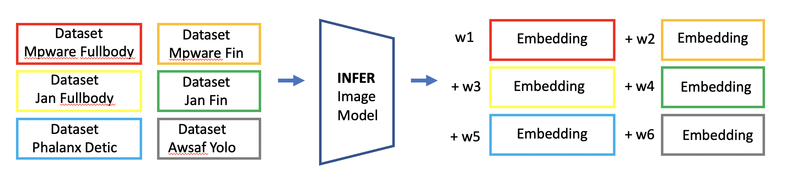
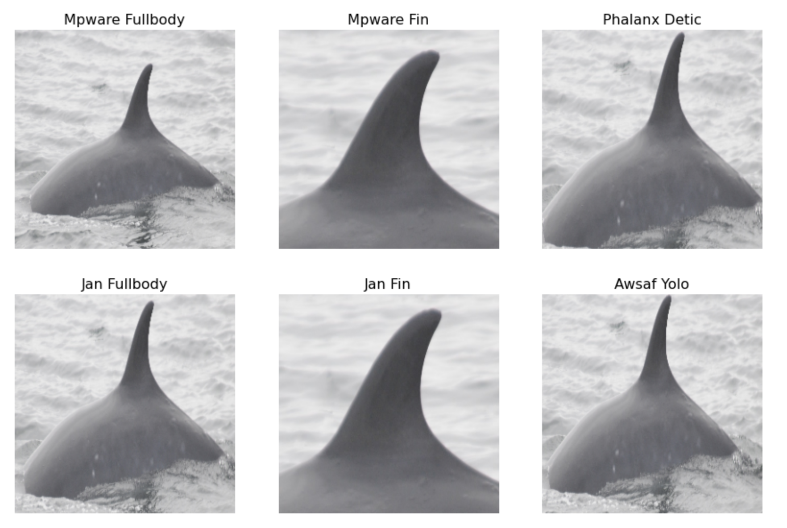

# Happywhale - Whale and Dolphin Identification 轻量深读（Tier B）

> 赛事：Research ｜ 主题 cv（细粒度检索/开集识别）｜ 1588 队 ｜ 标准赛 ｜ 指标：MAP@5（含 `new_individual` 开集）
> 材料基础：`digests/happy-whale-and-dolphin.md`（6 篇正文：1st 320192 / 3rd 319896 / 19th 320298 / 往届方案 304504 / 降分辨率数据集 304686 / 裁剪数据集 319245 等；80 条主题索引）+ 7 张图
> 轻读时间：2026-10（Tier B B05）

## 1. 一句话重述与数字账

从任意角度/光照的鲸豚照片识别个体（长尾 + 开集）。真正的考点是**裁剪策略（多来源 bbox 混合）+ ArcFace 系度量学习 + knn/logit 双路后处理 + 伪标签**——本场是"伪标签改变名次"的标志性案例。

| 关键数字 | 值 | 来源 |
| --- | --- | --- |
| 1st（320192，198 票） | sub-center ArcFace（k=2）+ 动态 margin（Optuna 在小模型 256px/effnet-b0 上调参）；**bbox 混合增强** fullbody:fullbody_charm:backfin:detic:none = 0.60:0.15:0.15:0.05:0.05（backfin 显著提分）；测试取两种 fullbody 预测均值；effnet_b5–b7/v2m/v2l（b7 最佳单模）；GeM p=3 + 头前 BN + 两级特征拼接；**头 lr = backbone lr ×10**；后处理 knn+logit 混合（knn_ratio 0.5→伪标后 0.8），`new_individual` 阈值设为"首预测为新个体的比例 = 0.165"；**两轮伪标签：0.88589/0.85959 → 0.89343/0.87062 → 0.89680/0.87579（pub/priv）**；最终 ~50 模型集成；赛后验证**只用两队的各 1 个最佳模型（0.89385/0.87336）也仍可夺冠** | 1st |
| 3rd（319896） | YOLOv5 显著鲸体检测器**迭代自标**（先标 5000 张 → 训练 → 全量预测 → 修正 box<0.4 或 box 数≠1 → 重训）；识别：tf_effnet_b7/b6 @768、NFNet-l2 @1024；BNNeck + ArcFace(s=30,m=0.3)/AdaFace；增强偏**纹理**（Sharpen/ToGray/CLAHE）+ mixup；逐技巧消融（new_id / not_new_id / CV 三列） | 3rd |
| 19th（320298，71 票） | **无伪标签单模型 LB 0.860**：6 个裁剪数据集（两家 fullbody + 两家 fin + detic + yolo）混合训练（20 epoch，每图见 120 次），双 ArcFace 头（species + individual，m=0.19/s=19）；推理时**逐数据集出 6 个嵌入 → 贝叶斯优化权重 → KNN**（图 1）；8 折 ×12 模型投票集成 → LB 0.868；赛后给 2 个模型加伪标签：**+0.009 pub / +0.016 priv** | 19th |
| 数据侧（社区） | 物种列修复（305574，176 票）、背鳍数据集（310153/309214）、降分辨率数据集（304686）、LB probing 与切分讨论（304633/308991 等）；两篇 CV 技巧帖合计 275 票 | 社区 |

## 2. 逐方案对照矩阵

| 维度 | 1st | 3rd | 19th |
| --- | --- | --- | --- |
| 裁剪 | 5 来源 bbox 按比例混合 | 自训 YOLOv5 迭代精修 | 6 个现成裁剪数据集 |
| 主干 | EffNet b5–b7 / v2m–l（1024） | EffNet b6/b7 + NFNet-l2 | EffNet b5–b7 / v2l–xl / ConvNeXt-L |
| 头部 | sub-center ArcFace + 动态 margin；species 二头 | BNNeck + ArcFace/AdaFace；species 二头 | 双 ArcFace（m=0.19, s=19） |
| 检索 | knn+logit 混合（0.5→0.8） | KNN | 6 嵌入贝叶斯加权 + KNN |
| 伪标签 | **两轮，+0.006~0.011** | 未强调 | 无（赛后验证 +0.009/+0.016） |
| 成绩 | 0.89343/0.87062 → 0.89680/0.87579 | 3rd | 0.859（单模）→ 0.868（集成） |

## 3. 共识、分歧与裁决

### 共识一：裁剪来源的多样性本身就是性能（三家）

1st 用 5 种 bbox 按比例混合（含 15% backfin 专治"只露背鳍"的图）；3rd 自训检测器迭代精修；19th 直接混合 6 个公开裁剪数据集并逐数据集出嵌入。**裁决**：细粒度开集识别里，"主体如何被框出来"对分数的影响大于主干选择——多来源裁剪既是数据增强也是分布覆盖。置信度：高。

### 共识二：ArcFace 系头部 + 检索式评估是主线（三家）

1st 用 sub-center ArcFace（k=2）+ 动态 margin（并指出上届"翻转当新类"在本届不适用，因为拍摄角度多变）；3rd 用 BNNeck+ArcFace/AdaFace；19th 用双 ArcFace 头（物种 + 个体）。**裁决**：MAP@5 的检索式指标与度量学习头部天然匹配；物种辅助头是稳定的小增益。置信度：高。

### 共识三：伪标签是最大单点增量（1st/19th 独立验证）

1st 两轮伪标签把 pub/priv 从 0.88589/0.85959 提到 0.89680/0.87579，且赛后"2 模型也能夺冠"；19th 赛后给 2/12 模型加伪标签即 +0.016 priv，自评"足以进金牌区"。**裁决**：极端长尾 + 开集场景里，伪标签是性价比最高的动作（远超换主干/调参）。置信度：高。

### 分歧一：knn vs logit 的权重

1st 观察到 knn 在 CV 上更好但公榜优势小（长尾导致 knn 偏向样本多的类），于是固定 knn_ratio=0.5，伪标后提到 0.8；19th 纯 KNN（多嵌入加权）。**裁决**：knn/logit 差异来自"训练分布 vs 测试分布"的偏置；混合比例应随伪标签/分布校正调整。置信度：中高。

### 分歧二：开集阈值怎么定

1st 用"首预测为 `new_individual` 的比例 = 0.165"反推阈值（基于验证/试提交）；19th 在 CV 上调 `new_individual` 阈值。**裁决**：开集阈值应按"目标新个体比例"校准，而不是纯分数阈值。置信度：中高。

### 事件：社区数据整理的价值

物种列问题修复（176 票）、背鳍/全身裁剪数据集、降分辨率数据集——1st/19th 都直接使用了社区数据集。**裁决**：数据整理帖是细粒度赛的"隐形基建"，善用可省数周。置信度：高。

## 4. 证据分级

| 断言 | 等级 | 说明 |
| --- | --- | --- |
| 1st 的伪标签分数链与"两模型也能夺冠" | 自述 + 完整数字 + 公开代码 | 高 |
| 3rd 的检测器迭代与技巧消融表 | 自述 + 表 + 代码 | 中高 |
| 19th 的 6 嵌入贝叶斯加权与伪标签复验 | 自述 + 图 + 赛后更新 | 高 |
| bbox 混合比例（0.60/0.15/0.15/0.05/0.05） | 单队自述（1st） | 中（比例可复现，收益未给单变量消融） |
| 社区数据集质量 | 多队使用 + 票数 | 高 |

## 5. 悬案与缺口（登记）

- 2nd 与 4th–18th 的 write-up 未入库；"9 CV Tricks"（168 票）与"7 More CV Tricks"（117 票）两帖未细读；
- "Miracle of Coincidence"（136 票）与 LB probing（304633）涉及榜面异常，未细读；
- 1st 的 Optuna 动态 margin 具体分布未公布（只有调参流程）；
- 3rd 的 180px 宽流程图无法作为证据（本场归档图仅 2 张可用）。

## 6. 图表证据

**图 1**（topic 320298）：19th 的推理管线——同一模型在 6 个裁剪数据集上各出一次嵌入，用贝叶斯优化在 CV 上求权重（w1…w6）后加权送入 KNN；"多裁剪来源 = 多视角集成"的具体实现。

**图 2**（topic 320298）：同一头鲸在 6 个数据集中的裁剪样例（Mpware/Jan 的 fullbody 与 fin、Phalanx detic、Awsaf yolo）——框法不同导致同一主体呈现截然不同的构图，是"多来源裁剪"策略的直观依据。

## 7. 出处

- 1st（198 票）：https://www.kaggle.com/competitions/happy-whale-and-dolphin/discussion/320192
- 3rd（319896）：https://www.kaggle.com/competitions/happy-whale-and-dolphin/discussion/319896
- 19th（71 票）：https://www.kaggle.com/competitions/happy-whale-and-dolphin/discussion/320298
- 物种列修复（176 票）：https://www.kaggle.com/competitions/happy-whale-and-dolphin/discussion/305574
- 背鳍数据集（142 票）：https://www.kaggle.com/competitions/happy-whale-and-dolphin/discussion/310153
- 9 CV 技巧（168 票）：https://www.kaggle.com/competitions/happy-whale-and-dolphin/discussion/310105
