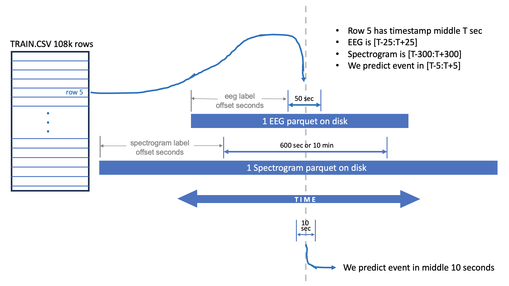
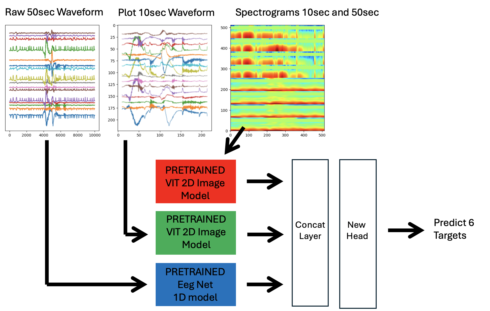

# 深读：HMS 有害脑活动分类（标签来源双位移 + 频谱逆向工程）

> 素材：现有 6 篇正文 + 80 条主题索引（含 603 票的数据理解帖与 233 票的频谱公式帖）。
> 本篇亮点：拆出本场的两个"隐藏位移"（标注者人群 / 主办方增广复制），并给出"变换与平均的顺序"这一信号处理通则。

## 0. 一句话重述：这道题真正在考什么

任务：由 EEG 预测 6 类有害脑活动的**概率分布**（KL 散度）。
但两处隐藏结构决定成败：

1. **标注者位移**：训练标签来自 119 名混合标注者（癫痫均值 18.8%），测试标签来自 20 名**专家**（1.5%）→ 必须把训练子集对齐到"专家口径"（`vote_count>=10`）。
2. **增广复制**：主办方把同一段 EEG 平移后配同一标签造出 ~10 万行 → 行间高度冗余且折间泄漏 → 需要逆向还原"真实数据点"（3rd 还原到 **6,350 行**）。

→ 任务降解为：**① 对齐标签来源；② 去增广冗余重建验证；③ 选择表示（频谱图/波形图/1D 原始）与模型家族；④ 融合或单模极致化。**

## 1. 材料与角色

| 帖子 | 角色 | 关键信息 |
| --- | --- | --- |
| 数据理解 + EffNetB2 starter（468010，**603 票**） | 学习资产 | 行=时间窗：EEG [T−25:T+25]（50s）、频谱 [T−300:T+300]（600s）、预测中段 [T−5:T+5]（10s） |
| Magic Formula（469760，233 票） | 机制 | 逆向主办方 4 张频谱图的生成公式；新频谱优于官方频谱 |
| 3rd（492471） | 季军 | 逆向增广 → 6,350 行"真实数据"；2D MelSpec + 1D Squeezeformer 双路线 |
| 2nd（492254） | 亚军 | 3D-CNN 处理 16 通道频谱（2D-CNN 无法编码通道位置）；EEG 重塑成图像 |
| 8th（492482，金） | 单模金 | "One Mega Model"：三支路嵌入拼接 + 低票伪标签 |
| 1st（492560，team Sony） | 冠军 | 统一验证协议（cdeotte 方法：按 eeg_id 归一并裁中段；5 折 GroupKFold；vote≥10）+ 团队集成 |

## 2. 逐方案对照矩阵

| 维度 | 1st（Sony） | 2nd | 3rd | 8th |
| --- | --- | --- | --- | --- |
| 标签过滤 | vote ≥ 10 | 未明述（团队管线） | >9 票；**还原真实点后仅 6,350 行** | vote ≥ 10 训练 + 低票伪标签 |
| 验证 | 5 折 GroupKFold（按 eeg_id，裁中段） | GroupKFold | 4 折按 patient id；清洗后 CV-LB 相关性好 | 同左（按患者） |
| 表示 | 团队混合 | 16 通道频谱→**3D-CNN**；EEG→图像 | 16 张独立 MelSpec 拼接 + 中段 zoom；1D 原始 | 频谱（10s+50s 同图）、波形 2D 图、1D 原始 |
| 融合 | 团队级集成 | 权重写在括号里（频谱+EEG 模型） | 双路线集成 | **单模一体化**（concat 嵌入 + 新头） |
| 关键数字 | — | x3d-l：CV 0.21+/priv 0.29；EEG-图：priv 0.2829 | — | CV 0.246 / pub 0.243 / **priv 0.290（单模金）** |

## 3. 共识与分歧（含裁决）

**共识**：必须按专家口径过滤（vote≥10/>9）；必须按患者/eeg_id 分组验证；频谱图（Mel/STFT）是主力表示；双香蕉蒙太奇是默认通道组合。

**分歧与裁决**：

| 争议 | 观点 A | 观点 B | 裁决（依据与置信度） |
| --- | --- | --- | --- |
| 低票数据怎么办 | 8th：低票行用三模型伪标签回填（`0.1×旧 + 0.3×模型1..3`），单模金 | 3rd：2D 预训练模型"用<8 票/伪标签无收益"，宁可弃 10 万冗余行 | **取决于模型家族与数据预算**：从零训练的 1D/大模型受益于低票数据（8th）；预训练 2D + 干净子集更稳（3rd）。两者都拿金/铜，不是互斥真理；置信度中（均为自述，但方向与各自设定自洽） |
| 10 分钟频谱图是否有用 | 8th 把 10s+50s 频谱拼进同一图 | 3rd："末用 10 分钟频谱，收益不显著" | **收益弱**：可作为多样性补充而非主力；置信度中 |
| 频谱生成方式 | 官方 4 张频谱（LL/LP/RP/RL） | Magic Formula：**先算 4 组通道差的频谱再平均** | **后者的数学更完整**（见 §5），实验中 EEG 频谱 0.63 < 官方 0.66，二者同用 0.59（KL，越低越好）——置信度高（可复算实验表） |

## 4. 增量数字账

| 事实/动作 | 数字 | 备注 |
| --- | --- | --- |
| 标注者位移 | 训练 119 人（癫痫 18.8%） vs 测试 20 专家（1.5%） | 来自主办方论文（8th 引用） |
| 数据冗余 | 106.8k 行 → 17,089 eeg_id / 1,950 患者 | 行=窗口，非独立样本 |
| 3rd 清洗 | → **6,350 真实行**（弃 ~10 万） | CV-LB 相关性显著改善 |
| Magic Formula 实验 | 官方 0.66 → EEG 0.63 → 两者同用 **0.59** | EffNetB0 + KL，越低越好 |
| 8th 单模 | CV 0.246 / pub 0.243 / priv 0.290 | 三支路 + 伪标签 |

## 5. 机制推演

1. **为什么要对齐"标注者人群"**：测试由 20 名专家标注，其癫痫判定率只有 1.5%，而全量 119 人平均 18.8%。在 KL 指标下，模型输出的分布直接被测；若用全量标签训练，模型系统性高估癫痫类 → 分布错配。`vote_count≥10` 是对"专家口径"的可操作近似（8th 与 1st/3rd 独立采用）。
2. **为什么必须先反增广再谈 CV**：主办方对同段 EEG 平移生成多行、标签相同 → 同一患者/同一段信号跨折 → 折内泄漏；3rd 逆向出"真实点"后（6,350 行）CV 与 LB 的相关性才变好。与 feb-2022 的"生成复制"同属**在数据生成层做泄漏审计**。
3. **Magic Formula 的数学**：设谱图为非线性变换 `spec(·)`。把波形先相加再取谱：
   `(Fp1−F7)+(F7−T3)+(T3−T5)+(T5−O1) = Fp1−O1` ——中间通道全部抵消（望远镜求和）。
   而**先分别取谱再平均**保留 4 段差分各自的信息。**通则：非线性变换前做线性合并会丢失被抵消的分量；应"先变换、后合并"。**
4. **表示与架构的匹配**：2D-CNN 把 16 通道音节图拼接成一张大图时，通道维度没有"位置归纳偏置"（无 padding），相邻关系被 conv 混叠——2nd 因此改用 **3D-CNN**（通道作为一维）或控制拼接顺序（3rd 的双香蕉排序）；而 8th 用 ViT 的全局注意力替代卷积，弱化了位置假设。
5. **KL 目标的工程含义**：起点帖实验显示 CE(0.73/0.57) 与 KL(0.66) 差异显著——**损失必须匹配指标**；KL 训练 + 裁剪（±1024/32，不做逐样本归一化）是 3rd 的稳定配方。

## 6. 证据分级

| 断言 | 等级 | 说明 |
| --- | --- | --- |
| 标注者位移（18.8% vs 1.5%） | **强（论文+多队采用）** | 主办方论文，8th 引用 |
| 增广复制与 6,350 真实行 | **强（方法自述+效果）** | 3rd 描述逆向过程，CV-LB 改善佐证 |
| Magic Formula 优于官方频谱 | **可复算（实验表）** | 0.66→0.63→0.59 |
| 伪标签收益 | **弱（对立证据）** | 8th 用之夺金；3rd 试过无效 |
| 10 分钟频谱弱收益 | **中（自述** | 3rd 的实测结论 |

## 7. 边界条件与反事实

- **若测试标注者也用混合人群**：专家过滤会变成伤害（本场是主办方的特殊设定）。
- **若不做反增广**：CV 被冗余行抬高，容易在私榜翻车（与 feb-2022 一致）。
- **反事实**：8th 证明"单模 + 正确的标签工程"也能夺金——大集成不是必需；3rd 证明"干净子集 + 双路线"同样成立；两条路殊途同归，但都以"标签对齐 + 去冗余"为前提。

## 8. 悬案与失败学

- 悬案 1：主办方增广的具体参数（平移步长/采样规则）未官方披露，3rd 靠逆向近似；
- 悬案 2：伪标签结论为何分裂（8th 收益大、3rd 无收益）——缺少统一口径的对照；
- 失败学：不按患者分组（冗余行跨折）；不做专家过滤；逐样本/逐批归一化（3rd 明确有害）；把 CE 当 KL 用。

## 9. 图表证据

**图 1：数据结构（行=时间窗）**（来源：数据理解帖 468010，603 票；本地 `intel/hms-harmful-brain-activity-classification/bodies/468010_img/01.png`）

*读图结论*：train.csv 108k 行；EEG 片段 [T−25:T+25]（50s）、频谱片段 [T−300:T+300]（600s）、预测目标在中段 [T−5:T+5]（10s）——这张图解释了"行≠样本"与"裁中段验证"的全部由来，也是全场最高票帖（603 票）的核心。

**图 2：One Mega Model 三支路结构**（来源：8th 492482；本地 `.../492482_img/03.png`）

*读图结论*：原始 50s 波形→EegNet-1D；10s 波形 matplotlib 图→ViT；10s+50s 频谱→ViT；三路嵌入拼接后接新头输出 6 类。单模私榜 0.290（金）——它把"多模态"从"多模型集成"折叠进了一个网络。

## 10. 对既有笔记/playbook 的修订点

1. 笔记升级：补标注者位移（18.8% vs 1.5%）、增广复制与 6,350 行、Magic Formula 数学、KL/CE 差异、3rd/8th/2nd 数字台账；内嵌两张图。
2. `playbook/00-通用方法论.md` 增补：**"标签来源审计"**（谁标注了训练/测试？分布是否同源？）与**"非线性变换顺序"**通则（先变换后合并）。
3. `playbook/tabular.md`（信号/医疗相关节）与 `playbook/science.md` 各加一条指向本场的引用（标注者位移 + 反增广）。

## 11. 出处

- 数据理解 starter：https://www.kaggle.com/competitions/hms-harmful-brain-activity-classification/discussion/468010
- Magic Formula：https://www.kaggle.com/competitions/hms-harmful-brain-activity-classification/discussion/469760
- 3rd：https://www.kaggle.com/competitions/hms-harmful-brain-activity-classification/discussion/492471
- 2nd：https://www.kaggle.com/competitions/hms-harmful-brain-activity-classification/discussion/492254
- 8th：https://www.kaggle.com/competitions/hms-harmful-brain-activity-classification/discussion/492482
- 1st：https://www.kaggle.com/competitions/hms-harmful-brain-activity-classification/discussion/492560
