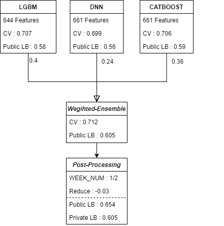
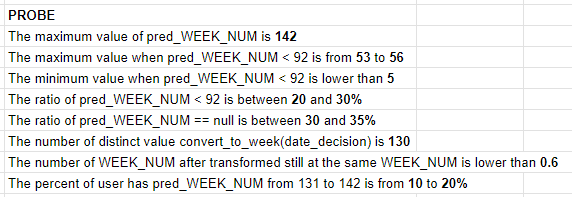
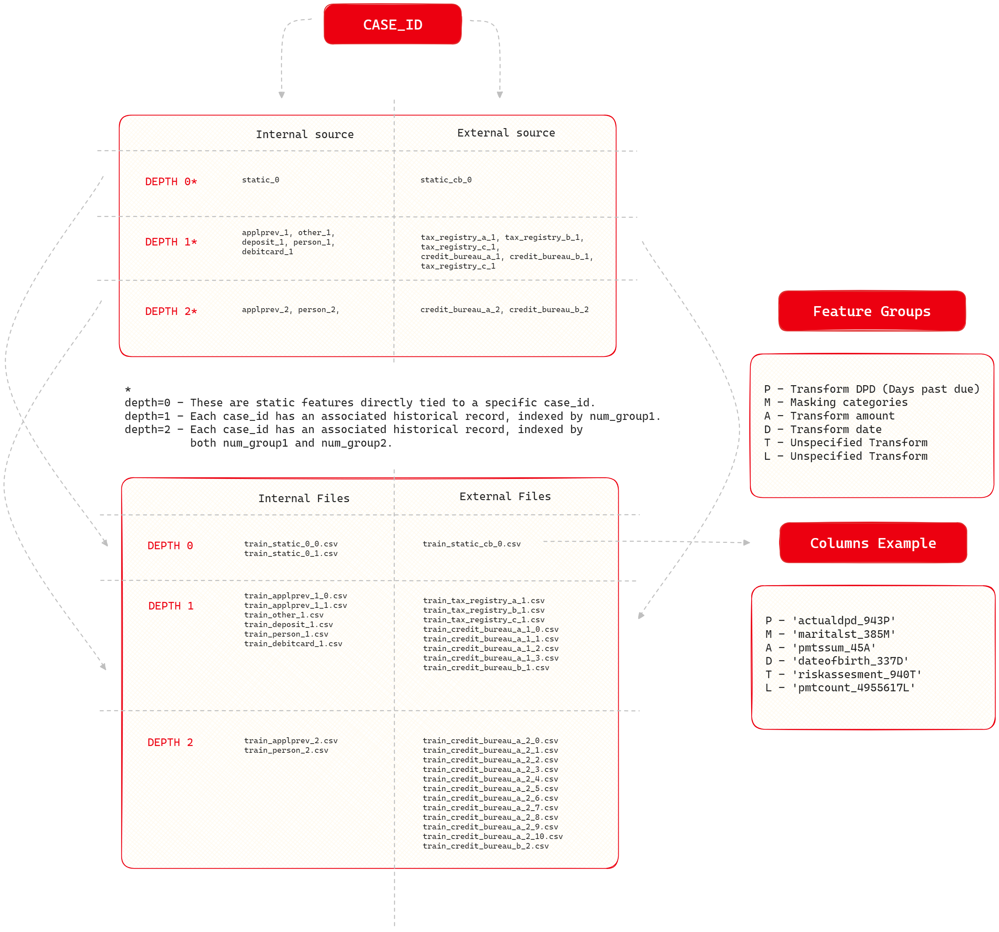
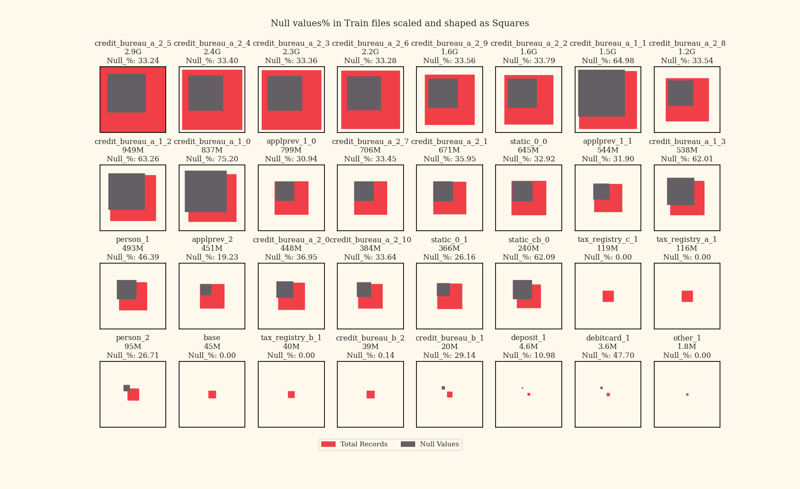

# Home Credit - Credit Risk Model Stability 深读：指标缺陷 × 日期恢复 × 下注策略

> 赛事：Featured ｜ 主题 tabular（金融风控）｜ 3856 队 ｜ 代码赛 ｜ 指标：Home Credit 2023 - Gini Stability（Gini − 线性时间趋势惩罚）
> 材料基础：`digests/home-credit-credit-risk-model-stability.md`（8 篇正文：1st 175 / 公开 8→私有 253 的 60 / 13th 38 / 10th 29 / 53rd 29 / silver 29 / 57th 24 / 数据理解 375；120 条主题索引）+ 4 张图
> 深读时间：2026-10（Tier A #56）

## 0. 一句话重述：这道题真正在考什么

题面是"预测客户违约概率，并让模型表现随时间稳定（Gini Stability）"——真正的考题是**在一个可被操纵的复合指标下做风险下注**。比赛被 1st 直接切分为两段：

1. **Phase 1（ML）**：标准风控建模——关系型多表（depth 0/1/2）× 聚合特征工程 × CatBoost/LGBM/XGB/DNN 集成。但"干净方案"的私有榜上限被固化为 **≈0.52–0.53**（1st 模型池 0.53；8th/253 自述无 hack 0.520；57th 集成 0.528）。
2. **Phase 2（Metric Hack）**：指标含**线性时间趋势惩罚**，而测试集的时间信息（WEEK_NUM）可被恢复（`min_refreshdate_3813885D` 与 `date_decision` 的差 ≈ 常数 3/1/2019，相关系数 0.9~0.99）。恢复周号后，对特定周区间的预测值做下调（REDUCE≈0.03、DEVIDE=1/2 或按周线性递减），即可在**不改变模型质量**的前提下抬分——1st 的公开榜 0.605→0.654、私有榜 0.605；8th/253 的日期恢复法私有 0.560~0.617；而用"公开流传的对抗分类器 hack"的版本私有只有 0.510~0.520。
3. **押注阶段**：模型差距 0.00X，hack 参数差距 0.0X（1st 原话）——最终名次主要由"押哪个周区间、押多少 REDUCE"决定。1st 的策略：双提交对冲（No-Hack + Hack），Hack 版取分布中位数（DEVIDE=1/2、REDUCE=0.03），并自评"排名靠运气"。

一句话：**这是一场"复合指标审计 + 日期泄漏恢复 + 参数下注"的比赛**——它教给社区的第一课不是风控建模，而是"指标设计缺陷如何摧毁一个 3856 队竞赛的排名含义"。

## 1. 材料与角色

| 帖子 | 作者 | 票数 | 角色与独有信息 |
| --- | --- | --- | --- |
| [473950](https://www.kaggle.com/competitions/home-credit-credit-risk-model-stability/discussion/473950) Understanding completion data | SSS | 375 | 全场最热：32 文件/465 特征/436 描述的完整 schema；depth 0/1/2 与 P/M/A/D/T/L 变换后缀；空值×文件大小可视化（图 3/4） |
| [508337](https://www.kaggle.com/competitions/home-credit-credit-risk-model-stability/discussion/508337) 1st：My Betting Strategy | yuuniee | 175 | 唯一把比赛拆成 ML/MH 两段的完整叙事：模型池无 hack 上限 ≈0.53；集成权重 0.4/0.24/0.36、CV 0.712/公 0.605；hack 参数敏感性（REDUCE 私榜最优 0.02~0.04）；**双提交对冲 + 中性下注**；FE 与 CV 相关性分层观察 |
| [507946](https://www.kaggle.com/competitions/home-credit-credit-risk-model-stability/discussion/507946) 公开 8 / 私有 253 | Evgeniia Grigoreva | 60 | 日期恢复法：`refreshdate_3813885D` 最小值≈2019-03-01，训练集 87% 恢复正确/3% 错/10% 缺；自研法公 0.655、私 0.560~0.617，公开流传法私 0.510~0.520；**指标线性趋势惩罚批判**（市场条件造成的随机趋势不可外推）；6 套数据处理器提升集成多样性；长失败清单 |
| [508113](https://www.kaggle.com/competitions/home-credit-credit-risk-model-stability/discussion/508113) 13th | Yuya Shintani | 38 | 772→411 手工特征；10 模型（LGBM/XGB/CatBoost/HistGB）→ RidgeClassifier 堆叠 + 概率校准 + 5 seed；CV AUC 单模 ~0.856、堆叠 0.8593；**pmts_year_1139T 年份后处理**；"本场不适合当学习材料，后处理影响太大" |
| [508588](https://www.kaggle.com/competitions/home-credit-credit-risk-model-stability/discussion/508588) 10th | Phạm Ngọc Thiên Ân | 29 | 探针表（图 2）：测试周号最大 142、<92 组 53~56、null 30~35%、131~142 占 10~20%；WEEK_NUM 恢复（与 min_refreshdate 相关 0.99）；**只 hack 未来组（92→142）**并线性下调（92 周 −0.04 起）；对抗 hack 因只覆盖 3~4 周而弃用；单个 XGB 收尾 |
| [508242](https://www.kaggle.com/competitions/home-credit-credit-risk-model-stability/discussion/508242) 53rd（无 hack） | Sercan Yeşilöz | 29 | 纯 ML：2 CatBoost + LGBM + NN；日期特征除以 −365；StratifiedKFold/StratifiedGroupKFold + WEEK_NUM 样本权；CV AUC ~0.852~0.858；尝试过线性平移/周号恢复但**干净方案私榜更高** |
| [507971](https://www.kaggle.com/competitions/home-credit-credit-risk-model-stability/discussion/507971) silver | Oleksiy Kononenko | 29 | "什么都没做，只是 XGB/LGBM/CatBoost 基础集成"；**关键动作是在 hack 合法化时停止工作**（冻结提交）——策略型银牌 |
| [508124](https://www.kaggle.com/competitions/home-credit-credit-risk-model-stability/discussion/508124) 57th（无 hack） | — | 24 | 7 模型私榜表（CatBoost 0.509 最高单模）→ L3 集成私 0.528/公 0.605；排序 by numgroups 聚合、10 折元分类器 +0.002、无日期模型补多样性；作者自述"hack 开始后从 top-10 掉到 62 名" |

**材料缺口（受"仅 ≤3 篇场次定点补采"约束，登记备查）**：指标定义与治理事件帖正文未收录——`475878` Understanding the gini stability metric（57 票，公式精读）、`476449` Problem with competition metric（130 票，最早揭发）、`476867`/`478716` 官方指标公告与后续（83/34 票）、`497167` Metric hack again（73 票，MH 复活）、`497337` host clarification（51 票）、`496898` How to cheat（49 票）、`501172` Another way to hack（39 票）、`501744` 团队视角（32 票）、`505664` A Hard Lesson for Kaggle（32 票）、`508163` 官方收尾（34 票）、`475485` 大数据代码赛实践（106 票）、`476463` 生日分析（101 票）。**本场没有 2nd~9th 的完整 write-up**（1st/10th/13th/53rd/57th/silver 之外），前排名次方案的可迁移性证据受限。

## 2. 逐方案对照矩阵

| 维度 | 1st | 公开 8/私 253 | 13th | 10th | 53rd（无 hack） | silver | 57th（无 hack） |
| --- | --- | --- | --- | --- | --- | --- | --- |
| 核心动作 | 模型池 + 中性下注 hack | 自研日期恢复法 + hack | 特征/堆叠 + 年份后处理 | 只 hack 未来周组 | 纯 ML，拒绝 hack | 基础集成后冻结 | 多模型多样性集成 |
| 特征 | max/min/avg/var/first/last/max−min（644/661） | 比、差、时间窗聚合、多源合并 | 772→411 手工特征 | 手工特征（depth 0/1）逐个验证 | 公开代码 + 日期/−365 | 基础 FE | 551~718 特征/模型 |
| 模型 | LGBM 0.4 + DNN 0.24 + CatBoost 0.36 | LGBM/CatBoost；6 套数据处理器 | 10 模型 → Ridge 堆叠 + 校准 | 单 XGB | CatBoost×2 + LGBM + NN | XGB/LGBM/CatBoost | 7 模型 → L3 集成（元分类器） |
| CV | SGKF shuffle/no-shuffle；Δ≤0.005 弱相关 | 5 折按周切分、丢 slope 项 | SGKF(k=5, WEEK_NUM) | SGKF/Multilabel/RollOut/HoldOut 全试 | SKF/SGKF + 周样本权 | — | 5 折同 SGKF |
| 指标处理 | 恢复 WEEK_NUM（相关 >0.9） | 恢复日期（87% 正确） | 用 pmts_year_1139T 微调 | 恢复 WEEK_NUM（相关 0.99）+ 探针 | 不用 | 不用 | 不用 |
| 下注方式 | DEVIDE=1/2、REDUCE=0.03；双提交 | 自研 vs 公开法；押错（253 名） | 年份惩罚 | 周 92→130 线性下调 | — | — | — |
| 成绩（私） | **0.605**（hack 版；无 hack 池 ≈0.53） | 自研 0.560~0.617 / 公开法 0.510~0.520 | 13th（宣称 14th） | 10th | 53rd | silver | 0.528（62 名口述） |

## 3. 共识、分歧与裁决

### 共识一：指标可被操纵是全场主线，且操纵与模型质量正交（5/7 明说）

1st 把比赛切成 ML/MH 两段；8th/253 自评"好私榜的关键是正确 hack"；10th"问题在指标本身，不在数据"；53rd/57th 反证"不 hack 也能 0.52~0.53"；silver 用"退出时机"证明 hack 后竞争性质改变。**裁决**：当指标含可独立操纵项（时间趋势惩罚）× 时间信息可恢复时，竞赛退化为参数下注；此时"模型分"是入场券，"下注分布"决定名次。置信度：高。

### 共识二：CV 与 LB 的相关性极差，且没有干净解法（4/4 有 CV 的队都报告失败）

1st：CV 差 ≤0.005 与 LB 弱相关、>0.01 才相关；参数调优的 CV 增益相关性低、FE 增益相关性高。
8th/253：简单 CV、时序 CV、带 gap 时序 CV、特定周留出全部试过，无相关；**开始集成后相关性才改善**。
10th：SGKF/Multilabel SGKF/RollOut/HoldOut 全试，最后"选择最信任的 SGKF(group=WEEK_NUM)"。
13th/53rd：统一 SGKF(k=5, WEEK_NUM)+堆叠/样本权。
**裁决**：在制度性漂移（后 COVID 市场/补助/报告规则变化）下，CV 只能用于粗筛；集成多样性与"信任的单一分组方案"是次优解。置信度：高。

### 共识三：干净方案的天花板 ≈0.52–0.53（三队独立）

1st 模型池私榜上限 ≈0.53；8th/253 无 hack 0.520；57th 集成私榜 0.528。**裁决**：上限由"指标趋势惩罚 + 市场随机趋势"共同锁定（8th 的机制批判）；再强的模型也无法把 0.53 抬到 0.60。置信度：中高（三队自述，数字口径略有差异）。

### 共识四：关系型多表的聚合工程仍是模型分的基础

8th/253：按 `numgroups` 排序后再聚合（对 first/last 有效）、时间窗聚合（合同结束 3/5/7 年、分期 1/6 月/1/2/3 年）显著提升 CV、`num_group1=0` 是申请人本人、active/closed 重复列合并、多源同字段拼接。
10th：CountEncoder 全量训练 +3e-3、>200 类别的 collapse +0.003、高缺失子模型 top10 +2e-3、伪标签 +6e-3。
57th：Coefficient of Variation 聚合器、无日期模型补多样性、10 折元分类器 +0.002。
13th：era/入职年龄/雇佣时长/税表合并/按周波动特征剔除。
**裁决**：匿名化 + 多表 + 时间窗 = 特征工程主战场；聚合器与排序语义（numgroup 次序）是隐藏自由度。置信度：中高。

### 分歧一：参与 hack 还是拒绝

1st：中性下注 + 双提交（结果最好）；10th：重仓未来周组（次优）；8th：押"公开流传法"→ 253 名；53rd/57th：拒绝 → 53/62 名区；silver：提前冻结 → 银牌。**裁决**：在"hack 决定 0.0X"的彩票里，**参与方式比参与与否更重要**——对冲（no-hack+hack）优于单边重仓；而在指标被官方放任后，任何 CV/模型优势都不足以补偿押错周区间的损失。置信度：高。

### 分歧二：哪种 hack 更稳健

1st/8th/10th 一致：**周号/日期恢复类 hack 稳健**（作用于整段测试期）；**对抗分类器类 hack 脆弱**（10th 实证只识别 3~4 周，若私榜起点改变则失效；host 确实改了起点）。组别选择上：10th 只押"未来组（92→142）"避开奇怪的 0→55 组；1st/8th 用连续参数而非离散组。**裁决**：hack 的作用面（覆盖测试期比例）× 私榜抽样方式决定稳健性；"长窗口 + 中性参数"是最优防守。置信度：中高。

### 分歧三：后处理算不算 hack

13th 的 pmts_year_1139T 年份下调、57th 的排序聚合、1st 的 Week 恢复分别处在"业务泄漏—特征工程—指标操纵"的连续谱上。**裁决**：本场没有干净的"无泄漏"分界线——`pmts_year_1139T`≈最新 date_decision 年份、日期差与 WEEK_NUM 相关 0.9+，都说明**匿名化只移除了显式日期，没有移除时间信号**。置信度：高。

## 4. 增量数字账

| 动作 | 数字 | 来源 |
| --- | --- | --- |
| 1st 模型池（无 hack） | 私榜上限 ≈**0.53**；LGBM CV 0.707/公 0.58、DNN 0.699/0.56、CatBoost 0.706/0.59 | 1st 正文+图 1 |
| 1st 集成 | 权重 0.4/0.24/0.36；CV **0.712**、公开 **0.605** | 图 1 |
| 1st 后处理 | WEEK_NUM 1/2、REDUCE −0.03：公开 0.605→**0.654**、私有 **0.605** | 图 1 |
| 1st hack 参数敏感性 | 公开最优 REDUCE 0.03；私有分布预计 0.02~0.04；模型差距 0.00X vs 参数差距 0.0X | 1st 正文 |
| 8th/253 日期恢复 | 训练集恢复正确率 87%、错误 3%、缺失 10%；自研法公 0.655 / 私 **0.560~0.617**；公开流传法私 **0.510~0.520**；无 hack 上限 ≈0.520 | 8th 正文 |
| 10th 恢复/探针 | WEEK_NUM 与 min_refreshdate 相关 **0.99**；测试周号最大 142、<92 组 53~56、null 30~35%、131~142 占 10~20% | 10th 正文+图 2 |
| 10th 下注 | 只 hack 未来组（92→142）；最终线性下调：92 周 −0.04、每周递减 0.0025（93 周 −0.0375…）；对抗法只覆盖 3~4 周弃用 | 10th 正文 |
| 13th 模型分 | 单模 CV AUC 0.7994~0.8576（含 rf/dart 变体；主力 GBDT 0.8497~0.8576）；Ridge 堆叠 **0.8593**；5 seed 平均；772→411 特征 | 13th 表 |
| 53rd 模型分 | LGBM CV 0.85766、CatBoost 0.85324/0.85180；4 模型集成 | 53rd 表 |
| 57th 模型分 | 7 模型私榜 0.476~0.509（CatBoost 最高 0.509）→ L3 集成私 **0.528**/公 0.605；CV 0.689244 | 57th 表 |
| 57th 增益 | 10 折元分类器 +0.002；1DCNN 把集成从 0.529 拉到 0.528（负贡献仍保留） | 57th 正文 |
| 10th 特征增益 | CountEncoder 全量 +3e-3；collapse 类别 +0.003；高缺失子模型 +2e-3；伪标签 +6e-3 | 10th 正文 |
| 事件热度 | 指标问题帖 130 票；官方公告 83/34；hack 复活帖 73；host 澄清 51；"terrible competition" 63；"Hard Lesson" 32 | 主题索引 |
| 赛事 | 3856 队；120 帖；Gini Stability；提交暂停后 2024-03-11 重启 | 元数据+482474 |

**结构校验（2 处吻合 + 1 处口径存疑）**

1. 1st 图中三模型权重 0.4+0.24+0.36 = 1.00，且集成 CV 0.712 > 任一单模（0.707/0.699/0.706）✓；
2. 干净方案上限三队独立吻合：0.53（1st）/0.520（8th）/0.528（57th）；1st 的 hack 版私榜 0.605 落在 8th 自研法的 0.560~0.617 区间内 ✓；
3. ⚠ 57th 帖标题"57th place"与正文自述"only 62nd"、其公开分数 0.605 与 1st 无 hack 集成公榜同为 0.605——排名/名次口径存在混淆（标题可能为后续更新），按原帖存档。

## 5. 机制推演

**M1｜复合指标为什么可以被独立操纵**：指标 = 区分度项（Gini）+ 稳定性项（对时间趋势的惩罚）。任何"只在周内做单调变换"的操作不改变周内排名，却会改变跨周可比性 → 直接作用于惩罚项。日期/周号一旦可恢复，就能精确选择"改哪些周、改多少"，把指标优化从"提高模型"变成"压平趋势曲线"。1st 的 REDUCE 敏感性（0.02~0.04）说明这是一个**一维下注问题**，不是模型问题。

**M2｜日期为什么能被恢复**：匿名化抹掉了显式日期，但保留了三类痕迹：(a) 跨表差值与相邻字段的差（`date_decision − min_refreshdate` ≈ 常数）；(b) 缺失率随时间的趋势（"Beware that the null count has a trend!"）；(c) 取值分布与周号的单调关系。8th 用 (a) 把最小值锚定到 2019-03-01 反推 87% 的日期；10th 用线性回归恢复 WEEK_NUM（相关 0.99）。

**M3｜为什么干净模型锁死在 0.53**：8th 指出测试期 Gini 的"下行斜率"来自市场条件（补助退坡、2022 冲击、CARES Act 报告扭曲）而非模型退化——这是随机趋势，不可预测也不可外推；指标却对这一斜率施加惩罚。于是任何诚实模型都要被扣掉一个与模型无关的常数 → 天花板固定。**推论**：这类指标设计把"稳定性"等同于"惩罚不可控的外部冲击"，属于指标定义层面的错误（8th 的批判）。

**M4｜对抗 hack 为什么脆弱**：对抗分类器只能在训练/测试边界识别少数连续周（10th 实测 3~4 周），而测试期跨度 >50 周（92→142）；一旦 host 调整私榜起点（实际发生了），识别到的周段可能完全不在私榜重点 → 收益清零。周号恢复法覆盖整段测试期，因此对起点变化鲁棒。**推论**：hack 的稳健性 ∝ 作用面对测试期的覆盖率 × 与私榜抽样方式的正交性。

**M5｜集成多样性的两个层面**：模型层（LGBM/CatBoost/XGB/DNN/1DCNN/MLP）+ **数据处理器层**（8th 用 6 套从零做 FE 的处理器；57th 用 7 套特征集）。后者在 CV-LB 相关性上贡献更大（8th 观察：开始集成后 CV-LB 相关性改善）——因为处理器差异带来的多样性不共享同一批泄漏/伪相关。

**M6｜堆叠与校准的稳定收益**：13th 的单模 → Ridge 堆叠 +0.002~0.003（CV AUC 0.8576→0.8593）+ 校准；57th 的 10 折元分类器 +0.002；1st 的线性回归 OOF 权重与 LB 最优接近。**推论**：在弱相关 CV 环境下，二阶模型（stacking/校准）比一阶调参更可靠——它优化的是"多个弱信号的一致性"，而不是单个模型的分数。

**M7｜竞赛治理失败的时间线闭环**：2 月最早揭发（130 票）→ 官方公告修改（83/34）→ 3 月暂停/重启（96 票）→ 4 月 hack 复活并合法化（73 票）→ 榜单被 hack 分数淹没（505574/504467/505664）→ 收尾官方声明（34 票）。**推论**：当平台无法在规则层面消除"指标可操纵性"时，参赛者的最优策略从"建模"转向"规则套利"，竞赛排名失去可比性——这正是社区呼吁"Hard Lesson"的原因。

## 6. 证据分级

| 断言 | 等级 | 说明 |
| --- | --- | --- |
| 1st 的模型权重/分数/后处理参数 | 自述 + 结构图（仓库内） | 高 |
| 干净方案上限 0.52~0.53 | 三队独立自述 | 中高 |
| 8th 日期恢复 87%/0.560~0.617 | 自述 + 公开 notebook（赛后发布） | 中高 |
| 10th 探针数值（142/30~35%/…） | 自述 + 探针表截图 | 高（图内证据） |
| 10th 对抗法只覆盖 3~4 周、私榜起点被改 | 自述（多队转述 host 行为） | 中 |
| 13th/53rd 的 CV AUC 表 | 自述 + 表格 | 中高 |
| 57th 7 模型私榜表 | 自述（HTML 行内表格） | 中高 |
| 指标含"线性时间趋势惩罚" | 8th 明确表述 + 1st/10th 的 hack 行为佐证 | 中高（公式原文未收录） |
| `WEEK_NUM` 相关 0.9~0.99 | 1st/8th/10th 三队独立 | 高 |
| 事件时间线（暂停/重启/hack 合法化） | 主题索引（标题+日期+票数） | 高 |
| 2nd~9th 方案 | 未收录 | —（缺口） |

## 7. 边界条件与反事实

- **反事实 1（官方封堵 hack）**：排名将回到 0.52~0.53 区间比模型质量；57th 自述"hack 前在 top-10"，说明前段竞争是正常 ML 竞争。1st 的双提交设计说明他也认可"干净方案仍然重要"。
- **反事实 2（8th 押公开法而非自研法）**：公开法私榜 0.510~0.520 vs 自研 0.560~0.617——**同一队伍的两种 hack 选择差异高达 0.05~0.10 私榜分**（帖题"公 8 → 私 253"记录了他们最终提交的落差；具体提交对应关系原文未完全厘清）；对照组证明"下注选择"压倒模型质量。
- **反事实 3（silver 不提前冻结）**：继续参与 hack 彩票可能更高也可能更低——他的银牌来自"确定性"，说明在负期望博弈里"退出"也是一种有效策略。
- **反事实 4（10th 采用对抗 hack）**：对抗法公开榜更强，但只覆盖 3~4 周且私榜起点被改——若采用，结果不可控。
- **边界**：所有结论依赖"指标含可独立操纵的时间项 + 测试期时间信息可恢复"。固定指标、无时间泄漏的比赛不适用；hack 参数（1/2、0.03、周 92→130）只在本赛数据/指标下有效，绝不可迁移。

## 8. 悬案与失败学

**悬案**

1. **指标公式原文未收录**：`475878`、`476449`、`476867`、`478716` 未采集；"线性趋势惩罚"的精确形式（对哪些周、什么系数、是否含标准差项）无法复算，hack 的作用通道只能从行为反推。
2. **hack 组别语义**：10th 的"未来组 92→142、混合组 0→53~55、null 30~35%"与 1st 的"public/private 都跨全期"并存——测试集的周区间与私榜抽样方式没有权威文档。
3. **1st 的最终分数口径**：图 1 显示私榜 0.605 与"无 hack 池上限 0.53"；hack 版私榜相对其自身 no-hack 集成的真实增益（而非池上限）无法从材料计算。
4. **57th 名次矛盾**：标题 57th vs 正文"only 62nd" vs 评论区"57th rank"；另外其公榜 0.605 与 1st 公榜相同，疑为不同时间提交快照。
5. **2nd~9th、11th/12th 方案缺失**：无法验证"中性下注"是否为最优；也无法构建完整的 hack 策略谱系。
6. **官方是否赛后处置**：`508163` 未收录；违规判罚/榜单修正无记录。

**失败学（跨队合集）**

- 1st：TabNet/TabTransformer/FT-Transformer；收入/支出/税的分期统计与互相差分；K-means；credit_bureau_a 表大量特征导致过拟合（评论区多队确认）。
- 8th/253：按 depth>0 建子模型 + OOF 元特征（RAM/时间暴涨、仅 bureau 数据 CV 有效）；通胀缩放；收入缩放；近邻目标均值；伪标签；深度表哑变量求和；近期样本加权；对抗验证特征剔除；按信用史有无分模；深度模型（未入集成）。
- 13th：伪标签/元特征在公榜无效；此外未报告失败项。
- 53rd：线性平移或周号恢复的 hack 版本私榜不如干净版。
- 57th：对抗验证特征选择（训练集内）；置换重要性；自造损失函数；按周分布切分的 CV；dart/ordered boosting；IsolationForest+SMOTENC；PowerTransformer/QuantileTransformer（最终只用 log1p 于比值>100 列）；FastRGF；DAE/TabTransformer/NN-cat-embeddings/pytorch_tabular；类别合并模板；组合类别；scale_pos_weight。

## 9. 图表证据

> 路径相对本文件（`analysis/deep/`）：`../../intel/home-credit-credit-risk-model-stability/bodies/<topic>_img/NN.ext`

**图 1：1st 的两段式方案总览**（topic 508337）——LGBM(644 特征, CV 0.707, 公 0.58) ×0.4 + DNN(661, 0.699, 0.56) ×0.24 + CatBoost(661, 0.706, 0.59) ×0.36 → 加权集成（CV 0.712、公 0.605）→ 后处理（WEEK_NUM 1/2、REDUCE −0.03）→ 公 0.654 / **私 0.605**。**一图读完"ML 池 → 集成 → 下注"的完整结构**；权重与分数为正文未列的四位小数级证据。

**图 2：10th 的测试集探针结果**（topic 508588）——max pred_WEEK_NUM=142；<92 的组 53~56；null 占 30~35%；第 131~142 周占 10~20%；`convert_to_week(date_decision)` 覆盖 130 个不同值。**这是"恢复周号 → 选择 hack 区间"的证据链**：测试期远超对抗法能识别的 3~4 周。

**图 3：数据 schema**（topic 473950）——case_id 为根；internal/external 两源；depth 0（静态）/1（num_group1）/2（num_group1+num_group2）；文件清单与 P/M/A/D/T/L 变换后缀示例（actualdpd_943P、dateofbirth_337D…）。**读懂 depth 与后缀 = 特征工程的地图**。

**图 4：文件大小 × 空值率**（topic 473950）——credit_bureau_a_2_* 是大头（2.9G/2.4G/2.3G…），空值率 30~40%；`credit_bureau_a_1_0` 空值 75.2%、`a_1_1` 65.0%、`static_cb_0` 62.1%、`debitcard_1` 47.7%；tax_registry_a/b/c 与 base 为 0%。**空值率本身带时间趋势**（另帖 477075），是日期恢复的侧信道之一。

## 10. 对既有笔记/playbook 的修订点

1. `notes/tabular/home-credit-credit-risk-model-stability.md` 升级：补 8 篇作者/票数、7 队 × 8 维对照、数字账（ML 池 0.53 / hack 私 0.605 / 8th 押错 0.253 / 57th 0.528）、"下注策略"与治理时间线、4 张图证。
2. `playbook/tabular.md`（风控/复合指标节）增补：
   - **指标审计优先**：拿到复合指标先做"可操纵性审计"（哪些项可被与模型质量无关的操作影响）；
   - **CV-LB 相关性量化**：分档检验（Δ≤0.005 / Δ>0.01），FE 增益比调参增益更可信；
   - **关系型多表聚合**：按 numgroups 排序再 first/last、时间窗聚合（合同年/分期月）、多源同字段拼接但保留原始列；
   - **弱 CV 环境用二阶模型**：stacking + 校准 + seed 平均 > 单模调参；
   - **彩票环境的风险管理**：双提交对冲、中性参数、避免只覆盖局部测试期的 hack。
3. `playbook/00-通用方法论.md` 增补：**"指标设计缺陷是竞赛风险，不是参赛者的道德问题；识别—量化—对冲三步走"**；**"时间匿名化不等于时间信息移除：差值、空值趋势、分布漂移都是恢复通道"**；补充 L94/L95 案例。
4. `analysis/THEORY.md`（Batch 6 末汇总 v0.6）候选：
   - **L94｜复合指标的可操纵性审计律**（区分度项+独立可操纵项 → 竞赛退化为参数下注；证据 = 1st/8th/10th；反例边界 = 指标项不可独立影响时比赛仍可比）；
   - **L95｜匿名化时间侧信道律**（显式日期移除 ≠ 时间信息移除；差值/空值趋势/分布漂移可恢复 WEEK_NUM；证据 = 1st/8th/10th + 477075）；
   - **L96｜弱 CV 环境下二阶模型优先律**（CV-LB 弱相关时 stacking/校准/多样性 > 调参；证据 = 13th +0.002~0.003、57th +0.002、8th 集成后相关改善）。

## 11. 出处

- 数据理解（375 票）：https://www.kaggle.com/competitions/home-credit-credit-risk-model-stability/discussion/473950
- 1st（175 票）：https://www.kaggle.com/competitions/home-credit-credit-risk-model-stability/discussion/508337
- 公开 8/私有 253（60 票）：https://www.kaggle.com/competitions/home-credit-credit-risk-model-stability/discussion/507946
- 13th（38 票）：https://www.kaggle.com/competitions/home-credit-credit-risk-model-stability/discussion/508113
- 10th（29 票）：https://www.kaggle.com/competitions/home-credit-credit-risk-model-stability/discussion/508588
- 53rd 无 hack（29 票）：https://www.kaggle.com/competitions/home-credit-credit-risk-model-stability/discussion/508242
- silver（29 票）：https://www.kaggle.com/competitions/home-credit-credit-risk-model-stability/discussion/507971
- 57th 无 hack（24 票）：https://www.kaggle.com/competitions/home-credit-credit-risk-model-stability/discussion/508124
- 未收录正文的关键讨论（真实 topic id，供后续定点补采/图片层参考）：475878、476449、476867、478716、497167、497337、496898、501172、501744、505664、508163、475485、476463、477075、488466、505574、507556、507982、507959
