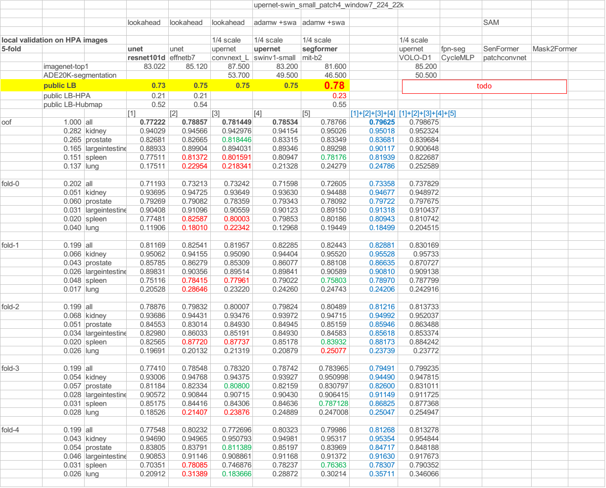

# HuBMAP + HPA - Organ Segmentation 轻量深读（Tier B）

> 赛事：Research ｜ 主题 cv（病理图像分割，5 器官）｜ 1174 队 ｜ 代码赛 ｜ 指标：Dice
> 材料基础：`digests/hubmap-organ-segmentation.md`（4 篇正文：3rd 354683 / 4th 354851 / 2nd 354857 / 往届总结 433 行处等；80 条主题索引）+ 2 张图
> 轻读时间：2026-10（Tier B B09）

## 1. 一句话重述与数字账

在 5 个器官（肾/大肠/肺/前列腺/脾）的 H&E 病理切片上分割组织结构的实例。真正的考点是**域偏移（domain shift）**：测试用 HuBMAP 的 H&E 染色，训练大量来自 HPA 的 DAB 染色；host 明说"用不同协议准备的数据也能工作，是本届的核心挑战"。因此顶级方案围绕**染色归一化/直方图匹配 + 多分辨率重采样 + 器官专属建模**展开。

| 关键数字 | 值 | 来源 |
| --- | --- | --- |
| 3rd（354683） | 先剔除一批"疑似错标"的肺（后经 host 澄清是"肺泡的另一种切法"，仍因样本太少而丢弃，**之后用伪标签把它们加回**）；**统一重采样到 HuBMAP 目标分辨率**（原始尺度从 6.3µm/px 的前列腺到 0.2µm/px 的大肠），并按器官加额外降/升采样；同时保留一份 HPA 原始尺度数据；**CutMix 只在同一器官类内做**（p=0.5、α=1.0）；CNN 用 512 裁剪、SegFormer 用 1024（"SegFormer 在小裁剪上明显更差；CNN 加大裁剪反而伤 LB"）；非空掩码采样概率 0.5；重度几何/颜色/形变增强（"让模型知道颜色不重要"）；**直方图匹配**所有训练图到 H&E 的 GTEX/HuBMAP 参考；外部数据：GTEX（约 140 张，H&E）+ HPA（每器官 5.7–6.1 万张 DAB），全部用自集成打伪标签（集成在 HuBMAP 0.59、在 HPA+HuBMAP 0.81） | 354683 |
| 4th（354851，"Stain Normalization is all you need"） | 不用伪标签与外部数据；**双流模型**（肺单独一模型，其余器官另一模型——"其他器官学到的知识与肺冲突"）；编码器 coat-lite-medium / mit(SegFormer) / mpvit + daformer+unet 解码器；**训练时把 HPA 图随机用 Reinhard 或 Vahadane 归一化到那一张 HuBMAP 测试图**，让模型同时学两个特征空间；推理端也做染色归一化 | 354851 |
| 2nd（354857） | "重编码器 + 大分辨率"更有效：3 个 CNN（effnet_b7、convnext_large、tf_effnetv2_l）+ 1 个 Transformer（coat_lite_medium，**单模最好但 CNN 集成更强**）；3 种输入分辨率（768/1024/1472）× 5 折；**辅助输出 organ 与 pixel_size**（pixel_size 按重采样后输入计算、随增强变化）→ 更鲁棒；增强：随机裁剪/填充、缩放、旋转、翻转、颜色、模糊/噪声、饱和度/亮度/对比度、弹性形变；另用外部数据 | 354857 |
| 社区侧 | "**HPA 数据与 HuBMAP 数据会不会有问题？**"（78 票）、"一些洞察"（89 票）、"切片厚度如何影响染色强度的可视化"（56 票）、"外部数据源"（55 票）、"让病理模型对域偏移鲁棒（作者 Heather Couture）"（47 票）、"往届 HuBMAP 方案总结"（50 票） | 社区 |

## 2. 逐方案对照矩阵

| 维度 | 3rd | 4th | 2nd |
| --- | --- | --- | --- |
| 域偏移对策 | **按器官重采样 + 直方图匹配 + 外部数据伪标签** | **双流模型 + 训练时染色归一化（Reinhard/Vahadane）** | 多分辨率 + 器官/像素尺度辅助头 |
| 模型 | CNN（512）+ SegFormer（1024） | coat-lite / SegFormer / mpvit + daformer-unet | effnet_b7/convnext_l/effnetv2_l + coat_lite |
| 外部数据 | GTEX ~140 + HPA 5.7–6.1 万/器官（伪标签） | 无 | 有 |
| 关键细节 | CutMix 仅同器官；非空掩码采样 0.5 | 肺单独建模 | pixel_size 随增强变化 |

## 3. 共识、分歧与裁决

### 共识一：域偏移（HPA→HuBMAP）是本场主问题（3rd/4th + 社区高票帖）

host 明确点题：4th 的标题直接是"染色归一化就是全部"；3rd 用直方图匹配 + 双尺度数据；社区 78 票帖专门质疑 HPA/HuBMAP 数据兼容性，56 票帖可视化切片厚度对染色的影响。**裁决**：病理赛先做"染色/协议审计"，把颜色空间对齐（归一化或强颜色增强）当作模型的一部分。置信度：高。

### 共识二：多分辨率与像素尺度必须显式处理（3rd/2nd）

3rd 按器官重采样到目标分辨率（尺度跨 30 倍）；2nd 用 3 档分辨率并在训练中跟踪 pixel_size 作为辅助目标。**裁决**：像素尺度差异大时，重采样到统一物理尺度 + 多分辨率训练/集成优于单一分辨率。置信度：高。

### 共识三：肺（lung）是特殊子分布（3rd/4th）

3rd 专门处理肺（丢弃再伪标加回）；4th 直接给肺单独一条流（"其他器官的知识会伤害肺"）；社区基准表也显示 lung 分项显著低于其他器官。**裁决**：当某器官/类别与其余数据的特征冲突时，**分组建模**（多流/多头）比强行共享主干更稳。置信度：高（多队独立 + 分项分数）。

### 分歧一：外部数据/伪标签的收益

3rd 用 GTEX+HPA 数万张伪标签（并在 HPA 上 0.81），4th 完全不用仍拿第 4。**裁决**：外部数据不是必需；当主问题是"染色域偏移"时，归一化+增强可能比堆数据更划算。置信度：中高。

### 事件：重编码器与大分辨率的收益（2nd + 基准表）

2nd 结论"重编码器 + 更大分辨率更好"；社区基准表（图 1）显示 `convnext_l`/`swin` 等在 lung 上明显优于 resnet101d。**裁决**：病理分割里主干容量与分辨率是主要杠杆，但要注意"加大 CNN 裁剪伤 LB"（3rd）——训练裁剪尺度要与推理/域特性匹配。置信度：中高。

## 4. 证据分级

| 断言 | 等级 | 说明 |
| --- | --- | --- |
| 3rd 的完整管线（重采样/直方图匹配/同器官 CutMix/伪标签） | 自述 + 分数 | 高 |
| 4th 的染色归一化与双流 | 自述（标题结论强、细节完整） | 中高 |
| 2nd 的多分辨率与辅助头 | 自述 | 中高 |
| 社区基准表（各主干×器官×折） | 图（可复核） | 中高 |
| HPA/HuBMAP 兼容性担忧 | 高票讨论 | 中 |

## 5. 悬案与缺口（登记）

- **1st place（356201，48 票）的方案未入库**（本场材料缺口最大的一处）；"Some Insights"（89 票）与"Let's share CV"类帖未细读；
- 3rd 的伪标签集成权重与 HPA 数据规模（5.7 万/器官 vs 训练集）未给出精确收益；
- 4th 未报告"不做归一化"的对照，标题结论的强度来自经验；
- 归档 2 图均来自 332941（基准表），为图证。

## 6. 图表证据

**图 1**（topic 332941）：5 折 × 5 器官的 Dice 基准表——convnext_l/swin 等在 kidney/prostate/spleen 明显强于 resnet101d，而 **lung 列普遍只有 0.18–0.25**（其他器官 0.75–0.95），量化印证了"肺是特殊子分布"与"重编码器更优"两条结论。

## 7. 出处

- 3rd（70 票）：https://www.kaggle.com/competitions/hubmap-organ-segmentation/discussion/354683
- 4th（50 票）：https://www.kaggle.com/competitions/hubmap-organ-segmentation/discussion/354851
- 2nd（56 票）：https://www.kaggle.com/competitions/hubmap-organ-segmentation/discussion/354857
- HPA/HuBMAP 数据质疑（78 票）：https://www.kaggle.com/competitions/hubmap-organ-segmentation/discussion/332714
- 外部数据源（55 票）：https://www.kaggle.com/competitions/hubmap-organ-segmentation/discussion/333886
- 1st（未入库，待补）：https://www.kaggle.com/competitions/hubmap-organ-segmentation/discussion/356201
