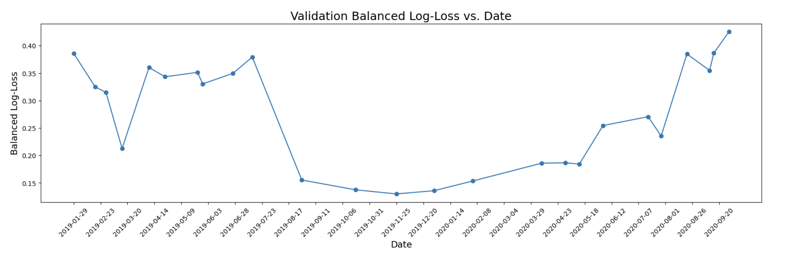

# ICR - Identifying Age-Related Conditions 轻量深读（Tier B）

> 赛事：Featured ｜ 主题 tabular（医疗小样本）｜ 6430 队 ｜ 代码赛 ｜ 指标：Balanced/Weighted Multiclass Log Loss
> 材料基础：`digests/icr-identify-age-related-conditions.md`（10 篇正文：Silver 431067 / 9th 430906 / 1st 430843 / 4th 431173 / Wow 430860 / 3rd 430978 / 相似赛 409596 / 6th 431048 / 5th 430907；120 条主题索引）+ 6 张图
> 轻读时间：2026-10（Tier B B03）

## 1. 一句话重述与数字账

极小的医疗表格数据（~600 行、三分类、大量匿名特征）预测年龄相关状况。真正的考题是**与过拟合/噪声作斗争**：时间漂移、后处理（阈值/置零）的公榜红利与私榜反噬、以及"到底该信什么验证"。

| 关键数字 | 值 | 来源 |
| --- | --- | --- |
| Silver 的时间 CV | 按日期排序 + 给无日期样本随机日期 + **滑窗 CV**；CV **0.27** / 公 0.17 / 私 0.39；时间特征重要度最高（数据随时段变化，可能是不同设备/校准）；各时段难度 0.13–0.42（图 1） | Silver |
| 后处理风险 | 对 25 个 OOF 折分析最优 top/bottom 阈值：**简单时段有效、困难时段无效**；私榜 = 困难时段 → 保守 PP（0.1 以下置 0）与探测伪标都让私榜变差 | Silver |
| 1st | Variable Selection Network DNN；每特征 8 神经元线性投影（不做 MinMax/Standard 归一化）；超大 dropout 0.75/0.5/0.25；概率重加权；10 折×重复 10–30 次、每折选 2 个最好模型；对抗"单折 CV 0.25→0.05 的巨震"；自认运气 | 1st |
| 2nd | "只是 CV"：time/max(time)+1；去掉 time 缺失的异常簇；UMAP+KMeans；手动 permutation 特征剔除；CatBoost+XGB+TabPFN 平均；未用任何探测/后处理 | 2nd |
| 3rd/4th/9th | 3rd：CatBoost + 全特征交叉（LGBM 私 0.38）；4th：CatBoostRegressor 递归填补 + Alpha/Beta/Gamma/Delta 分类概率特征 + 未调参 CatBoost；9th：XGB×2+TabPFN×2（过采样、Epsilon max+1、常数填补）+ 15 折集成（权重 3:1:1）；"postprocessing obviously didn't work" | 3rd/4th/9th |

## 2. 逐方案对照矩阵

| 维度 | 1st | 2nd | 3rd | 4th | 9th |
| --- | --- | --- | --- | --- | --- |
| 模型 | VSN DNN | CatBoost+XGB+TabPFN | CatBoost+特征交叉 | CatBoost（未调参） | XGB+TabPFN |
| 数据/特征 | 线性投影、dropout | UMAP/KMeans、手动筛选 | 全特征交叉 | 递归填补、类别概率 | 过采样、Epsilon 处理 |
| 验证 | 10 折×10–30 重复 | 自建 CV | — | — | 5/15 折 |
| 后处理/探测 | 概率重加权 | **无** | 无 | 无 | 无（PP 失败） |
| 结果 | 1st | 2nd | 3rd | 4th | 9th |

## 3. 共识、分歧与裁决

### 共识一：时间漂移是本题核心结构（Silver + 多队）

时间特征成为最重要特征；每个时间段的难度不同（0.13–0.42）；host 明确"测试在训练之后"。**裁决**：验证必须按时间（滑窗/留后段），随机 CV 会高估。置信度：高。

### 共识二：后处理/阈值/探测在私榜是负期望（Silver + 9th + 1st 的教训）

公开榜宽松时段让 PP 看起来有效；25 折分析显示"困难时段 PP 无效"；Silver 的两种激进提交都失败；9th 直接说 PP 不行。**裁决**：小数据 + 时段漂移下，PP/阈值/伪标的公榜收益不可外推；应做多时段稳健性分析再决定。置信度：高。

### 共识三：过拟合无处不在，简单+正则+重复平均是常态（1st/2nd/4th）

1st 用超大 dropout 与多折重复选择；2nd 手动剔除 + 简单平均；4th 用未调参 CatBoost + 少量特征；"更复杂特征→CV 不稳"。**裁决**：极小样本下模型选择/特征增长都会过拟合；用重复训练与稳健模型族。置信度：高。

### 分歧：最优模型族完全不一致（1st VSN DNN / 2nd CatBoost+TabPFN / 3rd 特征交叉 CatBoost）

三者方法差异巨大却都进前 4，且 1st/2nd 都自认意外。**裁决**：本场的名次有很大运气成分（噪声主导）；任何"单模型族优越"的结论都不可信；真正可复制的是"控过拟合 + 时间 CV + 不做高风险 PP"。置信度：高。

### 事实：Greeks/外部结构大多无用（1st/9th）

1st："Greeks 无用（测试没有对应值）"；9th 只保留 Epsilon 处理。**裁决**：字段只在训练集存在时是陷阱，不能作为特征来源。置信度：中。

## 4. 证据分级

| 断言 | 等级 | 说明 |
| --- | --- | --- |
| 时间 CV 与难度曲线 | 图证 + 自述（25 折分析） | 高（方法层面） |
| PP/探测私榜失败 | 多队独立自述 | 高 |
| 1st 的 DNN 细节与不稳定性（0.25→0.05） | 自述 | 中高 |
| 2nd/3rd/4th 的"无 PP/无探测" | 自述 + 公开代码 | 中高 |
| 各队最终名次 | 官方结果 | 高 |

## 5. 悬案与缺口（登记）

- 高票讨论帖未入库：`How To Balance Training And Boost CV and LB`（382 票）、`Balanced Log Loss Explained`（275）、`Dataset with integerized columns`（224）、`Postprocessing risk explained`（195）、`Things you should know`（138）、`TabPFN 好坏丑`（103）——PP/权重体系的原帖缺失。
- 官方是否对数据漂移/后处理做处置未收录；2 个 final submission 的选择机制未分析。
- 1st 的 VSN 具体实现（论文引用）与重加权公式未展开。

## 6. 图表证据

**图 1**（topic 431067，Silver）：Validation Balanced Log-Loss vs Date——同一模型在不同时间段的难度从约 0.13 到 0.42。**"私榜=困难时段"与后处理失效的机制证据**。

## 7. 出处

- Silver 时间 CV（431067）：https://www.kaggle.com/competitions/icr-identify-age-related-conditions/discussion/431067
- 9th（430906）：https://www.kaggle.com/competitions/icr-identify-age-related-conditions/discussion/430906
- 1st（430843）：https://www.kaggle.com/competitions/icr-identify-age-related-conditions/discussion/430843
- 4th（431173）：https://www.kaggle.com/competitions/icr-identify-age-related-conditions/discussion/431173
- 2nd Wow（430860）：https://www.kaggle.com/competitions/icr-identify-age-related-conditions/discussion/430860
- 3rd（430978）：https://www.kaggle.com/competitions/icr-identify-age-related-conditions/discussion/430978
- 6th（431048）：https://www.kaggle.com/competitions/icr-identify-age-related-conditions/discussion/431048
- 5th（430907）：https://www.kaggle.com/competitions/icr-identify-age-related-conditions/discussion/430907
