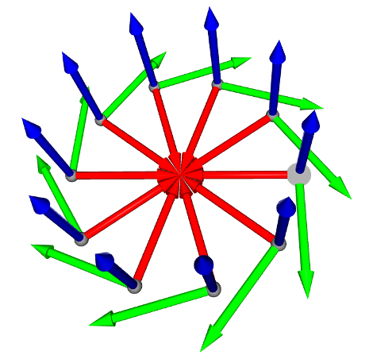

# Image Matching Challenge 2024 轻量深读（Tier B）

> 赛事：Research ｜ 主题 cv（三维重建）｜ 929 队 ｜ 代码赛 ｜ 指标：mAA-on-camera-centers-with-registration
> 材料基础：`digests/image-matching-challenge-2024.md`（6 篇正文：1st 510084 / 2nd 510499 / 3rd 510338 / 4th 510611 / 5th 510603 / 8th 509902；80 条主题索引）+ 12 张图
> 轻读时间：2026-10（Tier B B06 收官）

## 1. 一句话重述与数字账

IMC 2024 在 2022 版基础上引入了两个新难点：**透明/反光物体场景**与**被旋转的图片**。真正的新考点是**"分场景处理"**：常规场景继续卷特征匹配与 SfM 工程，透明场景则靠"图像排序 + 把相机摆到圆周上"这种几何先验直接拿分。

| 关键数字 | 值 | 来源 |
| --- | --- | --- |
| 1st（510084） | 常规场景：ALIKED(n16)+LightGlue 高分辨率（1280/2048，原图+裁剪）匹配集成、**按匹配数过滤图像对**（单检测器 ≥30、全集成 ≥100）、**逐图 DBSCAN 裁剪**（与 IMC2022 的逐对裁剪不同）、每对图旋转 0/90/180/270 取匹配最多者、缓存关键点、多 GPU+混合精度、重复建图 + Horn 对齐合并多解；透明场景：**DIP 模块**——用光流/像素差/SSIM/匹配数构造距离矩阵 → TSP 排序 → 按圆周均匀布相机；**透明 trick 提升 LB +0.03**；最佳私榜是 ALIKED+LG 与 OmniGlue 的合并（未选）；密集匹配器（LoFTR/DKM/RoMa/OmniGlue/XFeat/SIFT 等）、检索 CNN（NetVLAD/DINO-SALAD）、PixSFM/DFSFM 精化、3D RANSAC、去模糊等均未奏效 | 510084 |
| 4th（510611） | ALIKED-n16+LightGlue；旋转图按 4 个角度缓存关键点；匹配阈值 100/125；透明场景：**用 DINOv2 Segmenter 的 VOC2012 第 5 类（"bottle"）当前景掩码**，在原尺度 1024×1024 网格内只检测前景关键点、且只在与对应网格间匹配；**穷举所有图像对**；**使用 images 文件夹里所有图像（不限于 submission.csv）**——消融表：baseline priv 0.149 → +透明 trick 0.184 → +穷举 0.186 → +全量图像 **0.197**（pub 0.136→0.171→0.176→0.194；val 0.26→0.32→0.34→0.43） | 510611 |
| 2nd（510499） | 常规：**MST 骨架 + 迭代加入冗余关联**的 SfM 优化；透明：同样的"排序+圆周布相机"思路；**自研全局描述子**（ALIKED 点特征 + DINO 块特征 → 一对一对应 → 聚类 + VLAD）：NetVLAD 0.241/0.230 vs 自研 **0.245/0.247**；局部特征集成（Dedode v2+双 softmax / DISK+LightGlue / SIFT+NN）；旋转检测（<10% 判旋转则保留原方向）、同尺寸时共享内参、用图像间平均差异判断透明场景；基于 IMC2023 第 7 名 RMD-3DV 的开源代码 | 510499 |
| 3rd（510338） | **VGGSfM**：全帧跑 mAA +0.04（但 16GB 显存会 OOM）→ 拆成三条增量：① 用 VGGSfM track predictor 给 pycolmap 补充 2D 匹配（N=5 近邻，本地 +3%、LB ~0.17→0.18）② **用 VGGSfM 精化 pycolmap 的 SfM track**（31×31 patch，只精化重投影误差最大的 4096 条 track，Church 重投影误差 0.64→0.55；LB ~0.18→0.20）③ 用 VGGSfM 重定位未注册图像 + Umeyama 对齐 | 510338 |
| 8th（509902） | ALIKED+LightGlue；因旋转会降低关键点数，**先 4 向旋转找点 → 用 Homography 校正两图方向 → 再匹配**；pycolmap 分别以 simple-radial×2 + simple-pinhole×1 跑三次、取最大模型；双线程提点 + 双进程 COLMAP，T4×2 各绑一块 GPU | 509902 |
| 事件 | "Strange Behavior in IMC?"（35 票）与"推断榜单与末期洗牌"（29 票）；"LightGlue vs SuperGlue"（28 票）；IMC2023 冠军代码公开（27 票） | 社区 |

## 2. 逐方案对照矩阵

| 维度 | 1st | 2nd | 3rd | 4th | 8th |
| --- | --- | --- | --- | --- | --- |
| 匹配器 | ALIKED+LightGlue（高分辨集成） | 三种局部特征集成 | ALIKED+LG + VGGSfM tracks | ALIKED+LG | ALIKED+LG |
| 图像对 | 匹配数阈值过滤 | MST 骨架 | NetVLAD/DINO 近邻 | **穷举** | 4 向旋转 + Homography 校正 |
| 透明场景 | **TSP 排序 + 圆周布相机** | 同上 + 自研全局描述子 | — | **DINOv2 bottle 分割 + 网格匹配** | — |
| 图像池 | 提交列表 | 提交列表 | 提交列表 | **images 全量** | 提交列表 |
| 关键增量 | 透明 trick +0.03 | 全局描述子 +0.004~0.017 | VGGSfM 三条增量 +0.03 | 全量图像 +0.011 | 旋转鲁棒 + 多模型 |

## 3. 共识、分歧与裁决

### 共识一：透明场景必须单独处理（1st/2nd/4th）

SfM 在透明/反光物体上直接失效；1st/2nd 用"排序 + 圆周布相机"的几何先验（+0.03 LB），4th 用前景分割 + 网格内匹配。**裁决**：新场景类别出现时，先问"这个类别的物理结构能否直接给位姿约束"，而不是继续调匹配器。置信度：高。

### 共识二：ALIKED+LightGlue 是本届的性价比之王（1st/4th/8th）

三队主力都是 ALIKED+LightGlue；1st 试过 LoFTR/DKM/RoMa/OmniGlue/XFeat/DISK/SIFT 后仍选择它（理由：密集匹配器跨图重复性差、噪声高）。**裁决**：工具换代（IMC2022 的 LoFTR/SuperGlue → IMC2024 的 ALIKED/LightGlue）要跟着社区最新验证走。置信度：高。

### 共识三：工程（缓存、并行、多解合并）决定能否用满时间预算（1st/3rd/8th）

1st 缓存关键点描述子、双 GPU 并行、重复建图 + Horn 合并；3rd 把 VGGSfM 拆成"补匹配/精化/重定位"以适应 16GB 限制；8th 用 2 线程 + 2 进程跑满 T4×2。**裁决**：9 小时限时的代码赛里，"能否把方案跑完"与"方案有多好"同等重要。置信度：高。

### 分歧一：图像对怎么选

1st 用"匹配数阈值"而不是检索模型；2nd 用 MST 骨架 + 自研全局描述子；4th 直接穷举（"场景图像数本来就不多"）；8th 用旋转校正。**裁决**：当每场景图像数少时穷举最稳；图像多时再上检索/骨架。检索模型的收益只在候选对质量成为瓶颈时体现（2nd 的 NetVLAD vs 自研差距仅 0.004~0.017）。置信度：中高。

### 事件：用"提交列表之外的图像"（4th）

4th 发现 test 的 images 文件夹里有 submission.csv 未列出的图像，把它们纳入重建后 LB +0.011。**裁决**：代码赛要审计"数据目录 vs 提交清单"的差异；这类"白送的数据"往往被忽视。置信度：中高（有消融表）。

### 事件：旋转鲁棒性（4th/8th）

主办方去掉了 EXIF、可能故意旋转图像；4th 缓存 4 个角度的关键点，8th 先旋转找点再用 Homography 校正后重匹配。**裁决**：无 EXIF 的图像匹配要显式处理旋转（枚举角度或校正后再匹配）。置信度：高。

## 4. 证据分级

| 断言 | 等级 | 说明 |
| --- | --- | --- |
| 1st 的透明 trick +0.03 与各模块细节 | 自述 + 公开代码 | 高 |
| 4th 的四行消融表（0.149→0.197） | 自述 + 表（含三个场景的 val） | 高 |
| 3rd 的 VGGSfM 三条增量与耗时 | 自述 + 代码 | 中高 |
| 2nd 的全局描述子对照（NetVLAD vs 自研） | 自述 + 表 | 中高 |
| 8th 的双 GPU 编排 | 自述 | 中 |

## 5. 悬案与缺口（登记）

- 5th（定制场景匹配，31 票）与 6th/7th 的方案未细读；"Strange Behavior in IMC?"（35 票）与"榜单推断"（29 票）未细读；
- 1st 的"最佳私榜合并 OmniGlue 未选"提示 OmniGlue 价值可能被低估，无进一步证据；
- 透明场景的官方评测阈值与类别定义未在材料中展开；
- 归档 12 图：1st 的 8 张（管线/裁剪/透明圆周/数据集）、4th 的 6 张（分割与关键点可视化）为主要图证。

## 6. 图表证据

**图 1**（topic 510084）：1st 的整体管线——非透明场景走 COLMAP 的 I3DR（ALIKED+LightGlue 匹配集成 → 两视图几何 → 增量建图），透明场景走 DIP（排序 + 圆周布相机）；两条路径在提交端合并。

**图 2**（topic 510084）：透明场景的 DIP 假设——相机在物体周围近似圆周、朝向物体；据此把排序后的图像按均匀角度摆放，直接给出旋转矩阵与平移向量（"透明 trick" +0.03 的来源）。

## 7. 出处

- 1st（510084）：https://www.kaggle.com/competitions/image-matching-challenge-2024/discussion/510084
- 2nd（44 票）：https://www.kaggle.com/competitions/image-matching-challenge-2024/discussion/510499
- 3rd（31 票）：https://www.kaggle.com/competitions/image-matching-challenge-2024/discussion/510338
- 4th（46 票）：https://www.kaggle.com/competitions/image-matching-challenge-2024/discussion/510611
- 5th（31 票）：https://www.kaggle.com/competitions/image-matching-challenge-2024/discussion/510603
- 8th（58 票）：https://www.kaggle.com/competitions/image-matching-challenge-2024/discussion/509902
