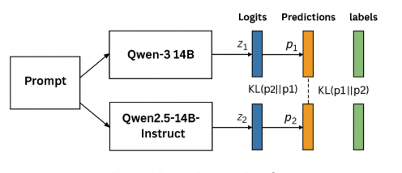
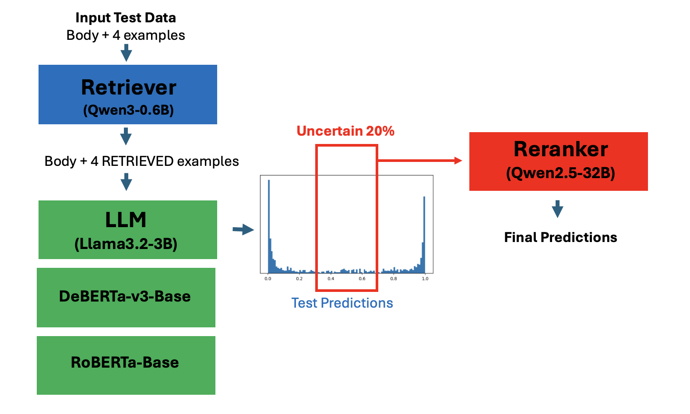

# Jigsaw Agile Community Rules 深读：Train-on-Test 与在线蒸馏

> 赛事：Featured ｜ 主题 nlp（内容审核）｜ 2445 队 ｜ 代码赛 ｜ 指标 每规则 AUC 的平均（2025-10-23 截止）
> 材料基础：`digests/jigsaw-agile-community-rules.md`（7 节：1st/3rd/6th/7th/12th/120th + "规则公开"帖）+ 3 张图
> 深读时间：2026-10（Tier A #24）

## 0. 一句话重述：这道题真正在考什么

题面是"判断评论是否违反某社区规则"，实际被考的是**训练期看不到测试规则时的在线适配工程**：

1. **规则/分布迁移是结构性的**：训练只有 2 条规则，测试有 6 条（4 条全新）；规则文本与测试样本在推理期才可见 → **本地 CV 无法模拟**（7th：CV 与 LB 毫无相关）；
2. **Train-on-Test 是全场共识**：test.csv 中的正负样例 + 规则可用作训练数据，加上 **12 小时推理窗口** → 在线微调（TTT）/直接训练是最大杠杆；所有名次靠前的方案都在"用测试训练"；
3. **公开榜是可信验证**：主办确认公开/私榜**随机划分**、公开约占 30% → 公开榜是私榜的无偏低方差估计；1st/3rd/7th 全部以此代替本地 CV（与 ICR/Amex 的"公开榜陷阱"恰好相反）；
4. **蒸馏的变体**：没有更大教师、软标签又极尖（softmax≈one-hot，温度缩放无效）→ 6th 用 **Deep Mutual Learning（在线互学习）**；3rd 用"慢集成（LLM）+ 快集成（小模型）"；120th 用 RAG 检索相似样例 + 对不确定 20% 用 32B 重排；
5. **数据与推理工程**：剔除 subreddit（+0.007）、按 rule-body-label 去重与多数投票、Unsloth 在 T4 上塞 14B、只算 Yes/No token 的损失、按规则内排名做 AUC 融合。

一句话：**这是一场"在线适配 + 推理预算编排"的比赛**——模型（Qwen 家族）是公共品；分差来自"用测试学到多少 + 12 小时内塞进多少模型 + 对规则迁移的鲁棒性设计"。

## 1. 材料与角色

| 帖子 | 作者 | 票数 | 角色与独有信息 |
| --- | --- | --- | --- |
| [607941](https://www.kaggle.com/competitions/jigsaw-agile-community-rules/discussion/607941)（规则公开，127 票） | c-number（社区整理） | 127 | **6 条规则全文**（2 公开 + 4 私榜）：广告/法律建议/财务建议/医疗建议/非法活动/剧透——新规则是"专业建议类"内容审核 |
| [613305](https://www.kaggle.com/competitions/jigsaw-agile-community-rules/discussion/613305)（1st，118 票） | Guanshuo Xu | 118 | **公开榜=验证集**的论证；subreddit 剔除；只对 Yes/No token 计损失；候选 token 集 + log-odds；per-rule 排名融合；6 模型集成 0.9344/0.9293 |
| [613150](https://www.kaggle.com/competitions/jigsaw-agile-community-rules/discussion/613150)（6th，107 票） | ducnh279 | 107 | **DML 在线互学习**：KL 互蒸馏 + CE；独立训练→DML 对照表；3-peer（含 Qwen3Guard）0.93237/0.92781 |
| [613215](https://www.kaggle.com/competitions/jigsaw-agile-community-rules/discussion/613215)（7th，40 票） | ktr | 40 | 纯 train-on-test；**安全模型红利**（shieldgemma-9b 单模最佳 0.927/0.922）；vLLM Gemma2 fp16 解锁 hack；负面清单（32B 只用训练规则、合成数据失败） |
| [613168](https://www.kaggle.com/competitions/jigsaw-agile-community-rules/discussion/613168)（120th 银牌，40 票） | Chris Deotte | 40 | **RAG + ReRanker**：检索相似正负例做 prompt；4× TTA；只对不确定 20% 调 32B 重排；按规则内排名融合 |
| [613096](https://www.kaggle.com/competitions/jigsaw-agile-community-rules/discussion/613096)（12th，39 票） | losingself | 39 | 无标签数据软标签预训练（deberta-base：0.912→0.924，1 小时）；Claude 采样审计；bf16-on-T4 慢 6× 的公共 bug |
| [613324](https://www.kaggle.com/competitions/jigsaw-agile-community-rules/discussion/613324)（3rd，35 票） | Sergio Papadakis | 35 | **双速集成**：慢（8×Qwen2.5/3 7B-14B）+ 快（bge-base/Qwen3-embed-0.6b/DeBERTa-small）；LoRA 预训练→TTT→末 token 嵌入→经典 ML 头部 |

**材料缺口（未扩采，登记备查）**：23 条 write-up 标记中仅收录 7 节（2nd/4th/5th 等未收）。

## 2. 逐方案对照矩阵

| 维度 | 1st Guanshuo | 3rd Sergio | 6th ducnh279 | 7th ktr | 12th losingself | 120th Chris |
| --- | --- | --- | --- | --- | --- | --- |
| 核心策略 | Train-on-test + 6 模型集成 + 公开榜验证 | TTT + 双速子集成（慢 LLM/快小模型） | **DML 3-peer 在线互蒸馏** | Train-on-test + 安全预训练模型 | 无标签软标签预训练 DeBERTa | RAG 检索 + 不确定重排 |
| 数据工程 | 剔除 subreddit；test 上采样 1 次（train×1+test×2 epoch） | 用全部规则/样例重建数据集 | 测试正负样例 + 规则 prompt | subreddit 全弃（+0.007）；rule-body-label 去重 + 多数投票（平票丢弃） | Claude 审计采样（<1% 违规的 subreddit 剔除）；800k/12M 组合 | 检索 top2 正+top2 负相似例 |
| 模型/损失 | Qwen3-14b/8b/4b、Qwen2.5-14b、llama3.1-8b、Ettin-400M；只算 Yes/No token 损失 | 慢 8×Qwen2.5/3；快 bge/Qwen3-emb/DeBERTa；Triplet/ArcFace/CE 多损失 | Qwen3-14B/8B/Qwen3Guard-4B；KL 互蒸馏+CE | Qwen3-14B、phi-4、gemma2-9b、shieldgemma-9b、Qwen3-8B-Guard | DeBERTa-base→large（软标签）+ triplet 8× augs + llama3b | Llama3.2-3B + DeBERTa-base + DistilRoBERTa + 32B 重排 |
| 推理工程 | Unsloth（14B@16GB T4）、LoRA 合并、按长度排序、forward-only、候选 token 集 | Unsloth 单卡单模型并行、LoRA 合并、vLLM 末 token 嵌入 | 2×T4 对半切 + 按长度批 | Unsloth 双卡训练；vLLM Gemma2 fp16 hack | bf16→fp16（T4 提速 6×） | 4× TTA；仅 20% 行调 32B |
| 融合 | **per-rule 排名归一化**（+0.002） | 慢/快两段集成 | 3-peer 加权集成（多样性优先） | 5 模型集成 | 与公开 notebook 集成 | 规则内排名平均（AUC 指标对齐） |
| 成绩 | 0.9344/0.9293 | 单模型 0.896–0.926 | 0.93237/0.92781 | shieldgemma 0.927/0.922 | 0.924 级 | 银牌（120th） |

## 3. 共识、分歧与裁决

### 共识一：Train-on-Test 是本场唯一的强起点（全员）

1st："用 test.csv 的正负样例作为训练数据"；6th/3rd 直接以此构建 TTT 数据；7th："completely relies on train-on-test"；12th 用无标签数据软标签预训练。**本地 CV 无法覆盖 4 条新规则**，而测试样本+规则就是唯一的域内数据。

**裁决**：当"规则/标签语义在测试时出现"且规则允许时，在线适配（TTT/train-on-test）是最大杠杆。置信度最高。

### 共识二：公开榜在此处可以作为验证集（与 ICR/Amex 相反）

1st 的论证：随机划分 + 公开约占 30% → 无偏低方差；3rd/7th 全部用公开榜验证；7th 明确"本地 CV 与 LB 毫无相关，完全信任 LB"。

**裁决**：**公开榜是否可用取决于划分方式**（L4/L6 的边界条件）：随机划分 → 可用；时间/分组划分 + 分布漂移 → 陷阱。同一技术动作在不同赛制下结论相反。置信度最高。

### 共识三：数据卫生有直接分数回报

"剔除 subreddit"（1st："显著提升"；7th：+0.007，因为标注过程不涉及 subreddit，它制造伪重复）；按 rule-body-label 去重 + 多数投票修标签（7th）；12th 的采样审计剔除低违规 subreddit。**新规则下，任何伪相关都会放大。**

**裁决**：规则迁移任务的数据清洗优先级高于模型选择。置信度高。

### 分歧一：无更大教师时怎么蒸馏？——DML vs 各自训练

6th 的对照给出了干净答案：无教师 + 软标签极尖（温度缩放无效）→ **DML 互学习**：Qwen3-14B 0.921→0.925、Qwen2.5-14B 0.919→0.924（私榜），DML 集成 0.9271 vs 独立集成 0.925；但 DML 会引入错误相关性 → 用 3-peer（加 Qwen3Guard-4B）保多样性到 0.92781。

**裁决**：DML 是"无教师蒸馏"的可行替代；同时要用 peer 多样性对冲其相关性副作用。置信度高（有对照表）。

### 分歧二：合成数据到底行不行

7th：合成数据**伤分**（训练 loss 趋零 = 未能模仿测试分布）；1st：为 4 条新规则生成逼真评论是"nontrivial task"（未投入）；12th：用真实无标签数据 + 软标签有效（0.912→0.924）。

**裁决**：合成数据的失败点是"分布不像测试"；真实无标签数据 + 软标签是更稳的路线。置信度中高。

### 分歧三：安全预训练模型的意外红利

7th：shieldgemma-9b 单模最佳（0.927/0.922）、Qwen3-8B-Guard 优于 vanilla（0.920→0.923）；6th 的第三 peer 用 Qwen3Guard-Gen-4B 提多样性；1st 的模型全是通用 instruct 模型。内容审核任务与安全对齐模型的先验天然匹配。

**裁决**：**任务与模型预训练领域匹配**是免费的先验（与 lmsys 的 reward-model 起点同源，L18）。置信度中高（7th 单家对照 + 6th 间接支持）。

## 4. 增量数字账

| 动作 | 数字 | 来源 |
| --- | --- | --- |
| 剔除 subreddit | 7th：+0.007；1st："显著提升" | 1st/7th |
| 只算 Yes/No token 损失 | 统一收敛速度，可共用一组超参 | 1st |
| per-rule 排名归一化融合 | 早期 0.929→0.931（+0.002） | 1st |
| test 上采样 1 次 | 等效 train 1 epoch + test 2 epochs | 1st |
| 1st 最终单模与集成 | Qwen3-14b 0.9297/0.9239 … Ettin-400M 0.8991/0.8944；集成 **0.9344/0.9293** | 1st |
| 6th DML 对照 | 独立 0.925/0.921 vs DML 0.929/0.925；集成 0.929/0.925 → **0.932/0.9271**；3-peer 0.93237/0.92781 | 6th |
| 6th 时间预算 | 训练 5h + 推理 5h（2×T4） | 6th |
| 7th 单模与集成 | shieldgemma 0.927/0.922（最佳单模）；Qwen3-8B-Guard 0.923/0.921；4 模型总耗时 ~10h | 7th |
| 12th 无标签预训练 | deberta-base 软标签：0.912→0.924（2 seeds，约 1h）；采样 800k/12M 组合 | 12th |
| 12th 的 T4 bug | bf16 在 T4 上慢 6×（公共 notebook 常见错误） | 12th |
| 3rd 子集成分数 | 2xQwen3-14b 0.92571/0.92049；2xQwen2.5-14b 0.90828/0.90248；2xbge 0.90952/0.89714 等 | 3rd |
| 120th 重排范围 | 仅 20% 不确定样本用 Qwen2.5-32B | 120th |
| 规则结构 | 2 公开（广告/法律建议）+ 4 私榜（财务建议/医疗建议/非法活动/剧透） | 607941 |

**可复算/结构校验（1 处吻合）**：1st 的"test 上采样 1 次"→ train 1 epoch + test 2 epoch 的等效性 ✓（同数据被见两次）。

## 5. 机制推演

**M1｜为什么 train-on-test 合法且最强**：赛制把"规则文本 + 带标签样例"放在测试集中、且给 12 小时推理窗口——这等价于授予参赛者在推理期做域适应的权利；4 条新规则没有任何训练数据，唯一能学到其语义的来源就是测试样例本身。**本地 CV 的失效不是偶然，而是"新规则没有历史样本"的必然。**

**M2｜为什么公开榜在此可信**：随机划分让公开/私榜同分布，30% 样本量把估计方差压到可接受范围；与 ICR/Amex（时间/患者划分 + 分布漂移）形成对照——**"公开榜是否可信"是赛制属性，不是比赛态度问题**（THEORY L4/L6 的边界条件）。

**M3｜DML 为什么有效**：多模型互学 = 每个模型同时从"硬标签 CE"与"同伴软分布 KL"获得监督；软分布携带类别间相似性（正则化），在无更大教师时提供额外监督信号；但互相学习会共享错误 → 需要第三个不同家族/安全模型的 peer 恢复多样性。

**M4｜为什么经典 KD 失效**：LLM 的二分类 logits 极尖（softmax ≈ one-hot），温度缩放也软不下来——教师没有"暗知识"可传；互学习绕开了"需要一个更强教师"的假设。

**M5｜损失与推理的细节为什么值分**：chat 模板在 Yes/No 前后引入额外 token，若都计入损失会拖慢收敛并跨模型不一致；只对答案 token 计损失 + 构造候选 token 集（Yes/YES/Y/… 及空格变体）+ log-odds sigmoid，是把"生成式 LLM"压成"校准二分类器"的标准工程。**指标是 AUC → 先按规则内排名再融合**（3rd/120th 都强调），因为跨规则的概率尺度不可比。

**M6｜12 小时窗口的预算学**：模型越多、每个越强 → 分越高，但 T4×2 是硬约束；Unsloth/QLoRA/LoRA 合并/长度排序/forward-only/不确定重排，全部是为了"在窗口内多塞一个模型"。这与 rsna/MAAP 的推理金字塔同构，但这里的预算对象是"训练+推理"合一的 12 小时。

## 6. 证据分级

| 断言 | 等级 | 说明 |
| --- | --- | --- |
| DML 提升（0.921→0.925 等） | **可读取（对照表）** | 独立 vs DML 同条件对比 |
| 1st 的集成与单模表 | **可读取 + 代码公开** | 公开 notebook |
| 3rd 的双速集成表 | **可读取** | 每子集成分数列出 |
| subreddit 剔除 +0.007 | **自述（7th）** | 1st 亦独立观察 |
| 7th 的 vLLM Gemma2 解锁 | **可复现（给出 sed 命令）** | 版本 0.10.0 |
| 12th 的 0.912→0.924 | **自述** | 2 seeds，短时长 |
| 规则全文 | **社区整理（经主办讨论确认）** | 6 条规则 |
| 120th 的 RAG/重排分数 | **可复现（公开 notebook 组合）** | 银牌存在性证据 |

## 7. 边界条件与反事实

- **前提**：规则允许用测试样本训练（未禁止）+ 推理窗口足够长（12h）。若禁止 train-on-test 或窗口极短，全场方法论重写。
- **公开榜可用性边界**：仅因"随机划分"成立；若改成按时间/子版划分，1st 的验证策略会误导（对照 llm-detect 的公开榜陷阱）。
- **反事实（6th）**：若坚持经典 KD（等更强教师），在 2×T4 上无法训练教师，只能退化为独立训练（−0.004~0.006 私榜）；DML 是算力约束下的最优解。
- **反事实（7th）**：若无安全预训练模型（shieldgemma/Qwen-Guard），其单模上限 ~0.920，可能掉出金区——**领域匹配的先验是名次级变量**。
- **反事实（12th）**：若不做无标签预训练，只剩公开 Qwen/DeBERTa notebook，分数约 0.912；软标签预训练 +0.012。
- **边界（合成数据）**：合成失败的根因是"分布不像"，而非合成本身；真实无标签数据（12th）是更稳的替代。

## 8. 悬案与失败学

**悬案**

1. **4 条新规则的"标注语义"**：规则文本公开后，仍不清楚标注者对"专业建议 vs 一般讨论"的边界；这决定上限；
2. **DML 的规模上限**：更多 peer / 更大模型组合是否继续增益（6th 只来得及做 3-peer）；
3. **公开榜 30% 的方差**：虽无偏，但其绝对噪声对 0.001 级名次竞争的区分度未量化。

**失败学**

| 失败 | 来源 | 教训 |
| --- | --- | --- |
| 只在训练规则上训 32B、只推公开规则 | 7th | 与 train-on-test 的预测分布不匹配，显著更差 |
| 合成数据 | 7th | 训练 loss 趋零 = 没学到测试分布；弃用 |
| 为 4 条新规则硬造逼真评论 | 1st | "nontrivial task"，成本高收益低 |
| 包含 subreddit 列 | 1st/7th | 制造伪重复与伪相关（+0.007 的代价） |
| 标签不一致不做多数投票 | 7th | 平票保留会略降分；用众数替换 |
| 用经典软标签 KD（温度缩放） | 6th | 软标签太尖，无效；改 DML |
| bf16 在 T4 上训练 | 12th（公共 bug） | 慢 6×；T4 用 fp16 |
| 全量 32B 重排 | 120th | 耗时；只对不确定 20% 重排即可覆盖多数错误 |

## 9. 图表证据

> 路径相对本文件（`analysis/deep/`）：`../../intel/jigsaw-agile-community-rules/bodies/<topic>_img/NN.ext`

**图 1：深度互学习（DML）结构**（6th，topic 613150）——`../../intel/jigsaw-agile-community-rules/bodies/613150_img/01.PNG`

*读图结论*：同一 prompt 分别进 Qwen3-14B 与 Qwen2.5-14B；两路 logits 各自产生预测 p1/p2，除各自的 CE（对 labels）外，还加 **KL(p2‖p1) 与 KL(p1‖p2) 双向互蒸馏**——"没有教师，就让学生互为教师"。

**图 2：RAG + ReRanker 管线（120th 银牌）**（Chris Deotte，topic 613168）——`../../intel/jigsaw-agile-community-rules/bodies/613168_img/01.png`

*读图结论*：Qwen3-0.6B 检索器为每条 body 找 4 个相似样例（2 正 + 2 负）注入 prompt → Llama3.2-3B / DeBERTa / RoBERTa 三路 + 4× TTA → 预测分布直方图 → **只把不确定的 20% 交给 Qwen2.5-32B 重排** → 最终预测。是"检索增强 + 推理预算分层"的完整实例。

**图 3：6th 的提交记录（成绩物证）**（topic 613150）——`../../intel/jigsaw-agile-community-rules/bodies/613150_img/02.PNG`

*读图结论*：帖内提交截图（selected submission），对应其 3-peer DML 集成 0.93237/0.92781——本深读将该图列为成绩佐证（不做额外解读）。

## 10. 对既有笔记/playbook 的修订点

1. `notes/nlp/jigsaw-agile-community-rules.md` 升级：补齐 7 节作者/票数；方案谱系扩为 6 方案对照矩阵；新增 train-on-test 共识、公开榜可信性边界、DML、数据卫生、双速集成、图证与失败学。
2. `playbook/nlp.md` 增补：
   - **规则/指令在测试期出现 → 在线适配（TTT/train-on-test）优先**；
   - **"公开榜可信度"判断清单**（划分方式/样本量/漂移）；
   - **无教师蒸馏 → DML 互学习**（+ peer 多样性对冲相关性）；
   - **损失/推理细节**（只算答案 token、候选 token 集、log-odds、按规则内排名融合）；
   - **安全/领域预训练模型的先验红利**。
3. `playbook/00-通用方法论.md` 增补："**赛制决定技术动作的对错**"：同一动作（信任公开榜、使用测试数据、蒸馏）在不同划分/规则下风险相反——先给赛制画"可信度地图"再动手。

## 11. 出处

- 规则公开（c-number，127 票）：https://www.kaggle.com/competitions/jigsaw-agile-community-rules/discussion/607941
- 1st（Guanshuo Xu，118 票）：https://www.kaggle.com/competitions/jigsaw-agile-community-rules/discussion/613305
- 6th DML（ducnh279，107 票）：https://www.kaggle.com/competitions/jigsaw-agile-community-rules/discussion/613150
- 7th（ktr，40 票）：https://www.kaggle.com/competitions/jigsaw-agile-community-rules/discussion/613215
- 120th RAG（Chris Deotte，40 票）：https://www.kaggle.com/competitions/jigsaw-agile-community-rules/discussion/613168
- 12th（losingself，39 票）：https://www.kaggle.com/competitions/jigsaw-agile-community-rules/discussion/613096
- 3rd（Sergio Papadakis，35 票）：https://www.kaggle.com/competitions/jigsaw-agile-community-rules/discussion/613324
- 未收录缺口（登记备查）：23 条 write-up 标记中的其余条目（含 2nd/4th/5th）
