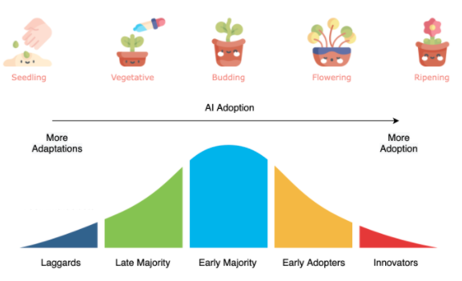

# 2021 Kaggle ML & DS Survey（数据叙事 notebook 赛）轻量深读（Tier B）

> 赛事：Community ｜ 主题 other（meta 数据叙事，评审制）｜ 无排行榜 ｜ 奖项：第 1 名 $10,000 + 4 名 runner-up 各 $5,000 + $1,000 早期提交奖
> 材料基础：`digests/kaggle-survey-2021.md`（6 篇正文：7 条建议 279327 / 获奖名单 295401 / 8 大主题 278727 / 往届获奖 278542 / 早期提交奖 288495 / 21 个获奖示例 281091；72 条主题索引）+ 6 张归档图
> 轻读时间：2026-10（Tier B B16）

## 1. 一句话重述与数字账

第五届 Kaggle 年度调查的"最佳分析 notebook"赛：用问卷数据讲一个**具体**的数据故事，由 Kaggle 评审发奖。本场的最大价值是社区沉淀出的**方法论 checklist**（上届得主的 7 条建议，94 票）与**获奖作品画像**：冠军用多源外部数据构造 **AI 采用指数**，亚军们分别做 5 年性别对比（D3 主题化可视化）、Analyst vs Scientist 薪资/职责、早期职业路径与云趋势——**选题独特性与叙事质量**而非代码复杂度决定名次。

| 关键数字 | 值 | 来源 |
| --- | --- | --- |
| 获奖名单（295401） | 第 1 名 $10,000：《Data Science in 2021: Adaptation or Adoption?》（多源外部数据 + **AI adoption index** + 交互可视化）；4 名 runner-up 各 $5,000：性别 5 年对比（D3 + 1920s 主题）、Analyst vs Scientist（薪资差与职责）、早期职业路径（硕士生 vs 职场人）、云计算趋势（生产力/COVID/地理） | 295401 |
| 7 条建议（279327） | ①选一个具体问题（别做逐变量全景 EDA）；②角度与众不同；③研究并引用来源；④**先确认数据类型再选方法**——问卷几乎全是定性变量，不能出现 Pearson/直方图/线性回归；⑤简单图表 > 花哨图表（避开饼图/3D）；⑥所有结果都要有文字解释与完整轴/标题/图例；⑦注意美学与导航 | 279327 |
| 8 大叙事主题（278727） | ①地域 ②性别 ③技术兴起 ④编程语言 ⑤教育水平 ⑥跨年时序对比 ⑦"有价值的数据科学家" ⑧"如何成为数据科学家" | 278727 |
| 社区资产 | 往届获奖名单（2017–2020，54 票）；21 个分析赛获奖 notebook 巡礼（25 票）；外部数据集清单（24 票）；可视化改进建议（25 票）；$1,000 早期提交奖（47 票） | 索引 |

## 2. 逐方案对照矩阵

| 维度 | 冠军 | Runner-up（性别） | Runner-up（职业对比） | 上一届得主的建议 |
| --- | --- | --- | --- | --- |
| 选题 | AI 采用指数 | 男/女 5 年对比 | Analyst vs Scientist | "选一个具体问题" |
| 数据 | 多外部源拼接 | 2017–2021 跨年 | 同届调查 | 研究+引用来源 |
| 可视化 | 交互式 | D3.js + 1920s 主题 | 简洁图表 | 简单图表 + 完整注释 |
| 技法 | 自建指标体系 | 跨年比较 | 薪资/职责分解 | 方法匹配测量尺度 |

## 3. 共识、分歧与裁决

### 共识一：方法必须匹配数据尺度——问卷数据禁用连续变量方法（279327；置信度高）

作者明确点名 Pearson 相关、直方图、散点图、线性回归不适用于定性变量；"0-1 编码不等于定量"。**裁决**：分析前先写清测量尺度与方法映射。置信度：高。

### 共识二：选题"窄而独特"优于全景 EDA（7 条建议 + 获奖画像；置信度中高）

获奖作品都是"一个明确命题 + 独特角度"（采用指数、性别对比、职业差异）；作者指出"Database-EDA"式 notebook 从不获奖。**裁决**：先定叙事主线，再选图与统计。置信度：中高。

### 共识三：叙事与可视化质量=评分主体，引用与来源标注是硬要求（279327、281675；置信度中高）

建议里包含"引用来源即使未复制代码"、"每个 cell 都要有解释"与"美观导航"。**裁决**：把 notebook 当论文写（问题→方法→结果→结论）。置信度：中高。

### 事件：官方用早期提交奖激励分享（288495；置信度中）

$1,000 奖励"提前公开的优秀 notebook"，与 2022 届冠军"提前两周公开换反馈"策略一致。**裁决**：评审制赛的早期公开是正收益策略。置信度：中。

### 分歧：主题同质化（8 大主题清单；置信度中）

8 大主题既是选题库也是同质化风险提示（性别/教育/语言被反复写）。**裁决**：用主题清单做起点，用外部数据或新指标做差异化。置信度：中。

## 4. 证据分级

| 断言 | 等级 | 说明 |
| --- | --- | --- |
| 获奖名单与评语 | 官方公告 | 高 |
| 7 条建议 | 上届得主自述（94 票） | 中高 |
| 8 大主题 | 社区观察（63 票） | 中 |
| 21 个获奖示例/往届名单 | 社区汇总 + 官方链接 | 中高 |
| 早期提交奖 | 官方公告 | 高 |

## 5. 悬案与缺口（登记）

- 获奖 notebook 的完整技术细节未收录（评语为主）；
- 8 大主题的示例链接在 digest 中未逐条展开；
- 早期提交奖的获奖者名单未收录；
- **图证缺口**：无（6 张图，本深读内嵌 1 张）。

## 6. 图表证据

**图 1**（topic 295401）：冠军作品《Adaptation or Adoption?》的 AI 采用阶段图（Seedling→Ripening 对应 Laggards→Innovators）——把调查数据与外部数据合成为"AI 采用指数"的核心可视化。

## 7. 出处

- 7 条建议（94 票 / 34 评论）：https://www.kaggle.com/competitions/kaggle-survey-2021/discussion/279327
- 获奖名单（63 票 / 31 评论）：https://www.kaggle.com/competitions/kaggle-survey-2021/discussion/295401
- 8 大叙事主题（63 票 / 14 评论）：https://www.kaggle.com/competitions/kaggle-survey-2021/discussion/278727
- 往届获奖名单（54 票 / 17 评论）：https://www.kaggle.com/competitions/kaggle-survey-2021/discussion/278542
- 早期提交奖（47 票 / 20 评论）：https://www.kaggle.com/competitions/kaggle-survey-2021/discussion/288495
- 21 个获奖示例（25 票 / 2 评论）：https://www.kaggle.com/competitions/kaggle-survey-2021/discussion/281091
- 分析赛与讲故事（31 票 / 14 评论）：https://www.kaggle.com/competitions/kaggle-survey-2021/discussion/291684
- 可视化建议（25 票 / 9 评论）：https://www.kaggle.com/competitions/kaggle-survey-2021/discussion/281675
- 外部数据集（24 票 / 2 评论）：https://www.kaggle.com/competitions/kaggle-survey-2021/discussion/280726
