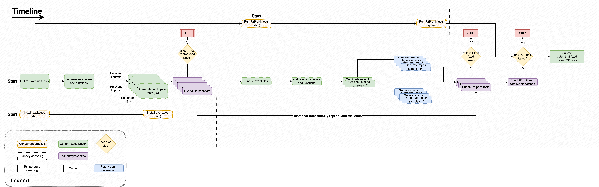
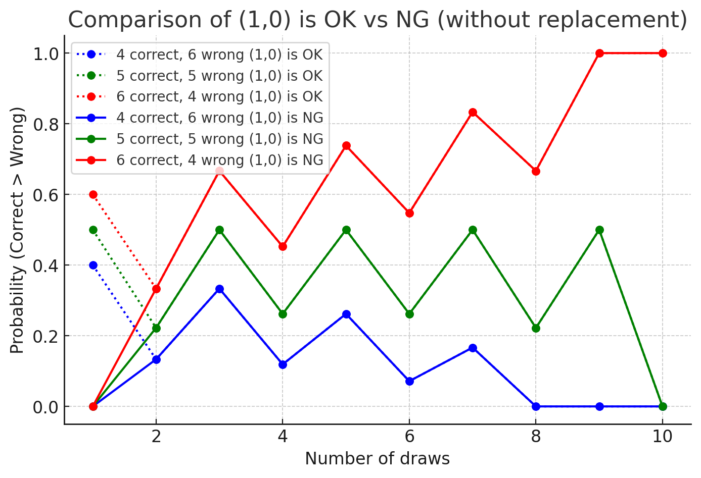

# Konwinski Prize 轻量深读（Tier B）

> 赛事：Featured ｜ 主题 nlp（SWE-bench 式真实 GitHub issue 自动修复，代码赛）｜ 617 队 ｜ 不能用 API，只能用开源 LLM ｜ 指标：K Prize Metric（答对得分、答错重罚、跳过近似中性）
> 材料基础：`digests/konwinski-prize.md`（6 篇正文：1st 568884 / 公开 2nd 568888 / 公开 4th 私榜 15th 568799 / 3rd 597207 / 8th 590920 / 赛事帖 551229；80 条主题索引）+ 9 张归档图
> 轻读时间：2026-10（Tier B B14）

## 1. 一句话重述与数字账

$1M 奖金、单人主办的"SWE-bench+"式比赛：给定真实 GitHub issue 与仓库，产出修复补丁。**答错重罚、跳过几乎无损**，因此本场的核心不是"多解题"而是"**只交有把握的补丁**"。全体参赛者建立在 @huikang 的 `select-patch-verify` starter 与 Agentless 范式之上；1st 的私榜结果只有 **9 对 2 错 109 跳过**，却足以夺冠——"选择与跳过"就是比赛本身。

| 关键数字 | 值 | 来源 |
| --- | --- | --- |
| 数据与赛制 | 训练仅 **6 个样例**；外部 SWE-agent 轨迹数据集约 6,400 条；公榜 **71 个干净样例**、私榜 150–200（更干净）；禁用 API，只能自托管开源 LLM；答错惩罚重、跳过成本极低 | 568799 / 552605 |
| 1st（568884） | 基于 **Agentless 1.5** 改造：为 F2P（fail-to-pass）测试生成提供**上下文检索**（相关单测文件→函数/类骨架→imports；5 个样本用不同上下文层级 + 贪心/采样混合）；F2P+P2P 双重过滤拒绝补丁；**Qwen2.5-Coder-32B** 本地 vLLM；**SEARCH/REPLACE 格式生成补丁**（远优于直接生成 diff）；无 F2P 复现则二次高温度重试；包安装与测试并发；全局 20h / 单题 12min 时间闸；最佳提交 5–7 小时（3–10 分钟/题）；多次提交得分 **0.056–0.098**；私榜 **9 对 / 2 错 / 109 跳过**；agent 模式与推理模型未见增益；单卡 4090 无法做本地验证 | 568884 |
| 公开 2nd（568888） | Agentless 流水线：**Localize → Generate Test → Create Patch → Verify**，多级 skip 检查；LLM 选型对比后定 **Qwen2.5-Coder-32B**（14B 会丢上下文/语法错误多，72B/QwQ/DeepSeek 不稳定）；提示词工程做到"大联盟"规模：4 个 issue 评估、3 个定位、7 个选文件、14 个生成测试、12 个生成补丁、4 个验证提示；自建 10+ 过程指标（file_recall、reproduced_rate、good_test_rate、syntax_success_rate 等）；后 10 次提交平均 **0.052022**（0.028–0.070）；自述"大部分代码由 LLM 写" | 568888 |
| 公开 4th / 私榜 15th（568799） | 三人团队；明言"**忽略 CV、信公榜与方法论**"；模型 = DeepSeek-R1-Distill-Qwen-32B-AWQ；**Edit Distance Selection**（在候选补丁里选与其它候选编辑距离总和最小的"最平均"者）；**激进跳过**：题面长度限制在 1802–3400 字符、文件内容数 ≤388；用超几何分布模拟"超过 (1,0) 分数"的概率来选择挑战次数（最终 5 次）；分阶段时间闸 7/15/19 分钟 + 全局 8h/23h；12 个模块、98 个测试用例、80% 覆盖率；公榜 **(4 对, 0 错) LB +0.056243 → 第 4** | 568799 |
| 3rd（597207） | 基于 @huikang starter；核心 = **难度估计**：在 SWE-bench Verified（400 训练/100 验证）上给 DeepSeek-R1-Distill-Llama-70B-AWQ 加 LoRA（rank 32）做 easy/medium/difficult 三分类，P(easy)<0.5 直接跳过；搜索查询生成 ×6 并行 → 6×6 生成补丁 → LLM 判定 + unidiff 解析 + dry-run 三重验证；自述"第 3 名有运气成分" | 597207 |
| 8th（590920） | 基于 @huikang starter；关键词过滤（如含 "error" 的补丁）边际收益小；找到一组**权重配置**——失败很多但"成功时正确/错误比极高"——把提交集中在该配置上，两份提交都拿到金牌 | 590920 |
| 社区与工具 | huikang starter 被 3rd/8th/1st/2nd 广泛引用（社区公认 MVP）；80,036 条 SWE-agent 轨迹 + 6,411 个 GitHub issue 公开数据集（43 票）；社区给出"如何从 LB 分数反推 (n_correct, n_wrong, n_skipped)"的方法（38 票）；首个不拿 -1 的公开 notebook（39 票）；赛制升级/队列/延长选提交期请愿（24/21/19 票）；"gigachad 比赛"帖（84 票） | 索引 |

## 2. 逐方案对照矩阵

| 维度 | 1st | 公开 2nd | 公开 4/私 15 | 3rd | 8th |
| --- | --- | --- | --- | --- | --- |
| 骨架 | Agentless 1.5 | Agentless | starter + 自研 skip | huikang starter + 难度分类 | huikang starter |
| 模型 | Qwen2.5-Coder-32B | Qwen2.5-Coder-32B | DeepSeek-R1-Qwen-32B-AWQ | DeepSeek-R1-Llama-70B-AWQ | — |
| 关键技巧 | 上下文检索 + SEARCH/REPLACE + 双测验证 | 多提示词联盟 + 过程指标 | **超几何选挑战数 + 编辑距离选择** | **LoRA 难度估计跳过** | 权重配置筛选 |
| 跳过策略 | 无 F2P 复现即跳过 | 多级检查 | 长度/文件数/时间多阈值 | P(easy)<0.5 | 高正确/错误比配置 |
| 结果 | 1st（9/2/109） | 公榜均分 0.052 | 公 4th / 私 15th | 3rd | 8th |

## 3. 共识、分歧与裁决

### 共识一：社区 starter（huikang 的 select-patch-verify）+ Agentless 是全场的公共底座（1st、2nd、3rd、8th、568799；置信度高）

3rd/8th 明确说 starter 是基础；1st/2nd 从 Agentless 改造；社区数据集（80k 轨迹）也人人可用。**裁决**：这类"高工程复杂度 + 极少训练数据"的比赛，强公开起点 + 增量工程是最优策略。置信度：高。

### 共识二：选择/跳过机制与生成能力同等重要（1st、2nd、3rd、568799、8th；置信度高）

568799 用超几何模拟决定"挑战几次"、并按题面长度与文件数跳过；3rd 用 LoRA 难度分类；1st 用"无 F2P 复现即跳过"；8th 用高正确/错误比配置。**裁决**：在惩罚不对称的指标下，**漏斗式拒绝（只交高置信补丁）**是第一优化目标；生成端提升要服务于该漏斗。置信度：高。

### 共识三：32B 级开源模型足够（前提是上下文与输出格式工程）（1st、2nd、568799；置信度中高）

1st/2nd 用 Qwen2.5-Coder-32B，568799 用 DeepSeek-32B-AWQ；1st 明确说 SEARCH/REPLACE + 相关单测上下文让小模型可用；推理模型/mega 上下文未见优势。**裁决**：本地推理下"结构化输出 + 精准上下文"比模型规模更重要。置信度：中高。

### 分歧：评估与提交策略（1st/2nd 自制过程指标 vs 568799 信公榜+模拟；置信度中）

1st/2nd 建了 10+ 过程指标（file_recall、good_test_rate 等）但承认"指标提升不等于分数提升"；568799 直接忽略 CV、用超几何模拟公榜局势。**裁决**：本场本地验证不可行（1st 单卡放弃），两者分别代表"过程度量派"与"博弈派"，都能进前列；关键是把不确定性显式建模。置信度：中。

### 事件：赛制与基础设施风险（队列、选提交期、时间忽略政策、L4x4 卡死；置信度中高）

社区请愿延长选提交期、官方宣布排队时间不计入、公开帖抱怨 L4x4 池卡死；最终名次高度依赖提交时刻与随机性（3rd/8th 自述运气）。**裁决**：比赛机制本身（队列/时间窗/评分离散）是主要方差来源；应在策略里为它留冗余。置信度：中高。

## 4. 证据分级

| 断言 | 等级 | 说明 |
| --- | --- | --- |
| 1st 的 Agentless 改造与私榜 9/2/109 | 自述 + 管线图 | 中高 |
| 568799 的超几何模拟与跳过阈值 | 自述（含多张仿真图） | 高 |
| 2nd 的提示词数量与过程指标 | 自述（含全部指标定义） | 中高 |
| 3rd 的 LoRA 难度分类 | 自述 | 中 |
| 8th 的权重配置筛选 | 自述（简短） | 中 |
| 数据规模（6 训练 / 71 公榜） | 多帖一致 | 中高 |

## 5. 悬案与缺口（登记）

- 私榜完整前三名构成与最终分数表未收录（1st 私榜 9/2/109 由作者披露）；
- @huikang starter 的具体实现未细读（作为公共底座仅在多帖中被引用）；
- 赛制升级/选提交期请愿的最终处理未逐条跟进；
- **图证缺口**：无（9 张图，本深读内嵌 2 张）。

## 6. 图表证据

**图 1**（topic 568884，1st）：全流程时间线——相关单测/类函数/imports 三路上下文 → 生成 5 个 F2P 测试（3 个无上下文 + 2 个带上下文）→ 复现失败则 SKIP → 定位文件/类函数/细粒度编辑点（×2）→ 8 个修复补丁（每编辑点 4 个）→ F2P/P2P 验证 → 通过才提交。

**图 2**（topic 568799，公开 4/私 15）："超过 (1,0) 分数"的概率 vs 挑战次数（不同真值组合）——理解该曲线后，团队把挑战次数确定为 5，并据此设计跳过阈值。

## 7. 出处

- 1st（75 票 / 36 评论）：https://www.kaggle.com/competitions/konwinski-prize/discussion/568884
- 公开 2nd（42 票 / 6 评论）：https://www.kaggle.com/competitions/konwinski-prize/discussion/568888
- 公开 4th / 私榜 15th（23 票 / 5 评论）：https://www.kaggle.com/competitions/konwinski-prize/discussion/568799
- 3rd（11 票）：https://www.kaggle.com/competitions/konwinski-prize/discussion/597207
- 8th（13 票）：https://www.kaggle.com/competitions/konwinski-prize/discussion/590920
- 80,036 条 SWE-agent 轨迹数据集（43 票）：https://www.kaggle.com/competitions/konwinski-prize/discussion/552605
- 首个不为 -1 的 notebook（39 票 / 31 评论）：https://www.kaggle.com/competitions/konwinski-prize/discussion/561695
- 从 LB 反推 (correct, wrong, skipped)（38 票）：https://www.kaggle.com/competitions/konwinski-prize/discussion/557148
- starter notebook（29 票）：https://www.kaggle.com/competitions/konwinski-prize/discussion/553294
- gigachad 比赛帖（84 票 / 22 评论）：https://www.kaggle.com/competitions/konwinski-prize/discussion/551229
