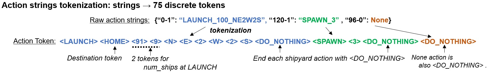
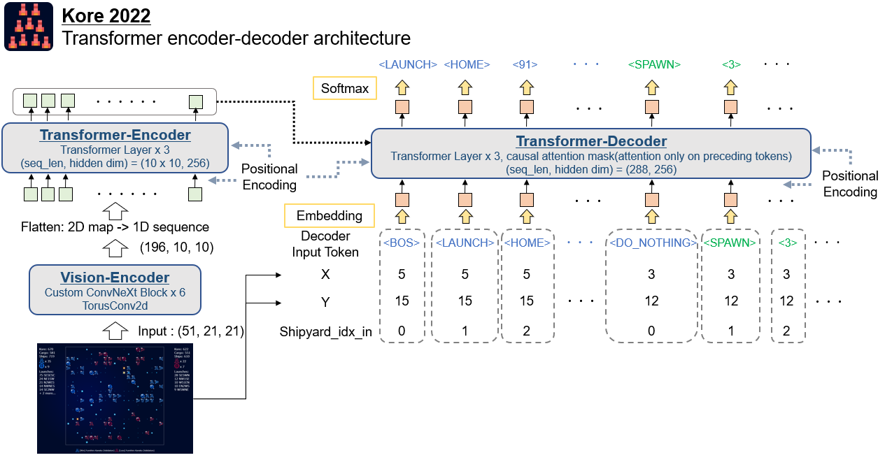
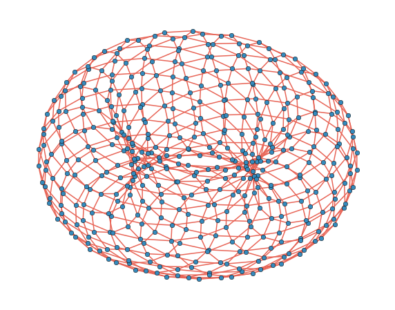

# Kore 2022 轻量深读（Tier B）

> 赛事：Featured ｜ 主题 sim-agent（1v1 太空资源对抗 RTS）｜ 469 队 ｜ 标准赛（提交 agent 互相对战）｜ 指标：kore_fleets（对战胜率/Elo 式评分）
> 材料基础：`digests/kore-2022.md`（6 篇正文：1st 340035 / 20th 339972 / 13th 337476 / 34th GNN 339774 / 游戏可视化 320987 / 替代可视化 323495；80 条主题索引）+ 3 张可内嵌 PNG（另有 1 张 13.5MB GIF 未内嵌、1 张截图缺失）
> 轻读时间：2026-10（Tier B B11）

## 1. 一句话重述与数字账

Kore 是"飞船 + 船坞 + kore 资源"的 1v1 对抗模拟赛：469 队提交 agent 互相匹配、按对战胜率排名。本届结论很锋利——**纯规则/启发式方案统治排行榜**（1st、2nd、4th、5th、20th 均为 rules-based），神经方案（13th 模仿学习、34th GNN）有亮点但排名靠后；胜负关键是"扩张 + 路径规划 + 可视化调试"的工程体系，而不是模型规模。

| 关键数字 | 值 | 来源 |
| --- | --- | --- |
| 1st（340035） | 以 Kore Beta 冠军（egrehbbt）代码为底，**+5,923 行 / −777 行**；六大动作相位（船坞防守 / 舰队攻击 / 船坞攻击 / 扩张 / 采矿 / 造舰）；新增"棋盘账本"（每格每时刻的伤害与伤害潜力）与"近全路径评分"；V92 → V118（2 周 26 次更新）→ V127（夺冠版）；赛后名次反复（basilisk1337 最后一天提交一度登顶） | 340035 |
| 20th（339972） | 经济模型：30 回合"动量" + 实力投射矩阵；新船/新基地 **NPV（1% 折现）**；三级造舰优先队列（critical/high/normal）；试算路径（整/半/21/13/8/5/3/2 艘 + "僵尸舰队"）；关键模块用 **Cython** 加速；新基地偏好"距 6 格 + kore 富集" | 339972 |
| 13th（337476） | 把动作串当**因果语言建模**：字符串 → **75 个离散 token**（目的地 token HOME/FRIEND/ENEMY/CONSTRUCTION/DRIFT；num_ships 拆成 2 个 token；DO_NOTHING 作分隔）；pix2seq 式 encoder-decoder（自定义 ConvNeXt×6 + TorusConv2d + DETR 式位置编码）；自述收敛很慢，最终仍停在模仿学习阶段 | 337476 |
| 34th（339774） | GNN 路线：把 21×21 环面棋盘建模成图（附代码与推理链接）；名次不高 | 339774 |
| 社区工具 | 两套可视化：动画回放（57 票）与 jmerle 的交互式调试器 Koreye 2022（63 票 / 23 评论）——1st 明确说它"至关重要"；"理解动作空间"（48 票 / 27 评论）是入门必读 | 320987 / 323495 / 319857 |
| 收敛 | "提交关闭 - 2 周收敛"（14 票）与"Top 40 每日分数"（15 票）说明最终名次靠持续对局收敛，末期仍会变动 | 336801 / 327155 |

## 2. 逐方案对照矩阵

| 维度 | 1st（规则） | 20th（规则+经济） | 13th（模仿学习） | 34th（GNN） |
| --- | --- | --- | --- | --- |
| 状态表示 | 棋盘账本：每格每时刻的伤害/伤害潜力 | 30 回合动量 + 实力投射矩阵 | 21×21 多通道特征图 | 环面图（节点=格） |
| 决策方式 | 六相位模式 + 近全路径评分 | NPV 估值 → 优先级队列 → 试算路径 | 自回归生成动作串 | 图网络（细节未展开） |
| 核心模块 | 路由/缓存/废弃与救援模式 | 路径优化（Cython）+ 风险调整 | token 化 + Transformer 编解码 | 图表示 |
| 算力 | 纯 CPU（路由与缓存优化） | 纯 CPU + Cython | GPU 训练 | — |
| 结果 | 1st | 20th | 13th | 34th |
| 启示 | 工程纪律 + 工具链 > 算法复杂度 | 把游戏形式化成经济系统 | 动作空间可 NLP 化 | 图视角是自然表示 |

## 3. 共识、分歧与裁决

### 共识一：规则/启发式方案在本场全面胜出（1st、2nd、4th、5th、20th；置信度高）

索引中 1st/2nd/3rd/4th/5th/20th 的标题几乎都带"rule based"，1st 更是 Beta 冠军方案的重度迭代。**裁决**：在动作空间巨大、单局上百回合的对抗模拟赛里，手工策略 + 参数调优的可控性高于端到端 RL；先把规则方案推到上限是理性路径。置信度：高（排名分布直接支持；2nd–5th 正文未收录，依据标题与索引）。

### 共识二：调试工具决定迭代速度（1st、320987、323495；置信度高）

1st 说可视化工具"至关重要"，用它定位每一局失败原因；社区两套可视化工具分别拿到 57/63 票。**裁决**：sim-agent 比赛的头号基础设施是"回放 + 失败归因"工具，其价值高于模型选择。置信度：高。

### 共识三：路径规划/经济模型是核心模块（1st、20th、336804；置信度中高）

1st 用近全路径评分最大化"每船每回合采矿效率"；20th 把路径优化做成独立模块并配 NPV/动量模型；另有"高效最优路径"专帖（14 票）。**裁决**：资源驱动的地图游戏里，路径搜索剪枝与缓存是工程主战场（1st 自述撞过时间/内存瓶颈）。置信度：中高。

### 分歧一：神经方案怎么切入（13th vs 34th；置信度中）

13th 证明"动作串当语言"可训练（75 token、pix2seq 架构），但收敛慢、未转入 RL；34th 直接上 GNN，排名靠后。**裁决**：神经方案在本场的瓶颈是动作空间设计与样本效率，而非网络容量；更现实的定位是"神经做局部评价/预测、规则做决策"。置信度：中（排名证据 + 两帖自述，缺少中间路线案例）。

### 事件：末期收敛与"最后一天"提交（1st、336801、337524；置信度中）

1st 自述赛后排名反复；社区有"2 周收敛"与"关闭后榜单趋势"帖。**裁决**：对抗模拟赛的最终名次依赖持续对局采样，末期仍有不确定性；"对手适应"是持续风险。置信度：中。

## 4. 证据分级

| 断言 | 等级 | 说明 |
| --- | --- | --- |
| 1st 的代码来源、改动量、版本迭代 | 自述（含数字） | 中高 |
| 20th 的经济模型与路径试算细节 | 自述（结构完整） | 中高 |
| 13th 的 token 化与网络架构 | 自述 + 2 张架构图 | 高 |
| 34th 的图视角 | 自述 + 1 张图（无细节） | 中 |
| 规则方案 vs 神经方案的排名分布 | 公开榜单 + 索引标题 | 高 |
| 可视化工具的作用 | 1st 自述 + 两帖票数 | 中高 |

## 5. 悬案与缺口（登记）

- 2nd（340994）/ 3rd（342296）/ 4th（340157）/ 5th（339979）/ 10th（340159）/ 15–20th（336826）/ 60th（340115）等 write-up 未收录正文，只能从标题判定路线；
- "理解动作空间"（319857）与"高效最优路径"（336804）正文未细读；
- RL 侧仅有入门/工具帖（如 327460），无高质量 RL 方案可评估；
- 归档 4 图中：1 张为 13.5MB GIF（不内嵌）、1 张截图缺失（323495_img 为空）——可嵌 3 张 PNG；
- **图证缺口**：Koreye 可视化工具截图未归档。

## 6. 图表证据

**图 1**（topic 337476，13th）：动作串 → 75 个离散 token；LAUNCH 后紧跟目的地 token，num_ships 拆 2 个 token，每个船坞动作以 DO_NOTHING 收尾。

**图 2**（topic 337476，13th）：Vision-Encoder（ConvNeXt×6 + TorusConv2d）→ Transformer-Encoder×3 → 因果 Transformer-Decoder×3；解码器额外输入船坞坐标与序号。

**图 3**（topic 339774，34th）：把 21×21 环面棋盘画成图结构（每个格子为节点）——GNN 方案的状态表示。

## 7. 出处

- 1st（49 票）：https://www.kaggle.com/competitions/kore-2022/discussion/340035
- 20th 经济模型（23 票）：https://www.kaggle.com/competitions/kore-2022/discussion/339972
- 13th 模仿学习（38 票）：https://www.kaggle.com/competitions/kore-2022/discussion/337476
- 34th GNN（30 票）：https://www.kaggle.com/competitions/kore-2022/discussion/339774
- 动画可视化（57 票）：https://www.kaggle.com/competitions/kore-2022/discussion/320987
- 交互式调试器 Koreye（63 票）：https://www.kaggle.com/competitions/kore-2022/discussion/323495
- 理解动作空间（48 票）：https://www.kaggle.com/competitions/kore-2022/discussion/319857
- 高效最优路径（14 票）：https://www.kaggle.com/competitions/kore-2022/discussion/336804
- 2 周收敛（14 票）：https://www.kaggle.com/competitions/kore-2022/discussion/336801
- Top 40 每日分数（15 票）：https://www.kaggle.com/competitions/kore-2022/discussion/327155
- 规则方案索引：2nd 340994 / 3rd 342296 / 4th 340157 / 5th 339979 / 10th 340159 / 15–20th 336826 / 60th 340115
