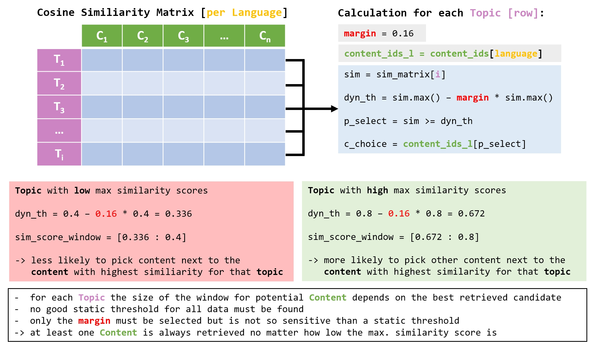
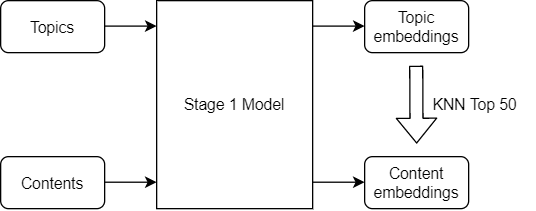

# Learning Equality - Curriculum Recommendations 轻量深读（Tier B）

> 赛事：Featured ｜ 主题 tabular（recsys，多语言检索/匹配）｜ 1057 队 ｜ 代码赛 ｜ 指标：F-Score Beta (Micro)
> 材料基础：`digests/learning-equality-curriculum-recommendations.md`（6 篇正文：1st 394812 / 2nd 395110 / 3rd 394838 / 6th 394813 / ChatGPT 方案 372384 / LB 0.30+ 基线 373640；80 条主题索引）+ 9 张图
> 轻读时间：2026-10（Tier B B05）

## 1. 一句话重述与数字账

为课程"主题"（topic tree 节点）检索匹配的"内容"（content），多语言、一对多、且"无匹配"也合法。真正的考点是**主题树上下文注入（召回质量）+ 阈值/后处理（把排序变成集合）+ 训练期的负样本设计**。

| 关键数字 | 值 | 来源 |
| --- | --- | --- |
| 1st（209 票） | 召回：char-4gram TFIDF（sparse_dot_topn，top-20 >1% 相似）+ 3 模型嵌入集成（seq 64，仅前半段 mean-pool）+ **ArcFace（margin 0.1→0.5/22 epoch）**；补充召回：同标题/同表示文本/同父节点/二跳近邻；特征 23 个（相似度 max/min、树/文本长度、同标题计数、同章节…）；LightGBM 二分类（命中类加权、cosine 距离单调约束 2×）；**后处理按相对概率缺口**（train 内容 >5% 且缺口 <25%；test 内容缺口 <5%；或 topic 是内容最优匹配且总缺口 <55%）。val 0.764 / LB 0.727；效率版 0.688 pub / **0.740 priv**，CPU ~20 分钟 | 1st |
| 2nd（79 票） | **单阶段检索（无重排、无后处理）**：text = `Title # Parent # … # Description`；max len 96；对称 InfoNCE + **自定义 batch 采样**（同批禁止共享内容的 topic、难负样本过采样至 128/样本、batch>768）；**语言切换（en/es/pt/fr 隔 epoch）** +0.01~0.02；**动态阈值**（margin 0.16，各折稳定在 0.14~0.18）**+0.02 以上**；单模 CV 0.654 / pub 0.651 / priv 0.696；5 模型集成 9 分钟/P100；蒸馏（砍半层数）+ 动态量化 JIT 打效率榜 | 2nd |
| 3rd（59 票） | 两阶段：无监督 SimCSE 召回（mpnet-base-v2 F2@5=0.5250 压过 MiniLM 0.4879 / mdeberta 0.4689）→ mdeberta 二分类重排（**加载 SimCSE 权重**：val 0.7149/pub 0.688/priv 0.727，从零训只有 0.6378/0.669/0.693）；FGM+EMA +0.01；阈值×召回数网格搜索；**12 模型 × 50 召回 = priv 0.751**（模型越多、召回越少越强） | 3rd |
| 6th（47 票） | 两阶段：ArcFace 嵌入（margin 0.2→0.6，4 个底座）→ KNN top-50 → **CatBoost/XGB 树特征重排**（嵌入距离/TFIDF 距离/兄弟节点匹配/频道出现次数）；后处理：空值兜底 top-1、共现对补齐、按频道阈值。明说"stage1 单独打不到 0.6，加树结构特征才上分" | 6th |
| 基线（129 票） | 标题嵌入 + KNN + 标题对二分类 → CV 0.40 / LB 0.30；给出"先无监督召回、再有监督分类"的标准骨架 | 373640 |

## 2. 逐方案对照矩阵

| 维度 | 1st | 2nd | 3rd | 6th |
| --- | --- | --- | --- | --- |
| 阶段结构 | 召回+特征+LGBM+后处理 | **单阶段检索** | SimCSE 召回 + 重排 | 嵌入召回 + GBDT 重排 |
| 主题树用法 | 祖先标题进文本 + 同父/同标题召回 | 祖先标题进文本（`#` 分隔） | topic 文本含 context/parent/children 描述 | **显式树特征**（兄弟匹配、频道计数） |
| 对比学习 | ArcFace（有监督，内容为类） | 对称 InfoNCE + 定制 batch | 无监督 SimCSE | ArcFace |
| 阈值策略 | 相对概率缺口规则（4 条件） | **动态阈值（margin 比例）** | 网格搜索（0.01–0.2 × topN） | 按频道搜索阈值 |
| 后处理依赖 | 高（关键） | **无** | 中（空主题兜底） | 中（共现补齐） |
| priv 分数 | 0.727（效率 0.740） | 0.696（单模） | 0.751 | 0.707 |

## 3. 共识、分歧与裁决

### 共识一：主题树上下文是必需输入（4/4 队）

1st 把祖先标题拼进 topic 文本并加"同父节点召回"；2nd 用 `Title # Parent # … # Description`；3rd 的 topic 文本含 parent/children 描述；6th 明确"stage1 无树结构信息，上限 <0.6"，靠树特征重排补齐。**裁决**：层级结构的注入点在"文本表示"还是"重排特征"可以不同，但不注入就是硬上限。置信度：高（4 队独立，含 6th 的负面对照）。

### 共识二：训练期的负样本/批次组成是隐藏主变量（2nd/3rd/6th）

2nd 为 InfoNCE 定制 batch（同批不出现共享内容的 topic、难负样本过采样）；3rd 明说"检索器的难负样本大幅提升重排性能"（0.585→0.688 LB 的对照见 recall 表）；6th 用 KNN top-50 作候选。**裁决**：一对多匹配任务里"批内噪声"是最容易被忽视的性能杀手——把数据采样当成模型的一部分。置信度：高。

### 共识三：阈值不是常量，而是随候选质量缩放（2nd/3rd/1st）

2nd 的动态阈值 `dyn_th = max_sim − margin·max_sim`（+0.02，各折稳定）；3rd 网格搜索阈值+召回数并观察到"验证集变小时 CV-LB 失联"；1st 用"相对概率缺口"替代绝对阈值。**裁决**：评测是集合型 F2，把连续分数切成集合这一步应与模型质量耦合；静态阈值在跨语言/跨频道时不稳。置信度：高（含 2nd 的图证）。

### 分歧一：单阶段检索 vs 两阶段重排

2nd 证明**无重排、无后处理**也能拿 priv 0.696（单模）并夺冠亚军；1st/3rd/6th 都堆了重排/特征/后处理（priv 0.727–0.751）。**裁决**：重排的收益取决于召回器质量——3rd 原文"检索器越好，第二阶段越可能无用甚至有害"。先投召回器，再决定要不要二阶段。置信度：中高。

### 分歧二：文本列（content.text）要不要用

6th 明确"找不到用好 text 列的方法"并丢弃；3rd 保留 `description [SEP] text`（截断 256 字符）；1st 用 text 仅作描述缺失时的替代。**裁决**：text 是弱信号与噪声的来源，主流做法是"截断 + 只在有位置时用"，不值得为它做复杂编码。置信度：中。

### 事件：CV-LB 失联与验证规模

1st 0.764 val vs 0.727 LB、但改进方向一致；3rd 从 4000→1000 验证主题后集成阶段 CV-LB 失联（"验证集太小"）；2nd 用"最小化内容重叠"的 10 折，fold 0 对齐 pub、fold 2 更像 priv。**裁决**：一对多任务的 CV 必须按"共享内容"分组；验证集要足够大以支撑集成选择。置信度：中高。

### 事件：效率奖 = 第二场比赛

2nd 用蒸馏（砍半层）+ 动态量化 JIT 拿效率榜（6 层是甜点、只量化注意力层）；1st 的效率版 20 分钟 CPU 保 0.740 priv。**裁决**：带 Efficiency Prize 的代码赛要在方案设计之初就准备"小模型路线"，不能赛后压缩。置信度：高。

## 4. 证据分级

| 断言 | 等级 | 说明 |
| --- | --- | --- |
| 1st 的后处理规则与 0.764/0.727 | 自述 + 公开代码/notebook | 高 |
| 2nd 的动态阈值 +0.02、语言切换 +0.01~0.02 | 自述 + 图证 + 公开代码 | 高 |
| 3rd 的各模型分数表与 0.751 | 自述 + 完整表格 + 训练代码 | 高 |
| 6th 的 stage1 上限 <0.6 | 自述（与 1st/3rd 分数结构互证） | 中高 |
| 基线 CV 0.40 / LB 0.30 | 自述（社区广泛复现） | 中 |

## 5. 悬案与缺口（登记）

- 4th/5th/12th/31st 的 write-up 未入库；"Topic Context Matters"（81 票）、"Stage 1/Stage 2 CV vs LB"（74 票）两帖未细读；
- 语言间分数差异极大（2nd 表中 bn 0.15 / swa 0.09 vs it 0.88）——低资源语言的处理策略材料中未展开；
- 效率奖的完整排名与运行环境细节未入库；
- 归档图 9 张中仅 3 张为方法图（2nd 的阈值与损失图、6th 的管线图），其余为主题装饰图。

## 6. 图表证据

**图 1**（topic 395110）：动态阈值 `dyn_th = sim.max() − margin × sim.max()`——同一 margin 下，行内最高相似度低（0.4）时窗口收窄、高（0.8）时窗口放宽；底部结论“至少一个 content 总会被检索到”，这正是静态阈值做不到的性质，也是 +0.02 增益的来源。

**图 2**（topic 394813）：6th 的 stage1（Topics/Contents → 嵌入 → KNN top-50）示意；其 write-up 明说 stage1 单独打不到 0.6 LB，必须靠 stage2 的树结构 GBDT 特征补足。

## 7. 出处

- 1st（209 票）：https://www.kaggle.com/competitions/learning-equality-curriculum-recommendations/discussion/394812
- 2nd（79 票）：https://www.kaggle.com/competitions/learning-equality-curriculum-recommendations/discussion/395110
- 3rd（59 票）：https://www.kaggle.com/competitions/learning-equality-curriculum-recommendations/discussion/394838
- 6th（47 票）：https://www.kaggle.com/competitions/learning-equality-curriculum-recommendations/discussion/394813
- LB 0.30+ 基线（129 票）：https://www.kaggle.com/competitions/learning-equality-curriculum-recommendations/discussion/373640
- 主题上下文（81 票）：https://www.kaggle.com/competitions/learning-equality-curriculum-recommendations/discussion/376873
- Stage1/2 CV vs LB（74 票）：https://www.kaggle.com/competitions/learning-equality-curriculum-recommendations/discussion/381509
