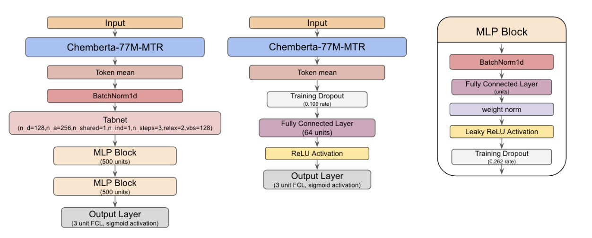

# LEASH - BELKA（DNA 编码库结合预测）轻量深读（Tier B）

> 赛事：Featured ｜ 主题 science（分子属性预测，DEL）｜ 1950 队 ｜ 标准赛 ｜ 指标：average mAP（三蛋白 BRD4/HSA/sEH）
> 材料基础：`digests/leash-BELKA.md`（7 篇正文：1st 519020 / 2nd 519133 / 14th 518951 / 5th 521894 / 988th 519135 等 + 数据瘦身 491472 + 度量变更 503232；120 条主题索引）+ 10 张图
> 轻读时间：2026-10（Tier B B07 收官）

## 1. 一句话重述与数字账

对 ~9800 万个 DEL 分子（由 BB1/BB2/BB3 三块构建）预测对三种蛋白的结合概率（mAP）。真正的考点是**"共享/非共享构建块要分开打"+"预训练任务比模型结构重要"+"验证窗口极窄（一个 epoch 内就会过拟合）"**。

| 关键数字 | 值 | 来源 |
| --- | --- | --- |
| 1st（519020，85 票） | 架构极简：**4 层、8 头、dim=32、词表 43 token**（作者自述 atomInSmiles 用得"不太对"，实际接近字符级）；不用 ChemBERTa 等预训练；**两阶段预训练**：① MLM（15% 遮蔽：80% mask/10% random/10% 保留，约 100 epoch × 10k 步 × 2028 batch，train+test+外部数据全用）② **SMILES→ECFP（2048 位、含手性）预测**（锁定 embedding，20–50 epoch；尽管 mAP 仅 ~0.4，但作者认为是"学到有用表示"的关键）；训练用掩码损失（外部数据只有 sEH 标签）；验证 = 留出 3% 构建块（约 900 万样本）；无效清单：复杂分词（bi/tri-gram、atomInSmiles）、深度 >6 层、多输入（SMILES+指纹）、ZINC 大规模预训练、自定义损失、门控融合 | 519020 |
| 14th（518951，61 票，"频繁存点"） | **共享/非共享分开建模**；非共享部分"验证分在一个 epoch 内就过拟合" → **每 0.01 epoch 验证一次**，从而拿到不过拟合的检查点；CV 把 BB1/BB2/BB3 各切 5 折、训练集只含训练块（测试集只含验证块）；ChemBERTa-77M-MTR；11 seed × 2 折（只保留 TP 分布与全量相近的 fold0/fold2）→ 19 模型集成；检查点选择两种策略（三目标平均 vs 逐目标）——私榜上"平均"更好 | 518951 |
| 2nd 公榜/13th 私榜（519133，68 票） | 共享块：CNN（公开 notebook 的两个变体，滤波 64/128/192、卷积核 19/9/3、SiLU、加 BiGRU）+ XGBoost(R)/LightGBM + GNN（hengck23），逐蛋白加权集成；非共享块：**排名集成**（把预测转成排名以消除尺度差异）的两份提交（pub 0.488/priv 0.275 与 pub 0.529/priv 0.277）；GBDT 特征 = SMILES 指纹 + BB 活性特征（"某 BB 在某位置出现时结合的比例"）+ chemprop 预测 | 519133 |
| 5th（521894，46 票） | **只用字符分词**（BPE/sentencepiece/atom-based 都更差），用 kernel=3 的 CNN 嵌入学字符组合；集成 **CNN1d + Transformer + Mamba(SSM)** 三种架构（3 蛋白多标签）；大批量（5000/2500/2000）；CNN1d 对 BN 极敏感（类不平衡 <1%、分布漂移）→ 用高 eps=5e-3、低 momentum=0.2；**每个网络用不同折**来换集成多样性（因为单折训练要 7h/28h/36h） | 521894 |
| 988th（519135） | GNN + 域适应，模型仅 800KB | 519135 |
| 数据/规则事件 | "训练集太臃肿，瘦身后可全量载入 Kaggle"（90 票）；"构建块的分组与排列"（75 票）；**"评测指标变更公告"（68 票）**；"Scaffold Hopping"（48 票）等 | 社区 |

## 2. 逐方案对照矩阵

| 维度 | 1st | 14th | 2nd | 5th |
| --- | --- | --- | --- | --- |
| 预训练 | **MLM → ECFP 预测（自训）** | ChemBERTa-77M-MTR | ChemBERTa 系 | 无（从零训） |
| 分词 | 近似字符级（43 token） | ChemBERTa 自带 | 指纹（ECFP/SECFP）+ 图 | **字符级 + 学习式 CNN 嵌入** |
| 架构 | 4 层 8 头 Transformer | ChemBERTa + TabNet/MLP | CNN/XGB/LGBM/GNN 集成 | CNN1d/Transformer/Mamba 集成 |
| 共享/非共享 | 统一模型（3% 块留出验证） | **分开处理 + 0.01 epoch 验证** | **分开处理 + 排名集成** | 统一多标签 |
| 私榜 | 1st | 14th | 13th | 5th |

## 3. 共识、分歧与裁决

### 共识一："共享块 vs 非共享块"是两条赛道（2nd/14th + 75 票帖）

两者的训练/泛化行为完全不同：14th 说非共享目标的验证分"一个 epoch 内就过拟合"；2nd 为两类分子配了完全不同的模型与集成方式（共享=多模型加权；非共享=排名集成）。**裁决**：数据生成结构（构建块是否在训练集中出现过）是本题的第一分层变量，必须分开设计 CV/模型/集成。置信度：高。

### 共识二：预训练任务 > 模型结构（1st/5th + 1st 的无效清单）

1st 的最终模型又浅又小（4 层/32 维），增益来自"MLM + ECFP 预测"两阶段；5th 也确认"最简单字符分词 + 学习式嵌入"胜过复杂分词。**裁决**：分子表示学习的收益主要来自**自监督目标的选择**（尤其"预测拓扑指纹"这类需要结构理解的任务），而不是堆参数或换复杂分词器。置信度：高（1st 的消融清单 + 5th 的对照）。

### 共识三：验证要"高频 + 结构化"（14th/1st/2nd）

14th 每 0.01 epoch 存点；1st 留出 3% 构建块做与测试一致的验证；2nd 承认非共享部分 CV 难做，改用公榜做两种排名集成。**裁决**：大样本 + 快速过拟合的赛题，验证频率与切分方式（按构建块）比模型选择更关键。置信度：高。

### 分歧一：要不要用现成分子预训练模型

14th/2nd 用 ChemBERTa；1st 完全自训并明确"没用任何预训练模型"仍夺冠。**裁决**：两者都能进前列；自训的优势是可以用竞赛/测试数据做域内预训练（1st 把 train+test+外部数据一起做 MLM），但要付出算力与实验成本。置信度：中高。

### 事件：评测指标中途变更（68 票）

host 公告修改评分指标。**裁决**：指标变更后要重估所有历史验证与阈值；登记为治理风险（与 S4E6/Mayo 等场的"中途更新"同类）。置信度：中高（官方公告）。

## 4. 证据分级

| 断言 | 等级 | 说明 |
| --- | --- | --- |
| 1st 的两阶段预训练与无效清单 | 自述 + 公开代码/数据/权重 | 高 |
| 14th 的 0.01 epoch 验证与 CV 设计 | 自述 + 公开 fold 生成 notebook | 高 |
| 2nd 的排名集成与双提交 | 自述 + 架构图 + 参数表 | 中高 |
| 5th 的字符分词优于 BPE/atom 系 | 自述（单队对照） | 中高 |
| 指标变更 | 官方公告 | 高 |

## 5. 悬案与缺口（登记）

- 3rd/4th/6th–13th 的方案未入库；"训练集瘦身"（90 票）与"构建块分组/排列"（75 票）未细读；
- 1st 的权重未完全恢复（只有 light 版本），复现需重训；
- 非共享部分的公榜-私榜差异极大（2nd 的 0.529→0.277），机制未充分解释；
- 归档 10 图：2nd 的两张架构图（ChemBERTa 变体）与 5th 的 7 张分词/BN 分析图为关键图证。

## 6. 图表证据

**图 1**（topic 519133）：非共享构建块部分的两个 ChemBERTa-77M-MTR 变体——左：token mean → BatchNorm1d → **TabNet** → MLP×2 → 3 输出；右：token mean → dropout → 单层 64 维 FC → ReLU → 3 输出；右侧为 MLP Block 内部结构（BN→FC→weight norm→LeakyReLU→dropout）。两份提交即用这类模型的排名集成。

## 7. 出处

- 1st（85 票）：https://www.kaggle.com/competitions/leash-BELKA/discussion/519020
- 2nd 公榜/13th 私榜（68 票）：https://www.kaggle.com/competitions/leash-BELKA/discussion/519133
- 14th（61 票）：https://www.kaggle.com/competitions/leash-BELKA/discussion/518951
- 5th（46 票）：https://www.kaggle.com/competitions/leash-BELKA/discussion/521894
- 988th（42 票）：https://www.kaggle.com/competitions/leash-BELKA/discussion/519135
- 训练集瘦身（90 票）：https://www.kaggle.com/competitions/leash-BELKA/discussion/491472
- 指标变更（68 票）：https://www.kaggle.com/competitions/leash-BELKA/discussion/503232
