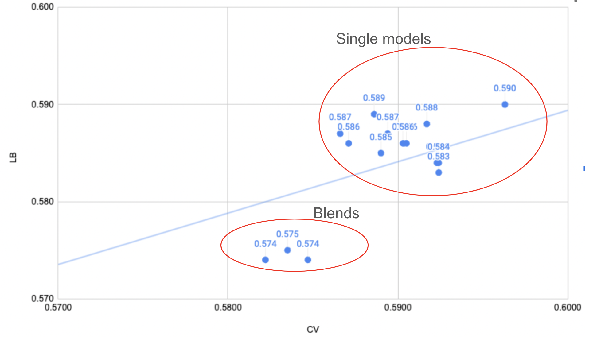

# Linking Writing Processes to Writing Quality 轻量深读（Tier B）

> 赛事：Featured ｜ 主题 nlp（键盘日志回归）｜ 1876 队 ｜ 代码赛 ｜ 指标：MSE（评分 0.5–6.0）
> 材料基础：`digests/linking-writing-processes-to-writing-quality.md`（6 篇正文：新 1st 466873 / 被取消资格的 1st 467154 / No place 466945 / 3rd 466906 / 3rd 另一篇 466775 / 23rd 466771；80 条主题索引）+ 6 张图
> 轻读时间：2026-10（Tier B B02）

## 1. 一句话重述与数字账

从**击键日志**预测作文质量分（MSE，训练集极小）。真正考的是**"从日志重建作文文本" + 大规模特征工程 + 外部作文评分数据迁移 + 异构集成**；且发生了一次**冠军被取消资格、名次递补**的治理事件。

| 关键数字 | 值 | 来源 |
| --- | --- | --- |
| 新 1st（原 2nd，递补） | 数据清洗（ftfy unicode 修复、up/down 时间修正、丢弃输入前 10 分钟事件）；句式重建（模糊匹配+Undo 修正，训练集仍残留 142 个异常事件）；378 特征；**8 个外部作文数据集/24 种作文类型**训练 tf-idf+LGBM 的"外部分数"当特征；最终嵌套 CV（6 bags×5 folds）；clip [0.5,6.0] | 1st |
| 新 1st 的单模 CV | LGB 0.576、LGB-clf 0.582、XGB-reg 0.580、XGB-clf 0.583、CatBoost 0.582、Bagging 0.594、tabnet 0.609、LightAutoML dense 0.593/resnet 0.587/fttransformer 0.603 | 1st |
| 新 1st 的提交 | 3 个 GPU 模型中胜出的那个**公榜分最差（0.578）**；因外部数据放弃效率奖；"我太幸运了" | 1st |
| 被取消资格的 1st | 5 人队 8 模型；LGBM CV 0.59759（1339 特征）、LightAutoML MLP、denselight CV 0.6135；公 0.575/私 0.557；**取消资格原因未在材料中说明** | 467154 |
| 3rd | GBT（awqatak 165 特征）+ DeBERTa（persuade 语料 MLM + q→i/X 替换 + 自定义 tokenizer）；40/60 融合；**GBM 的 LB/CV 比更好、DeBERTa CV 好但 LB 差** → 域移信号 | 3rd |
| No place | 1356 特征、混合 NN；**手动权重 65% LGBM/35% NN**（Ridge/NelderMead 会给低 CV 的 NN 过高权重）；公 0.575/私 0.561 | 466945 |

## 2. 逐方案对照矩阵

| 维度 | 新 1st | 被取消资格 1st | 3rd | No place |
| --- | --- | --- | --- | --- |
| 文本重建 | 模糊匹配+Undo 修正 | 公共 essay constructor | 公共 constructor + q→i/X 解析 | 公共 constructor |
| 特征 | 378（IKI/暂停/burst/tf-idf char+word） | 1339–1390（sentence/paragraph/ngram/char tf-idf/plr embedding） | 165（公共）+ DeBERTa 文本侧 | 1356（volatility/P-burst/IDF/序列） |
| 外部数据 | **8 数据集→外部分数特征** | persuade 预训练（MLP） | persuade MLM 掩码预训练 | 无（主要公共特征） |
| 集成 | 嵌套 CV 6×5 + 多模型平均 | 8 模型加权 | Ridge OOF 权重 + 手动 40/60 | **手动权重 65/35** |
| 关键判断 | 信 CV（LB 一贯低于 CV） | 信 CV？ | 按"谁信 CV 谁信 LB"配权重 | 按公/私表现手调 |

## 3. 共识、分歧与裁决

### 共识一：先把击键日志"重建成作文文本"，再做一切（3/3）

公共 essay constructor 被全社区复用；新 1st 进一步用模糊匹配/Undo 修正提高重建质量。**裁决**：本任务的原始信号（分数）只取决于最终文本，重建质量是特征工程的地基。置信度：高。

### 共识二：字符级 tf-idf + 深度统计特征是主力特征

新 1st 的 tf-idf（char/word）+ SVD 64；取消资格 1st 的 char analyzer +0.005 CV；3rd 直接复用 165 特征。**裁决**：小数据文本回归里，字符 n-gram 的鲁棒性优于神经表示（3rd 的 DeBERTa 只在 CV 好）。置信度：高。

### 共识三：CV 与 LB 存在域移，GBM 与 NN 的 CV/LB 比不同

3rd 明确：GBM 的 LB/CV 比更好、DeBERTa CV 高 LB 低；No place：NN 低 CV 高公榜 → 手动调权；新 1st：LB 一贯低于 CV、但分布相似故信 CV。**裁决**：**不同模型家族的 CV-LB 关系不一致**，融合权重应按"信任模型在哪个域更强"来定，而不是统一用 OOF CV。置信度：中高。

### 共识四：外部作文评分数据可迁移（新 1st 的核心）

8 个外部数据集（CommonLit、ASAP、Persuade 等）匿名化后训 LGBM 预测分数，作为特征与比赛分高度相关；keystroke 数据集迁移失败。**裁决**：**跨赛同质任务（作文评分）的分数预测是合法且强力的特征**；但要注意许可/匿名化与算力（效率奖取舍）。置信度：中高（单队强证据）。

### 分歧一：前向集成 vs 加权/平均

新 1st：forward ensembling 公榜更好但 CV/私榜更差（弃用）；No place：Ridge/NelderMead 因模型家族差异失效 → 手动权重；3rd：Ridge OOF + 手动跨家族比例。**裁决**：跨家族融合不要只用单一 OOF 寻权；保留"按域信任"的人工干预。置信度：中高。

### 分歧二/事件：被取消资格与递补

原 1st 队在赛后被取消资格（原因未公开），原 2nd 递补冠军；效率奖与外部数据不可兼得（新 1st 主动放弃）。**裁决**：外部队列/许可与效率约束是策略变量；治理事件应先登记事实，不在材料不足时推断原因。置信度：高（事件）。

## 4. 证据分级

| 断言 | 等级 | 说明 |
| --- | --- | --- |
| 新 1st 的分数表/外部数据相关性 | 自述 + 图 + 公开代码 | 中高 |
| 3rd 的 CV-LB 家族差异 | 图证 + 自述 | 中高 |
| 取消资格事件 | 帖标题 + 递补说明 | 高（事实）；原因未知 |
| No place 的手动权重理由 | 自述 | 中 |
| 重建质量（142 残留异常） | 自述 | 中 |

## 5. 悬案与缺口（登记）

- **取消资格的原因**未在任何收录正文中说明（仅 467154 标题），官方 recap（468441）未收录。
- 新 1st 的外部数据许可细节、以及"外部分数特征"的泄漏边界（外部数据是否与测试同源）未展开。
- 效率奖与精度取舍（3 GPU 模型）具体配置未给；"公榜最差的模型反而私榜最好"的机制未解释。
- 2nd/4th–22nd 方案未收录；23rd（466771）未细读。

## 6. 图表证据

**图 1**（topic 466873）：比赛数据 → 清洗/特征/句式重建 → tf-idf；外部数据 → 匿名化 → tf-idf → 外部分数预测；全部汇入多模型集成 → 后处理。**"日志→文本→外部分数特征"的完整管线**。

**图 2**（topic 466906）：单模型（上方）与融合（下方）的 CV vs LB；所有点位于拟合线上方（LB>CV），展示域移与家族差异。

## 7. 出处

- 新 1st（466873）：https://www.kaggle.com/competitions/linking-writing-processes-to-writing-quality/discussion/466873
- 被取消资格的 1st（467154）：https://www.kaggle.com/competitions/linking-writing-processes-to-writing-quality/discussion/467154
- No place（466945）：https://www.kaggle.com/competitions/linking-writing-processes-to-writing-quality/discussion/466945
- 3rd（466906）：https://www.kaggle.com/competitions/linking-writing-processes-to-writing-quality/discussion/466906
- 3rd 另一篇（466775）：https://www.kaggle.com/competitions/linking-writing-processes-to-writing-quality/discussion/466775
- 23rd（466771）：https://www.kaggle.com/competitions/linking-writing-processes-to-writing-quality/discussion/466771
