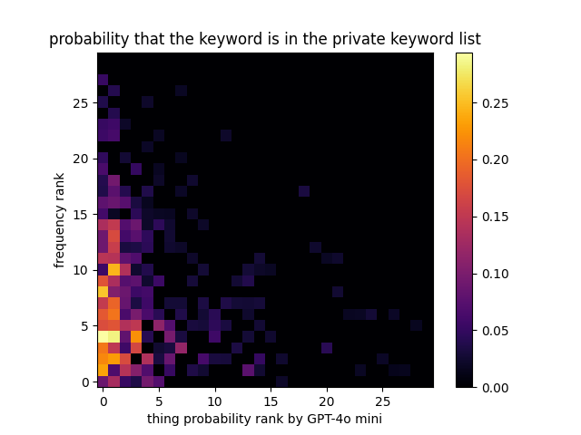

# LLM 20 Questions 轻量深读（Tier B）

> 赛事：Featured ｜ 主题 nlp（LLM 智能体对抗）｜ 832 队 ｜ 标准赛（提交 agent）｜ 指标：llm_20_questions（对局奖励）
> 材料基础：`digests/llm-20-questions.md`（6 篇正文：9th 529525 / 2nd 529643 / 1st 531106 / 11th 529931 / 金牌动画 531062 / Starter 520429；80 条主题索引）+ 12 张图
> 轻读时间：2026-10（Tier B B03）

## 1. 一句话重述与数字账

两个 agent 玩 20 问（一个猜关键词、一个回答 yes/no）。真正的考点是**策略协调（Agent Alpha 握手）+ 关键词概率建模 + LLM 问答工程**；社区还经历了一次"榜单重置+换关键词"与私有关键词泄漏事件。

| 关键数字 | 值 | 来源 |
| --- | --- | --- |
| 1st（90 票） | Guesser：第一个问题问 **"Is it Agent Alpha?"**（在非 Alpha 对局也占优）；Agent Alpha 关键词表 116,937 个 NLTK 名词；概率 = 词长×英语词频×**GPT-4o mini 的 thing-ness**（图 1）；**按概率二分**（而非按词数等分）；问题=26 字母 + ~3,000 胜局 + ~10,000 GPT-4o mini 生成；p(keyword,question) 表 **35k×13k=4.55 亿** 项，用 3 个 LLM + vllm 在 8×4090 上算（约 $500）；Answerer=Llama-3-8B + DeepSeek-Math（字母计数类）；两 agent 分列 1st/4th 等价 | 1st |
| 2nd（42 票） | 双策略：Alpha 二分（单字表 333k→120k，两轮 LLM 过滤）+ 纯在线 LLM（无离线问题）；"Is it Agent Alpha?" 握手；**Answerer 两段**：拼写/字母/列表题手动计算，其余 LLM（**把关键词替换回问句主语后准确率大增**）；在线 LLM 四模态（类别/位置/大小/枚举+分裂）；Alpha 关键词命中率 89%、平均奖励 5.81、LLM 对局胜率 12%；Llama 3.1 在 Kaggle 可运行的 hack（matthewsfarmer） | 2nd |
| 事件 | 榜单重置+新关键词（33 票/120 评论）；**私榜 7.7% 关键词是公榜重复**（42 票）；Llama 3.1 hack（41 票）；分数缓慢收敛且顶部震荡 | 主题索引 |

## 2. 逐方案对照矩阵

| 维度 | 1st | 2nd |
| --- | --- | --- |
| 核心 | Agent Alpha + 概率二分 | Alpha 二分 + 在线 LLM 双轨 |
| 关键词表 | 116,937 NLTK 名词 + thing-ness 概率 | 333k→120k 单字（LLM 过滤） |
| 搜索 | 按关键词概率二分 | 先找首词（高频优先），再 LLM 名词短语 |
| 问题生成 | 26 字母 + 胜局问题 + GPT 生成 | 在线 LLM 四模态（不预生成） |
| Answerer | Llama-3-8B + DeepSeek-Math | 拼写题手算 + LLM（关键词替换） |
| 结果 | 1st（+ 另一 agent 等价第 4） | 2nd |

## 3. 共识、分歧与裁决

### 共识一：Agent Alpha 握手成为顶部竞争的"入场券"（1st/2nd + lohmaa 起源）

两队都实现"Is it Agent Alpha?"握手；1st 讨论"第一个问题就问 vs 强制模式"的取舍；2nd 甚至说"少数 agent 采用就足以改变竞争动态"。**裁决**：这是典型的 Schelling 点/协议收敛——一旦足够多强回答者实现该模式，不实现者会被边缘化；本质是**多智能体博弈中的协调均衡**。置信度：高。

### 共识二：关键词概率建模显著优于均匀搜索（1st 明证；2nd 用词频表）

1st 的 thing-ness×词频 概率表（图 1）与"按概率二分"；2nd 高频词优先抢猜；私榜与公榜关键词高度相似（图 2；7.7% 精确重复帖）。**裁决**：利用"关键词生成分布"（词长/词频/thing-ness）能把搜索效率提升到接近最优；公共关键词的分布外推是合理策略。置信度：高。

### 共识三：Answerer 的工程细节决定胜负（1st/2nd）

拼写/字母计数题：LLM 不可靠 → 手动计算（2nd）或专用数学模型（1st 的 DeepSeek-Math）；2nd 的"关键词替换回问句"显著提升 LLM 回答准确率。**裁决**：LLM 在精确计数/模式题上要外挂确定性模块；prompt 里显式替换主语是通用技巧。置信度：高。

### 共识四：问题生成的两条路（离线表 vs 在线生成）

1st 用 4.55 亿项概率表 + vllm（离线、贵、强）；2nd 纯在线 LLM 四模态（灵活、便宜）。**裁决**：离线表的优势在信息量/一致，在线生成的优势在覆盖与迭代；两者都到前 2。置信度：中高。

### 事件：榜单重置/关键词更换与私有泄漏

中途"Leaderboard reset and new keywords"、最终"7.7% 私榜关键词是公榜重复"——**评测集构造缺陷**让排名含噪；顶部分数震荡到最后一刻。**裁决**：这类 agent 赛的"数据/评测泄漏"会直接冲击公平性；参赛者应记录并公开，同时把策略对关键词分布的假设做稳健化。置信度：高。

## 4. 证据分级

| 断言 | 等级 | 说明 |
| --- | --- | --- |
| 1st 的概率表/搜索/分数 | 自述 + 图 + 代码 + 公开数据 | 中高 |
| 2nd 的 Alpha/LLM 指标（89%/5.81/12%） | 自述 + 代码 | 中高 |
| 私榜 7.7% 重复 | 社区分析帖 | 高（事件）；官方处置未知 |
| Agent Alpha 的统治力 | 多队独立复现 | 高 |
| Llama 3.1 hack | 单一帖 + 广泛使用 | 中 |

## 5. 悬案与缺口（登记）

- 官方对"榜单重置/关键词更换/私榜重复"的说明与 rescore 未收录。
- 9th/11th 方案未细读；"Animation of Gold Medal Winners"（39 票）未看。
- 动态生成未登录关键词的队伍（1st 致谢提及）方法缺失。

## 6. 图表证据

**图 1**（topic 531106）：以"词频排名 × GPT-4o mini thing-ness 排名"估计"关键词出现在私榜列表的概率"（高频+高 thing-ness 概率最高）。**概率化二分搜索的依据**。

## 7. 出处

- 9th（529525）：https://www.kaggle.com/competitions/llm-20-questions/discussion/529525
- 2nd（529643）：https://www.kaggle.com/competitions/llm-20-questions/discussion/529643
- 1st（531106）：https://www.kaggle.com/competitions/llm-20-questions/discussion/531106
- 11th（529931）：https://www.kaggle.com/competitions/llm-20-questions/discussion/529931
- 金牌动画（531062）：https://www.kaggle.com/competitions/llm-20-questions/discussion/531062
- Starter（520429）：https://www.kaggle.com/competitions/llm-20-questions/discussion/520429
