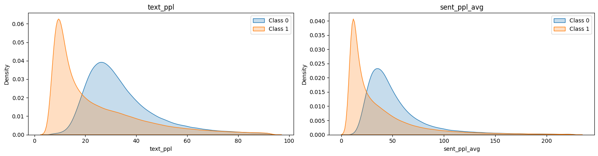

# LLM 生成文本检测深读：分布不可知时的"数据军备 + 域适应"

> 赛事：Featured ｜ 主题 nlp ｜ 4358 队 ｜ 代码赛 ｜ 指标 ROC AUC（2024-01-22 截止）
> 材料基础：`digests/llm-detect-ai-generated-text.md`（8 节：1st 两版/2nd/3rd/4th/5th/8th/21st）+ 社区数据集帖（Radek 的 500 篇生成作文）
> 深读时间：2026-10（Tier A #22）

## 0. 一句话重述：这道题真正在考什么

题面是"判断作文是否 AI 生成"，实际被考的是**当隐藏测试的生成器分布未知时，如何用"数据多样性 + 域适应 + 生成器无关特征"覆盖它**：

1. **外部数据 = 方法本体**：1st 明言"建模方法影响较小"，多源数据混合让每个单模都到 0.970+；5th 自建 **1.7M** 训练样本；2nd/3rd 复刻"Pile/SlimPajama 续写"配方；
2. **CV 与公开榜双失灵**：多数队伍"CV 接近完美但 LB 不稳/私榜暴跌"（8th 的 800k 微调 CV 0.98 → 私榜 0.674；TF-IDF 公开 0.95+ → 私榜 0.89）——**目标从"拟合"变成"覆盖未知生成器"**；
3. **测试期域适应**：5th 的 teacher→short-context student（在学生**测试文档**的短片段上蒸馏）；2nd/1st/3rd/21st 用测试伪标签/MLM/条件融合——用测试分布本身当正则；
4. **生成器无关特征**：8th 的 **PPL + GLTR**（"文本在 LM 下有多可预测"）躲过了洗牌（私榜 0.956），而微调分类器过拟合生成器痕迹；
5. **公开榜是陷阱**：1st/2nd 的多模型私榜 > 公开榜（0.984 vs 0.966；0.983 vs 0.967）；21st 公开 0.986 但选中的提交私榜仅 0.932（最佳 0.957）——**在这场比赛里，"公开榜高"往往意味着过拟合当前生成器**。

一句话：**这是一场"数据多样性 + 测试分布适应"的比赛**——模型（DeBERTa/Mistral/GPT-2）是公共件，胜负在数据的生成器覆盖度与对私榜分布漂移的抵抗力。

## 1. 材料与角色

| 帖子 | 作者 | 票数 | 角色与独有信息 |
| --- | --- | --- | --- |
| [470121](https://www.kaggle.com/competitions/llm-detect-ai-generated-text/discussion/470121)（1st 短版，203 票） | Raja Biswas | 203 | 160k datamix（40k 人写）；多范式模型（Mistral LoRA 0.984 私榜/Ghostbuster 0.974/自定义 tokenizer 0.943/rank loss 0.963/Ahmet 弱监督 0.971）；rank 融合 |
| [470395](https://www.kaggle.com/competitions/llm-detect-ai-generated-text/discussion/470395)（2nd，115 票） | Guanshuo Xu | 115 | **"先通用预训练、再学生域适应"**：SlimPajama 50 万对 → DeBERTa 0.916/0.967 → 学生作文 LM 微调生成同风格文本 → 0.94/0.98 → 集成 0.967/0.983 |
| [473295](https://www.kaggle.com/competitions/llm-detect-ai-generated-text/discussion/473295)（1st 完整版，99 票） | Nicholas Broad 等（1st 队） | 99 | datamix 的 4 类来源与 7 种增强；6 种建模策略（含 Ghostbuster 与自定义 tokenizer MLM）；**rank 平均而非概率平均** |
| [470148](https://www.kaggle.com/competitions/llm-detect-ai-generated-text/discussion/470148)（21st，87 票） | Ali | 87 | **自制"测试伪标签"多轮迭代**：公开 0.975→0.986；但**选中提交私榜 0.932、最佳私榜 0.957**——公开榜套利的前车之鉴 |
| [470093](https://www.kaggle.com/competitions/llm-detect-ai-generated-text/discussion/470093)（5th，84 票） | James Day | 84 | **1.7M 数据 + 测试期域适应**（teacher→短上下文 student）；Mamba 教训；数据生成/过滤/增强全流程；Tricky Crawl（被误判的人类文本） |
| [470224](https://www.kaggle.com/competitions/llm-detect-ai-generated-text/discussion/470224)（8th，68 票） | Abdullah Meda | 68 | **PPL + GLTR 语言学特征**（GPT-2 系 + Top-k rank 统计）+ VotingClassifier；80 万数据后私榜 0.956；10 分钟出提交 |
| [470333](https://www.kaggle.com/competitions/llm-detect-ai-generated-text/discussion/470333)（3rd，67 票） | Yevhenii Maslov | 67 | TF-IDF + 12×DeBERTa 加权平均；**迭代式难样本筛选**（每轮加 500 人写 + 500 生成）；对 test 置信样本做 1k 伪标签（私榜 0.893→0.927） |
| [470179](https://www.kaggle.com/competitions/llm-detect-ai-generated-text/discussion/470179)（4th，66 票） | Ertuğrul Demir（+chasembowers） | 66 | "Combined Arms"：TF-IDF（ngram 3-7 + 拥抱/复制错别字 30%）+ Mistral logprob + Longformer 源域预测 + 700k DeBERTa 兜底；权重不按公开榜给 |

**材料缺口（未扩采，登记备查）**：另有多篇 write-up 未收录（22 条 write-up 标记中仅取 8 节 + 社区数据帖 452155）。

## 2. 逐方案对照矩阵

| 维度 | 1st（Raja/Nicholas 队） | 2nd Guanshuo | 3rd Yevhenii | 5th James | 8th Abdullah | 21st Ali |
| --- | --- | --- | --- | --- | --- | --- |
| 数据 | 160k（40k 人写）：PERSUADE 全 15 主题 + 6 类人写源 + 4 类生成源 + 7 种增强 | SlimPajama 50 万对 → 学生域适应数据 | 11k 精选 + Pile/SlimPajama 续写（35 模型 × 3 采样场景，500k/1m/1.2m） | **1.7M**：PERSUADE/Pile/SlimPajama/Tricky Crawl | 800k 公共数据集 | DAIGT V2 + 自造 Mistral/Gemini + 竞赛数据 |
| 核心模型 | Mistral-7B LoRA（0.984 私）/Ghostbuster/DeBERTa 分类/排序/自定义 tokenizer + MLM | DeBERTa-v3-large（两阶段域适应） | TF-IDF + 12×DeBERTa-v3-large | DeBERTa-v3-large + Mamba-790m（teacher）；短上下文 DeBERTa（student） | GPT-2 系 PPL + GLTR → VotingClassifier | TF-IDF Ridge/LinearSVR + distilroberta |
| 域适应 | 测试伪标签 + 自定义 tokenizer MLM（train+test） | **学生作文 LM 微调**生成同风格文本 | 置信测试样本 1k 伪标签；条件融合 | **teacher 在测试上出软标签 → 短上下文 student 蒸馏（测试片段）** | 无（特征本身生成器无关） | **测试 top/bottom 行多轮伪标签** |
| 融合 | **rank 平均** | 概率平均 | 两步条件加权（中间区间用 TF-IDF） | 学生模型按上下文 128/256 字符 60/40 加权 | 特征级 Voting | 概率集成 + 条件更新 |
| 私榜/公开 | 0.984/0.966（Mistral） | 0.983/0.967 | 0.970–0.974 | 0.977（无 Mamba） | 0.956 | 选 0.932 / 最佳 0.957 |

## 3. 共识、分歧与裁决

### 共识一：数据质量/多样性 > 建模（1st 直接盖章）

1st："建模方法影响较小——由于数据集质量，我们有多个单模在 0.970+ 区间"；其 datamix 迭代围绕"规模、多样性、复杂度"；5th 花整个赛程造 1.7M 样本；3rd 用 35 个开源模型造续写；2nd 复刻数据集后再谈模型。**所有人的工作量都在数据侧。**

**裁决**：本场的方法论是"数据即模型"；建模选择只在数据固定后才成为变量。置信度最高。

### 共识二：CV/公开榜不可信，泛化面才是目标函数

1st：私榜 > 公开榜（0.984 vs 0.966）；2nd：初始微调 CV 近乎完美但 LB 不稳→"放弃 finetune，转数据"；8th：CV 0.98 的微调私榜 0.674；4th："很难实现可靠 CV"；21st：公开 0.986 与私榜 0.932 的落差。

**裁决**：当训练/公开/私榜的生成器分布不同时，任何"拟合当前可见分布"的指标都会误导；对策是"多生成器覆盖 + 生成器无关特征 + 保守融合"。置信度最高。

### 共识三：测试分布要用，但要"轻轻地用"

5th 的 student 在测试片段上蒸馏（域适应）；21st 用测试伪标签多轮迭代（效果显著但风险极大）；3rd 只取置信度极高/极低的 1k 样本；1st 用 train+test 训练自定义 tokenizer 并做 MLM。**直接"用测试"能显著提升分数，但过度使用会放大公开榜过拟合**——21st 的"选错提交"（0.932 vs 0.957）就是代价。

**裁决**：测试分布适应的强度要与验证可信度成反比配置；在无法验证私榜时，保守融合优先。置信度中高。

### 分歧一：微调分类器 vs 语言学特征

- 微调派：1st/2nd/3rd/5th 的 DeBERTa/Mistral 都在 0.97–0.98 私榜；
- 特征派：8th 的 PPL+GLTR（0.956）用"生成器无关统计"躲过洗牌；4th 也用 TF-IDF + logprob 特征做兜底。

**裁决**：两条路都可行；语言学特征的**抗洗牌性**更好（测的是"文本有多可预测"而非"哪个生成器的痕迹"），但绝对上限取决于特征与模型规模（8th 用 GPT-2 large 到 0.956）。混合（4th/3rd 的 TF-IDF+Transformer）是对冲。置信度中高。

### 分歧二：Mamba/Transformer 架构之争（5th 的教训）

5th 的 Mamba 在公开榜只低 0.003–0.006，但**私榜原地不动而 DeBERTa 涨 0.01**，最终拖累名次（无 Mamba 即第 3）；作者归因于时间不足与 padding/学习率处理不当，而非架构本身。

**裁决**：本场证据不足以判定架构优劣，但说明"公开榜兼容 ≠ 私榜兼容"；不确定的长上下文模型在融合中应低权重或剔除。置信度中。

## 4. 增量数字账

| 动作 | 数字 | 来源 |
| --- | --- | --- |
| 1st 的模型阶梯（私榜/公开） | Mistral-7B LoRA 0.984/0.966；Ghostbuster 0.974/0.957；DeBERTa rank 0.963/0.961；Ahmet 0.971/0.957；自定义 tokenizer 0.943/0.942 | 1st |
| 1st datamix | 160k（40k 人写）；含 T5 合成（Feedback 2）等 4 类生成源 + 7 种增强 | 1st |
| 2nd 的两阶段 | SlimPajama 50 万对 → 0.916/0.967；学生域适应 → 0.94/0.98；最终集成 0.967/0.983 | 2nd |
| 3rd 的对照 | 11k 精选模型：0.927 公开/0.845 私榜（过拟合）；1m 续写模型：0.956/0.967；TF-IDF +1k 伪标签：私榜 0.893→0.927（公开不变） | 3rd |
| 4th | 700k DeBERTa 兜底；随机人工错字注入 30% 生成数据 | 4th |
| 5th 数据表 | PERSUADE 26k 人/327k 生成；Pile 512k/512k；SlimPajama 233k/233k；Tricky Crawl 125k 人；最佳配比 62–99% Pile | 5th |
| 5th 域适应 | teacher（1 DeBERTa+2 Mamba）→ student（128/256 字符）→ 0.977（无 Mamba）/0.972（含）；全上下文 DeBERTa 单独 0.970、Mamba ~0.957 | 5th |
| 8th 的阶梯（公开/私榜） | 44k+PPL 0.674/0.506；800k+PPL 0.800/0.656；800k+GLTR 0.910/0.918；PPL+GLTR 0.923/0.926；GPT-2 Medium 0.932/0.953；Large 0.938/**0.956** | 8th |
| 8th 的反例 | 800k 微调：CV 0.98 但公开 0.793/私榜 0.674；TF-IDF 公开高、私榜 0.89 | 8th |
| 21st 的伪标签迭代 | 公开 0.975→0.982→0.983→0.984；私榜 0.922→0.929→（换线）0.957；**选中提交私榜 0.932** | 21st |

**可复算/结构校验（2 处吻合）**

1. 1st datamix 的人写占比：40k/160k = **25%**（与"balanced with significant general texts"一致）；
2. 8th 的阶梯单调性：同一特征集下模型越大越好（Small 0.926 → Medium 0.953 → Large 0.956 私榜）✓——语言学特征的上限由特征提取器容量决定。

## 5. 机制推演

**M1｜为什么"CV 完美"在本场恰恰是警报**：训练/公开集与私榜由不同生成流程产出；CV 内的近重复与同生成器痕迹让模型学到"拼写/格式/句式"的浅层线索，这些线索在 CV 上线性可分，在私榜上失效。1st 的"私榜 > 公开榜"说明其模型依赖的是更深的语义/统计信号。

**M2｜为什么"多生成器数据"能治洗牌**：模型要学到"AI 文本 vs 人写文本"的不变边界，训练集必须覆盖生成器的多样性（1st 的 4 类来源、5th 的 14 个模型、3rd 的 35 个模型）；单一生成器 → 模型学它的指纹。**数据多样性 = 对未知生成器的正则化。**

**M3｜5th 的短上下文 student 为什么有效**：teacher 在完整测试文档上给软标签；student 只吃 128/256 字符片段，被迫学习"局部措辞怪癖"与长上下文判断的相关性——把测试文档的**局部分布**蒸馏进小模型；推理时滑窗平均进一步平滑。前提：teacher 质量足够（DeBERTa 0.970）。

**M4｜PPL/GLTR 的抗洗牌机制**：PPL 度量"文本在参考 LM 下的可预测性"，GLTR 度量"落在 Top-k 排名桶内的 token 比例"；LLM 采样偏好高概率 token 是**所有生成器的共性**，与具体指纹无关。因此它对生成器切换不敏感（8th 的 44k→800k 阶梯中，GLTR 私榜从 0.445 涨到 0.918，靠的是数据量与特征质量，而非拟合公开榜）。代价：上限受参考模型容量限制。

**M5｜错别字/混淆增强的双向作用**：竞赛数据被"混淆"污染；人写文本带自然错字、AI 文本干净 → 模型可能学"有错字=人类"的伪相关；4th 发现"字符级混淆完全随机"后主动对 30% 生成数据注入随机错字，逼迫模型回到内容层；3rd 反向去混淆（只修 15+ 错误的文本）减少噪声。**增强的方向取决于你怀疑哪一侧的伪相关。**

**M6｜rank 融合为何优于概率融合**：公开榜分数被压到 ~0.98 饱和、各模型概率尺度不同；rank 只保留排序信息（与 AUC 指标天然匹配），避免校准差异污染融合（1st 明言用 rank；3rd/21st 也用条件/加权概率但趋向保守）。

**M7｜公开榜套利的数学**：21st 的伪标签迭代把公开榜从 0.975 推到 0.986——因为伪标签直接拟合了公开测试样本；但公开与私榜的组成不同，选中的"公开最佳"私榜只有 0.932，而另一条（较少公开套利）私榜 0.957。**当公开榜可被"使用测试"放大时，公开榜分数与私榜的相关性反转。**

## 6. 证据分级

| 断言 | 等级 | 说明 |
| --- | --- | --- |
| 1st 的模型阶梯与 datamix 规模 | **可读取 + 代码/数据公开** | 公开 repo/dataset |
| 5th 的完整数据管线 | **自述（强）** | 数据集/代码/notebook 全公开 |
| 8th 的特征阶梯表 | **可读取（帖内表）** | 8 行对照，公开 notebook |
| 8th 的 PPL 分布图 | **可读取（图）** | 双面板分布分离 |
| 2nd 的两阶段分数 | **自述** | 代码/数据公开 |
| 3rd 的迭代选择/伪标签收益 | **自述** | 有推理 notebook |
| 21st 的公开/私榜落差 | **可读取（标题+正文）** | "selected private 0.932 / best 0.957" |
| Mamba 拖累名次（5th） | **自述（反事实）** | "无 Mamba 即第 3" |

## 7. 边界条件与反事实

- **前提：允许外部数据**。本场的核心是"自建数据"，若无外部数据或算力（5th 用了 2×3090+4090 生成、1st 的 160k 混合），方法退化到小数据集微调——正是洗牌中最脆弱的一类。
- **反事实（5th）**：若不用 Mamba（或正确训练 Mamba），私榜 0.977 可达第 3；若提交 3 个候选时选中最佳，名次直接前进。
- **反事实（21st）**：若不选"公开 0.986"的提交而选私榜 0.957 的版本，名次会从 21st 明显上升——**选择错误的代价被标题钉死**。
- **反事实（8th）**：若跟随大众做 800k 微调（其 CV 0.98），私榜只有 0.674；选择"语言学特征 + 投票"是它从公开榜外到第 8 的全部原因。
- **边界（域适应强度）**：5th 的 student 蒸馏在测试上进行，但依赖 teacher 校准；21st 的多轮伪标签在无可靠验证时失控——**使用测试分布必须能被验证**（公开榜不可用时，保守）。

## 8. 悬案与失败学

**悬案**

1. **私榜的真实生成器构成**未公开：所有"泛化"讨论都缺少目标分布的第一手信息；
2. **Mamba 的真实能力**：时间不足与训练 bug 混杂，无法判定 SSM 在本任务的真实上限；
3. **测试伪标签的最优强度**：1k（3rd）成功、多轮 top/bottom（21st）高风险——收益-风险曲线未量化。

**失败学**

| 失败 | 来源 | 教训 |
| --- | --- | --- |
| 800k 数据微调（CV 0.98） | 8th | 近完美 CV + 私榜 0.674——CV 不可信的最极端案例 |
| TF-IDF 单独/与微调等权融合 | 8th/2nd/3rd | 公开高、私榜低（0.89）；等权融合被拖累 |
| 只用 PERSUADE 数据 | 5th/4th | 泛化差；放大模型没用（数据多样性才是瓶颈） |
| 1D Conv ResNet | 5th | 极快但只有 0.87（未 scale 前输给 DeBERTa） |
| 迭代伪标签（5th 视角） | 5th | 分数随训练/测试洗牌波动大，弃用；改用稳定域适应 |
| Mamba 训练错误（padding 取 last-token、学习率过高 NaN） | 5th | 细节 bug 抵消架构收益；融合前先验证私榜兼容性 |
| 公开榜调权重 | 4th | 公开榜分数全 ~0.98，无法区分成员；手调常识权重 |
| 校正全部拼写错误/去混淆全量执行 | 3rd | 只修 15+ 错误的文本，避免把增强本身变成噪声 |
| 选错提交（0.932 vs 0.957） | 21st | 提交选择 = 分数（THEORY L22 的极端案例） |

## 9. 图表证据

> 路径相对本文件（`analysis/deep/`）：`../../intel/llm-detect-ai-generated-text/bodies/470224_img/NN.png`（本场唯一图片资产）

**图 1：PPL 分布：AI 文本低而集中、人写文本高而分散**（8th Abdullah，topic 470224）——`../../intel/llm-detect-ai-generated-text/bodies/470224_img/01.png`

*读图结论*：左（text_ppl）：Class 1（AI，橙）峰值 ~10 且集中；Class 0（人写，蓝）峰值 ~25–30 且长尾到 60+。右（句级平均 PPL）：同样分离（AI ~10 vs 人写 ~25）。**"生成器无关"的统计信号确实存在且可分**——这正是 GLTR/PPL 路线在洗牌中幸存的第一手证据。

## 10. 对既有笔记/playbook 的修订点

1. `notes/nlp/llm-detect-ai-generated-text.md` 升级：补齐 8 节作者/票数；方案谱系扩为 6 方案对照矩阵；新增"数据即方法"、域适应光谱、PPL/GLTR 抗洗牌、rank 融合、公开榜套利案例、图证与失败学。
2. `playbook/nlp.md` 增补：
   - **检测类任务的"数据即模型"原则**（多生成器覆盖、生成器无关特征）；
   - **域适应光谱**（teacher-student 测试蒸馏 / 置信伪标签 / MLM / 保守不用）与强度-风险权衡；
   - **PPL/GLTR 特征工程**（参考模型阶梯、Top-k rank 桶）；
   - **rank 融合**与公开榜饱和时的权重纪律。
3. `playbook/00-通用方法论.md` 增补：
   - "**CV 完美是警报**"案例（8th 的 0.98 CV → 0.674 私榜；21st 的 0.986→0.932）；
   - "**当公开榜可被测试数据放大时，其与私榜的相关性会反转**"；
   - "数据侧多样性是分布漂移的唯一正则"（呼应 L17/L18/T6）。

## 11. 出处

- 1st 短版（Raja Biswas，203 票）：https://www.kaggle.com/competitions/llm-detect-ai-generated-text/discussion/470121
- 2nd（Guanshuo Xu，115 票）：https://www.kaggle.com/competitions/llm-detect-ai-generated-text/discussion/470395
- 1st 完整版（Nicholas Broad 等，99 票）：https://www.kaggle.com/competitions/llm-detect-ai-generated-text/discussion/473295
- 21st（Ali，87 票）：https://www.kaggle.com/competitions/llm-detect-ai-generated-text/discussion/470148
- 5th（James Day，84 票）：https://www.kaggle.com/competitions/llm-detect-ai-generated-text/discussion/470093
- 8th（Abdullah Meda，68 票）：https://www.kaggle.com/competitions/llm-detect-ai-generated-text/discussion/470224
- 3rd（Yevhenii Maslov，67 票）：https://www.kaggle.com/competitions/llm-detect-ai-generated-text/discussion/470333
- 4th（Ertuğrul Demir，66 票）：https://www.kaggle.com/competitions/llm-detect-ai-generated-text/discussion/470179
- 社区数据帖（Radek Osmulski，500 篇生成作文）：https://www.kaggle.com/competitions/llm-detect-ai-generated-text/discussion/452155
- 未收录缺口（登记备查）：22 条 write-up 标记中的其余条目
