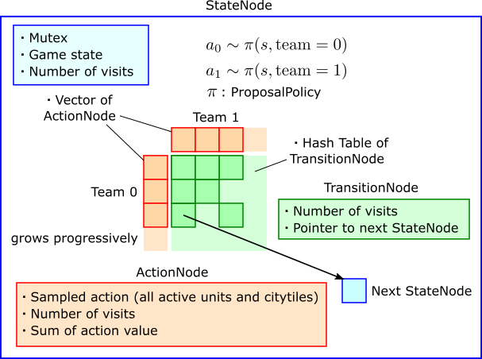

# Lux AI 2021（Season 1）轻量深读（Tier B）

> 赛事：Featured ｜ 主题 sim-agent（1v1 即时策略对抗，提交 agent 程序）｜ 1178 队 ｜ 标准赛（对战配对，Elo 型）｜ 指标：Lux AI 2021
> 材料基础：`digests/lux-ai-2021.md`（4 篇正文：Toad Brigade RL 294993 / 5th 293911 / 6th 293776 / 4th 296938 / 8th 294603 / 16th 293835；80 条主题索引）+ 14 张图
> 轻读时间：2026-10（Tier B B08）

## 1. 一句话重述与数字账

两位玩家在网格地图上运营工人/城市/资源（含昼夜燃料机制）的 1v1 对抗。真正的考点是**"在超大联合动作空间 + 每回合时限下的策略学习"**：冠军 Toad Brigade 用**单调自对弈 RL** 反超并碾压规则/模仿路线（与其他队差约 300 Elo），而其余名次主要靠**模仿学习（IL）+ 手工规则 + MCTS**。

| 关键数字 | 值 | 来源 |
| --- | --- | --- |
| 1st Toad Brigade（294993） | **纯 RL 自对弈**：单一网络对全地图所有工人/城市同时输出动作（一次前向覆盖任意规模舰队，解决可变单位数与信用分配问题）；奖励仅终局 ±1；数月夜间持续训练，能力单调提升（一个月内就超过同队的规则 agent）；策略随规则改动演化：早期"焦土采光资源"，木材再生改动后转为**保护可再生森林、封锁对手、最后昼夜抢建大城**；作者用"逐格删除状态看 value 变化"可视化重要性 | 294993 |
| 5th（293911） | **Conditional UNet 模仿学习**：条件输入 = 全局状态 + **要模仿的 agent 身份**，一个模型同时模仿多个 agent；训练数据 = 2021-12-01 时 Elo>1700 的 **82 个 agent、约 1.6 万场**；验证 = 最佳 agent 的 10% 对局；结论：IL 能复制强 agent，但"**300 场的对局量不足以得到好拷贝**"（与 Toad Brigade 差 ~300 Elo） | 293911 |
| 6th（293776） | 全 IL，RL 多次尝试失败；7 个输出（unit：CENTER/NORTH move、build city、NORTH transfer；citytile：build unit/research/do nothing）；**唯一一次前向/turn**（"per-unit 方案会被时限压死"）；技巧：先用 7–20 个 top agent 数据训练、再**冻结主干只用 Toad Brigade 回放微调最后 3 层**；transfer 动作与 city-tile 模型都是明显增益 | 293776 |
| 4th（296938） | 从 top-7 agent 做 IL：**共享 CNN + 每个 agent 一个独立 FC 头**（避免混合数据互相干扰），推理只用 top agent 的头；在 UNet 上插入 FReLU、SE、transformer encoder，尽量加深加宽；加权 softmax CE（降低 move center 权重）、四方向旋转增强、100 epoch（最终模型训练约一周）；**输出后接规则解释器**（禁止工人同格、citytile 优先 Build Worker 等），"直接使用网络输出效果不理想" | 296938 |
| 8th（294603） | **NN + MCTS**：自写 C++ 游戏状态转移（克隆引擎，用于高速自对弈与搜索）；为"同时动作 + 超大动作空间"设计 MCTS：**ProposalPolicy 采样候选动作 + Progressive Widening + UCB1 + TransitionNode 哈希表 + 多线程虚拟损失**；叶节点用价值网络和/或 rollout 评估；省略 transfer 是"大错" | 294603 |
| 16th（293835） | "用规则改良模仿 agent"：sazuma 公开 IL 的细节（不训练 center 动作、有宵禁、单位视野受限、citytile 无脑造兵）；16th 的改法 = 加 center 动作、去掉宵禁 + 一批规则（建城排序、木材不足时不造兵、移动排序让有资源的先走、无法过夜则撤出、城格占用防堆叠） | 293835 |
| 社区 | 规则总览图（69 票）、**开源更快的 Python 引擎 + RL Gym**（63 票）、UNet IL 教程（60 票）、可套用的算法清单（56 票）、如何写规则 agent（53 票）、**RL 实战技巧清单**（51 票）、迁移学习（48 票） | 社区 |

## 2. 逐方案对照矩阵

| 维度 | Toad Brigade | 5th | 6th | 4th | 8th |
| --- | --- | --- | --- | --- | --- |
| 路线 | **纯 RL 自对弈** | Conditional UNet IL | IL + 微调 | IL（多 agent 多头） | NN + MCTS |
| 动作输出 | 全单位/城市同时（单网络） | 条件 UNet | 7 动作（单前向） | 单前向 + 规则解释器 | 搜索 + 策略/价值网 |
| 训练数据 | 自对弈 | 82 agent × ~16k 场 | top agent 回放 | top-7 agent | 自对弈/IL |
| 关键工程 | 奖励塑造极简（±1） | 身份条件化 | 单前向 + 冻结微调 | FReLU/SE/Transformer + 规则 | C++ 克隆 + 渐进加宽 MCTS |

## 3. 共识、分歧与裁决

### 共识一：单网络"全体单位一次前向"是时限下的主流架构（Toad Brigade/5th/6th/4th）

每回合时限极紧（6th 说单前向已经逼近上限，"per-unit 方案会很难受"）；三队都选择一次前向覆盖所有单位/城市，并靠掩码/排序取用。**裁决**：对抗类比赛的动作空间工程 ≈ 把"信用分配 + 时延"两个约束同时解掉；单前向多单位是已被验证的范式。置信度：高。

### 共识二：IL 能快速到前列，但上限受"数据来源强度"限制（5th/6th/4th/16th）

所有 IL 队伍都以 top 1 的 Toad Brigade 为模仿目标（6th 甚至专门冻结主干只学 TD；5th 报告与 TD 差 ~300 Elo、300 场对局不足以复制）。**裁决**：IL 的天花板 ≈ 被模仿者的水平减去数据/表达损失；要超越必须走 RL 或搜索（8th 的 MCTS 是补强方向）。置信度：高。

### 共识三：RL 的可行路径是"自对弈 + 极简奖励"（Toad Brigade）

冠军的奖励只有终局 ±1，却学出了资源垄断与长期战略；其他队的 RL 尝试（6th："多次失败"）失败。**裁决**：在有自对弈环境与足够算力的赛制里，纯 RL 可行且上限最高；但需要基础设施（高速引擎/并行自对弈）与长期训练窗口。置信度：高（正反例都有）。

### 分歧一：搜索（MCTS）值不值

8th 用自写 C++ 引擎 + 渐进加宽 MCTS + 价值网融合，拿到 8th；4th/5th/6th 都没用搜索。**裁决**：搜索的收益取决于"状态转移是否可高效克隆 + 时限是否允许"；本场 8th 证明可行但成本高（第一个月都在写引擎）。置信度：中高。

### 分歧二：规则后处理用不用

4th 明说"直接用网络输出不理想"，需要规则解释器；16th 整篇都在讲规则补丁；Toad Brigade 则放弃了规则路线（"RL 一开始就超过规则 agent"）。**裁决**：IL/弱策略阶段规则是必要脚手架；一旦 RL 收敛，规则会限制上限。置信度：中高。

### 事件：规则改动与策略演化（Toad Brigade）

木材再生 + 燃料成本调整削弱"焦土速攻"后，冠军 agent 自发转向保护森林的可持续策略。**裁决**：自对弈 RL 能适应规则变更，但需要重新训练窗口；比赛中的规则改动要纳入"再训练预算"评估。置信度：中高。

## 4. 证据分级

| 断言 | 等级 | 说明 |
| --- | --- | --- |
| Toad Brigade 的 RL 设置与策略演化 | 自述 + 开源代码 + 可视化 | 高 |
| 5th 的条件 UNet 与 82 agent 数据、~300 Elo 差距 | 自述 + 公开代码 | 中高 |
| 6th 的单前向 7 动作与冻结微调 | 自述 + 图 | 中高 |
| 4th 的多头 IL + 规则解释器 | 自述 + 代码 | 中高 |
| 8th 的 C++ 引擎 + 渐进加宽 MCTS | 自述 + 结构图 | 中高 |
| 16th 的规则清单 | 自述 + 代码 | 中 |

## 5. 悬案与缺口（登记）

- 2nd/3rd/7th 与 9th–15th 的方案未入库（6th 提到的 sazuma 教程是关键公共基线，但独立帖未细读）；
- "RL 技巧清单"（51 票）与"RLIAYN 在线 RL"（44 票）未细读——是本场最容易迁移的工程经验；
- Toad Brigade 的网络结构与训练规模细节未在归档部分展开；
- 归档 14 图：8th 的 MCTS 结构图（图 1）、Toad Brigade 的 GIF 可视化、4th 的模型图。

## 6. 图表证据

**图 1**（topic 294603）：为"同时动作 + 超大联合动作空间"改造的 MCTS——StateNode 持有双方 ActionNode 向量（按访问数**渐进加宽**），双方动作由 ProposalPolicy 采样、经 TransitionNode 哈希表转移；叶节点用价值网/rollout 评估，多线程用虚拟损失并行。这是"搜索如何适配 RTS 级动作空间"的具体方案。

## 7. 出处

- Toad Brigade 的 RL（294993）：https://www.kaggle.com/competitions/lux-ai-2021/discussion/294993
- 5th（297 行处）：https://www.kaggle.com/competitions/lux-ai-2021/discussion/293911
- 6th（72 票）：https://www.kaggle.com/competitions/lux-ai-2021/discussion/293776
- 4th：https://www.kaggle.com/competitions/lux-ai-2021/discussion/296938
- 8th：https://www.kaggle.com/competitions/lux-ai-2021/discussion/294603
- 16th 规则补丁：https://www.kaggle.com/competitions/lux-ai-2021/discussion/293835
- 开源引擎 + RL Gym（63 票）：https://www.kaggle.com/competitions/lux-ai-2021/discussion/267351
