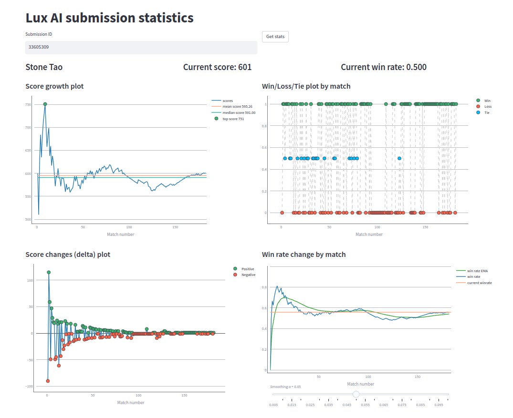
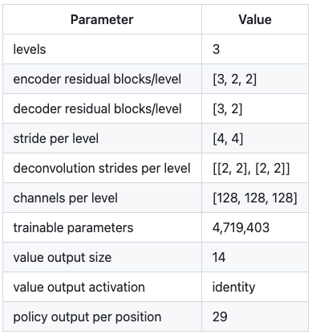
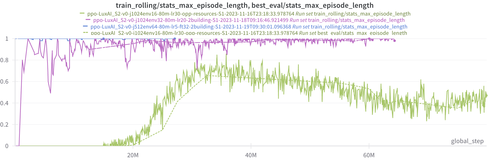
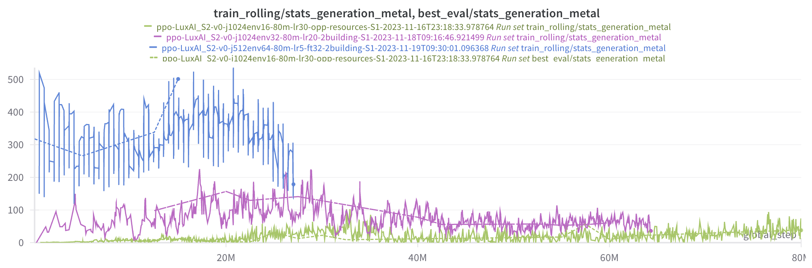

# Lux AI Season 2 – NeurIPS Stage 2 轻量深读（Tier B）

> 赛事：Featured（标准赛 / 多智能体 RL）｜ 主题 sim-agent（Lux AI S2 精英阶段）｜ 64 队 ｜ 指标 lux_ai_s2 ｜ 截止 2023-11-28（延期至周一）
> 材料基础：`digests/lux-ai-season-2-neurips-stage-2.md`（6 篇正文：PPO+Jux 方案 459891 / 上手资源 442050 / 基线资源 438939 / 统计站 442372 / Discord 规则 442221 / 延期公告 456054；14 条主题索引）+ 12 张归档图
> 轻读时间：2026-10（Tier B B19）

## 1. 一句话重述与数字账

Lux AI S2 的 NeurIPS 精英阶段（**仅 64 队**）：在 16×16/32×32/64×64 地图上训练 1v1 资源采集+工厂建造 agent。归档里唯一的技术正文（459891）给出了完整的工业级 RL 配方：**fork Jux 支持非 lockstep 向量化环境 → 16→32→64 地图课程学习（各 80M 步、权重热启动）→ 行动掩码与冲突取消 → DoubleCone 加深感受野 → 统计量按 EMA 标准差归一化后与胜负奖励一起做 PPO**。作者同时公开了失败信号：32×32 的 KL 在 30M 步后 >0.02、金属产量跌到 100 以下（重型机器人成本），64×64 的损失周期性尖刺——"训练何时停止有用"比"跑满步数"更重要。

| 关键数字 | 值 | 来源 |
| --- | --- | --- |
| 规模与赛制 | **64 队**；Stage 2（精英阶段）；因 episode 失败延期到周一 | 索引 / 456054 |
| 训练课程 | 16×16 → 32×32 → 64×64，每段 **80M 步**，后段用前段最佳 checkpoint 热启动；向量化环境 **1024/1024/512**；16×16 用相邻工厂 spawn hack | 459891 |
| 模型 | DoubleCone 风格 + 额外 4× 下采样（感受野到 64×64）；**4,719,403 参数**；value 输出 14；policy 每位置 29 个 logit（24 单位 + 4 工厂 + 1 放置）；动作类型/子动作按独立同分布处理 | 459891（图 4） |
| 行动掩码 | 大量无效动作屏蔽 + 冲突取消（移动/转移/拾取冲突迭代取消）；规则示例：剩余步数不足不浇地衣、工厂格不转出资源、只能挖资源/敌方地衣/工厂地衣区旁废墟、只能在全资源+可挖区+己方单位+敌地衣的矩形内移动、只有 light 能自毁且仅限不可一击清除的敌地衣 | 459891 |
| 奖励与稳定性 | generation/resources 各统计量除以 **5M 步窗口的 EMA 标准差** + WinLoss(+1/-1/0)；通过改奖励权重即可切换策略（32/64 更奖励 ore/metal/机器人）；32×32 KL **>0.02**（30M 步后）、64×64 loss 周期性尖刺（每 1000 步同时结束游戏）；32×32 金属产量跌破 **100**（重机器人成本）后仍在产出能赢旧 checkpoint 的模型 | 459891（图 9/10） |
| 算力 | Lambda Cloud **1×A10**/实例；大地图用 A100 翻倍 mini-batch；PyTorch bfloat16 autocast + 梯度累积；进度停滞则提前停训 | 459891 |
| 社区设施 | 上手资源帖 16 票（官方教程 + Lux S2 前 10 方案 + Lux 2021/Kore/Hungry Geese）；Parametrix.ai 的 PPO 基线 + 往季 episode 下载；第三方统计站（score growth / win rate / delta，开源） | 442050 / 438939 / 442372 |

## 2. 逐方案对照矩阵

| 维度 | 本场唯一技术方案（PPO+Jux） | 系列赛对照（Lux S2 主赛/前作） |
| --- | --- | --- |
| 框架 | fork Jux：非 lockstep、统计收集、相邻工厂 spawn | Jux 原版 lockstep 假设不适配混合阶段 |
| 观察/动作 | GridNet 观察；动作按方向/资源拆分 | 主赛 top 方案多用规则/模仿学习起步 |
| 训练 | 渐进地图课程 + EMA 归一化统计奖励 | 主赛 RL 需 shaped reward 起训 |
| 稳定性 | KL/产量/步数多指标监控 + 早停 | 工程改造深度决定上限 |

## 3. 共识、分歧与裁决

### 共识一：课程学习（小图→大图）是复杂 RL 环境的可行起训方式（459891；置信度中高）

16×16 先把"放置工厂/挖矿/造机器人"的基本循环学出来，再热启动到大图；16×16 最终也只有约 600 步/局，说明小图本身就难打满。**裁决**：地图/场景复杂的比赛先在小尺寸学基础技能，再逐步放大；每阶段用最佳 checkpoint 而非最后 checkpoint。置信度：中高（单一权威自述 + 曲线）。

### 共识二：奖励归一化 + 权重可调 = 不换模型换策略（459891；置信度中）

作者把每个统计量除以其 5M 步 EMA 标准差，再把各 advantage 乘以系数；比赛中后期只改 ore/metal/robot 权重就把策略推向"重建设"。**裁决**：多目标 RL 用"归一化统计 + 可调权重"代替手写复合奖励，便于快速做策略消融。置信度：中。

### 共识三：行动掩码与冲突取消是复杂动作空间的必要工程（459891；置信度中高）

大量 no-op/无效动作被屏蔽，冲突动作整批取消而不是尝试解算。**裁决**：动作空间大的 agent 比赛，先把合法性与冲突处理写进环境包装层，再谈网络结构。置信度：中高。

### 事件一：训练"有效步数"远小于预算，必须看动力学指标（459891；置信度中高）

64×64 的"能赢旧 checkpoint"曲线在 20M 步前就停了；32×32 在金属产量跌破 100 后仍在产出 winner——KL/产量/步数曲线是决定何时停训的依据。**裁决**：为每个训练 run 设"里程碑指标 + 早停"，不要机械跑满步数。置信度：中高。

### 事件二：多人竞技平台的统计设施很有价值（442372 / 442050 / 438939；置信度中）

第三方统计站（分数增长、胜率 EMA、delta）与往季 episode 下载支撑了"用数据决定提交"；对局失败的 episode 问题甚至导致官方延期。**裁决**：agent 赛事把"回放/统计工具"当基础设施，提交前用胜率曲线而不是单场结果判断。置信度：中。

## 4. 证据分级

| 断言 | 等级 | 说明 |
| --- | --- | --- |
| PPO+Jux 的完整配方与曲线 | 作者自述 + 11 张图（459891） | 高（细节最全的 Tier B agent 材料） |
| 地图课程与热启动 | 自述 + 训练 run 命名与表格 | 中高 |
| 行动掩码规则清单 | 自述 | 中高 |
| 训练不稳定性（KL/loss/产量） | 自述 + W&B 曲线 | 中高 |
| 上手/基线资源 | 官方与社区帖（442050 / 438939） | 高（存在性） |
| 统计站数据 | 第三方站截图（442372） | 中 |

## 5. 悬案与缺口（登记）

- Stage 2 的最终排名/获奖方案未归档（本场只有一份技术正文，4 票）；
- 16×16 spawn hack 与 valid_spawns_mask 修复是否影响比赛公平性无归档讨论；
- 作者列的 LayerNorm/ChannelLayerNorm2d 等改进未给出结果；
- 统计站为第三方个人服务，数据长期可用性未知；
- **图证缺口**：无（12 张图，本深读内嵌 4 张）。

## 6. 图表证据

**图 1**（topic 442372）：第三方统计站对一个提交的分数增长、胜/负/平、delta 与胜率 EMA——agent 赛事用长期曲线判断强度而不是单场结果。

**图 2**（topic 459891）：网络配置表——3 层、编码器 residual blocks [3,2,2]、解码器 [3,2]、stride [4,4]、通道 128、**4.72M 参数**、value 14、policy 每位置 29。

**图 3**（topic 459891）：达到步数上限的对局比例——16×16（绿）平均约 600 步；32×32（紫）与 64×64（蓝）经常打满。

**图 4**（topic 459891）：每局平均金属产量——64×64 的"能赢旧 checkpoint"推进在 20M 步前停止；32×32 虽持续产出 winner，但产量跌破 100（重型机器人成本），提示训练已过收益拐点。

## 7. 出处

- PPO using Jux 方案（4 票 / 4 评论）：https://www.kaggle.com/competitions/lux-ai-season-2-neurips-stage-2/discussion/459891
- 上手资源汇编（16 票 / 0 评论）：https://www.kaggle.com/competitions/lux-ai-season-2-neurips-stage-2/discussion/442050
- 基线/数据/公开代码（3 票 / 3 评论）：https://www.kaggle.com/competitions/lux-ai-season-2-neurips-stage-2/discussion/438939
- 提交统计站（5 票 / 1 评论）：https://www.kaggle.com/competitions/lux-ai-season-2-neurips-stage-2/discussion/442372
- Discord 规则（2 票 / 0 评论）：https://www.kaggle.com/competitions/lux-ai-season-2-neurips-stage-2/discussion/442221
- 延期公告（2 票 / 0 评论）：https://www.kaggle.com/competitions/lux-ai-season-2-neurips-stage-2/discussion/456054
