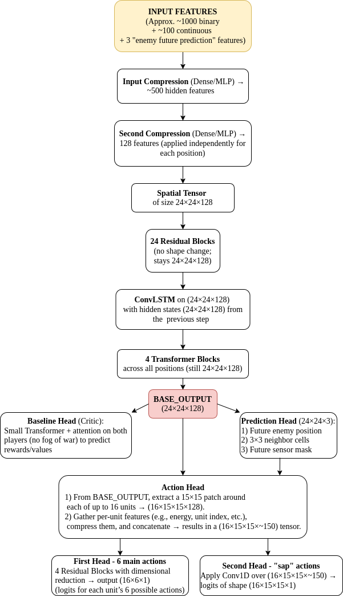

# Lux AI Season 3 轻量深读（Tier B）

> 赛事：Featured ｜ 主题 sim-agent（多智能体策略）｜ 701 队 ｜ 标准赛（提交 agent）｜ 指标：Lux AI Season 3（对局胜负/评分）
> 材料基础：`digests/lux-ai-season-3.md`（6 篇正文：Frog Parade / 1st Flat Neurons / 9th / 14th 3Comets / 4th / 3rd IL；80 条主题索引）+ 16 张图
> 轻读时间：2026-10（Tier B B02）

## 1. 一句话重述与数字账

16 单位、24×24 地图、战争迷雾下的 1v1 对抗（收集 relic 得分）。真正的考点是**两条路线之争：大规模自对弈 RL（1st）vs 从顶级回放做模仿学习（3rd/4th/9th/14th）**，外加隐藏参数估计与"防模仿"的元博弈。

| 关键数字 | 值 | 来源 |
| --- | --- | --- |
| 1st（RL） | IMPALA+V-trace+Upgo；每 tile ~1000+ 特征（~100 连续+one-hot）；24 resblock+ConvLSTM+4 Transformer；双动作头（6 动作 / 15×15 sap 目标）；敌方未来位置监督头；动态奖励缩放（滑窗 5000 批 → [-5,5]）；动态熵（0.9/3.9→0，100M 步；重置 0.45/2.0）；终局奖励 ±1/±2.5（单局最大 ±7.5）；最终 **~1.5B 步/3–4 天**（200M 迭代），全程 **>20B 步** | 1st |
| 1st 的防模仿测试 | 单提交内两模型：弱模型 85%/强模型 15%；按 main/submission/is_strong 统计胜率；后期用 logits 噪声弱化提交；强模型改为"同一局内分轮使用" | 1st |
| 3rd（IL） | 两个 UNet（Unit-UNet 6×24×24 动作 + SAP-UNet 24×24 目标）；28×24×24 特征+17 全局；训练数据=Frog Parade 回放；丢 95% 全 Center 样本；规则系被 IL 数小时训练击败后全面转 IL；在 FP 上再微调 FN | 3rd |
| 9th（IL） | 14 map 通道+16 标量；两阶段：FP 7,935 局（仅胜局）→ FP 1,550 局（胜负都用）；**最小费用流**给单位分配动作 | 9th |
| 4th（IL） | 两个 IL 模型（Action/Sap Target）；隐藏参数估计（sap dropoff）；估计完成后**切换模型** | 4th |
| 14th | 多智能体 RL 银牌（3Comets） | 材料 |

## 2. 逐方案对照矩阵

| 维度 | 1st（RL） | 3rd（IL） | 9th（IL） | 4th（IL） |
| --- | --- | --- | --- | --- |
| 学习范式 | IMPALA 自对弈 + 教师蒸馏 | 从顶级回放监督 | 两阶段 IL | 双 IL 模型 |
| 网络 | ResBlock+ConvLSTM+Transformer+多头 | Unit-UNet + SAP-UNet | UNet + 最小费用流 | Action + SapTarget |
| 隐藏参数 | 内部状态估计器（nebula/点位） | 在特征中估计 | 估计 | **估计后切换模型** |
| 多样性/防遗忘 | 教师 KL + 冻结对手池 + 动态熵/奖励 | 数据筛选（胜局/去掉已定局） | 两阶段数据 | — |
| 对称性 | 强制己方 (0,0)+翻转 | 镜像到 (0,0) | 镜像到 (0,0) | — |
| 元博弈 | 85/15 双模型+日志+噪声，防 IL 抄 | 直接学 FP/FN | 学 FP | 学 FP |

## 3. 共识、分歧与裁决

### 共识一：隐藏参数与环境估计是硬前提（4/4）

nebula 漂移/能量削减/视野缩减、sap dropoff、得分点位都不可直接观测；1st 用内部状态更新器、3rd/4th 显式估计、9th 用估计通道。**裁决**：部分可观测对抗中，**"估参数"模块与策略网络同等重要**；4th 的"估计完成即切换模型"是最干净的使用方式。置信度：高。

### 共识二：对称性归一（强制 (0,0) + 镜像/翻转）是标准工程（3/3 明示）

1st 训练与推理翻转增广；3rd/9th 镜像所有回放到 (0,0)。**裁决**：把地图对称性从数据里消掉，等价于数据增广 + 降维；同时注意动作分布失衡（3rd 提到右/下增多，用加权 CE）。置信度：高。

### 共识三：IL 是快速追赶顶级方案的最短路径（3 队实证）

3rd：规则系数周无进展 → IL 数小时训练即超过；4th 首个仿真赛即第 4；9th 两阶段 IL 第 9；数据都来自 Frog Parade/Flat Neurons 回放。**裁决**：当头部 agent 的公开回放可下载时，IL 能以极低成本复刻强策略；RL 的优势需要规模（20B 步）与防模仿设计来维持。置信度：高。

### 分歧/元博弈：被模仿者的应对（1st 的 85/15 双模型）

1st 明确"IL 会抄我们的策略"：在同一提交里放弱/强两模型，85% 用弱模型保排名、15% 用强模型测真实胜率并记录到日志；后期用 logits 噪声与"局内分轮"进一步模糊。**裁决**：在 IL 盛行的对抗赛里，**提交策略本身是博弈的一部分**——既要测强度，又要防止对手低成本复制。置信度：中高（自述，但机制清晰）。

### 分歧一：RL vs IL 的上限

1st 用 20B 步 RL 夺冠；3rd/4th/9th 用 IL 进前 10。**裁决**：IL 起步快、上限受教师数据限制；RL 天花板更高但需要巨大算力与稳定化技巧（动态奖励/熵/教师 KL/对手池）。置信度：高。

### 分歧二：动作分配细节（同格多单位/多回合）

3rd：同格多单位按能量分半、优先移动/SAP；9th：最小费用流；1st：每单位独立 patch + 采样/贪心。**裁决**：动作分配是一个独立子问题；min-cost flow 是更原则化的方案，工程启发式亦可。置信度：中。

## 4. 证据分级

| 断言 | 等级 | 说明 |
| --- | --- | --- |
| 1st 的架构/训练规模/防模仿策略 | 自述 + 架构图 + 代码 | 中高 |
| 3rd 的 IL 逆转（数小时超过规则系） | 自述 + 代码 | 中高 |
| 9th 的两阶段数据/最小费用流 | 自述 + 代码 | 中 |
| 4th 的模型切换 | 自述 + 代码 | 中 |
| 14th 多智能体 RL 银牌 | 材料（未细读） | 中 |
| Frog Parade 的具体方法 | 正文未细读（另一篇 568621） | 中（缺口） |

## 5. 悬案与缺口（登记）

- Frog Parade 方案（568621）未细读——它是全场的"教师数据来源"，其方法与许可影响整个 IL 生态。
- 1st 的"logits 噪声弱化"参数与效果、85/15 策略的最终收益未量化。
- 14th 的多智能体 RL 细节未读；Frog Parade/Flat Neurons 的对局风格差异未分析。
- 防模仿是否真的降低了 IL 对手的胜率：缺受控证据（只有设计意图）。

## 6. 图表证据

**图 1**（topic 569562）：输入（~1000 二值+~100 连续+3 敌方未来特征）→ 两级压缩 → 24×24×128 → 24 残差块 → ConvLSTM → 4 Transformer 块 → BASE_OUTPUT → 基线头/预测头/动作头（6 动作 + 15×15 sap 目标）。**本场 RL 方案的完整骨架**。

## 7. 出处

- Frog Parade（568621）：https://www.kaggle.com/competitions/lux-ai-season-3/discussion/568621
- 1st Flat Neurons（569562）：https://www.kaggle.com/competitions/lux-ai-season-3/discussion/569562
- 9th（568789）：https://www.kaggle.com/competitions/lux-ai-season-3/discussion/568789
- 14th 多智能体 RL（567961）：https://www.kaggle.com/competitions/lux-ai-season-3/discussion/567961
- 4th IL（569928）：https://www.kaggle.com/competitions/lux-ai-season-3/discussion/569928
- 3rd IL（568494）：https://www.kaggle.com/competitions/lux-ai-season-3/discussion/568494
