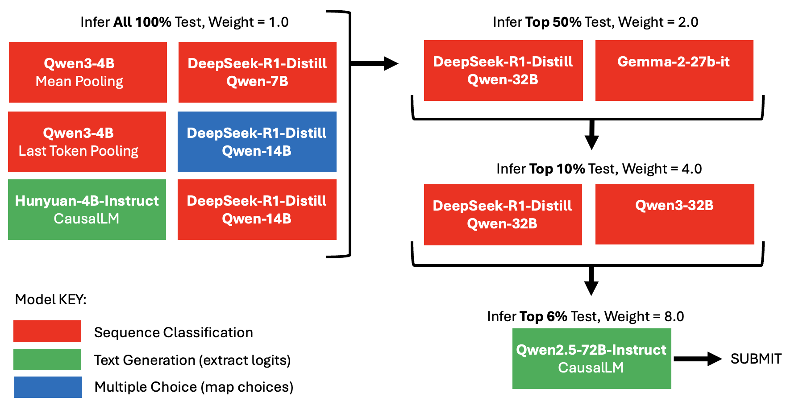
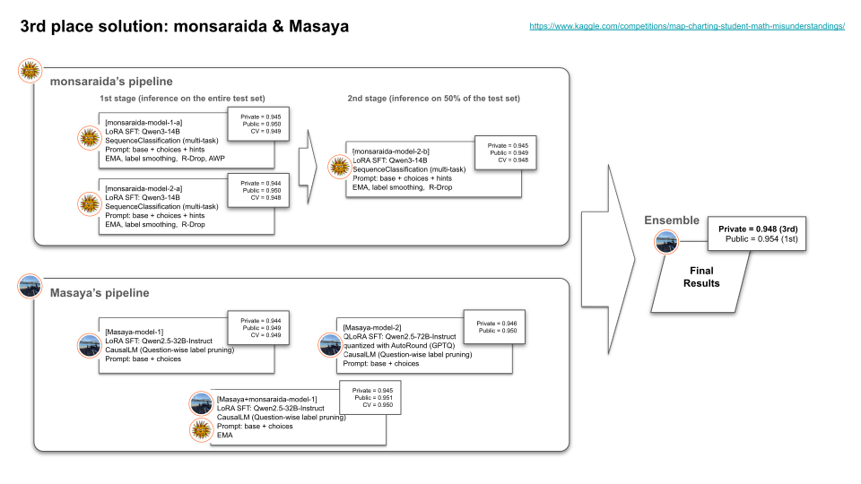
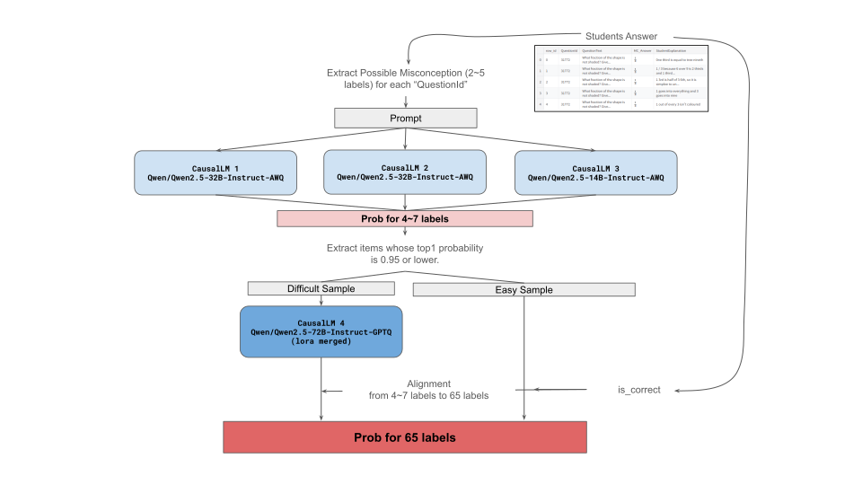

# MAP 数学误解分类深读：标签空间工程 + 推理预算编排

> 赛事：Featured ｜ 主题 nlp（教育）｜ 1500+ 队 ｜ 代码赛 ｜ 指标 MAP@3（65 类标签）（2025-10 截止）
> 材料基础：`digests/map-charting-student-math-misunderstandings.md`（6 节：1st/3rd/6th/10th/18th + "测试题是否与训练相同"帖）+ 3 张图
> 深读时间：2026-10（Tier A #21，Batch 3 首篇）

## 0. 一句话重述：这道题真正在考什么

题面是"判断学生解释属于哪种数学误解（65 类）"，实际被考的是**在一个结构化的窄标签空间里做工程**：

1. **标签空间重构**：65 类 = True/False × {Correct/Neither/Misconception} × 37 种误解；而**每个 QuestionId 只可能有 2–5 种误解**、训练/测试仅 15 道题 → 把 65 类降解为"每题 6 选 1"/"每题 8–12 个后缀选 1"，精度大涨且推理快 2–3 倍（3rd 的 Masaya +0.002~0.003；1st 的 suffix classification 是极致形态）；
2. **提示结构**：把 `{Answer}` 换成 `{Choices + Selected}`（+0.001~0.004）、加每题候选误解列表（+0.0003）、以 `is_correct` 规则特征代替让模型猜对错（98 票帖子）；
3. **噪声标签的验证学**：主噪声来自 "Neither"；单种子 CV 不可信（1st：5 折 × 5 种子、3 种子才稳；"信 loss 不信 MAP@3"）；
4. **推理预算是第二赛场**：9 小时/2×T4 的硬约束下，用**级联/金字塔**（按不确定度分层重推）/ **量化**（W8A8 INT8、GPTQ-4bit）/ **逐层 offload** 把 32B–72B 塞进预算；
5. **多范式互补**：序列分类 / CausalLM 生成 / 多选 / 多头分解 / 后缀分类——跨范式集成的增益大于范式内集成。

一句话：**这是一场"把标签结构读透、把推理预算编排好"的比赛**——模型（Qwen 家族）是公共品，分差全在输出空间设计与推理工程。

## 1. 材料与角色

| 帖子 | 作者 | 票数 | 角色与独有信息 |
| --- | --- | --- | --- |
| [612268](https://www.kaggle.com/competitions/map-charting-student-math-misunderstandings/discussion/612268)（1st，191 票） | tascj | 191 | **后缀分类 + FlexAttention 前缀共享**；offload_adam 单卡 32B 全参训练；5 折×5 种子；W8A8 INT8 + 逐层 offload（65 分钟/16k 样本） |
| [589400](https://www.kaggle.com/competitions/map-charting-student-math-misunderstandings/discussion/589400)（题目结构帖，98 票） | Chris Deotte | 98 | **is_correct 特征**（15 题固定 → 正确选项可规则计算）；指出 12 行错误标签（Q31778/MC_Answer=9）及清洗代码 |
| [612096](https://www.kaggle.com/competitions/map-charting-student-math-misunderstandings/discussion/612096)（18th，81 票） | Chris Deotte | 81 | **金字塔集成**：100%→50%→10%→6% 分层重推、权重 1/2/4/8；3 个月 1000+ 模型；4 条范式（分类/生成/多选/多头）全试 |
| [612059](https://www.kaggle.com/competitions/map-charting-student-math-misunderstandings/discussion/612059)（3rd/公开第 1，78 票） | monsaraida & Masaya | 78 | 提示结构（Choices/Selected +0.001）；R-Drop +0.001；每题标签限制（+0.002~0.003、快 3×）；72B 级联（190min→60min）；fp16/padding 提速 4× |
| [612038](https://www.kaggle.com/competitions/map-charting-student-math-misunderstandings/discussion/612038)（10th，64 票） | 匿名 solo | 64 | 直接 65 类分类 + 15 个 QLoRA 模型（3 backbone × 5 折）；Focal+CE + 类别权重 warmup 0.33；logit 加权融合（32B×2，8B×1） |
| [612099](https://www.kaggle.com/competitions/map-charting-student-math-misunderstandings/discussion/612099)（6th，44 票） | Manan Jhaveri | 44 | 37 类 + 去重/伪标签重复样本/合成稀类；Qwen-semble 7 模型 0.951/0.947；"个体最差的增强模型对集成贡献显著" |

**材料缺口（未扩采，登记备查）**：索引里另有 16 条 write-up 未收录（2nd/4th/5th/8th 等）。

## 2. 逐方案对照矩阵

| 维度 | 1st tascj | 3rd monsaraida | 3rd Masaya | 10th | 6th Manan | 18th Chris |
| --- | --- | --- | --- | --- | --- | --- |
| 输出空间 | **每题的 8–12 个候选"后缀"选 1**（后缀分类） | 65 类 + 辅助任务（2/3/36 类多任务） | **每题仅列出可能误解**（2–5 个标签 + Correct/Incorrect） | 65 类直接分类 | 37 类（去 True/False 前缀） | 三种：65 类/37 类/多选 A–F/3 头分解 |
| 模型 | DeepSeek-R1-Distill 7B/14B、Qwen3 8B/14B/32B、GLM-Z1 9B/32B | Qwen3-14B（试了 10 个基座） | Qwen2.5 14B/32B/72B（AWQ/GPTQ） | Qwen3-Reranker-8B / Qwen3-Embedding-8B / Qwen2.5-32B | Qwen3-Embedding-8B、Qwen3-14B、Qwen2.5-14B | 全家族（1B–72B，1000+ 模型） |
| 训练 | 全参 + offload_adam（单 A100 80G 训 32B）；epoch1/bs32/lr1e-5 | LoRA + 多任务 + R-Drop/AWP/EMA | LoRA r16/a32；EMA 最佳单模 72B | QLoRA + Focal+CE + 权重 warmup | QLoRA r128；去重/伪标签/合成数据 | 14B 以下全参、以上 LoRA/QLoRA |
| 验证 | 5 折×5 种子；3 种子稳定；信 loss 不信 MAP@3 | CV/公开；R-Drop 稳定 | fold0 CV（算力有限）；72B EMA 最佳但公开低未用 | 5 折×3 backbone | 20% 本地 + 全量重训 | 多范式多提示大量实验 |
| 推理工程 | W8A8 INT8（SmoothQuant 0.75）+ 逐层 offload（65min/16k，2×T4） | 多阶段：全量→最低置信 50% 重推；fp16+padding=False 4× 提速 | **置信级联**：14B/32B 先跑，低置信→72B（190min→60min） | GPTQ-4bit + FP16 头 + vLLM embed；logit 加权融合 | 常规 vLLM/量化 | **金字塔**：100%→50%→10%→6%，权重 1/2/4/8 |
| 成绩 | 冠军 | — | — | 公开 0.951 / 私榜 0.948 | 公开 0.951 / 私榜 0.947 | CV 0.951 / 公开 0.952 / 私榜 0.947 |

## 3. 共识、分歧与裁决

### 共识一：把标签空间"读窄"是最大单步（全员）

- 3rd Masaya：每题只列出该题可能出现的误解 + Correct/Incorrect → CV/LB +0.002~0.003、**快 3 倍**；补充"把其他选项也放进 prompt"再 +0.003~0.004；
- 1st：把问题重构为"从每题 8–12 个候选后缀中选 1"（候选数随题目而定），配合前缀共享的 FlexAttention 一次前向给所有候选打分；
- 18th：多选（A–F，6 选 1）范式"worked well"；
- 6th/10th 虽用 37/65 类，也都强调"每个 QuestionId 的标签集合是预定的"这一结构。

**裁决**：结构化标签空间的利用（每题候选集）是本场第一杠杆——它不仅提精度，还把推理成本按候选数缩小。置信度最高（三家独立、量级一致）。

### 共识二：提示的"对比结构"与规则特征值钱

`{Choices + Selected}` 代替 `{Answer}`（3rd +0.001，且"显著改善 Masaya 的模型"）；`is_correct` 规则特征（Chris 的 98 票帖：15 题固定 → 正确答案可算；附带发现 12 行错误标签）；候选误解列表作 hint（+0.0003）。

**裁决**：让模型"对比选项/对照候选误解"比让它自由判断更准；能用规则算出的字段（对错）就不要让模型学。置信度高。

### 共识三：噪声标签下"多种子"是验证的底线

1st 的核心方法论：**单种子 CV 极不稳定**（"主要因 Neither 噪声"）→ 5 折×5 种子，3 种子集成才稳定（并引用 Feedback Prize 1st 的同款做法）；"信 loss 而非 MAP@3"（loss 更稳）；18th 用 3 个月 1000+ 模型做实验；10th 用 15 模型集成（5 折 × 3 基座）稳带宽。

**裁决**：标签噪声 → 验证噪声；多种子/多折/多范式集成是唯一可靠的调参信号。置信度高。

### 分歧一：序列分类 vs CausalLM 生成 vs 多任务/多头

1st（suffix 分类 + FlexAttention）、10th（AutoModelForSequenceClassification）、6th（embedding 分类 + CausalLM 混合）、3rd Masaya（CausalLM）、18th（三范式全用并指出"多头"最难但有效）。**跨范式集成是共同选择**。

**裁决**：范式不是胜负手（都能到 0.95+）；差异在推理成本与集成互补性——CausalLM 在"每 token 语义随题目变化"时更自然（Masaya），分类头在多模型融合时更廉价。置信度中高。

### 分歧二：合成/增强数据用不用

6th：合成稀类 + 伪标签重复样本"明显提升"（最佳单模 0.949）；18th：GPT 合成数据"结果参差，最终不用"（不信任）；3rd Masaya：反转标签的噪声技巧无效；1st：235B 生成 justification 的辅助 SFT 损失"边际"。

**裁决**：合成数据的收益取决于"目标是否是补长尾支持度"——补稀类有效（6th 的 10/37 类），通用增广无效（6th 的 10k 增广样本 ≈0.945 无增益）。置信度中。

## 4. 增量数字账

| 动作 | 数字 | 来源 |
| --- | --- | --- |
| `{Choices+Selected}` 替代 `{Answer}` | CV/公开 +0.001（并显著改善队友模型） | 3rd monsaraida |
| 每题候选误解列表（hint） | +0.0003 | 3rd monsaraida |
| 每题标签限制（只列可能误解） | +0.002~0.003 且推理快 3× | 3rd Masaya |
| 把其他选项放进 prompt（Masaya） | +0.003~0.004 | 3rd Masaya |
| bfloat16→float16 + padding=False | 推理 2× × 2× = **4× 提速** | 3rd monsaraida |
| 72B 置信级联 | 190 min → **60 min** | 3rd Masaya |
| R-Drop（+AWP、EMA） | CV +0.001+ | 3rd monsaraida |
| 1st 的模型对照 | Qwen3-32B 0.9484；GLM-Z1-32B 0.9480；组合 **0.9496**（3 种子均值） | 1st |
| 1st 的验证纪律 | 5 折×5 种子；3 种子集成稳定；"信 loss 不信 MAP@3" | 1st |
| 1st 推理 | W8A8 INT8（T4 稳定 40+ TFLOPS vs 实测 20）；16k 样本 65 min（2×T4）；仅提交 4/6 模型（/tmp 容量崩溃） | 1st |
| 10th 对照表 | 单 8B 0.946/0.942；8B×5 0.950/0.946；32B×5 0.950/0.947；15 模型集成 **0.951/0.948** | 10th |
| 6th 对照 | 最佳单模 0.949；7 模型集成 **0.951/0.947**；个体差的增强模型对集成贡献显著 | 6th |
| 18th 金字塔 | CV 0.951 / 公开 0.952 / 私榜 0.947；权重 1/2/4/8 | 18th |
| 题目结构帖 | 15 题固定；Q31778 有 **12 行错误标签**（MC_Answer=9 标 True） | 589400 |

**可复算校验（2 处吻合）**

1. 10th 的 15 模型 = 3 backbone × 5 折 ✓；融合权重"32B 折 ×2、8B 折 ×1" → 2×5 + 1×10 = 20 权重单位 ✓；
2. 18th 金字塔层级 100%→50%→10%→6% 与权重 1→2→4→8 均为倍增结构 ✓（按不确定度收窄候选集、按模型强度加权的对称设计）。

## 5. 机制推演

**M1｜为什么"每题候选集"能把准确率抬起来**：65 类里大部分类对给定题目**不可能出现**（每题的误解集合预先确定）；把输出空间限制到题内候选，等于把先验正确注入模型，同时把跨题混淆（同为 Misconception 的不同类型）的概率质量重新分配。1st 的 suffix 分类进一步把"生成标签串"变成"给固定后缀打分"——输出空间与标签空间完全对齐。

**M2｜为什么 Choices/Selected 提示更有效**：学生解释里的错误往往是对**选项差异**的误读；仅给"所选答案"时模型看不到可选集合，无法判断"错在哪一步"；把 Choices 放入上下文使"误解类型"变成可比较的相对判断。

**M3｜噪声标签如何扭曲验证**：Neither 类边界模糊 + 个别错误标注 → 单种子 CV 抖动大于模型差异；1st 的"信 loss"是因为 loss（交叉熵）对全部类的概率质量敏感，而 MAP@3 只看前三名命中——噪声主要影响头部排序的 ±1 位，对 loss 的扰动更平滑。

**M4｜推理级联/金字塔的数学**：总推理量 = Σ 层级样本比例 × 模型成本。把大模型只用于最不确定的 6–50%，在总时长内换取"更大模型的有效覆盖"；18th 的权重 1/2/4/8 是对"更少但更强"的分层置信补偿。这与 THEORY L22（选择即分数）同源，但对象从"阈值"变成"算力分配"。

**M5｜量化为何在本场特别值钱**：任务输入短、输出是分类 logit，推理瓶颈在 Linear 层矩阵乘；W8A8 INT8 把 T4 的实测 20 TFLOPS 拉到 40+（1st），GPTQ-4bit + FP16 分类头（10th）与 AWQ（3rd）都在"保持 logits 校准"的前提下压缩成本——**分类任务的量化以 logit 分布不漂移为约束**。

**M6｜is_correct 规则特征的合法性**：15 题固定 → 每题正确答案唯一可算 → `is_correct` 无需模型学习；这同时解锁 True/False 前缀的确定性赋值与候选排序的先验。帖子还给出了训练集 12 行错误标签的清洗方法（先剔除错误选项行再取正确 Category）。

## 6. 证据分级

| 断言 | 等级 | 说明 |
| --- | --- | --- |
| 每题标签限制 +0.002~0.003 | **自述（强）** | 单变量、两家（Masaya/1st/18th 结构呼应） |
| Choices 提示 +0.001~0.004 | **自述（强）** | 3rd 双人独立验证（monsaraida + Masaya） |
| 1st 的种子/折对照与模型表 | **可读取（表）** | 3 种子均值 + loss/MAP 双列 |
| 10th/6th/18th 的集成对照 | **可读取（表）** | 单模→集成分数完整 |
| 12 行错误标签 | **可验证（数据）** | 给出 QuestionId/答案/清洗代码 |
| W8A8 40+ TFLOPS | **自述 + 工具文档** | LMDeploy/SmoothQuant 的已知收益 |
| 合成数据"参差"（18th）与"有效"（6th） | **自述（冲突）** | 口径不同（通用增广 vs 补稀类），见裁决 |

## 7. 边界条件与反事实

- **题目固定是前提**：15 题、每题误解集合预先确定 —— 一旦测试出现新题/新误解集合，"每题候选集"策略退化；98 票帖子专门讨论这一点（若测试同 15 题，可硬编码正确答案）。本场是"结构性先验"给的红利。
- **反事实（1st）**：若不实现 W8A8 + 逐层 offload，无法在 T4 上跑 32B；若 /tmp 管理正确（6 个模型全部提交），集成可能再 +0.001 级——**工程事故直接吃掉分数**。
- **反事实（3rd）**：若不用 72B 级联（直接 72B 全量），190 分钟×多模型无法塞进 9 小时；级联是"用排序置信度换算力"的典型。
- **反事实（18th）**：金字塔若不做不确定性重推，只能用中等模型覆盖全部样本，上限更低；反向地，若把大模型用在全量，时间不够。
- **边界（集成规模）**：6th 的"个体最差模型"在集成中有正贡献——**选成员的标准是互补性而非单体分数**（与 THEORY L7/L13 一致）。

## 8. 悬案与失败学

**悬案**

1. **测试集是否含新题**：帖子发问但无官方结论；若含新题，per-question 候选与 is_correct 的收益边界未知；
2. **多头的上限**：18th 的 3 头设计（Category × True/False 误解分头）"有效但难调"，其最优形态未被探索完；
3. **合成数据的分层有效性**：补稀类有效 vs 通用增广无效的边界（每类多少样本、什么生成器）无系统结论。

**失败学**

| 失败 | 来源 | 教训 |
| --- | --- | --- |
| 单种子验证 | 1st | 噪声标签下单种子分数误导；必须多种子 |
| 把 10k 通用增广样本加入训练 | 6th | 公开分停在 ~0.945、集成增益低——"多"不等于"有用" |
| GPT 合成数据（通用） | 18th | 结果参差、不信任——补稀类才值得合成 |
| Llama3.3-70B / Gemma2 基座 | 3rd Masaya | Qwen2.5 家族在本任务更强 |
| Fixing choices token per label / Eedi 预训练 / 反转标签技巧 | 3rd Masaya | 无效或伤分 |
| 2 阶段（先判对错再判类型）、文本生成、文本蕴含、MoE 头、focal loss | 6th | 多范式试验中的负面清单；embedding 分类最稳 |
| 硬逻辑约束的层级多任务、点式/列表式 reranker、TTA | 10th | 全部无效；"干净切分 + 平衡训练 + 许多小模型"胜出 |
| 把 checkpoint 放 /tmp | 1st | Kaggle CoW 存储无法真正删除 → 容量崩溃，6 个模型只交 4 个 |

## 9. 图表证据

> 路径相对本文件（`analysis/deep/`）：`../../intel/map-charting-student-math-misunderstandings/bodies/<topic>_img/NN.ext`

**图 1：18th 的金字塔集成**（Chris Deotte，topic 612096）——`../../intel/map-charting-student-math-misunderstandings/bodies/612096_img/01.png`

*读图结论*：四层推理——100% 样本用小模型（Qwen3-4B 均值/末 token 池化、Hunyuan-4B、DeepSeek-R1-Distill 7B/14B，权重 1.0）→ 按不确定度取 50%（DeepSeek-32B、Gemma-2-27B，权重 2.0）→ 10%（DeepSeek-32B、Qwen3-32B，权重 4.0）→ 6%（Qwen2.5-72B，权重 8.0）→ 提交。颜色标注范式（红=序列分类、绿=文本生成、蓝=多选），**一张图浓缩了本场"标签空间 × 范式 × 算力分配"三维设计**。

**图 2/3：3rd 的方案总览（SVG）**（topic 612059）——`../../intel/map-charting-student-math-misunderstandings/bodies/612059_img/01.svg`、`.../02.svg`

*说明*：两张 SVG 为纯矢量路径（无文字层），分别对应 monsaraida 与 Masaya 的管线总览；细节以正文为准（monsaraida：Qwen3-14B LoRA 多任务 + R-Drop + 多阶段推理；Masaya：CausalLM 每题候选 + 14B/32B→72B 级联）。

## 10. 对既有笔记/playbook 的修订点

1. `notes/nlp/map-charting-student-math-misunderstandings.md` 升级：补齐 6 节作者/票数；方案谱系扩为 6 方案对照矩阵；新增标签空间工程、提示对比结构、多种子验证、推理级联/金字塔、量化与 is_correct 特征、图证与失败学。
2. `playbook/nlp.md` 增补：
   - **标签空间工程**（利用题目/样本的结构化候选集，把 N 类问题降解为 k 选 1）；
   - **提示对比结构**（Choices/Selected、候选列表、规则可算字段不要学）；
   - **推理预算编排**（不确定度级联、金字塔权重、W8A8/GPTQ 分类保 logits）；
   - **噪声标签的验证纪律**（多种子、信 loss、多范式集成）。
3. `playbook/00-通用方法论.md` 增补："**算力分配也是选择问题**"——把最强模型的算力投向最不确定的样本（本场四级金字塔），与阈值/提交策略并列。

## 11. 出处

- 1st（tascj，191 票）：https://www.kaggle.com/competitions/map-charting-student-math-misunderstandings/discussion/612268
- 题目结构/is_correct（Chris Deotte，98 票）：https://www.kaggle.com/competitions/map-charting-student-math-misunderstandings/discussion/589400
- 18th 金字塔（Chris Deotte，81 票）：https://www.kaggle.com/competitions/map-charting-student-math-misunderstandings/discussion/612096
- 3rd/公开第 1（monsaraida & Masaya，78 票）：https://www.kaggle.com/competitions/map-charting-student-math-misunderstandings/discussion/612059
- 10th（64 票）：https://www.kaggle.com/competitions/map-charting-student-math-misunderstandings/discussion/612038
- 6th Qwen-semble（Manan Jhaveri，44 票）：https://www.kaggle.com/competitions/map-charting-student-math-misunderstandings/discussion/612099
- 未收录缺口（登记备查）：2nd/4th/5th/8th 等 16 条 write-up
