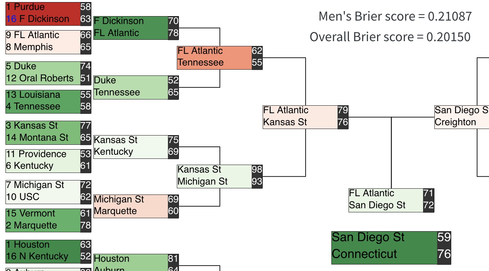

# March Machine Learning Mania 2025 轻量深读（Tier B）

> 赛事：Featured ｜ 主题 tabular（体育预测）｜ 1727 队 ｜ 标准赛 ｜ 指标：MSE/Brier
> 材料基础：`digests/march-machine-learning-mania-2025.md`（6 篇正文：往届总结 562585 / 榜单更新 569248 / 1st 572717 / 4th 572466 / 可视化 568862 / "第一名吓人" 569369；80 条主题索引）+ 1 张图
> 轻读时间：2026-10（Tier B B03）

## 1. 一句话重述与数字账

NCAA 淘汰赛胜负概率预测（Brier）。真正考点与此前一致：**筛子先验 + 简单模型 + LOSO 验证**；2025 的独特之处是**手动覆写/加注**与纯模型路线同台竞技，且赛程中榜单噪声极大。

| 关键数字 | 值 | 来源 |
| --- | --- | --- |
| 1st | 29 个 raddar 风格特征（seed/球队均值/elo/quality）；XGB（eta 0.0093、depth 4、704 轮）；之后**预测后处理**：<85% 的预测 +10%；并**手动覆写 6 场男队早期比赛**（如 0.582→0.982、0.664→0.964），理由是"高种子胜率 + 专家确认" | 1st |
| 4th | **LR 在 XGB 叶子节点上**（XGB 用 Cauchy loss 回归净胜分）；raddar 特征 + Laplace 平滑（上季交锋/客场胜/近 14 天胜率）+ 堆叠 OOF；**LB 泄漏规避**：不用原 CV 代码（时间泄漏）、不用 spline（目标泄漏）、LOSO 只用于模型平均；"不用赌博、不手动操纵" | 4th |
| 系列语境 | 往届总结（47 票）；可视化器（66 票，图 1 的 Brier 0.21087/0.20150）；榜单更新线程（62 票）；"Current first place scares me"（有人前几轮全对） | 主题索引 |

## 2. 逐方案对照矩阵

| 维度 | 1st | 4th |
| --- | --- | --- |
| 模型 | XGB 回归（Brier） | LR on XGB leaves（Cauchy 净胜分） |
| 特征 | 29（raddar 子集） | raddar 全量 + Laplace 平滑 |
| 外部数据 | Kenpom/Massey（538 已停） | 仅官方数据 |
| 验证 | — | LOSO（只用于模型平均）；显式排除泄漏方案 |
| 后处理 | **+10% 膨胀 + 6 场手动覆写** | 无（"no gambling/no manual"） |
| 结果 | 1st | 4th |

## 3. 共识、分歧与裁决

### 共识一：raddar 的特征管线已成系列基线（2/2）

1st 基于 raddar 特征做选择；4th 基于 raddar 全量加平滑。**裁决**：在只有官方历史数据的赛制下，社区公共特征管线的边际优化仍是最稳起点。置信度：高。

### 共识二：简单模型 + LOSO（2/2）

1st 用 XGB（深度 4）；4th 用 LR on leaves；两者都强调按赛季留出/平均。**裁决**：样本少（每场一局、年度一次），模型容量与调参要克制。置信度：高。

### 共识三：泄漏是本场的隐形杀手（4th 明列）

4th 因"时间泄漏"放弃公共 CV 代码、因"目标泄漏"放弃 spline，并把 LOSO 限制在模型平均用途。**裁决**：先审"验证代码/特征变换是否用到了未来或目标"，再谈分数。置信度：高。

### 分歧（本场焦点）：手动覆写/加注 vs 纯模型

1st 明确用手动经验（膨胀 + 6 场覆写）并夺冠；4th 明确"不用赌博、不手动操纵"得第 4。**裁决**：一次性、小样本、强先验的锦标赛预测里，专家先验的手动注入可以是正收益，但它是**高方差策略**且难以归因/复现；纯模型路线更可复用。置信度：中高（两种策略都进前 4）。

### 事件：赛中榜单噪声（"第一名吓人"）

锦标赛早期有人公榜接近满分（运气/激进），社区对"和上帝竞争"的调侃说明：**赛程早期的 LB 排序信息量极低**。**裁决**：锦标赛预测赛不要按早期 LB 调策略；等待样本累积或按模型先验行动。置信度：高。

## 4. 证据分级

| 断言 | 等级 | 说明 |
| --- | --- | --- |
| 1st 的特征/参数/覆写清单 | 自述 + 公开代码 | 中高 |
| 4th 的泄漏规避与模型 | 自述 + 公开代码 | 中高 |
| 可视化器的 Brier 计算 | 第三方工具 | 中 |
| 手动覆写的收益贡献 | 不可分离（与调参/特征混在一起） | 低 |

## 5. 悬案与缺口（登记）

- 2nd/3rd 方案未收录；往届总结（562585，47 票）未细读。
- 1st 的手动覆写贡献无法从材料中量化（最终名次 1st，但与特征/调参的增益混在一起）。
- 2025 年 538 数据停更的影响、MasseyOrdinal 迟到等外部数据可用性问题只被 1st 提及。

## 6. 图表证据

**图 1**（topic 568862，可视化器）：男队括号与预测胜者（如 FL Atlantic 胜 Purdue、San Diego St 胜 UConn），右上角 Men's Brier 0.21087 / Overall 0.20150。**锦标赛预测的输出形态与该届实际爆冷**。

## 7. 出处

- 往届总结（562585）：https://www.kaggle.com/competitions/march-machine-learning-mania-2025/discussion/562585
- 榜单更新（569248）：https://www.kaggle.com/competitions/march-machine-learning-mania-2025/discussion/569248
- 1st（572717）：https://www.kaggle.com/competitions/march-machine-learning-mania-2025/discussion/572717
- 4th（572466）：https://www.kaggle.com/competitions/march-machine-learning-mania-2025/discussion/572466
- 可视化器（568862）：https://www.kaggle.com/competitions/march-machine-learning-mania-2025/discussion/568862
- "第一名吓人"（569369）：https://www.kaggle.com/competitions/march-machine-learning-mania-2025/discussion/569369
