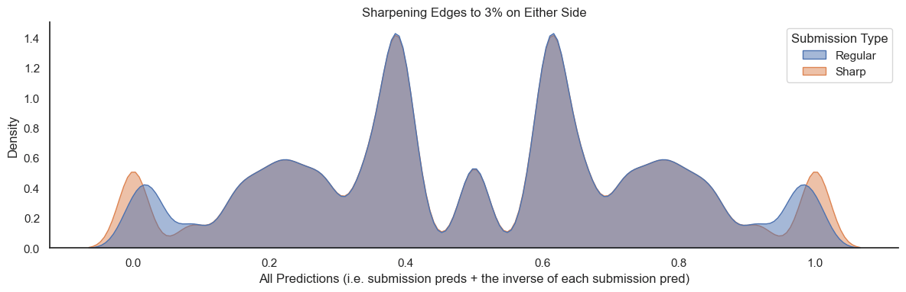
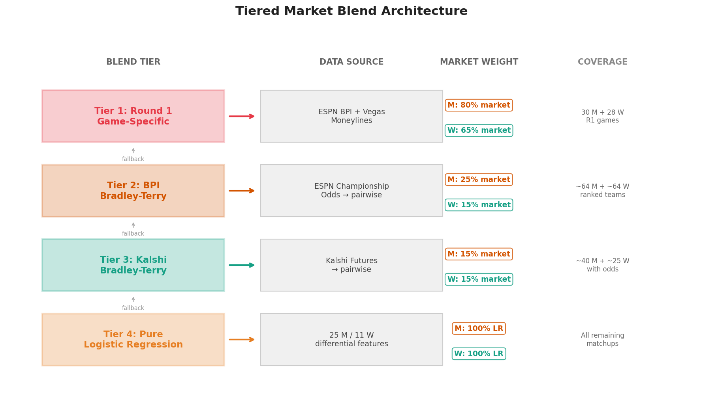

# March Machine Learning Mania 2026 轻量深读（Tier B）

> 赛事：Featured ｜ 主题 science（体育预测）｜ 3462 队（帖内 3485/3462 两种口径）｜ 标准赛（Stage 2 单提交）｜ 指标：MSE/Brier
> 材料基础：`digests/march-machine-learning-mania-2026.md`（8 篇正文：1st 72 / 3rd 34 / 2nd 15 / 10th 16 / 银牌 13 / 7th / 6th / 可视化 60；120 条主题索引）+ 10 张图
> 轻读时间：2026-10（Tier B B01）

## 1. 一句话重述与数字账

预测 NCAA 男女篮锦标赛每场胜负（Brier/MSE，仅 ~63 场/性别被评分）：**筛子（seed diff）已是强先验，真正的增量在"委员会没建模的东西"——连续实力评分、伤病、预测市场**；小样本要求重度正则、概率校准与（可选）极端值后处理。

| 关键数字 | 值 | 来源 |
| --- | --- | --- |
| 1st | 0.1097454；harry_Rating（NetEff×对手质量×名校×Top12）+ 伤病扣减；等渗校准 CV 0.1620→**0.1590**；边缘锐化（≤3%/≥97%） | 1st |
| 2nd | 0.1149886；XGB 60%+LR 40%；clip [0.02,0.98]（Brier 感知）；CV 男 0.1925/女 0.148 vs 终分 0.115（"chalky year"+小样本） | 2nd |
| 3rd | 0.1160374；**Stage 2 用 LR 大幅胜 XGB**（CV Brier 0.124 vs 0.157）；特征 33→23（男）/19→11（女）；三轮市场数据分层（R1 市场权重男 80%/女 65%） | 3rd+图 2 |
| 银牌（19th） | 0.12007，命中 87/104（83.7%）；**回归净胜分 + 5 次样条校准**；BartTorvik 特征一步 +3.1%（0.1650→0.1599）；LOSO 22 个模型全保留做"免费集成" | 银牌 |
| 10th | 净胜分回归 + 校准；Optuna 联合调参/选特征；6 seed 集成 | 10th |

## 2. 逐方案对照矩阵

| 维度 | 1st | 2nd | 3rd | 银牌 | 10th |
| --- | --- | --- | --- | --- | --- |
| 预测目标 | XGB 回归（Win）+ 等渗 | XGB/LR 分类概率 | LR 分类概率 | **净胜分回归**+样条 | 净胜分回归 |
| 特征 | seed diff + harry_Rating + 伤病 + 少量 | 35 个差分特征（含 Elo/Massey） | 25/11 个差分特征（含 Colley/SRS/交互） | 53 特征（BartTorvik 突破） | 盒分/Elo/GLM/seed |
| 外部数据 | 伤病（rotowire+EvanMiya）、AP | 仅官方数据 | **ESPN BPI+Vegas+Kalshi** | BartTorvik（T-Rank）等 | 基本官方 |
| 验证 | LOSO（2003–2025） | 10 折 | —（52 轮迭代） | LOSO（22 季全保留） | LOSO+Optuna |
| 校准 | 等渗回归 | clip [0.02,0.98] | 市场概率参与融合 | 5 次样条 | trim+校准器 |
| 后处理 | **锐化 3%/97% 边缘**（负 EV 赌名次） | clip | 分层 fallback（市场→LR） | 80/20 与无 Torvik 模型混合 | — |
| 成绩 | 0.10975 | 0.11499 | 0.11604 | 0.12007 | 10th |

## 3. 共识、分歧与裁决

### 共识一：seed diff 是主导先验，建模重点是"委员会没建模的部分"（1st 明说）

1st："让委员会做大部分工作，然后补它没考虑的：连续排名、伤病、对位优势"；银牌：seed 单独 Brier 0.1671 是最强单特征；3rd 的 LR 特征表 seed 相关性 -0.59/-0.76。**裁决**：把 seed 作为基线，增量来自连续评分（BartTorvik/Elo/GLM/Colley/SRS）与临场信息（伤病/市场）。置信度：高。

### 共识二：全员使用"差分特征"（Team1−Team2）

1st/2nd/3rd/银牌/10th 一致；2nd 指出这让男女数据能合并训练（相对强度性别无关）。**裁决**：成对预测的默认表示，兼得对称性与跨域合并。置信度：高。

### 共识三：概率校准是必需项

1st 等渗 CV −0.003；银牌净胜分→胜率必须校准（5 次样条处理尾部）；3rd 直接用市场隐含概率；2nd 用 clip 控制极端。**裁决**：Brier 指标下"分数→概率"的映射与模型同等重要；净胜分回归路线尤其依赖校准。置信度：高。

### 共识四：LOSO（按赛季留一）是标准验证；Stage 1 与 Stage 2 要分开看

1st/银牌/10th 用 LOSO；银牌"22 个赛季模型全保留平均"当免费集成；3rd 揭示 Stage 1（已知对局）XGB 靠记忆取胜、Stage 2（未见对局）LR 泛化更好。**裁决**：验证必须按赛季外推；公榜（Stage 1）与最终（Stage 2）机制不同，不能按公榜选模。置信度：高。

### 共识五：小样本 → 重正则 + 简单模型

1st 深度 2；2nd 深度 4 是上限（6/8 更差）；3rd 激进剪枝是最大单步收益（一轮 −0.007 Brier）。**裁决**：~650–1300 训练行下，特征数与树深是第一过拟合源；先剪枝再调参。置信度：高。

### 分歧一：LR vs XGB / 是否混合

3rd：Stage 2 LR 0.124 vs XGB 0.157，且"混合 LR+XGB 让 CV 与 LB 都变差——小数据别混合本质不同的模型"；2nd：XGB 60%+LR 40% 是最终方案（clip 后）；1st：单 XGB 回归+等渗。**裁决**：结论取决于特征集与校准管线；小样本下 LR 的低方差是真实优势，混合需嵌套 CV 实证，不可默认可行。置信度：中高。

### 分歧二：净胜分回归 vs 胜负分类

银牌/10th：净胜分携带更多信息（20 分胜与 1 分胜不同），再校准成概率；2nd/3rd 直接分类。**裁决**：净胜分回归 + 良好校准通常更强（银牌 LOSO 验证）；分类的优点是直接输出概率、少一次映射。置信度：中。

### 分歧三：预测市场数据的价值

3rd 重仓（R1 男 80%/女 65% 市场权重；三重来源 fallback）；1st"没时间用"；2nd 未用。**裁决**：市场（Vegas/BPI/Kalshi）是**正交信息**，尤其 R1 的伤病/对位；不用是明显的机会成本（1st 自认）。置信度：中高（单队深度使用）。

### 分歧四：极端值处理（锐化 vs 裁剪）

1st 主动锐化 ≤3%/≥97%（自认负 EV、为名次赌）；2nd 裁剪到 [0.02,0.98]（Brier 感知的保守化）。**裁决**：取决于目标函数与风险偏好——追求期望分用裁剪/不锐化，追求名次上探可用锐化。置信度：中。

## 4. 证据分级

| 断言 | 等级 | 说明 |
| --- | --- | --- |
| 1st/2nd/3rd 的分数与流程 | 自述 + 代码/图 | 中高 |
| 等渗/样条校准增益 | 自述数字（1st 有 CV 对照） | 中高 |
| BartTorvik +3.1% | 银牌自述（LOSO） | 中 |
| 市场分层权重与覆盖 | 3rd 图（图 2） | 中高（结构层面） |
| CV-终分大 gap 的解释 | 2nd 自述（chalky year/小样本） | 中（合理但不可复算） |
| 队数口径 | 3462（元数据/银牌）vs 3485（3rd） | 低（登记） |

## 5. 悬案与缺口（登记）

- 4th–9th 方案未细读（7th/6th 在 digest 中）；2026 新赛制（Stage 2 单提交）对策略的影响未系统化。
- 1st 的 harry_Rating 手调 scaler 是"个人意见注入"，不可复现/不可迁移；伤病调整依赖人工录入。
- 市场的可复现性问题（3rd 抓取于 3-19；赔率/期货随时间变化）。
- CV vs 终分 gap 无法用单年数据验证；"chalky year"假设需要多年回测。

## 6. 图表证据

**图 1**（topic 689528）：预测密度（含反向概率）——Regular vs Sharp；锐化把 ≤3%/≥97% 的边缘推到极端。**"为名次赌负 EV"的直观形态**。

**图 2**（topic 689321）：Tier 1 R1 市场（男 80%/女 65%）→ Tier 2 BPI Bradley–Terry（25%/15%）→ Tier 3 Kalshi（15%/15%）→ Tier 4 纯 LR（100%）；含覆盖量与 fallback 链。

## 7. 出处

- 1st（72 票）：https://www.kaggle.com/competitions/march-machine-learning-mania-2026/discussion/689528
- 2nd（15 票）：https://www.kaggle.com/competitions/march-machine-learning-mania-2026/discussion/689537
- 3rd（34 票）：https://www.kaggle.com/competitions/march-machine-learning-mania-2026/discussion/689321
- 10th（16 票）：https://www.kaggle.com/competitions/march-machine-learning-mania-2026/discussion/689044
- 银牌 19th（13 票）：https://www.kaggle.com/competitions/march-machine-learning-mania-2026/discussion/689174
- 缺口登记：678938（赛制更新）、683453（榜单完成）、680969（数据错误）、689808、689849
