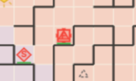
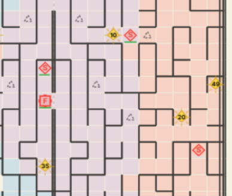
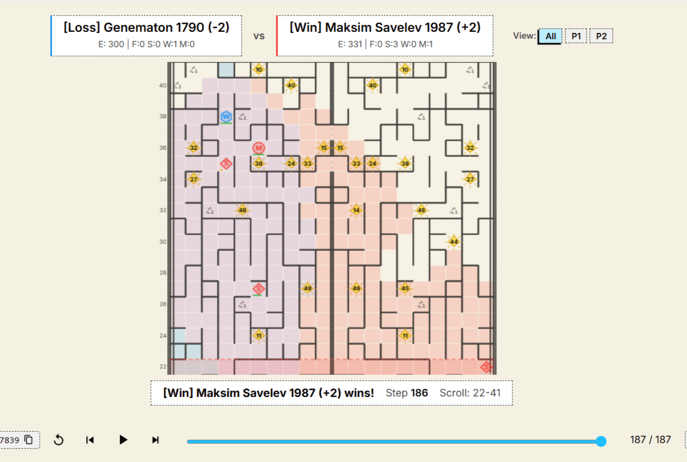
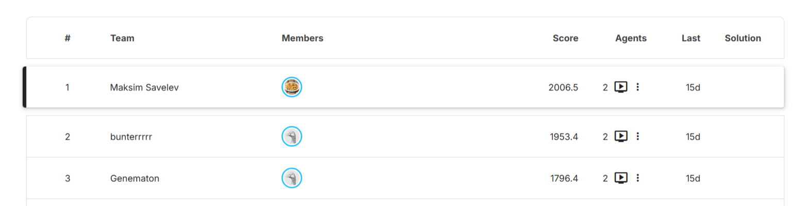

# Maze Crawler 轻量深读（Tier B）

> 赛事：Playground（agent 对战）｜ 主题 sim-agent（迷宫爬行/资源经济）｜ 459 队 ｜ 指标 crawl ｜ 截止 2026-06-30
> 材料基础：`digests/maze-crawler.md`（6 篇正文：1st 717120 / 3rd 718158 / 起步与 Discord 696210 / 7th 717177 / 无奖牌帖 696453 / 每日数据集 701822；23 条主题索引）+ 5 张归档图
> 轻读时间：2026-10（Tier B B20）

## 1. 一句话重述与数字账

两人工厂对战的迷宫环境：地图自下而上滚动（sbd = "离死亡还有几 tick"），双方靠采矿攒能量，终局由**工厂相撞时存活单位的总能量**决胜负。1st 的核心洞见是"**不要把能量差留到 500 步后的被动 tiebreak**"——把相撞当主动目标，在碰撞前精确投放一个 300 能量的矿工来锁定 tiebreak；3rd 则走完全不同的路线：把环境移植到 JAX、用行为克隆起步 + PPO 自对弈。两条路线最终在排行榜上相差约 210 分（2006.5 vs 1796.4），而 1st 自述对近镜像对手只有约 53/47。

| 关键数字 | 值 | 来源 |
| --- | --- | --- |
| 规模与奖励 | **459 队**；Playground 无奖牌/积分（社区专帖询问后确认） | 696453 |
| 终局规则 | 工厂相撞或一方被卷出；**相撞由存活机器人总能量决定**；多数强队选择"攒能量等 500 步后的 tiebreak" | 717120 |
| 1st 三层结构 | ① 移动：first-move BFS，对每个可达格打分的**单一评分函数**（jump-aware）；② 经济：`node > bfs` 采矿（矿工 TRANSFORM 成矿、工厂坐矿收能）+ 低 sbd 转 worker 保命；③ 战斗：主动找敌人、抢有利碰撞 | 717120 |
| 1st 关键常数 | `MINER_PHASE_END=350`、`MIN_NODE_SBD=30`、**`ENERGY_CAP=3000`（一次性锁存：到 3000 后永久停止采矿转为猎杀）**、`WORKER_PHASE_START=400`、`SCOUT_COST=50`、`TIEBREAK_DIST=5`、`TIEBREAK_ENERGY_MARGIN=50`、`TIEBREAK_MINER_LOOKAHEAD=2`、`ENEMY_LOGIC_START=35`、`CROSS_BONUS=40`、`ENEMY_COL_BONUS=15` | 717120 |
| tiebreak 细节 | 矿工 = **300 能量**；在敌人曼哈顿距离 ≤5 时于"工厂刚离开的格子"（`OPPOSITE[last_move_dir]`）放矿工；预测 1–2 tick 内将被卷出的矿工按已死处理，避免"矿工与工厂同 tick 死亡"输掉 tiebreak；自军单位互踩用交换/等待规避（新矿工有移动冷却） | 717120 |
| 3rd 路线 | **JAX 环境移植 + 行为克隆 bootstrap + PPO self-play**；小型网络（棋盘 CNN + 标量信息通路）；奖励=胜负 + 少量能量 shaping；大样本评估；自述弱点：自对弈池同质 → 能量强、战斗弱 | 718158 |
| 7th 路线 | 匈牙利匹配全局分配任务 + 按时间片预留格子的路径规划 + 地图左右对称补全 + 走廊清障 + 终局集体北撤 | 717177 |
| 最终排名 | **1 Maksim Savelev 2006.5 > 2 bunterrrr 1953.4 > 3 Genematon 1796.4**；1st 估计对 bunterrrr 约 53/47，且 rating 变化 ±5 不对称收敛慢 | 717120_img/05 |

## 2. 逐方案对照矩阵

| 维度 | 1st（规则 + 评分函数） | 3rd（RL 自对弈） | 7th（全局优化） |
| --- | --- | --- | --- |
| 决策 | 单 BFS + 可调评分 | 神经策略网络 | 匈牙利匹配 + 时间预留 |
| 经济 | 节点采矿 + 3000 能量锁存 | 自学能量玩法 | 全局任务分配 |
| 战斗 | 主动逼迫碰撞 + tiebreak 矿工 | 自对弈涌现（弱） | 清障/碾压/北撤 |
| 工程 | 纯 Python 规则 | JAX 快速模拟器（LLM 协助移植） | 对称补全 + 交通管理 |
| 结果 | #1 2006.5 | #3 1796.4 | #7 |

## 3. 共识、分歧与裁决

### 共识一：先确定"赢"的定义，再围绕它设计（717120 / 718158；置信度高）

1st 把 tiebreak 当主动目标并给出精确投放逻辑；3rd 也把奖励与游戏真实胜利条件对齐，并强调"奖励做减法比做加法重要"。**裁决**：agent 赛先写清终局规则（碰撞/淘汰/计分），再决定经济与战斗的优先级；奖励/评分项要直接映射胜利条件。置信度：高。

### 共识二：单一可调评分函数是规则型 agent 的高效架构（717120；置信度中高）

同一个 BFS 通过加减评分项复用于探索、采矿、追击；全部行为都是常数阈值，便于快速再平衡。**裁决**：复杂环境先用"一个可解释的评分函数 + 常量表"快速迭代，再考虑学习型策略。置信度：中高。

### 共识三：RL 路线需要快模拟器 + 多样性对手（718158；置信度中高）

3rd 的 JAX 移植让大规模自对弈可行，但同质自对弈池导致战斗短板；作者建议引入 AlphaStar 式对抗对手。**裁决**：自对弈训练必须显式维护对手多样性（历史版本 + 针对性对手 + 大样本评估）。置信度：中高。

### 事件一：近镜像对策是冠军的盲点（717120；置信度中）

1st 承认只针对"标准能量流"调到 ~95% 胜率，未针对复制品调参；对 bunterrrr 只有约 53/47（估计），两处细节（矿工投放时机、离矿规则）造成拉锯。**裁决**：当策略可被复制时，预留"镜像鲁棒性"预算（对称对局调参、早晚投放对比）。置信度：中。

### 事件二：平台与激励影响参与质量（696453 / 700980 / 701737 / 702770；置信度中高）

无奖牌/积分、环境本地与线上不一致、滚动过快、tiebreak 怪异等帖子密集。**裁决**：无奖励 agent 赛把"学到的可复用工程"当主要回报；提交前用每日 episode 数据集做离线回放校验。置信度：中高。

## 4. 证据分级

| 断言 | 等级 | 说明 |
| --- | --- | --- |
| 1st 架构、常数与 tiebreak 逻辑 | 冠军自述 + 5 张图（717120） | 中高（无官方分数复核） |
| 3rd 的 JAX+BC+PPO 管线 | 自述（718158，1 票） | 中（细节较少） |
| 7th 的匹配/预留机制 | 自述（717177） | 中 |
| 最终排名与分数 | 排行榜截图（717120_img/05） | 高 |
| 无奖牌/平台 bug | 多帖（696453 / 700980 等） | 高（现象） |
| 1st 对 bunterrrr 的胜率估计 | 作者自述"约 53/47，未数" | 低 |

## 5. 悬案与缺口（登记）

- 2nd（bunterrrr）没有归档 write-up，近镜像对局的真实胜率无法复核；
- 1st 未给完整代码/消融（对比 3rd 的 JAX 路线缺少等量细节）；
- 官方对无奖牌、tiebreak 规则、环境 bug 的最终结论未归档；
- 每日 episode 数据集长期可用性未验证；
- **图证缺口**：无（5 张图，本深读内嵌 4 张）。

## 6. 图表证据

**图 1**（topic 717120，1st）：工厂停在"矿工变矿"的格子上持续收能——经济层的核心画面。

**图 2**（topic 717120，1st）：廉价侦察兵向两侧扇形展开——每个侦察兵既是视野也是 tiebreak 能量。

**图 3**（topic 717120）：回放界面显示 1st（Maksim Savelev, E=331）在第 186 步、Scroll 22–41 阶段击败 3rd（Genematon, E=300），底部提示 "wins!"——tiebreak/淘汰判定的现场。

**图 4**（topic 717120）：最终排名 Maksim Savelev **2006.5** > bunterrrr **1953.4** > Genematon **1796.4**（各 2 agents）——1st 与近镜像 2nd 仅差约 53 分。

## 7. 出处

- 1st 方案（11 票 / 4 评论）：https://www.kaggle.com/competitions/maze-crawler/discussion/717120
- 3rd 方案（1 票 / 0 评论）：https://www.kaggle.com/competitions/maze-crawler/discussion/718158
- 7th 方案（3 票 / 0 评论）：https://www.kaggle.com/competitions/maze-crawler/discussion/717177
- 无奖牌/积分询问（9 票 / 2 评论）：https://www.kaggle.com/competitions/maze-crawler/discussion/696453
- 起步与 Discord（5 票 / 0 评论）：https://www.kaggle.com/competitions/maze-crawler/discussion/696210
- 每日 episode 数据集（4 票 / 0 评论）：https://www.kaggle.com/competitions/maze-crawler/discussion/701822
- 环境本地/线上不一致（0 票 / 3 评论）：https://www.kaggle.com/competitions/maze-crawler/discussion/701737
- 5th/7th 规则型 bot（2 票 / 4 评论）：https://www.kaggle.com/competitions/maze-crawler/discussion/708834
