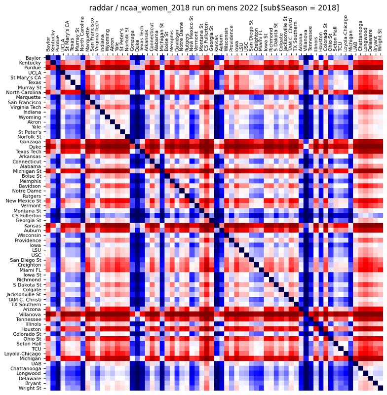

# Men's March Mania 2022 轻量深读（Tier B）

> 赛事：Featured ｜ 主题 tabular（体育预测，NCAA 男篮锦标赛）｜ 930 队 ｜ 标准赛（两阶段）｜ 指标：Log Loss
> 材料基础：`digests/mens-march-mania-2022.md`（7 篇正文：1st 317145 + "Magic"解读 317316 / 3rd 317365 / 5th 317566 / 6th 317114 / 往届方案 308513 / 外部 538 评分 309917；120 条主题索引）+ 11 张图
> 轻读时间：2026-10（Tier B B06）

## 1. 一句话重述与数字账

预测 NCAA 男篮锦标赛每场比赛的胜负概率（log loss）。真正的考点是**"锦标赛结果的巨大方差 vs 模型的边际收益"**——本场冠军是一个**照搬 2018 年女篮方案、连 `Season=2018` 都没改**的"幸运 bug"；其余名次则给出可复制的建模路径（回归评分、CatBoost、队伍嵌入）。

| 关键数字 | 值 | 来源 |
| --- | --- | --- |
| 1st（317145）与解读（317316） | 冠军自述"我没有新方法，只是用了 @raddar 2018 女篮的夺冠方案"；作者复现时发现：**把 `sub$Season` 写成 2018（照抄原代码）→ 0.51577；改成 2022 → 0.66334**。差异来自"合并了 2018 赛季的球队统计"（如把 Baylor 等 2022 强队按 2018 表现估值），在"冷门迭出"的 2022 赛程上恰好蒙对（图 1 热力图） | 317145/317316 |
| 3rd（317365） | 用 **Excel** 做回归：把 2018/2019/2021 的赛前指标（进攻/防守效率、三分占比、回合数、助攻失误比、胜率、罚球率、Massey 平均排名、COL/AP、Quad1 胜/Quad4 负、种子、赛程强度 + 最后 3 场平均）回归到 ESPN 积分体系，系数当权重 → 自建 power rating；效率类数据用 teamrankings 外部数据 | 317365 |
| 5th（317566） | **CatBoostClassifier（logloss 目标）+ 少量分类特征**（当年种子、历史胜率、往季参赛场次=能走多远）；CV 只用最近 2 个赛季；不裁剪概率；未用 raddar 的模型/数据；自述"足球类预测的经验：赛季维度上更简单的模型更稳" | 317566 |
| 6th（317114） | **队伍嵌入**：`nn.Embedding(team_id)` 学到每队向量，输入两队 embedding 预测"team1 是否获胜"以及 14 项技术统计；数据做对称复制（消除主客/胜负方向）+ 分位数变换；**按时间线一个 epoch 训完，minibatch = 同一 Season+DayNum**；未来工作：用 GNN 让一场比赛影响其他球队；作者自述同方法在女篮赛只排 472/659 | 317114 |
| 社区侧 | 外部 538 评分数据集（54 票）、Massey Ordinals 更新、"无 ML 也能拿铜"（27 票）、结果爆冷的讨论帖（24 票） | 社区 |

## 2. 逐方案对照矩阵

| 维度 | 1st（幸运 bug） | 3rd | 5th | 6th |
| --- | --- | --- | --- | --- |
| 方法 | 照搬 2018 女篮夺冠代码（Season 未改） | Excel 回归 power rating | CatBoost + 分类特征 | 队伍嵌入 + 多任务 |
| 数据来源 | 2018 赛季统计（错配） | 竞赛数据 + teamrankings 外部 | 竞赛数据 | 常规赛详细结果 |
| 验证 | — | 近三届锦标赛回归拟合 | 最近 2 赛季 | 时间线单 epoch（按赛季+日切批） |
| 可复现性 | **低（依赖特定赛果）** | 高（但手工流程重） | 高 | 中高（代码公开） |
| 结果 | 0.51577（榜 1）；同代码改 2022 → 0.66334 | 3rd | 5th | 6th |

## 3. 共识、分歧与裁决

### 共识一：本场方差极大，"幸运"与"方法"的界限模糊（社区 + 1st/6th）

1st 是照搬+错季统计的"幸运 bug"；6th 的同一套方法在女篮赛排 472/659；社区有"无 ML 也能拿铜"与"冷门迭出"的讨论。**裁决**：单届锦标赛预测（尤其单场配对、样本仅 63 场）本质上高方差；名词次不能直接当作方法优劣的证据。**对 1st 的"解法"只能登记为"不可复制的幸运事件"**，不应进入方法论。置信度：高（有 6th 的跨赛对照 + 分数链）。

### 共识二：赛前排名/效率类特征是主信号（3rd/5th）

3rd 的特征清单（效率、种子、Massey 平均、Quad 战绩、SOS、近 3 场状态）与 5th 用的种子/历史胜率/参赛场次都落在同一族。**裁决**：锦标赛预测的通用基线 = 种子 + Massey/538 类排名 + 效率 + 近期状态；复杂模型只在此之上做微调。置信度：高。

### 分歧一：模型复杂度

3rd 用 Excel 回归（最简）、5th 用 CatBoost（中等）、6th 用嵌入网络（较复杂）；三者名次 3/5/6。**裁决**：在 63 场样本上，模型复杂度的收益无法与方差区分；简单模型 + 好特征是更稳的默认。置信度：中高。

### 分歧二：用不用外部/历史数据

3rd 用 teamrankings 外部数据；5th 只用官方数据并刻意不用 raddar 的模型；1st 恰恰因为用了错季的历史统计而"赢"。**裁决**：外部数据可用但必须做年份对齐（1st 的教训）；跨赛季统计的可迁移性有限。置信度：高（有明确反例）。

### 事件：过往方案的复用边界（往届方案帖 308513 + 538 评分 309917）

社区整理了历届夺冠方案与 538 评分数据集，被广泛复用（raddar 的方案也是其中之一）。**裁决**：复用历届方案时，**赛季相关的硬编码（年份、队伍 ID、赛制）必须逐一审计**；否则"复用"可能退化为随机的历史错配。置信度：高。

## 4. 证据分级

| 断言 | 等级 | 说明 |
| --- | --- | --- |
| 1st 的 Season 错配与 0.51577/0.66334 对照 | 自述 + 可复现实验 + 热力图 | 高 |
| 3rd 的特征清单与 Excel 回归流程 | 自述（细节完整，但无代码） | 中 |
| 5th 的 CatBoost 与 CV 设置 | 自述 + 公开代码 | 中高 |
| 6th 的队伍嵌入与跨赛对照 | 自述 + 公开 notebook | 中高 |
| 无 ML 也能拿铜 | 论坛帖 | 低/现象 |

## 5. 悬案与缺口（登记）

- 2nd/4th 的方案未入库；"Experts Median Submission"（31 票）、"A Bronze without any ML?"（27 票）未细读；
- 1st 的错配为何在 2022 赛果上更优，只有"Baylor/密歇根估值错位"的定性解释，无统计检验；
- Stage 1/2 两阶段的分差与提交策略细节未整理；
- 归档 11 图中 6 张来自"Magic 解读"（复现热力图、2018/2022 对比），1 张为 6th 的模型图。

## 6. 图表证据

**图 1**（topic 317316）：`$Season = 2018`（照抄原代码）跑 2022 赛程得到的对阵概率热力图——行/列的红色带意味着该队对所有对手都被高估（如两条密歇根、Baylor 未被偏好），正是"用 2018 统计评估 2022 球队"的直接可视化。

## 7. 出处

- #1 solution（317145）：https://www.kaggle.com/competitions/mens-march-mania-2022/discussion/317145
- 1st "Magic"解读（46 票）：https://www.kaggle.com/competitions/mens-march-mania-2022/discussion/317316
- #3 solution（317365）：https://www.kaggle.com/competitions/mens-march-mania-2022/discussion/317365
- #5 solution（317566）：https://www.kaggle.com/competitions/mens-march-mania-2022/discussion/317566
- 6th 队伍嵌入（317114）：https://www.kaggle.com/competitions/mens-march-mania-2022/discussion/317114
- 往届夺冠方案（308513）：https://www.kaggle.com/competitions/mens-march-mania-2022/discussion/308513
- 538 外部评分（54 票）：https://www.kaggle.com/competitions/mens-march-mania-2022/discussion/309917
