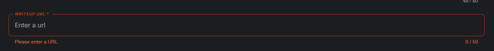

# Meta Kaggle Hackathon 轻量深读（Tier B）

> 赛事：Featured（评审制 hackathon，双赛道）｜ 主题 other（平台元数据研究）｜ 118 队 ｜ 无排行榜 ｜ 交付物：write-up（+ 未公开的 notebook/数据集/演示）
> 材料基础：`digests/meta-kaggle-hackathon.md`（6 篇正文：获奖公告 598833 / 教育影响 582261 / 提交问题 589369+589854 / 许可更正 589996 / 模板请求 588045；46 条主题索引）+ 2 张归档图
> 轻读时间：2026-10（Tier B B16）

## 1. 一句话重述与数字账

用 **Meta Kaggle 数据集**（历年竞赛/用户/讨论/代码元数据）做洞察分析的评审制 hackathon，分 **Main Track** 与 **Trends Over Time** 两条赛道。获奖作品的共性很清楚：**端到端分析 + 可落地的平台建议**——数据集相似度推荐器（用投票语义）、用户流失与召回（5 Days of GenAI 召回效应）、讨论协作与竞赛成绩的关系、平台演进综述、用户增长异常的**事件关联**、参与度 cohort 分析。赛事侧则又一次暴露了**提交基础设施与规则问题**（URL 50 字符/字符集校验、必填媒体、许可错标、notebook 未公开）。

| 关键数字 | 值 | 来源 |
| --- | --- | --- |
| 获奖作品（598833） | Main Track：①"Echoes of Interest"（Daniel Hernández Mota & Diego Alfonso Meza Corona）——用投票等交互在数据集上加语义层，做相似度推荐 PoC；②Parul Pandey——Kaggler 流失与召回，含 5 Days of GenAI 的召回效应；③Peter Moorhouse——讨论区公开分享与竞赛成绩的关系（"涨潮托起所有船"）。Trends Over Time：①"From Insights to Impact"（平台全景 + 新手友好/激励建议）；②"Kaggle Chronicles: 15 Years"（**异常检测**把用户增长尖峰对应到事件 + 库使用趋势）；③"Kaggle Journeys"（cohort 分析：更快的**单人参赛**趋势） | 598833 |
| 提交问题 | write-up URL 字段限 50 字符且只允许字母/数字/连字符，但 Kaggle notebook 的自动 URL 触发校验错误；"Media Gallery → Images"被标记为必填；另有"我的 notebook/数据集没被设为 Public"（6 票 / 7 评论）；结果公布日期反复询问（4 票 / 8 评论） | 589369 / 589854 / 590655 / 598615 |
| 规则修正 | 公开 write-up 许可从 **CC0 更正为 CC BY 4.0**（允许撤稿；与 Gemma 4 届同款事故）；社区请求官方提供 write-up 模板（5 票） | 589996 / 588045 |
| 教育影响（582261） | 21 票：高中数据科学学习小组（KNAI 团队前缀）——学生靠自己的代码进前 20–30%，今年有人拿到 Playground 第 3；作者强调 **notebook 环境对教学的价值**（免去 3–4 节课的环境安装） | 582261 |

## 2. 逐方案对照矩阵

| 维度 | Main 1st | Main 2nd | Trends 1st | Trends 2nd |
| --- | --- | --- | --- | --- |
| 主题 | 数据集相似/推荐 | 用户流失与召回 | 平台全景与建议 | 15 年趋势 |
| 方法 | 交互语义 + 推荐 PoC | 参与模式 + 流失分析 | 综述 + 建议 | **异常检测**关联事件 |
| 产出 | 可落地系统 | 召回策略 | 平台改进清单 | 库使用/增长趋势 |
| 评价点 | 端到端、说服力强 | 与社区历史结合 | "tour-de-force" | 数据丰富 |

## 3. 共识、分歧与裁决

### 共识一：获奖作品=端到端分析+可落地建议（598833；置信度高）

官方评语反复强调"proof of concept""well-supported recommendations""what Kaggle should consider"。**裁决**：元数据 hackathon 的评分锚点是"洞察能否转化为行动"。置信度：高。

### 事件：提交基础设施与规则再次成为主要摩擦（589369、589854、589996、590655、598615；置信度高）

URL 校验与 50 字符限制把自动生成链接挡在门外；必填媒体与 write-up 内容重复；许可被错标后更正；notebook 未公开的困惑。**裁决**：与 Gemma 3n/4、Gemini 3 完全同型——评审制赛的最大风险在提交链路；应提前演练并留证据。置信度：高。

### 事件：Results 时间线不确定（598615、590941 等；置信度中高）

评审多花"几天"，社区反复开帖问结果日期。**裁决**：评审制赛按"超出预告数天到数周"预期。置信度：中高。

### 事件：模板与规则透明度诉求（588045；置信度中）

社区请求官方 write-up 模板（类似论文模板）。**裁决**：评审标准越透明，参赛者越能把精力放在分析而非格式猜测上。置信度：中。

## 4. 证据分级

| 断言 | 等级 | 说明 |
| --- | --- | --- |
| 获奖名单与评语 | 官方公告 | 高 |
| 提交校验/必填媒体问题 | 参赛者帖 + 截图 | 中高 |
| 许可更正 | 官方帖 | 高 |
| 教育影响 | 个人帖 + 照片 | 中 |
| 结果时间线 | 官方 + 多帖 | 中高 |

## 5. 悬案与缺口（登记）

- 获奖 write-up 的完整方法与代码未收录（评语为主）；
- "Notebooks and Datasets weren't made Public"的最终处理未跟进；
- 双赛道重复提交的规则口径未细读；
- **图证缺口**：无（2 张图，本深读内嵌 1 张）。

## 6. 图表证据

**图 1**（topic 589369）：提交表单的 "WRITEUP URL" 字段——50 字符上限 + "Please enter a URL" 校验，与自动生成的 notebook URL 冲突（该届最典型的提交摩擦证据）。

## 7. 出处

- 获奖公告（24 票 / 26 评论）：https://www.kaggle.com/competitions/meta-kaggle-hackathon/discussion/598833
- 教育影响（21 票 / 2 评论）：https://www.kaggle.com/competitions/meta-kaggle-hackathon/discussion/582261
- 提交问题（1 票）：https://www.kaggle.com/competitions/meta-kaggle-hackathon/discussion/589369
- 无法提交 write-up（2 票）：https://www.kaggle.com/competitions/meta-kaggle-hackathon/discussion/589854
- 许可更正（1 票）：https://www.kaggle.com/competitions/meta-kaggle-hackathon/discussion/589996
- 模板请求（5 票）：https://www.kaggle.com/competitions/meta-kaggle-hackathon/discussion/588045
- 介绍帖（16 票 / 3 评论）：https://www.kaggle.com/competitions/meta-kaggle-hackathon/discussion/581301
- 起步材料（16 票 / 8 评论）：https://www.kaggle.com/competitions/meta-kaggle-hackathon/discussion/582208
- notebook 未公开（6 票 / 7 评论）：https://www.kaggle.com/competitions/meta-kaggle-hackathon/discussion/590655
- 结果时间（4 票 / 8 评论）：https://www.kaggle.com/competitions/meta-kaggle-hackathon/discussion/598615
